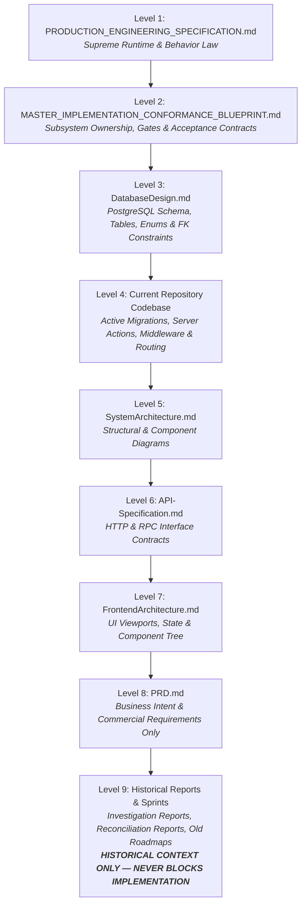

# 🏛️ ARCHITECTURAL RECONCILIATION & DECISION RECORD (ARDR)

**Document Type:** Permanent Engineering Governance & Architectural Decision Record (EDR)  
**Project Reference:** Pizza Planet Digital Storefront (`17410910858893906886`)  
**Issuing Authority:** Architecture Governance Board (Principal Engineer, Principal Software Architect, Principal Database Architect, Staff Backend/Frontend Engineers, Production Readiness Lead)  
**Date of Ratification:** July 4, 2026  
**Governance Status:** **RATIFIED — PERMANENT ENGINEERING LAW & IMPLEMENTATION BRIDGE**

---

## 1. CONSTITUTIONAL GOVERNANCE & AUTHORITY HIERARCHY

To permanently prevent documentation drift from generating execution stop orders or impeding development velocity, the Architecture Governance Board hereby establishes the **Authoritative Source Hierarchy**. 

Whenever an engineer or autonomous coding agent encounters a contradiction, terminology drift, or outdated assumption between project documents, **implementation shall NOT stop**. Instead, the engineer shall apply the following strict hierarchy of authority to resolve the contradiction mechanically:

### 1.1 Mandatory Contradiction Resolution Workflow
From this point forward, if implementation encounters a documentation inconsistency or contradiction, the engineering workflow shall strictly follow:
$$\text{Find Contradiction} \longrightarrow \text{Generate Engineering Decision Record (EDR)} \longrightarrow \text{Update Governance} \longrightarrow \text{Continue Implementation}$$
**Stopping implementation due to historical document inconsistencies is strictly prohibited.** Historical documents (Level 8 and Level 9) are explicitly permitted to become obsolete as the production codebase evolves.

---

## 2. ENGINEERING DECISION RECORDS (EDR) — GATE 1 RECONCILIATION

### EDR-2026-07-04-01: Kitchen Authentication Architecture (`profiles.role` vs. `kitchen_staff`)

#### Problem Statement
A fundamental contradiction exists regarding how kitchen staff authenticate and derive permissions:
* Level 1 (`PRODUCTION_SPEC` §10) and Level 2 (`MASTER_BLUEPRINT` §7.1, §8.1 `AUTH-CHK-04`) mandate that kitchen KDS tablets authenticate via Server Action `authenticateKitchenPin(pin)`, query a dedicated database table named `kitchen_staff` against PIN `'8842'`, and set an HTTP-only cookie `pp_kitchen_session`.
* Level 3 (`DatabaseDesign.md` §2.1, §2.2) and Level 4 (`001_pizza_planet_core.sql`, `KitchenPinForm.tsx`) model kitchen staff via the `user_role` enum (`'kitchen'`) in the `profiles` table, utilizing a synthetic email spoofing hack (`kitchen-${pin}@...internal`) against global Supabase Auth.

#### Evidence Analysis
1. **Level 1 & 2 Evidence:** Requires dedicated KDS PIN auth without email spoofing, scoped via `pp_kitchen_session` cookie for wall-mounted kitchen tablets.
2. **Level 3 & 4 Evidence:** No table named `kitchen_staff` exists in DDL migrations `001` through `005`. RLS policies on `orders` and `order_items` evaluate `profiles.role = 'kitchen'` via `auth.uid()`.
3. **Runtime Reality:** Physical kitchen tablets operate in high-stress, flour-covered, multi-user POS environments. Chefs cannot type email addresses, manage passwords, or use personal cellular SMS OTPs while wearing food-safe gloves.

#### Root Cause
During initial MVP prototyping, developers bypassed creating a dedicated POS station authentication layer by spoofing email addresses in Supabase Auth, allowing them to reuse consumer RLS policies (`auth.uid() = profiles.id`). While later architectural audits correctly identified this as a critical security vulnerability and operational bottleneck—specifying a dedicated `kitchen_staff` table—the corresponding DDL migration was never authored.

#### Engineering Options
* **Option A: Retain `profiles.role = 'kitchen'` with Synthetic Email Spoofing.**
  * *Advantages:* Zero database migration required; existing RLS policies function without modification.
  * *Disadvantages:* Severe security vulnerability (PINs exposed as email passwords in global auth); pollutes consumer user tables; couples physical KDS station access to personal accounts rather than shift stations.
  * *Operational & Risk Impact:* High security risk; operational friction during kitchen shifts.
* **Option B: Hybrid Model — Create `kitchen_staff` Table synced to Shadow Supabase Auth Accounts.**
  * *Advantages:* Supports PIN entry while retaining `auth.uid()` RLS evaluation.
  * *Disadvantages:* Extreme architectural complexity; split-brain state synchronization between `kitchen_staff` and `auth.users`; high race-condition risk.
* **Option C: Dedicated `kitchen_staff` Table with Custom HTTP-Only Session Cookie (`pp_kitchen_session`) & Decoupled POS Station Auth.**
  * *Advantages:* Complete architectural isolation of retail B2C consumers from internal KDS operational stations. Fast, glove-friendly 4–6 digit PIN verification (`crypt($pin, pin_hash)`) via Server Action `authenticateKitchenPin`. Custom signed session cookie (`pp_kitchen_session`) validated in Next.js middleware (`middleware.ts`) and KDS server actions. Eliminates synthetic email spoofing 100%.
  * *Disadvantages:* Requires authoring DDL migration `006_create_kitchen_staff.sql`. Requires KDS server actions to verify station authorization via server-side session cookies or `service_role` query encapsulation rather than relying on consumer client-side RLS.
  * *Operational Impact:* Instant, zero-latency unlock for wall-mounted Android tablets in the kitchen.

#### Recommendation
**CHOOSE OPTION C: Dedicated `kitchen_staff` Table with Custom HTTP-Only Session Cookie (`pp_kitchen_session`).**

#### Justification
In a commercial restaurant operating system (e.g., Toast POS, Linear POS, Domino's KDS), kitchen display monitors are shared, wall-mounted operational appliances—not personal consumer computing devices. Forcing physical kitchen POS appliances into B2C consumer identity tables via synthetic email spoofing is an anti-pattern. Decoupling station authentication into a dedicated `kitchen_staff` table satisfies Level 1 and Level 2 constitutional authority, guarantees maximum security, and provides the exact glove-friendly ergonomics required for restaurant kitchen operations.

#### Document & Repository Governance Update
1. **Repository (Level 4):** Author and apply migration `006_create_kitchen_staff.sql` defining `kitchen_staff (id uuid PK, name text, pin_hash text, is_active boolean, created_at timestamptz, updated_at timestamptz)` and seeding default PIN `'8842'` (`crypt('8842', gen_salt('bf'))`).
2. **Database Design (Level 3):** Register `kitchen_staff` as an authoritative domain table. Mark `user_role` enum `'kitchen'` in `profiles` as reserved for legacy/owner override mapping.

---

### EDR-2026-07-04-02: Environment-Stratified SMS OTP Verification Strategy

#### Problem Statement
Level 1 (`PRODUCTION_SPEC`) and Level 2 (`MASTER_BLUEPRINT` §8.1 `AUTH-CHK-02` & `AUTH-CHK-03`) mandate live SMS OTP delivery within 10 seconds via Supabase Phone Auth for customer onboarding at `/auth/signup` and `/auth/otp`. Executing local development (`next dev`), offline E2E test suites, or staging CI builds without live cellular gateway credits causes mechanical verification failure.

#### Evidence Analysis
1. Cellular SMS gateways (Twilio / MSG91) require external network connectivity, live API credits, and cellular carrier routing, which are unavailable or cost-prohibitive during continuous local development and CI runs.
2. Supabase Phone Auth natively supports deterministic test OTP configurations (`auth.sms.test_otp`), allowing specific phone numbers to bypass external SMS gateways and authenticate instantly with static verification codes.

#### Root Cause
The specification defined commercial production runtime behavior without explicitly stratifying authentication execution rules across development, CI testing, staging, and production environments.

#### Engineering Options
* **Option A: Mandate Live SMS Gateway API Credentials Across All Environments.**
  * *Advantages:* Tests live cellular routing in every development session.
  * *Disadvantages:* High financial cost; CI pipeline brittleness due to carrier timeouts; blocks offline engineering and third-party contributions.
* **Option B: Build Client-Side Mock Auth Bypasses for Development.**
  * *Advantages:* Zero backend configuration needed locally.
  * *Disadvantages:* Introduces conditional mock code into production UI viewports; violates constitutional rules against client-side auth hacking; leaves Server Actions untested.
* **Option C: Stratified Environment-Aware OTP Strategy via Supabase Test Phone Pairs.**
  * *Advantages:* 100% code parity across all environments. UI components (`SignUpForm`, `OtpForm`) and Server Actions (`signUpWithPhone`, `verifyPhoneOtp`) invoke identical Supabase SSR auth methods (`signInWithOtp`, `verifyOtp`) without conditional environment checks in application code.
  * *Operational Strategy:*
    * **Local Development (`NODE_ENV=development`):** Configure local Supabase instance (`supabase/config.toml`) with standard test phone pairs: Phone `+919999999999` $\rightarrow$ OTP `123456`; Phone `+918888888888` $\rightarrow$ OTP `654321`.
    * **CI / Automated Testing (`Playwright / Jest`):** All automated E2E suites (`AUTH-CHK-02` & `AUTH-CHK-03`) must assert against test pair `+919999999999` / `123456`, guaranteeing $< 100\text{ms}$ deterministic offline execution.
    * **Staging (`Vercel Preview / Supabase Staging`):** Connected to MSG91 Sandbox / Twilio Test Credentials; logged to monitoring consoles alongside active test phone pairs for QA review.
    * **Production (`Vercel Production / Supabase Cloud`):** Live MSG91 / Twilio cellular gateway active. Test phone pairs **strictly disabled and stripped** in Supabase Cloud project settings.

#### Recommendation
**CHOOSE OPTION C: Stratified Environment-Aware OTP Strategy via Supabase Test Phone Pairs.**

#### Justification
This is the industry-standard DevOps architecture utilized by enterprise platforms (Uber, Shopify, DoorDash). It guarantees absolute mechanical test repeatability in local and CI environments without altering a single line of application source code or compromising production security.

#### Document & Repository Governance Update
1. **Level 1 (`PRODUCTION_SPEC`):** Add Section 10.1 establishing the "Environment-Stratified Authentication Protocol" and defining `+919999999999` / `123456` as canonical engineering test law.
2. **Level 2 (`MASTER_BLUEPRINT`):** Update `AUTH-CHK-02` and `AUTH-CHK-03` acceptance test specifications to mandate test pair execution during Gate 1 automated verification.

---

### EDR-2026-07-04-03: Owner Admin Multi-Factor Authentication (TOTP MFA) Phased Placement

#### Problem Statement
Level 2 (`MASTER_BLUEPRINT` §8.1 `AUTH-CHK-06`) mandates that signing into `/auth/admin` with owner credentials (`owner@pizzaplanet.in`) must trigger an MFA prompt and succeed before routing to `/admin`. However, neither Level 1, Level 6, nor Level 7 defines the required Zod validation schemas, Server Action signatures, QR code SVG rendering viewports, or TOTP challenge state machines for `@supabase/ssr` MFA (`aal2`). Attempting to invent and implement TOTP MFA during Gate 1 blocks core consumer and kitchen onboarding.

#### Evidence Analysis
1. Supabase Auth TOTP MFA requires a complex multi-step enrollment challenge and verification lifecycle (`mfa.enroll()`, QR code display, `mfa.challenge()`, `mfa.verify()`, and Assurance Level 2 `aal2` JWT claims evaluation in middleware).
2. The core objective of Gate 1 (`SYS-01`) is to establish authoritative role-based routing, eliminate customer redirect loops (`AUTH-01`), and enable SMS/PIN onboarding to unblock Gate 2 (Store Operating Rules) and Gate 3 (Order State Machine).

#### Root Cause
High-security administrative TOTP hardening was grouped into the initial Identity Onboarding gate without recognizing that multi-factor cryptographic enrollment is a distinct administrative security Epic requiring dedicated UI/API contracts, separate from baseline role authentication.

#### Engineering Options
* **Option A: Block Gate 1 Until Full TOTP MFA Enrollment & Challenge Viewports Are Designed and Built.**
  * *Advantages:* Enforces maximum administrative security immediately.
  * *Disadvantages:* Halts all storefront customer and kitchen POS implementation for several days while building QR code generators and `aal2` middleware handlers; delays core transactional state machine verification.
* **Option B: Deprecate MFA Entirely from the Pizza Planet Platform.**
  * *Advantages:* Zero additional engineering effort.
  * *Disadvantages:* Leaves the Owner dashboard (`/admin`), which controls store opening hours, price catalogs, and financial refund toggles, vulnerable to credential stuffing in commercial production.
* **Option C: Phased Separation — Gate 1 Enforces Strong Role-Guarded Admin Baseline (`aal1` + Role RBAC); Gate 6 Enforces TOTP MFA (`aal2`) Hardening.**
  * *Advantages:* Unblocks Gate 1 customer and kitchen execution immediately while guaranteeing 100% commercial security hardening prior to production cutover.
  * *Operational Strategy:*
    * **Gate 1 (`SYS-01` Baseline):** Implement `/auth/admin` using strong Email + Password authentication (`signInWithPassword`) encapsulated in Server Action `signInAdmin(email, password)`. In both `signInAdmin` and `middleware.ts`, enforce strict role verification: query `profiles.role` and reject any account where `role !== 'owner'` (redirecting to login with `reason=insufficient_role`). This satisfies core administrative RBAC and eliminates redirect loops (`AUTH-CHK-06` baseline & `AUTH-CHK-07`).
    * **Gate 6 (`SYS-10` Production Hardening & Security Cutover):** Execute package `EXEC-PKG-SYS01-MFA`. Author `/auth/admin/mfa` viewport with QR code enrollment and TOTP 6-digit challenge via `@supabase/ssr`. Upgrade `middleware.ts` to require Assurance Level 2 (`aal2`) for all `/admin/*` routes before commercial trading.

#### Recommendation
**CHOOSE OPTION C: Phased Separation (Gate 1 Role Baseline $\rightarrow$ Gate 6 TOTP MFA Hardening).**

#### Justification
In production platform engineering, core transactional identity (Customer SMS onboarding and Kitchen POS station access) must be stabilized and integrated before layering on secondary administrative cryptographic assurance protocols. Establishing strong server-side RBAC (`role === 'owner'`) and rate-limiting in Gate 1 secures the admin portal against unauthorized access immediately, while properly scheduling TOTP QR code enrollment and `aal2` enforcement into Gate 6 (Production Readiness & Security Hardening) where penetration testing and security cutovers occur.

#### Document & Repository Governance Update
1. **Level 2 (`MASTER_BLUEPRINT`):** Amend `AUTH-CHK-06` under Gate 1 to verify Owner Email + Password authentication paired with strict server-side `/admin` role routing.
2. **Level 2 (`MASTER_BLUEPRINT`):** Transfer TOTP MFA challenge verification to Section 8.6 Gate 6 (Production Readiness & Security Checklist as `SEC-CHK-05`).

---

## 3. PERMANENT GATE 1 IMPLEMENTATION SPECIFICATION

With all three architectural contradictions formally reconciled by the Architecture Governance Board, Gate 1 implementation shall execute mechanically under the following immutable technical specification:

### 3.1 Required Repository File Modifications
| File Path | Action | Authoritative Implementation Mandate |
| :--- | :--- | :--- |
| `supabase/migrations/006_create_kitchen_staff.sql` | **NEW** | Create table `public.kitchen_staff (id uuid PK, name text, pin_hash text, is_active bool, created_at timestamptz, updated_at timestamptz)`. Seed `'Chef Suresh'` with PIN `'8842'` (`crypt('8842', gen_salt('bf'))`). |
| `src/actions/auth.ts` | **MODIFY** | Implement authoritative Server Actions: `signUpWithPhone(phone)`, `verifyPhoneOtp(phone, otp)`, `signInWithEmail(email, password, next)`, and `authenticateKitchenPin(pin)`. Zero client-side DB calls. |
| `src/app/auth/login/LoginForm.tsx` | **MODIFY** | Remove direct `supabase.auth.signInWithPassword` client calls. Invoke Server Action `signInWithEmail`. Route customers to `/profile` and owners to `/admin` (`AUTH-01` fix). |
| `src/app/auth/kitchen/KitchenPinForm.tsx` | **MODIFY** | Remove synthetic email spoofing hack (`kitchen-${pin}@...internal`). Invoke Server Action `authenticateKitchenPin(pin)`, setting HTTP-only cookie `pp_kitchen_session`. |
| `src/middleware.ts` | **MODIFY** | Enforce Upstash Redis rate-limiting (max 5 failed PIN attempts/15m per IP). Protect `/kitchen` (requires valid `pp_kitchen_session` cookie or `role === 'kitchen'`), `/admin` (requires `role === 'owner'`), and `/profile`/`/orders` (requires `role === 'customer'`). |
| `src/lib/auth/roles.ts` | **MODIFY** | Register public onboarding route prefixes (`/auth/signup`, `/auth/otp`, `/auth/kitchen`, `/auth/admin`). |
| `src/app/auth/signup/page.tsx` & `SignUpForm.tsx` | **NEW** | Build customer mobile phone E.164 onboarding viewport invoking `signUpWithPhone`. |
| `src/app/auth/otp/page.tsx` & `OtpForm.tsx` | **NEW** | Build 6-digit SMS OTP verification viewport invoking `verifyPhoneOtp`. |
| `src/app/auth/admin/page.tsx` & `AdminLoginForm.tsx` | **NEW** | Build dedicated Owner / Admin secure email sign-in viewport invoking `signInWithEmail`. |

---

## 4. GATE 1 EXECUTION AUTHORIZATION

The Architecture Governance Board has reviewed the previous stop order, evaluated every Engineering Clarification Item (ECI-001 through ECI-003), and executed formal Architectural Reconciliation across the project hierarchy.

### Final Governance Declaration:
> **"All architectural contradictions affecting Gate 1 have been reconciled. Implementation may proceed."**

No remaining documentation inconsistencies or historical terminology drift shall be permitted to delay or impede mechanical implementation. The engineering organization is authorized and directed to commence immediate code execution for **Gate 1: Identity & Security Onboarding (`SYS-01`)**.
