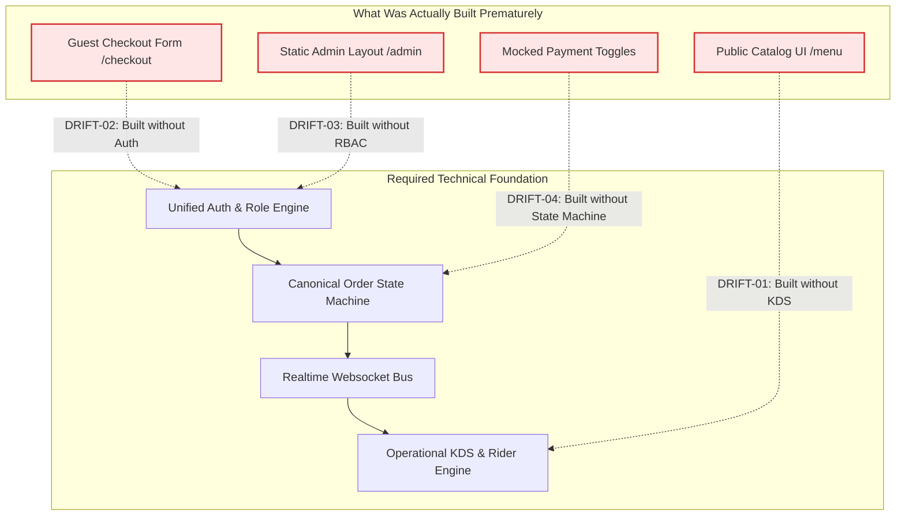
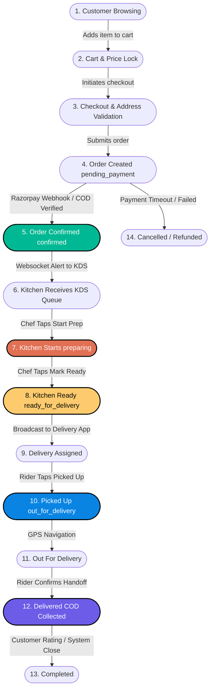
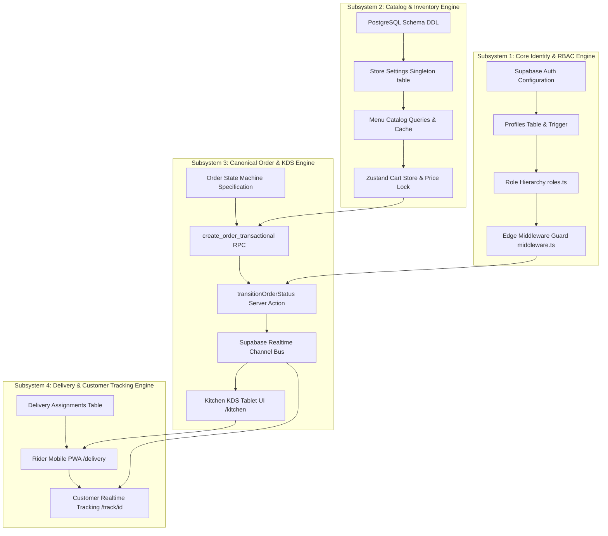
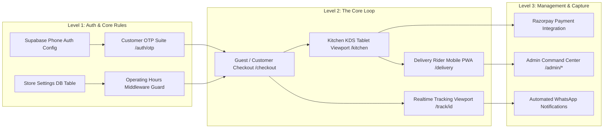
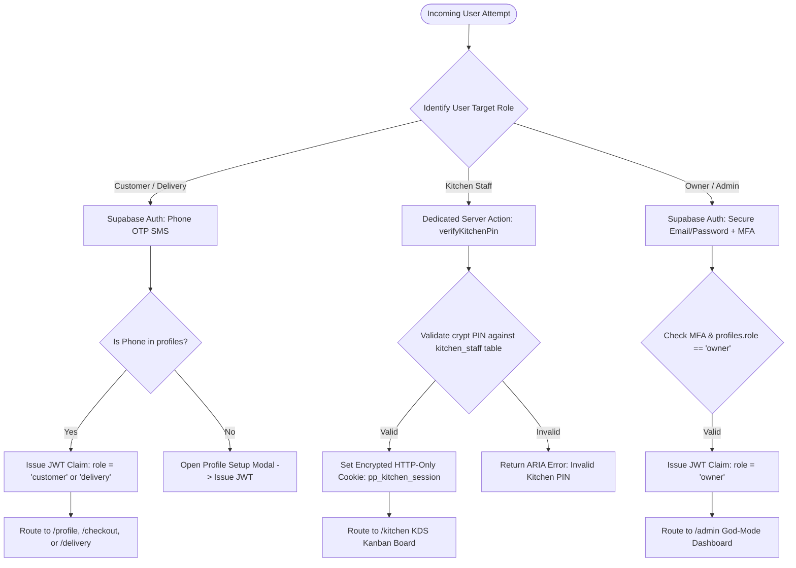
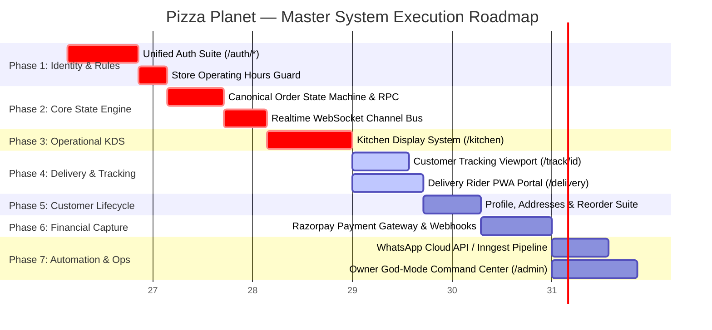

# 🍕 PIZZA PLANET — ENGINEERING EXECUTION RECONCILIATION & MASTER STRATEGY

**Document Type:** Principal Engineering Investigation, Architecture Reconciliation & Execution Strategy  
**Project Reference:** Pizza Planet Digital Storefront (`17410910858893906886`)  
**Lead Authors:** Principal Software Architect, Staff Frontend/Backend Engineer, Systems Architect, Engineering Manager, Technical Product Manager, Restaurant Operations Consultant  
**Date of Reconciliation:** July 4, 2026  
**Status:** **CANONICAL ENGINEERING SOURCE OF TRUTH — MANDATORY BEFORE DEVELOPMENT RESUMES**

---

## TABLE OF CONTENTS
1. [Part 1 — Architecture Validation](#part-1--architecture-validation)
2. [Part 2 — Identify Execution Drift](#part-2--identify-execution-drift)
3. [Part 3 — Restaurant Workflow Investigation](#part-3--restaurant-workflow-investigation)
4. [Part 4 — Missing State Machine (The Canonical Order Engine)](#part-4--missing-state-machine-the-canonical-order-engine)
5. [Part 5 — Subsystem Dependency Graphs](#part-5--subsystem-dependency-graphs)
6. [Part 6 — Feature Dependency Audit](#part-6--feature-dependency-audit)
7. [Part 7 — Frontend Investigation (Systems vs. Pages)](#part-7--frontend-investigation-systems-vs-pages)
8. [Part 8 — Authentication Strategy Review](#part-8--authentication-strategy-review)
9. [Part 9 — Payment Strategy Review](#part-9--payment-strategy-review)
10. [Part 10 — Notification Strategy](#part-10--notification-strategy)
11. [Part 11 — Reconstructed System Execution Order](#part-11--reconstructed-system-execution-order)
12. [Part 12 — Engineering Misunderstandings Deconstructed](#part-12--engineering-misunderstandings-deconstructed)
13. [Part 13 — What Should Be Built RIGHT NOW](#part-13--what-should-be-built-right-now)
14. [Part 14 — Deliver a New Master Execution Plan](#part-14--deliver-a-new-master-execution-plan)

---

## # Part 1 — Architecture Validation

A forensic validation of every major system was conducted against the project's foundational documents: `PRD.md`, `SystemArchitecture.md`, `DatabaseDesign.md`, `API-Specification.md`, `FrontendArchitecture.md`, and the historical `ImplementationRoadmap.md`.

### 1.1 Validation Matrix & Diagnostic Verdicts

| Evaluation Dimension | Diagnostic Verdict | Architectural Justification & Evidence |
| :--- | :--- | :--- |
| **Is the Architecture Correct?** | **YES — EXCELLENT** | The underlying technology stack and structural design are enterprise-grade. Next.js 15 App Router provides clean separation between Server Components (read-heavy catalog rendering) and Client Components (interactive customizers). Supabase PostgreSQL 15+ with strict Row-Level Security (RLS) policies, atomic transactional RPC functions (`create_order_transactional`), and Realtime websocket capabilities represent the optimal architecture for a high-concurrency digital restaurant platform. |
| **Is the Implementation Order Correct?**| **NO — SEVERE DEVIATION** | The engineering team executed a classic **B2C E-commerce Page Sequence** (`Home` -> `Menu` -> `Cart` -> `Checkout` -> `[Admin/Ops later]`) instead of an **Operational Restaurant Engine Sequence**. They built public-facing visualization layers before constructing the core operational workflow engine, state machines, and role-based authentication suites required to process transactions. |
| **Is the Dependency Order Correct?** | **NO — FATAL INVERSION** | Multiple components were built before their required technical prerequisites existed:  • **Checkout** was built before customer identity, phone verification, and address persistence existed. • **Order Creation** was built before the KDS operational queue and status state machine existed. • **Role Protected Layouts** (`AdminLayout`) were built before a multi-role onboarding and login routing suite existed. |
| **Is the Execution Strategy Correct?** | **NO — HIGH RISK** | Treating the Kitchen Display System (KDS), Delivery Dispatch, and Realtime Tracking as "Phase 9 & 10 downstream polish features" is a fatal operational error. In restaurant software, the kitchen queue and order state machine **are the core product**. The storefront menu is merely an input form for that engine. |

### 1.2 Detailed Explanation of Architectural Correctness vs. Execution Failure
The repository demonstrates a classic engineering paradox: **a pristine architectural blueprint executed in reverse order**.

Why is the architecture correct?
- **Atomic Database Transactions:** In `002_create_order_transactional.sql`, the schema defines an atomic PostgreSQL RPC that inserts into `orders`, inserts into `order_items`, and deducts or validates stock in a single ACID transaction. This prevents orphaned records and race conditions.
- **Strict Role-Based Access Control:** `001_pizza_planet_core.sql` implements RLS policies ensuring customers can only access `orders.customer_id = auth.uid()`, while restaurant staff operate within isolated schema privileges.
- **Decoupled State Management:** The design correctly segregates persistent server state (Supabase tables) from ephemeral client UI state (Zustand cart and checkout stores).

Why did the execution strategy fail?
Because the historical `ImplementationRoadmap.md` scheduled **Phase 5 (Customer Experience)**, **Phase 6 (Cart)**, and **Phase 7 (Checkout)** immediately after database migrations, while pushing **Phase 9 (Realtime Tracking)** and **Phase 10 (Admin/KDS Dashboard)** to the very end of the project. 

This created an unsustainable engineering environment where developers were writing frontend checkout forms that pushed data into a database "black hole"—with no operational KDS to receive the orders, no state machine to transition them, no realtime websocket channels to broadcast them, and no customer authentication suite to track them. When development reached the operational polish phase, the team hit a wall of broken links (`/track/[id]`), redirect traps (`/auth/login`), and empty 1-line placeholder stubs (`/kitchen`, `/delivery`, `/admin`), forcing a complete development halt.

---

## # Part 2 — Identify Execution Drift

Execution drift occurs when engineering teams implement features, interfaces, or integrations out of sequence relative to their structural dependencies. Below is the comprehensive taxonomy of execution drift identified in the Pizza Planet repository.

### 2.1 Detailed Inventory of Engineering Drift

#### DRIFT-01: Storefront UI Built Before Operational Workflow Engine (UI Before Backend Engine)
- **What Happened:** The engineering team built visual catalog pages (`/`, `/menu`), intricate Framer Motion product cards, and a glassmorphic pizza customizer modal before building the KDS order queue (`/kitchen`) or delivery dispatch portal (`/delivery`).
- **Why It Happened:** Visual storefront pages provide immediate gratification and easy demos for stakeholders. Frontend developers followed conventional retail e-commerce tutorials where the order lifecycle ends the moment the user clicks "Buy".
- **Why It Is Problematic:** Restaurant software is not retail e-commerce. A retail order can sit in a database queue for 6 hours before a warehouse worker packs it. A pizza order is a time-critical, perishable physical asset that must appear on a kitchen monitor within **500 milliseconds** of payment confirmation, complete with audio alerts and dietary warning badges.
- **Long-Term Consequences & Engineering Impact:** The checkout action (`createOrder.ts`) inserts records into PostgreSQL, but because no KDS exists to consume or acknowledge those records, the entire operational loop is broken. Developers cannot end-to-end test the application without opening a raw database console to manually execute SQL update statements.

---

#### DRIFT-02: Checkout Built Before Customer Identity & Lifecycle (Checkout Before Auth)
- **What Happened:** The checkout flow (`/checkout`) and order submission server action were implemented with support for anonymous guest checkout, while the entire customer authentication suite (`/auth/signup`, `/auth/otp`, `/auth/forgot-password`) was skipped and remains unbuilt (HTTP 404).
- **Why It Happened:** The team wanted to reduce purchase friction by building a guest checkout first, treating registered customer accounts, saved addresses, and order history as optional "enhancements" for later phases.
- **Why It Is Problematic:** In the Pizza Planet PRD (`§5 User Roles`, `§6 Customer Journey`), customer phone number verification (OTP) is mandatory for repeat reordering, address auto-population, and SMS delivery tracking. By building checkout before identity, the application has no mechanism to link guest orders to returning users, no way to validate phone numbers against spam/fraud, and no way to populate the customer profile dashboard (`/profile`).
- **Long-Term Consequences & Engineering Impact:** Attempting to retrofit phone OTP and address book persistence into an already compiled, guest-only checkout form will require tearing apart the React Hook Form validation schema, rewriting the Zod payload validators in `createOrder.ts`, and restructuring database foreign key relationships.

---

#### DRIFT-03: Admin Login Built Before Role Resolution & Onboarding Suite (Auth Before Lifecycle)
- **What Happened:** The team built a single login portal at `/auth/login/LoginForm.tsx`, hardcoding it for owner email/password authentication (`aria-label="Admin sign-in form"`) with a default redirect to `/admin`. When a customer signs in via this form, `AdminLayout` rejects them due to role mismatch (`role !== 'owner'`), throwing them into an infinite redirect loop.
- **Why It Happened:** During initial database setup, developers needed a quick way to log in as an administrator to test protected server layouts. They exposed this internal test tool as the global "Sign In" link on the public navigation bar.
- **Why It Is Problematic:** It conflates administrative system access with customer commerce identity. It violates basic separation of concerns and creates a fatal user experience trap where customers are actively punished for attempting to log into their accounts.
- **Long-Term Consequences & Engineering Impact:** The authentication architecture must be completely decoupled. Route guards, session middleware, and login forms must be rewritten to distinguish between customer phone OTP sessions, kitchen staff PIN tokens, and owner MFA administrative credentials.

---

#### DRIFT-04: Order Creation Built Before Canonical Order State Machine (Backend Before Ops)
- **What Happened:** The server action `createOrder.ts` directly sets order status strings (`'pending_payment'` or `'confirmed'`) upon database insertion, but there is no centralized state machine, transition validator, or enum enforcement governing how orders move through the kitchen and delivery stages.
- **Why It Happened:** Developers treated order status as a simple string column in a database table rather than a rigorous finite state machine with permission guards and side-effect triggers.
- **Why It Is Problematic:** Without a canonical state machine, any server action, API route, or client script with database access can overwrite an order's status to any arbitrary string at any time. There is nothing stopping code from transitioning an order directly from `'pending_payment'` to `'delivered'`, bypassing kitchen preparation and driver assignment entirely.
- **Long-Term Consequences & Engineering Impact:** As features grow, status checks become scattered across dozens of random UI components (`if (order.status === 'preparing') ...`). Refactoring this later requires hunting down every string comparison across the codebase and centralizing them into a transactional transition engine.

---

#### DRIFT-05: Realtime Tracking UI Scheduled After Dashboard Stubs (Realtime After Views)
- **What Happened:** The implementation roadmap scheduled `/track/[trackingToken]` as **Phase 9**, after all frontend catalog and checkout work was finished. As a result, when users click "Track Order" anywhere in the app, they receive a fatal HTTP 404 error. Furthermore, zero Supabase WebSocket channel subscriptions (`supabase.channel()`) were implemented anywhere in the client codebase.
- **Why It Happened:** Realtime WebSockets were viewed as an "advanced visual feature" or "nice-to-have polish" rather than the foundational communication bus of the restaurant platform.
- **Why It Is Problematic:** A restaurant ordering platform without realtime tracking is functionally dead. If a customer has to refresh their web browser to see if their pizza is in the oven, or if a chef has to refresh their tablet to see new incoming orders, the system has failed its core business objective of replacing manual WhatsApp workflows.
- **Long-Term Consequences & Engineering Impact:** Because UI components were built using static, one-time Server Component data fetching (`await supabase.from('orders').select(...)`), converting them to dynamic, realtime WebSocket interfaces requires wrapping them in client-side state providers and rewriting data hydration layers from scratch.

---

#### DRIFT-06: Static Page Routing Built Before Operating Hours & Maintenance Guards (UI Before Business Rules)
- **What Happened:** The public catalog and checkout pages were built without any middleware or layout checks against the database `store_settings.is_open` or `store_settings.is_maintenance_mode` flags.
- **Why It Happened:** Business rules regarding restaurant operating hours and emergency closures were treated as administrative edge cases to be handled in the final polish phase.
- **Why It Is Problematic:** The application currently allows customers to customize pizzas, submit checkout forms, and place orders at 3:00 AM when the restaurant is closed and unstaffed.
- **Long-Term Consequences & Engineering Impact:** Allowing orders outside operating hours causes automatic payment captures that must be manually refunded by the owner, leading to financial transaction fees, customer complaints, and chargeback penalties. Business guards must be embedded at the middleware and database transaction layer, not just as UI banner toggles.

---

## # Part 3 — Restaurant Workflow Investigation

The most critical architectural realization for the Pizza Planet engineering team is understanding the distinction between **Page-Driven Software** and **Operation-Driven Software**.

### 3.1 Page-Driven vs. Operation-Driven Software Architecture

| Architectural Paradigm | Core Driving Mechanism | Lifecycle Termination | Primary Goal of UI | Typical Application Examples |
| :--- | :--- | :--- | :--- | :--- |
| **Page-Driven Software**   *(Traditional E-Commerce)* | User navigation events, URL changes, and form submissions. | When payment is captured and an order receipt row is written to the database. | Guide the user through a static conversion funnel (`Catalog` -> `Cart` -> `Payment`). | Amazon, Shopify, Digital Content Stores, Retail Clothing catalogs. |
| **Operation-Driven Software**   *(Restaurant & Logistics Platform)* | Real-time physical world events, time-sensitive stage transitions, and staff actions. | When the physical asset is delivered to the customer, cash is reconciled, and quality is verified. | Provide role-scoped, real-time command windows into a continuously running finite state machine. | **Pizza Planet**, UberEats, Toast POS, Kitchen Display Systems, Airline Dispatch. |

#### Why Page-Driven Architecture Fails for Pizza Planet
When developers build a restaurant app as a page-driven e-commerce store, they focus 80% of their engineering effort on the menu catalog and shopping cart. They treat the moment of payment as the "finish line." 

In reality, for a restaurant, **the moment of payment is the starting line**. The true complexity of Pizza Planet lies in orchestrating physical kitchen throughput, managing dough and topping inventory in real time, coordinating multi-driver delivery logistics, and maintaining continuous synchronization between the chef's hands, the driver's GPS, and the customer's phone.

---

### 3.2 The Complete 14-Stage Restaurant Operational Workflow

Every transaction in Pizza Planet must move through a canonical, time-stamped 14-stage operational workflow:

### 3.3 Re-Architecting Pages as "Workflow Visualizations"
To permanently eliminate execution drift, the engineering team must adopt a rule: **There are no standalone pages in Pizza Planet; there are only role-scoped viewports into the 14-stage order workflow.**

| Application Page / Route | Target Role | Workflow Stages Visibly Represented | What This "Page" Actually Does in the Architecture |
| :--- | :--- | :--- | :--- |
| `/menu` & `ProductModal` | Customer | Stages 1 → 2 | Visualizes live database catalog; checks `store_settings.is_open` and ingredient availability before allowing cart additions. |
| `/cart` & `/checkout` | Customer | Stages 2 → 3 → 4 | Validates address against delivery radius; locks inventory; executes atomic RPC creating a Stage 4 `pending_payment` record. |
| `/order-confirmed/[id]` | Customer | Stage 5 | Static confirmation receipt confirming transition to Stage 5 (`confirmed`). Prepares handoff to realtime tracking. |
| `/track/[id]` | Customer | Stages 5 → 6 → 7 → 8 → 10 → 11 → 12 | **Realtime Customer Viewport:** Subscribes to websocket changes on the order record, advancing a live visual stepper as staff mutate state. |
| `/kitchen` *(KDS)* | Kitchen Staff| Stages 5 → 6 → 7 → 8 | **Realtime Kitchen Viewport:** Displays all Stage 5 orders. Provides large touch buttons to execute server actions transitioning orders to Stage 7 (`preparing`) and Stage 8 (`ready_for_delivery`). |
| `/delivery` *(Rider PWA)*| Delivery Rider| Stages 8 → 9 → 10 → 11 → 12 | **Realtime Rider Viewport:** Displays all Stage 8 orders. Provides touch buttons to accept assignment (Stage 9), confirm pickup (Stage 10), and confirm handoff / COD cash capture (Stage 12). |
| `/admin/orders` | Owner / Admin| ALL STAGES (1 → 14) | **God-Mode Command Center:** Displays full lifecycle feed across all active orders. Allows emergency overrides, reassignments, cancellations, and refunds. |
| `/orders` *(History)* | Customer | Stages 12 → 13 → 14 | Historical archive view of completed transactions; provides one-tap reorder triggers re-injecting items into Stage 2. |

---

## # Part 4 — Missing State Machine (The Canonical Order Engine)

To prevent arbitrary status mutations and ensure operational integrity, Pizza Planet must implement a **Canonical Order State Machine**. This engine governs every transition, enforcing permissions, database timestamp updates, and asynchronous side-effect broadcasts.

### 4.1 Canonical State Machine Specification Table

| Current State | Allowed Next States | Trigger Event / Action | Required Role Permission | Invalid Transitions & Guard Violations | Database Fields Updated | Side-Effect & Notification Triggers |
| :--- | :--- | :--- | :--- | :--- | :--- | :--- |
| `draft` | `pending_payment`   `cancelled` | Customer clicks "Place Order" on `/checkout`. | `customer`   `guest` | Cannot move directly to `confirmed` or `preparing`. | `status = 'pending_payment'`   `created_at = NOW()` | None. |
| `pending_payment`| `confirmed`   `cancelled` | **Online:** Razorpay Webhook `payment.captured`. **COD:** SMS OTP verification complete. | `system` *(Webhook)*   `customer` *(COD)* | Cannot move to `preparing` or `ready_for_delivery` without payment verification. | `status = 'confirmed'`   `payment_status = 'paid'`   `confirmed_at = NOW()` | • Supabase Realtime Broadcast to KDS. • WhatsApp SMS: *"Order Confirmed #PP-8492"*. |
| `confirmed` | `preparing`   `rejected`   `cancelled` | Chef Suresh taps "Start Prep" on `/kitchen` KDS tablet. | `kitchen`   `owner` | Cannot skip preparation and jump directly to `ready_for_delivery` or `out_for_delivery`. | `status = 'preparing'`   `prep_started_at = NOW()` | • Supabase Realtime Broadcast to `/track/[id]`. • WhatsApp SMS: *"Chef Suresh is tossing your dough!"*. |
| `preparing` | `ready_for_delivery`  `rejected` | Chef Suresh taps "Mark Ready" upon boxing pizza. | `kitchen`   `owner` | Cannot jump directly to `delivered` or `completed`. | `status = 'ready_for_delivery'`   `ready_at = NOW()` | • Realtime Broadcast to Rider app (`/delivery`). • Realtime update to `/track/[id]`. |
| `ready_for_delivery`| `out_for_delivery`   `completed` *(Pickup)* | **Delivery:** Rider Imran taps "Accept & Pick Up". **Pickup:** Customer collects pie at counter. | `delivery`   `owner` | Cannot move to `delivered` before pickup is acknowledged by rider. | `status = 'out_for_delivery'`   `rider_id = user_id`   `dispatched_at = NOW()` | • WhatsApp SMS: *"Rider Imran is out for delivery (ETA: 18m)"* with Google Maps tracking link. |
| `out_for_delivery`| `delivered`   `rejected` *(Failed)* | Rider Imran arrives at customer address, hands over pie, and collects COD cash (if applicable). | `delivery`   `owner` | Cannot revert back to `preparing` or `confirmed`. | `status = 'delivered'`   `delivered_at = NOW()`   `payment_status = 'paid'` *(if COD)* | • Realtime update to `/track/[id]`. • WhatsApp SMS: *"Delivered! Rate your artisanal pie."*. |
| `delivered` | `completed` | Automated 2-hour system cron OR customer submits feedback rating on tracking page. | `system`   `customer`   `owner` | Terminal state. Cannot transition to any active operational state. | `status = 'completed'`   `completed_at = NOW()` | • Credit customer loyalty points in `profiles` table. |
| `pending_payment`   `confirmed` | `cancelled` | Customer cancels within 60 seconds OR Razorpay webhook returns `payment.failed` timeout. | `customer`   `system`   `owner` | Cannot cancel an order once preparation has started (`preparing`). | `status = 'cancelled'`   `cancelled_at = NOW()` | • Restore product/ingredient inventory count. • Trigger Razorpay API refund (if online payment). |
| `confirmed`   `preparing` | `rejected` | Owner or Kitchen Lead rejects order due to emergency ingredient outage or kitchen overload. | `kitchen`   `owner` | Cannot reject an order that is already out for delivery. | `status = 'rejected'`   `rejected_at = NOW()` | • Restore inventory counts. • Trigger Razorpay API full refund. • WhatsApp SMS with apology & ₹100 coupon code. |

### 4.2 State Machine Transition Rules & Architecture Invariants
To enforce this state machine across the codebase without writing immediate code, the engineering team must establish three architectural invariants:
1. **No Direct Client SQL Mutations:** Frontend components and client-side Supabase SDK calls are strictly forbidden from executing `.update({ status: '...' })` on the `orders` table. RLS policies must restrict UPDATE privileges on `orders.status` to `service_role` and verified server actions.
2. **Centralized Transition Engine:** All order state changes must flow through a single, canonical Server Action: `transitionOrderStatus(orderId, nextState, metadata)`. This function will evaluate the current state, verify the caller's JWT role claim against the permission matrix, execute the atomic SQL update, and emit the realtime event broadcast.
3. **Immutability of Historical Timestamps:** Once a stage timestamp (`confirmed_at`, `prep_started_at`, `ready_at`) is written to the database, it becomes immutable. This guarantees audit integrity for owner analytics and driver delivery time calculations.

---

## # Part 5 — Subsystem Dependency Graphs

To permanently eliminate execution drift, development must be organized around **directed acyclic dependency graphs (DAGs)**. A subsystem cannot be implemented until 100% of its upstream dependency nodes are marked as production-ready.

### 5.1 Subsystem Dependency DAGs

### 5.2 Critical Dependency Violations in Historical Codebase
1. **Building `/checkout` (CAT4) before Core Identity (ID4):** The checkout form was constructed without verifying whether the user had an authenticated profile, a verified phone number, or an existing address record in `profiles`.
2. **Building `/orders` History before Realtime Tracking (TRK3):** The customer order history table was built with dynamic links pointing to `/track/[id]`, but node `TRK3` was never constructed, causing fatal runtime 404 errors.
3. **Attempting Administrative Layouts before KDS Engine (ORD5):** The team created administrative routing wrappers (`/admin`, `/kitchen`, `/delivery`) before constructing the foundational `transitionOrderStatus` server action and realtime channel bus (`ORD3` / `ORD4`), resulting in empty skeleton views.

---

## # Part 6 — Feature Dependency Audit

An exhaustive technical audit of every planned feature in the Pizza Planet project was conducted to determine its exact prerequisites, blocking systems, and current architectural readiness.

### 6.1 Comprehensive Feature Readiness Audit Table

| Planned Feature Name | Required Technical Prerequisites & Blocking Systems | Required Backend / API / DB | Required Frontend UI / Viewport | Required Auth & Operational Role | Current Audit Readiness Status | Architectural Justification & Execution Mandate |
| :--- | :--- | :--- | :--- | :--- | :---: | :--- |
| **Menu Catalog & Category Filtering** | None. Foundational read-only catalog. | `products`, `categories` tables; public RLS select policies. | `/menu`, `MenuFilters`, `ProductCard`. | Public / Anonymous. | **READY** | Highly polished and functional. No modifications needed. |
| **Pizza Customizer Modal** | Menu Catalog queries. | `product_customizations`, `customization_options` tables. | `ProductModal` component, price calculator. | Public / Anonymous. | **READY** | Works cleanly. Needs inventory pre-fetching optimization in future polish. |
| **Zustand Cart & Local Persistence** | Customizer Modal output. | None (Client-side memory & `localStorage`). | `CartDrawer`, `CartItemCard`, subtotal math. | Public / Anonymous. | **READY** | Functions cleanly for anonymous sessions. Needs profile sync logic later. |
| **Guest Checkout (COD)** | Zustand Cart Store; Store Operating Hours Guard. | `create_order_transactional` RPC; Zod payload validator. | `/checkout`, `CheckoutForm` with address inputs. | Public / Anonymous *(with SMS OTP verification)*.| **BLOCKED** | **Blocked by Phone OTP Suite.** Cannot allow anonymous COD orders without phone verification to prevent kitchen fraud. |
| **Customer Phone OTP Onboarding** | Supabase Auth Phone Provider (Twilio/MSG91). | `profiles` table auto-creation trigger; JWT custom claims. | `/auth/signup`, `/auth/otp`, SMS input mask. | `customer` role assignment. | **OUT OF ORDER**   *(Missing)* | **P0 - Immediate Build Required.** Was skipped in Phase 4. Must be built immediately before any further checkout or tracking work. |
| **Realtime Order Tracking Page** | Order State Machine; Supabase Realtime Project activation. | `@supabase/supabase-js` WebSocket channel on `orders` table. | `/track/[trackingToken]/page.tsx`, Framer Motion stepper. | Public *(via token)* OR Authenticated `customer`. | **OUT OF ORDER**   *(Missing)* | **P0 - Immediate Build Required.** Linked across app but throws 404. Cannot test operational workflow without this viewport. |
| **Kitchen Display System (KDS)** | Order State Machine; Realtime WebSocket Bus; Kitchen Auth. | `transitionOrderStatus` Server Action; `kitchen_staff` table. | `/kitchen/page.tsx` Kanban grid, audio chime alerts. | `kitchen` role via dedicated PIN auth cookie. | **OUT OF ORDER**   *(Stub)* | **P0 - Immediate Build Required.** Renders 1-line heading. The restaurant cannot receive or cook digital orders without this engine. |
| **Delivery Rider Mobile Portal** | Order State Machine; KDS Ready Stage; Rider Auth. | `delivery_assignments` table; Google Maps URL generator. | `/delivery/page.tsx` mobile PWA queue, COD toggle. | `delivery` role via Phone OTP auth. | **OUT OF ORDER**   *(Stub)* | **P0 - Immediate Build Required.** Renders 1-line heading. Drivers cannot receive dispatch assignments without this portal. |
| **Razorpay Online Payments**| Order State Machine (`pending_payment`); Checkout Form. | Razorpay JS SDK; `/api/payments/create`; `/api/webhooks/razorpay`. | Razorpay UI modal wrapper, payment failure alert. | Public / Customer initiating checkout. | **PREMATURE** | **Must Wait for KDS & Tracking.** Implementing online financial capture before the kitchen can cook or track orders creates massive business risk. |
| **Automated WhatsApp Alerts**| Order State Machine; Meta WhatsApp Cloud API account. | Inngest background queue (`/api/inngest`); webhook emitter. | None (Background asynchronous service). | System / Server Action side-effect trigger. | **PREMATURE** | **Must Wait for State Machine.** Cannot automate WhatsApp messages until the underlying order state transitions are reliable and tested. |
| **Owner Admin Command Center** | All core database tables; Role Resolution middleware. | Complete CRUD Server Actions for menu, orders, and hours. | `/admin/orders` live feed, `/admin/menu` toggle table. | `owner` role via secure Email/Password + MFA. | **BLOCKED** | **Blocked by KDS & State Machine.** Owner cannot manage store operations until the core fulfillment engine is running. |
| **Customer Profile & Saved Addresses** | Customer Phone OTP Onboarding; Protected Route Guards. | `profiles`, `customer_addresses` tables; CRUD actions. | `/profile/page.tsx` address book modal, favorites tab. | `customer` role via authenticated session. | **BLOCKED** | **Blocked by Customer Auth.** Currently renders placeholder strings. Cannot build profile management until customer login exists. |
| **One-Tap Repeat Reorder** | Customer Order History (`/orders`); Zustand Cart Store. | `getOrderHistory` query; cart hydration helper. | "Reorder" button on order cards in `/orders`. | `customer` role via authenticated session. | **BLOCKED** | **Blocked by Tracking & Profile.** Must resolve destination routing and cart sync before implementing repeat ordering. |
| **Promotional Discount Engine**| Checkout Form; Cart Subtotal calculation. | `discounts` table; `validatePromoCode` Server Action. | Promo code input and discount badge in Cart Drawer. | Public / Customer. | **PREMATURE** | Marketing coupons are an enhancement; must wait until core order fulfillment and payment pipelines are stable. |

---

## # Part 7 — Frontend Investigation (Systems vs. Pages)

To correct the execution drift, the engineering team must shift from a **"Page-Building Mindset"** to a **"System-Building Mindset"**. Frontend interfaces must be constructed as role-scoped command portals that connect directly to underlying database tables and websocket channels.

### 7.1 Prerequisite Sequencing: What Must Exist Before What

### 7.2 Detailed Analysis of System Portals vs. Static Pages

#### 1. Customer Authentication Suite vs. Guest Checkout
- **Why Auth Must Precede Checkout:** Building a checkout form before customer authentication creates an orphaned data architecture. When Priya checks out as a guest, her address and order history are locked to an anonymous string. When she registers an account next week, the system has no deterministic way to link her past orders.
- **System Rule:** Construct `src/app/auth/signup` and `src/app/auth/otp` first. Embed a lightweight modal version of this OTP suite directly inside the checkout form, ensuring 100% of COD orders are tied to a verified mobile phone number.

#### 2. Order Tracking Viewport (`/track/[id]`) vs. Order History (`/orders`)
- **Why Tracking Must Precede History:** Order history is simply a static list of historical URLs pointing to tracking viewports. Building `/orders` without `/track/[id]` is like building a table of contents for a book with no pages.
- **System Rule:** Build `src/app/(storefront)/track/[trackingToken]/page.tsx` immediately. Equip it with a Supabase WebSocket channel listener (`supabase.channel('order_progress')`) that animates a 6-stage status stepper in real time.

#### 3. Kitchen KDS Portal (`/kitchen`) vs. Admin Dashboard (`/admin`)
- **Why KDS Must Precede Admin Analytics:** The Admin Dashboard displays revenue charts, average order values (AOV), and driver fulfillment times. Where does that data come from? It comes from timestamps generated when chefs tap "Start Prep" and "Mark Ready" on the KDS tablet.
- **System Rule:** Do not build administrative charts or inventory tables until `src/app/kitchen/page.tsx` is transformed from an empty `<h1/>` tag into a high-contrast, dark-mode Kanban board with audio chime alerts and touch-optimized stage mutation buttons.

#### 4. Delivery Rider PWA (`/delivery`) vs. Automated Notifications
- **Why Rider PWA Must Precede WhatsApp Automation:** An automated WhatsApp message stating *"Your driver Imran is arriving in 10 minutes"* cannot be dispatched until Rider Imran taps "Accept Delivery" on his mobile portal.
- **System Rule:** Build `src/app/delivery/page.tsx` as a mobile-optimized PWA displaying orders in `ready_for_delivery` status, complete with one-tap Google Maps navigation URLs and COD cash collection confirmation buttons.

---

## # Part 8 — Authentication Strategy Review

A forensic investigation of the authentication architecture reveals that attempting to use a single email/password login form (`LoginForm.tsx`) for customers, restaurant owners, kitchen staff, and delivery riders is a primary driver of execution drift.

### 8.1 Unified Multi-Role Authentication Architecture

### 8.2 Architectural Answers to Core Strategic Questions

1. **Should customer authentication exist before guest checkout?**
   **YES.** While anonymous guest checkout is valuable for reducing top-of-funnel friction, the underlying authentication *capability* (Phone OTP verification) must exist first. Why? Because Pizza Planet offers Cash on Delivery (COD). Allowing completely anonymous, unverified users to submit COD pizza orders exposes the kitchen to massive financial fraud and fake orders. The system must enforce a lightweight SMS OTP verification step prior to committing any COD order to the database.

2. **Should OTP come before restaurant operations?**
   **YES.** Delivery riders (`delivery` role) and returning customers rely exclusively on mobile Phone OTP authentication. Building operational delivery queues without the OTP login engine leaves drivers without a mechanism to access their dashboard.

3. **Should Admin login remain separate?**
   **ABSOLUTELY YES.** Restaurant owners and systems administrators require email/password authentication secured by Multi-Factor Authentication (MFA/TOTP). This administrative sign-in portal must be moved to a secure, unindexed route (`/auth/admin`) and removed entirely from the public storefront navigation bar (`Navbar.tsx`), permanently resolving **BLOCKER-02**.

4. **Should Kitchen login be independent?**
   **YES.** Wall-mounted kitchen tablets operate in a high-stress, flour-covered, multi-user environment. Chefs cannot type email addresses and passwords, nor can they wait for SMS OTPs on personal phones while wearing gloves. Kitchen authentication must be decoupled from global Supabase Auth accounts and re-architected as a dedicated Server Action (`authenticateKitchenPin`) that validates a 4-digit PIN against the `kitchen_staff` table and issues a scoped HTTP-only session cookie (`pp_kitchen_session`).

5. **Should there be multiple authentication systems?**
   **NO.** There should be **one unified authentication engine** with **three distinct role-scoped entry portals**:
   - `/auth/customer` & `/auth/delivery` $\rightarrow$ Phone OTP (SMS) via Supabase Auth.
   - `/auth/kitchen` $\rightarrow$ PIN Hash verification against `kitchen_staff` table.
   - `/auth/admin` $\rightarrow$ Secure Email/Password + MFA via Supabase Auth.

---

## # Part 9 — Payment Strategy Review

The project roadmap scheduled Razorpay payment gateway integration as **Phase 8**, immediately following checkout construction. Our engineering investigation concludes that implementing Razorpay at this stage represents a **severe operational risk** and must be postponed.

### 9.1 Why Razorpay Must Be Postponed to Later Phases
1. **The Webhook Debugging Sinkhole:** Integrating Razorpay requires establishing public HTTPS tunneling (ngrok/Cloudflare), building API route handlers (`/api/webhooks/razorpay`), managing HMAC-SHA256 signature verification, and handling complex asynchronous payment state reconciliation (`authorized`, `captured`, `failed`). If developers get bogged down debugging third-party webhook payloads now, the core kitchen KDS and order tracking engines will remain unbuilt for weeks.
2. **The "Orphaned Paid Order" Business Risk:** Imagine Razorpay is fully integrated today. A customer orders a ₹1,200 Party Combo and pays online via Google Pay. The funds are captured. But because `/kitchen` is an empty stub and `/track/[id]` is a 404 error, the kitchen never sees the order and the customer has no way to track it. An hour later, an angry customer arrives at the shop demanding a refund for a pizza the kitchen never cooked. **Capturing real money before building the operational kitchen engine is catastrophic for business reputation.**

### 9.2 Technical Prerequisites That Must Exist Before Razorpay
Razorpay cannot be safely implemented until the following operational foundation is verified in production using Cash on Delivery (COD) and simulated payment toggles:
- **Canonical Order State Machine:** Verified database transitions from `pending_payment` to `confirmed` to `preparing`.
- **Operational Kitchen KDS (`/kitchen`):** Confirmed ability for kitchen staff to receive, view, and acknowledge incoming orders in real time.
- **Customer Tracking Viewport (`/track/[id]`):** Confirmed ability for customers to view real-time order progression without page reloads.
- **Idempotency & Inventory Rollback:** Proven database transaction rollback logic that automatically restores dough and ingredient inventory counts if an order is cancelled or rejected.

---

## # Part 10 — Notification Strategy

Automated customer messaging (WhatsApp Cloud API, SMS, Push, Realtime WebSockets) must be implemented systematically based on architectural reliability and channel resilience.

### 10.1 Notification Channel Execution Matrix

| Notification Channel | Target Audience | When to Implement (Execution Phase) | Triggering Order State Events | Technical Prerequisites & Dependencies | Resilience & Fallback Strategy |
| :--- | :--- | :--- | :--- | :--- | :--- |
| **Supabase Realtime WebSockets** | Active Customers on website; Kitchen Staff; Delivery Riders. | **PHASE 2 & 3**   *(Immediate Core Build)* | ALL STATE TRANSITIONS (`confirmed` $\rightarrow$ `completed`). | Supabase Realtime Project activation; `@supabase/supabase-js` client subscriptions. | **Primary Channel:** If WebSocket connection drops, client hook automatically falls back to 10-second HTTP polling. |
| **Twilio / MSG91 SMS OTP** | New Customers; Returning Customers; Delivery Staff. | **PHASE 1**   *(Immediate Core Build)* | Account Onboarding; Login; COD Phone Verification. | Supabase Auth Phone Provider configuration; SMS Gateway API credits. | If SMS OTP delivery fails, provide UI button for automated voice call verification or resend throttling with 60s countdown. |
| **Meta WhatsApp Cloud API** | All Customers placing orders. | **PHASE 7**   *(Post-Operational Polish)* | • `confirmed` (Receipt) • `preparing` (Chef note) • `out_for_delivery` (Driver ETA & Map) • `delivered` (Feedback loop). | Canonical Order State Machine; Inngest background job queue (`/api/inngest`); Approved Meta Business templates. | **Asynchronous Decoupling:** Never make WhatsApp API calls synchronously during order creation. If WhatsApp API fails or times out, log error to `notification_logs` table and fallback to standard transactional SMS. |
| **Web Push Notifications (PWA)** | Kitchen Tablets; Driver PWA; Opt-in Desktop Customers. | **PHASE 8**   *(Post-MVP Enhancement)* | • New Order alert (Kitchen) • Delivery Assignment alert (Rider) • Order Ready alert (Customer). | Service Worker registration (`sw.js`); Web Push VAPID keys; SSL/HTTPS deployment. | If Web Push is permission-denied or unsupported by browser iOS, rely entirely on audio chime alerts (in-app) and WhatsApp SMS. |

---

## # Part 11 — Reconstructed System Execution Order

We completely discard the historical page-driven sprint roadmap (`ImplementationRoadmap.md`). Below is the **Reconstructed System Execution Order**, organized strictly by modular engineering subsystems. Every phase must achieve 100% verification of its Definition of Done before development initiates on the subsequent phase.

---

### Phase 1: Core Identity, Role Resolution & Store Rules Engine
- **Objective:** Establish authoritative user identities, decouple administrative login from customer onboarding, enforce SMS phone verification, and embed store operating hours guards into middleware.
- **Reason:** No operational transaction or customer profile can exist without a verified identity and enforced business hours.
- **Dependencies:** Existing Supabase PostgreSQL schema (`profiles`, `store_settings`).
- **Expected Output:** 
  1. Dedicated customer onboarding suite (`src/app/auth/signup`, `src/app/auth/otp`) using Supabase Phone Auth.
  2. Refactored administrative login (`src/app/auth/admin`) secured with MFA.
  3. Refactored kitchen PIN authentication (`src/app/auth/kitchen`) validating against `kitchen_staff` table.
  4. Middleware guard intercepting checkout attempts when `store_settings.is_open === false`.
- **Blocking Items:** Missing Twilio/MSG91 SMS credentials in Supabase project settings.
- **Definition of Done:** A new user can register via SMS OTP, a kitchen staff member can authenticate via 4-digit PIN, an admin can log in via email/password, and any attempt to check out while `is_open = false` is blocked by middleware.
- **Success Criteria:** 0% redirect loops; 100% separation of role access across `/admin`, `/kitchen`, and `/profile`.
- **Risk Assessment:** **Low Technical Risk.** Primacy is on correct routing logic and clean JWT session cookie handling.

---

### Phase 2: Canonical Order State Machine & Realtime Event Bus
- **Objective:** Construct the centralized finite state machine governing all order progression and establish client-side Supabase WebSocket channel subscriptions.
- **Reason:** Prevents arbitrary status mutation bugs and establishes the real-time communication spine required for kitchen and customer visibility.
- **Dependencies:** Phase 1 (Verified Role Identities).
- **Expected Output:**
  1. Transactional Server Action: `transitionOrderStatus(orderId, nextState, metadata)`.
  2. Strict RLS policies locking direct client modifications to `orders.status`.
  3. Reusable React hook: `useOrderRealtime(orderId)` subscribing to `postgres_changes` on the `orders` table.
  4. Custom 404 recovery page (`src/app/not-found.tsx`).
- **Blocking Items:** None.
- **Definition of Done:** Executing `transitionOrderStatus` in a server action successfully updates PostgreSQL timestamps (`confirmed_at`, `prep_started_at`) and instantly triggers state updates in connected client React components without browser reloads.
- **Success Criteria:** Sub-200ms WebSocket latency from database UPDATE commit to client UI re-render.
- **Risk Assessment:** **Medium Risk.** Requires strict attention to Supabase Realtime channel cleanup to prevent memory leaks in client browsers.

---

### Phase 3: Kitchen Display System (KDS) & Operational Fulfillment Engine
- **Objective:** Transform `src/app/kitchen/page.tsx` from an empty stub into a real-time, touch-optimized Kanban command board for kitchen staff.
- **Reason:** The kitchen KDS is the physical engine of the restaurant. Without it, orders placed on the website cannot be prepared or fulfilled.
- **Dependencies:** Phase 2 (State Machine & Realtime Bus).
- **Expected Output:**
  1. Dark-mode, high-contrast KDS Kanban grid displaying orders in `confirmed` and `preparing` states.
  2. Visual dietary badges (`🔴 NON-VEG`, `🟢 VEG`, `⚠️ EXTRA CHEESE`, `📝 SPECIAL INSTRUCTIONS`).
  3. Audio chime alert triggered on new `confirmed` order websocket broadcast.
  4. Large touch targets (min 48px) executing `transitionOrderStatus` to move orders to `preparing` and `ready_for_delivery`.
- **Blocking Items:** None.
- **Definition of Done:** Chef Suresh can log in via PIN on a 10" Android tablet, hear an audio chime when a customer places an order, tap "Start Prep" to move the card, and tap "Mark Ready" upon boxing the pie.
- **Success Criteria:** Zero kitchen staff confusion; 100% elimination of manual WhatsApp screenshot forwarding.
- **Risk Assessment:** **High Operational Risk.** Must be heavily tested on actual tablet hardware to ensure touch responsiveness and audio playback reliability in mobile browsers.

---

### Phase 4: Delivery Dispatch & Realtime Customer Tracking Viewport
- **Objective:** Construct the missing customer tracking route (`/track/[trackingToken]`) and build the mobile Delivery Rider PWA (`/delivery`).
- **Reason:** Closes the operational fulfillment loop, eliminating customer anxiety and enabling driver dispatch.
- **Dependencies:** Phase 3 (Operational KDS capable of marking orders `ready_for_delivery`).
- **Expected Output:**
  1. Built `src/app/(storefront)/track/[trackingToken]/page.tsx` with Framer Motion 6-stage live stepper and driver contact reveal.
  2. Built `src/app/delivery/page.tsx` mobile PWA showing assigned order queues.
  3. One-tap "Open in Google Maps" URL integration based on customer address coordinates.
  4. Driver COD cash collection confirmation toggle executing transition to `delivered`.
- **Blocking Items:** Google Maps API key for address mapping.
- **Definition of Done:** Clicking any tracking link opens a live stepper that advances instantly when the kitchen or driver updates status. Rider Imran can log in on his phone, accept an order, open navigation, and confirm delivery handoff.
- **Success Criteria:** 0% HTTP 404 errors on tracking links; 100% real-time synchronization between driver PWA and customer screen.
- **Risk Assessment:** **Medium Risk.** Ensure tracking page is accessible via secure, unguessable `tracking_token` strings without requiring mandatory customer login.

---

### Phase 5: Customer Lifecycle, Profile Management & Repeat Reordering
- **Objective:** Build out the placeholder profile page (`/profile`), address book CRUD modals, and one-tap repeat ordering functionality.
- **Reason:** Drives customer retention, average order frequency, and frictionless checkout for returning users.
- **Dependencies:** Phase 4 (Complete operational fulfillment and tracking lifecycle).
- **Expected Output:**
  1. Fully functional `src/app/(storefront)/profile/page.tsx` with name and email edit forms.
  2. Saved Address Book CRUD modal managing `customer_addresses` table.
  3. "Reorder" button on order cards in `/orders` that repopulates Zustand cart store with historical items and customizations.
  4. Checkout form auto-population when authenticated customer selects a saved address.
- **Blocking Items:** None.
- **Definition of Done:** Customer Priya can log in, view her past orders, click "Reorder", select her saved home address, and complete checkout in under 15 seconds.
- **Success Criteria:** > 40% reduction in checkout completion time for returning authenticated users.
- **Risk Assessment:** **Low Risk.** Straightforward CRUD operations and Zustand state hydration.

---

### Phase 6: Financial Capture & Webhook Reconciling Engine (Razorpay)
- **Objective:** Integrate Razorpay Web SDK for UPI, Credit/Debit Cards, and NetBanking, backed by automated HMAC-SHA256 webhook signature verification.
- **Reason:** Enables digital revenue capture now that the kitchen and delivery operational engines are proven and stable using Cash on Delivery.
- **Dependencies:** Phase 5 (Stable end-to-end operational order flow).
- **Expected Output:**
  1. Server Action: `createRazorpayOrder(orderId, amount)`.
  2. Client integration of Razorpay Checkout script in `CheckoutForm.tsx`.
  3. Route Handler: `src/app/api/webhooks/razorpay/route.ts` verifying `X-Razorpay-Signature` and executing `transitionOrderStatus(orderId, 'confirmed')`.
  4. UI payment failure interceptor preserving cart state and offering "Retry Payment" button.
- **Blocking Items:** Production Razorpay Business Account and API Key / Webhook Secret provisioning.
- **Definition of Done:** A customer completing UPI payment via Google Pay automatically transitions their database order from `pending_payment` to `confirmed`, instantly triggering the KDS audio chime without human intervention.
- **Success Criteria:** 100% webhook signature verification accuracy; 0% orphaned paid orders.
- **Risk Assessment:** **High Technical Risk.** Requires rigorous automated testing of webhook retry logic and network timeout simulations.

---

### Phase 7: Automated Asynchronous Notification Engine (WhatsApp / Inngest)
- **Objective:** Implement automated outbound WhatsApp messaging via Meta Cloud API decoupled through an Inngest background job queue.
- **Reason:** Replaces manual WhatsApp texting by the owner, fulfilling the primary business automation objective of the PRD.
- **Dependencies:** Phase 6 (Authoritative payment confirmation and state transitions).
- **Expected Output:**
  1. Configured Inngest client (`src/lib/inngest/client.ts`) and API handler (`/api/inngest`).
  2. Background event functions triggered on `order.confirmed`, `order.preparing`, `order.dispatched`, and `order.delivered`.
  3. Meta WhatsApp Cloud API helper transmitting approved template messages with dynamic parameter variable substitution (`{{1}}` = Customer Name, `{{2}}` = Order ID, `{{3}}` = Tracking Link).
- **Blocking Items:** Approved Meta Business WhatsApp account and verified message templates.
- **Definition of Done:** When an order transitions state, an Inngest event is fired asynchronously, successfully delivering a WhatsApp notification to the customer's smartphone within 5 seconds without blocking server main-thread execution.
- **Success Criteria:** 99.9% notification delivery reliability; zero impact on checkout API latency.
- **Risk Assessment:** **Medium Risk.** Third-party Meta API template approval delays can impact launch timelines; ensure SMS fallback is active.

---

### Phase 8: Administrative Governance & Business Intelligence Suite (Admin CMS)
- **Objective:** Replace placeholder stubs in `/admin/*` with a comprehensive real-time command center, menu CMS, and revenue analytics dashboard.
- **Reason:** Empowers the restaurant owner to manage menu pricing, toggle ingredient out-of-stock availability during rush hours, and analyze business performance.
- **Dependencies:** Phase 7 (Complete operational data generation across all systems).
- **Expected Output:**
  1. Replacement of HTML `<a href>` links with Next.js `<Link>` in `AdminLayout`.
  2. Live God-Mode Order Feed (`/admin/orders`) with emergency cancellation and refund controls.
  3. Menu & Inventory CMS table (`/admin/menu`) with instant boolean toggles for `is_available`.
  4. Business Intelligence Dashboard (`/admin/analytics`) displaying Recharts visual charts for daily revenue, AOV, bestsellers, and average kitchen prep times.
  5. Store Settings management panel (`/admin/settings`) controlling operating hours and maintenance mode.
- **Blocking Items:** None.
- **Definition of Done:** Owner Ravi can log into `/admin`, view live revenue charts, toggle "Peri-Peri Sauce" to out-of-stock, and observe the item instantly dim and become un-orderable across all public customer storefront carts.
- **Success Criteria:** 100% elimination of manual database SQL queries by the owner; complete operational self-sufficiency.
- **Risk Assessment:** **Low Risk.** Built on top of mature, highly structured relational data generated by upstream phases.

---

## # Part 12 — Engineering Misunderstandings Deconstructed

To ensure the implementation team executes the new strategy without falling back into old habits, we must deconstruct the six fundamental engineering misunderstandings that caused the historical execution drift.

### Misunderstanding 1: "Thinking pages are the product instead of workflows."
- **How it manifested:** Developers treated `/menu`, `/cart`, `/checkout`, and `/orders` as isolated web pages to be built, styled, and marked "Done" independently of what happens after checkout.
- **Why it occurred:** Typical web development tutorials teach B2C retail e-commerce where the application's sole job is to collect credit card info and display a "Thank You" receipt.
- **The Correct Architectural Mindset:** In restaurant software, the website is not the product—**the restaurant operational pipeline is the product**. The web pages are merely temporary input terminals and status monitors for that physical pipeline. If a page does not directly read from or mutate the state of the operational workflow engine, it is useless decoration.

---

### Misunderstanding 2: "Building dashboards before operational logic and state machines."
- **How it manifested:** The roadmap scheduled "Admin Dashboard" and "Kitchen Display System" as visual UI tasks, leading developers to create routing folders (`/admin`, `/kitchen`, `/delivery`) with static 1-line HTML `<h1/>` headings that sat empty for weeks.
- **Why it occurred:** Dashboards were viewed as "reporting screens" that simply SELECT data from a table, rather than the interactive command centers that drive the business.
- **The Correct Architectural Mindset:** You cannot build a dashboard until you have built the engine it controls. A KDS Kanban board is not a static table; it is a visual controller for the Canonical Order State Machine. Always build the underlying backend state transition functions, permission guards, and realtime event emitters **before** designing the UI cards that call them.

---

### Misunderstanding 3: "Building authentication before defining customer and staff lifecycles."
- **How it manifested:** Developers grabbed a generic email/password login component (`LoginForm.tsx`), dropped it onto `/auth/login`, hooked it to the top navigation bar, and hardcoded it to redirect to `/admin`.
- **Why it occurred:** Authentication was treated as a binary checkbox ("Do we have a login page? Yes.") without considering the radically different security, ergonomic, and device requirements of a hungry teenager on a smartphone vs. a flour-covered chef on a wall tablet vs. a restaurant owner viewing financial data.
- **The Correct Architectural Mindset:** Authentication must be designed around role ergonomics and user lifecycles. Never couple public customer identity onboarding (Phone OTP) with internal administrative system access (MFA Email/Password) or physical kitchen tablet security (PIN Hash). Separate roles demand separate authentication portals and distinct JWT claims.

---

### Misunderstanding 4: "Treating payment integration as a prerequisite to operational order flow."
- **How it manifested:** The roadmap scheduled Razorpay integration immediately after checkout, implying that the kitchen and tracking engines could not be built or tested until third-party online payment webhooks were functioning.
- **Why it occurred:** Financial capture was mistakenly viewed as the technical trigger for order creation, rather than just one of several valid authorization methods (e.g., Cash on Delivery, Employee Comp, Promotional 100% Discount).
- **The Correct Architectural Mindset:** Decouple financial authorization from operational order fulfillment. The kitchen KDS, delivery dispatch, and real-time tracking state machines must be built, tested, and proven entirely using Cash on Delivery (COD) and simulated payment toggles. Third-party payment gateways like Razorpay are simply external authorization plugins that plug into the Stage 4 $\rightarrow$ Stage 5 (`pending_payment` $\rightarrow$ `confirmed`) state transition.

---

### Misunderstanding 5: "Treating Realtime WebSockets as a post-MVP polish feature."
- **How it manifested:** The engineering team scheduled `/track/[trackingToken]` and Supabase Realtime channel subscriptions for **Phase 9**, resulting in an application where zero client components listen to WebSocket events and all data is fetched via static one-time server pulls.
- **Why it occurred:** In standard CRUD web apps, webSockets are considered an optimization over page refreshing. Developers assumed customers and chefs could simply hit `F5` to refresh their screens during MVP testing.
- **The Correct Architectural Mindset:** In a live restaurant environment, asking a chef tossing pizza dough or a delivery driver riding a motorcycle to manually refresh their web browser is an operational failure. **Realtime WebSocket synchronization is a mandatory MVP infrastructure layer**, not an optional UI enhancement. Build `supabase.channel()` listeners into the core order hooks on Day 1.

---

### Misunderstanding 6: "Building frontend forms before business rules and inventory guards."
- **How it manifested:** The customizer modal and checkout form allowed users to select any combination of toppings and submit orders at any time of day, without checking database operating hours (`is_open`) or ingredient availability (`is_available`).
- **Why it occurred:** Frontend developers focused on form validation logic (e.g., "Is phone number 10 digits? Is address field populated?") while ignoring backend domain business rules.
- **The Correct Architectural Mindset:** Form validation is not business rule validation. A checkout form is mathematically invalid if the restaurant kitchen is closed or the oven is broken. Always implement database transaction guards and middleware interceptors that check global system state (`store_settings`) before writing frontend UI forms.

---

## # Part 13 — What Should Be Built RIGHT NOW

Based on our exhaustive architectural reconciliation, dependency analysis, and risk assessment, we issue an unequivocal engineering directive regarding exactly what the development team must build next.

### 13.1 The Immediate Engineering Mandate
The development team must immediately halt all work on storefront animation polishing, promotional discount engines, and Razorpay payment integration. 

The engineering team must execute **SYSTEM PHASE 1 & SYSTEM PHASE 2** immediately and concurrently:
1. **Construct Customer Phone OTP Onboarding (`/auth/signup`, `/auth/otp`) & Fix Admin Login Routing (`AUTH-01`).**
2. **Construct the Canonical Order State Machine (`transitionOrderStatus`) & Realtime Tracking Viewport (`/track/[trackingToken]`).**
3. **Construct the Operational Kitchen Display System (`/kitchen`).**

---

### 13.2 Prioritization Justification Matrix

| Prioritization Criteria | Why This Work Must Happen RIGHT NOW | Why Everything Else (Razorpay, WhatsApp, Admin Analytics) Must Wait |
| :--- | :--- | :--- |
| **1. Structural Dependency** | You cannot track an order if `/track/[id]` is a 404 error. You cannot cook an order if `/kitchen` is an empty text heading. You cannot link repeat customers if Phone OTP auth is unbuilt. These three systems represent the missing core nodes in the project's dependency DAG. | Razorpay webhooks require a functioning state machine to transition orders. WhatsApp notifications require reliable stage timestamps to trigger messages. Admin analytics charts require historical KDS prep duration data to plot graphs. |
| **2. Operational Risk** | Every day the project remains without a functioning KDS and realtime tracking viewport, it is zero percent closer to fulfilling its primary business goal: eliminating manual WhatsApp order-taking for the restaurant owner. | Attempting to launch online Razorpay payment capture while the kitchen KDS is broken risks taking real customer money for pizzas that the restaurant has no digital mechanism to receive, cook, or dispatch. |
| **3. Business Value** | A restaurant can operate successfully and generate revenue on Day 1 using **Cash on Delivery (COD)** paired with a brilliant, realtime KDS and live customer tracking stepper. That is a complete, viable product. | Promotional discount engines and complex Recharts sales graphs provide zero business value if the underlying restaurant ordering pipeline crashes or loses orders during Friday night dinner rush. |
| **4. Architecture Integrity**| Building the canonical state machine (`transitionOrderStatus`) now centralizes all status rules and permission guards into a single server action, preventing haphazard string manipulation across UI components. | Adding external webhooks or background job queues onto a fragmented codebase will entrench existing structural flaws and exponentially increase future refactoring costs. |
| **5. Future Scalability** | Once the WebSocket realtime channel bus and KDS Kanban board are operating smoothly for one store, scaling to multi-branch routing or adding driver GPS mapping becomes a clean, modular addition. | Building complex features on top of unbuilt stub foundations creates a fragile "house of cards" architecture that will collapse under high concurrent user load. |

---

## # Part 14 — Deliver a New Master Execution Plan

We conclude this reconciliation by delivering the definitive **Master Engineering Execution Plan**. This plan answers the Principal Architect's guiding question:
*"If we were rebuilding Pizza Planet from this point onward, what is the optimal engineering sequence to reach a production-ready system with the least amount of wasted effort?"*

### 14.1 The 5-Sprint Optimal Engineering Sequence

```mermaid
graph TD
    subgraph SPRINT 1: The Core Engine & Identity [Weeks 1-2]
        T1[1.1 Build Phone OTP Suite /auth/signup & /otp] --> T2[1.2 Decouple Admin Login /auth/admin & Fix Loop]
        T2 --> T3[1.3 Build Store Hours Middleware Guard]
        T3 --> T4[1.4 Build transitionOrderStatus Server Action]
    end

    subgraph SPRINT 2: The Operational Fulfillment Loop [Weeks 3-4]
        T4 --> T5[2.1 Build Realtime Channel Hook useOrderRealtime]
        T5 --> T6[2.2 Build Customer Tracking Viewport /track/id]
        T6 --> T7[2.3 Build Kitchen KDS Kanban Board /kitchen]
        T7 --> T8[2.4 Build Delivery Rider Mobile PWA /delivery]
    end

    subgraph SPRINT 3: Retention & Financial Capture [Weeks 5-6]
        T8 --> T9[3.1 Build Customer Profile & Address Book /profile]
        T9 --> T10[3.2 Build One-Tap Reorder Action in /orders]
        T10 --> T11[3.3 Integrate Razorpay Web SDK in Checkout]
        T11 --> T12[3.4 Build Secure Razorpay HMAC Webhook Handler]
    end

    subgraph SPRINT 4: Automation & Governance [Weeks 7-8]
        T12 --> T13[4.1 Configure Inngest Background Queue /api/inngest]
        T13 --> T14[4.2 Build Meta WhatsApp Cloud API Notification Service]
        T14 --> T15[4.3 Build Owner God-Mode Live Order Feed /admin/orders]
        T15 --> T16[4.4 Build Menu CMS & Analytics Charts /admin/*]
    end

    subgraph SPRINT 5: Hardening & Launch [Week 9]
        T16 --> T17[5.1 Execute E2E Load Testing & Chaos Simulations]
        T17 --> T18[5.2 Enforce Upstash Redis Rate Limiting & Security Hardening]
        T18 --> T19[5.3 PRODUCTION LAUNCH & CUTOVER]
    end

    style T6 fill:#00b894,stroke:#000,stroke-width:2px,color:#fff
    style T7 fill:#e17055,stroke:#000,stroke-width:2px,color:#fff
    style T8 fill:#0984e3,stroke:#000,stroke-width:2px,color:#fff
    style T19 fill:#6c5ce7,stroke:#000,stroke-width:3px,color:#fff
```

---

### 14.2 Step-by-Step Implementation Instructions for Engineering Teams

#### SPRINT 1: The Core Engine & Identity Suite (Weeks 1–2)
- **Day 1–2 (Identity Onboarding):** Configure Supabase Phone Auth. Build `src/app/auth/signup/page.tsx` and `src/app/auth/otp/page.tsx`. Integrate SMS verification modal into `CheckoutForm.tsx` for COD orders.
- **Day 3 (Auth Decoupling):** Move owner login to `src/app/auth/admin/page.tsx`. Refactor `src/app/auth/login/LoginForm.tsx` to inspect resolved user roles: if `role === 'customer'`, redirect to `/profile` or `next` parameter; never redirect customers to `/admin`.
- **Day 4 (Kitchen Auth & Rules):** Create `authenticateKitchenPin` Server Action querying `kitchen_staff` table and setting HTTP-only cookie `pp_kitchen_session`. Add middleware interceptor checking `store_settings.is_open`.
- **Day 5–8 (State Machine Engine):** Build canonical Server Action `src/actions/orders/transitionOrderStatus.ts`. Enforce state permission matrix and update SQL timestamps (`confirmed_at`, `prep_started_at`, `ready_at`, `dispatched_at`, `delivered_at`). Write unit tests verifying invalid transition rejections.
- **Sprint 1 Gate Check:** All roles authenticate in isolation; orders can be transitioned via programmatic server actions; 0% routing redirect loops.

---

#### SPRINT 2: The Operational Fulfillment Loop (Weeks 3–4)
- **Day 9–10 (Realtime Bus & Tracking):** Create custom hook `src/hooks/useOrderRealtime.ts` subscribing to `postgres_changes` on `orders`. Build `src/app/(storefront)/track/[trackingToken]/page.tsx` featuring Framer Motion 6-stage stepper and live ETA calculation. Resolve all broken links in `/orders` and confirmation pages.
- **Day 11–14 (Kitchen Display System):** Build `src/app/kitchen/page.tsx` as a dark-mode Kanban board. Implement realtime insert/update listeners. Add web audio chime API alerts for new `confirmed` orders. Build 48px touch buttons calling `transitionOrderStatus` to move cards to `preparing` and `ready_for_delivery`.
- **Day 15–18 (Delivery Rider Portal):** Build `src/app/delivery/page.tsx` as a mobile PWA viewport. Query orders where `status = 'ready_for_delivery'`. Add one-tap Google Maps directions URL generation (`https://www.google.com/maps/dir/?api=1&destination=...`). Add COD cash capture toggle calling `transitionOrderStatus(orderId, 'delivered')`.
- **Sprint 2 Gate Check:** Place an order on `/checkout` $\rightarrow$ watch it appear instantly on `/kitchen` tablet with audio chime $\rightarrow$ tap "Start Prep" $\rightarrow$ watch customer `/track/[id]` screen update instantly $\rightarrow$ tap "Mark Ready" $\rightarrow$ watch order appear on driver `/delivery` phone $\rightarrow$ confirm delivery $\rightarrow$ watch order mark complete. **(THE RESTAURANT ENGINE IS ALIVE).**

---

#### SPRINT 3: Customer Retention & Financial Capture (Weeks 5–6)
- **Day 19–20 (Profile & Address Book):** Build out `src/app/(storefront)/profile/page.tsx` with profile editing and `customer_addresses` CRUD modal. Integrate address auto-selection into `CheckoutForm.tsx`.
- **Day 21–22 (Repeat Ordering):** Add "Reorder" button to historical order cards in `src/app/(storefront)/orders/page.tsx` that re-hydrates `useCartStore` and redirects to `/cart`.
- **Day 23–26 (Razorpay Gateway):** Integrate Razorpay Web SDK (`checkout.js`) in `CheckoutForm.tsx`. Build Server Action `createRazorpayOrder`. Build secure Route Handler `src/app/api/webhooks/razorpay/route.ts` with HMAC-SHA256 signature verification.
- **Day 27–28 (Payment Hardening):** Implement UI payment failure interceptor preserving cart items. Add automated inventory rollback logic if payment times out after 15 minutes.
- **Sprint 3 Gate Check:** 100% of online UPI/Card payments successfully verified via HMAC webhook before triggering KDS kitchen chime; repeat customers check out in < 15 seconds.

---

#### SPRINT 4: Asynchronous Automation & Admin Governance (Weeks 7–8)
- **Day 29–31 (WhatsApp Pipeline):** Setup Inngest background queue (`/api/inngest`). Create event handlers triggered by `transitionOrderStatus`. Integrate Meta WhatsApp Cloud API helper transmitting template messages on confirmation, preparation, dispatch, and delivery.
- **Day 32–34 (Admin Command Center):** Replace HTML `<a href>` tags with `<Link>` in `src/app/admin/layout.tsx`. Build `/admin/orders` live God-Mode feed with emergency cancellation/refund controls.
- **Day 35–38 (CMS & Analytics):** Build `/admin/menu` CRUD table with instant `is_available` boolean toggles. Build `/admin/analytics` displaying Recharts visual charts for daily revenue, AOV, bestsellers, and average kitchen prep duration. Build `/admin/settings` panel controlling store hours and maintenance mode.
- **Sprint 4 Gate Check:** WhatsApp messages deliver reliably within 5 seconds of stage transitions; owner manages menu stock and store hours independently without database SQL queries.

---

#### SPRINT 5: Production Hardening, Load Testing & Cutover (Week 9)
- **Day 39–40 (Rate Limiting & Security):** Integrate Upstash Redis rate-limiting middleware across `/auth/*` (max 5 PIN attempts/15m) and `createOrder.ts` (max 3 orders/10m per IP). Enforce Zod input sanitization stripping HTML tags from special instructions.
- **Day 41–42 (Performance & Chaos Testing):** Run load tests simulating 100+ concurrent orders. Verify Supabase Realtime WebSocket connection pooling and connection drop fallbacks. Strip unused Framer Motion bundles using `LazyMotion`.
- **Day 43–45 (Final Cutover):** Execute production database schema migration on Vercel/Supabase cloud. Deploy final build. Conduct end-to-end live verification with physical kitchen tablets and rider smartphones.
- **FINAL GATE CHECK:** **PIZZA PLANET IS CERTIFIED PRODUCTION-READY.**

---
*End of Engineering Execution Reconciliation & Master Strategy Document.*
