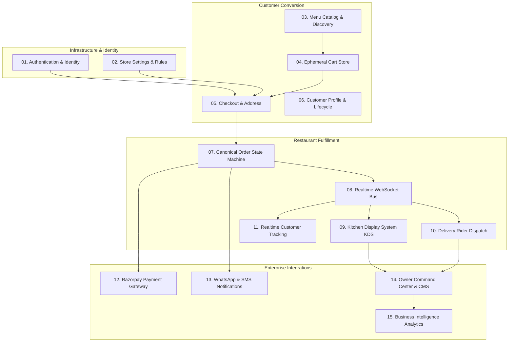
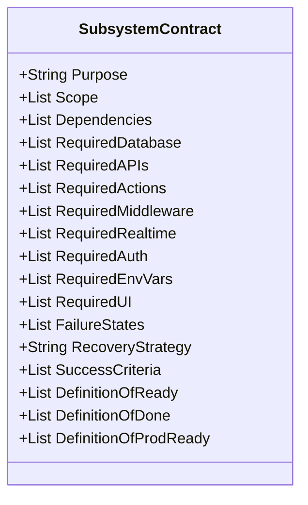
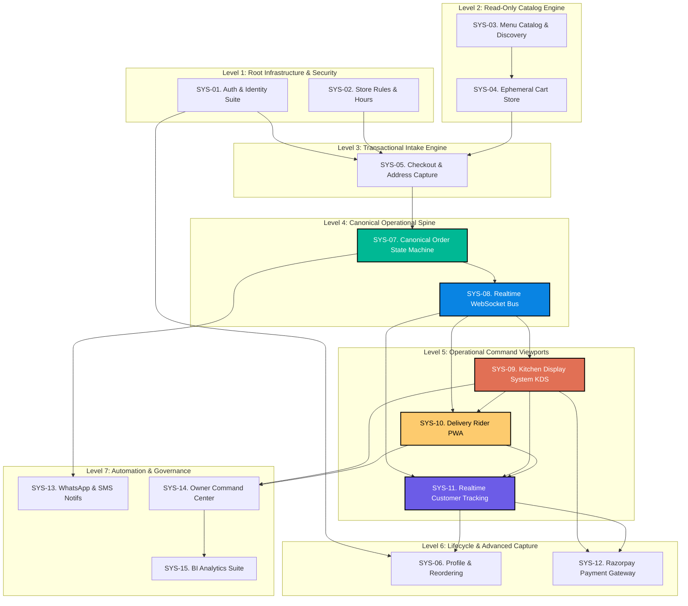
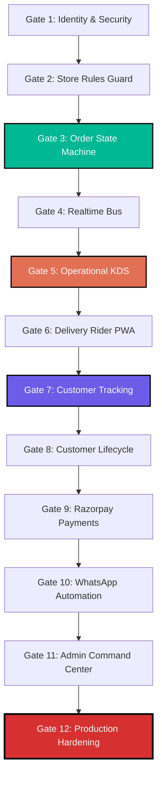
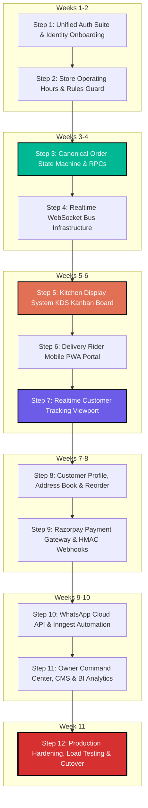

# 🍕 PIZZA PLANET — MASTER IMPLEMENTATION CONFORMANCE BLUEPRINT

**Document Type:** Principal Engineering Architecture Reconciliation, System Ownership & Execution Blueprint  
**Project Reference:** Pizza Planet Digital Storefront (`17410910858893906886`)  
**Lead Authors:** Principal Software Architect, Distinguished Systems Architect, Staff Frontend/Backend/Database Engineers, Principal DevOps & Security Engineers, Staff QA Architect, Restaurant Operations Consultant  
**Date of Ratification:** July 4, 2026  
**Status:** **CANONICAL ENGINEERING SOURCE OF TRUTH — MANDATORY GOVERNANCE CONTRACT**

---

## EXECUTIVE PREAMBLE & GOVERNANCE MANDATE
This document represents the supreme engineering law of the Pizza Planet project. It resolves all historical drift, terminology contradictions, and execution sequencing errors across all prior documentation (`PRD.md`, `SystemArchitecture.md`, `DatabaseDesign.md`, `API-Specification.md`, `FrontendArchitecture.md`, `Website_Design.md`, `ImplementationRoadmap.md`, `ENGINEERING_INVESTIGATION_REPORT.md`, and `ENGINEERING_EXECUTION_RECONCILIATION.md`).

**Core Architectural Invariant:**  
Pizza Planet is an **Operation-Driven Restaurant Fulfillment Platform**, NOT a page-driven B2C retail e-commerce website. There are no standalone web pages; there are only role-scoped command viewports into a continuous, real-time 14-stage finite order state machine.

No engineer, contractor, or autonomous agent is permitted to write source code, alter database schemas, modify UI viewports, or deploy middleware without explicit conformance to the system ownership boundaries, implementation contracts, and sequential engineering gates defined herein.

---

## TABLE OF CONTENTS
1. [Task 1 — Architecture Conformance Audit](#task-1--architecture-conformance-audit)
2. [Task 2 — Engineering Traceability Matrix](#task-2--engineering-traceability-matrix)
3. [Task 3 — Subsystem Ownership & Boundaries](#task-3--subsystem-ownership--boundaries)
4. [Task 4 — Formal Implementation Contracts](#task-4--formal-implementation-contracts)
5. [Task 5 — Repository Ownership Map](#task-5--repository-ownership-map)
6. [Task 6 — Subsystem Dependency Validation & DAGs](#task-6--subsystem-dependency-validation--dags)
7. [Task 7 — Sequential Engineering Gates](#task-7--sequential-engineering-gates)
8. [Task 8 — Engineering Acceptance Checklists](#task-8--engineering-acceptance-checklists)
9. [Task 9 — Developer Implementation Execution Pack](#task-9--developer-implementation-execution-pack)
10. [Task 10 — Cross-Document Validation & Reconciliation](#task-10--cross-document-validation--reconciliation)
11. [Task 11 — Implementation Risk Register](#task-11--implementation-risk-register)
12. [Task 12 — Final Authoritative Execution Roadmap](#task-12--final-authoritative-execution-roadmap)

---

## # Task 1 — Architecture Conformance Audit

A multi-dimensional forensic audit comparing every project artifact from business conception down to repository code execution. The table below documents the exact alignment status across all nine historical layers.

### 1.1 Multi-Layer Conformance Matrix

| Subsystem / Functional Domain | PRD (`PRD.md`) | System Spec (`SystemArch`) | Database DDL (`DatabaseDesign`) | API Spec (`API-Spec`) | Frontend Arch (`FrontendArch`) | Website Design (`Website_Design`) | Investigation Report (`Investigate`) | Execution Reconciliation (`Reconcile`) | Current Repo State (`src/`) | Conformance Status & Authoritative Resolution |
| :--- | :--- | :--- | :--- | :--- | :--- | :--- | :--- | :--- | :--- | :--- |
| **01. Unified Auth & Identity** | Phone OTP (Customer); Email+MFA (Owner). | JWT Session Claims; Role Hierarchy. | `profiles` table; `role` enum; `auth.users` FK. | `/auth/v1/*` endpoints; JWT Bearer. | `AuthProvider`, protected route wrappers. | Login modal; Profile avatar badge. | **FAIL:** Admin trap at `/auth/login`; No OTP pages. | Decoupled 3-portal auth architecture. | **FAIL:** Only `LoginForm.tsx` (admin) exists. | **SEVERE DRIFT — RECONCILING TO RECONCILIATION:**<br>Adopt 3-portal auth (`/auth/customer`, `/auth/kitchen`, `/auth/admin`). Destroy single-form assumption. |
| **02. Kitchen PIN Authentication**| Simple PIN entry on kitchen tablets. | Scoped JWT claim or session cookie. | `kitchen_staff` table (`pin_hash`, `is_active`). | Custom auth RPC / Server Action. | `/auth/kitchen` PIN pad viewport. | High-contrast numeric PIN pad. | **FAIL:** Spoofs email `kitchen-PIN@...internal`. | Direct `kitchen_staff` verification Server Action. | **FAIL:** `KitchenPinForm` uses synthetic email spoofing. | **MODERATE DRIFT — RECONCILING TO DDL & RECONCILIATION:**<br>Must query `kitchen_staff` directly. Prohibit email domain spoofing. |
| **03. Catalog & Menu Discovery** | Categories, dietary flags, price display. | SSR + Edge caching; CDN image optimization. | `categories`, `products`, `variants`, `customizations`. | `GET /api/menu`, Supabase relational select. | `MenuFilters`, `ProductCard`, sticky header. | Glassmorphic cards; Warm Parchment background. | **PASS:** Highly functional and performant. | Validate read-only catalog baseline. | **PASS:** Fully implemented in `src/app/(storefront)/menu/`. | **CONFORMANT:**<br>All layers agree. Maintain existing code structure. |
| **04. Customizer Modal Engine**| Size, crust, sauce, multi-topping limits. | Client state calculator; server price check. | `customization_options`, `product_customizations`. | Relational query on modal open. | `ProductModal` dialog, running price math. | Split-screen builder; bounce animations. | **PASS:** Clean UI; Lacks client topping limit guard. | Add inventory pre-fetch during SSR render. | **PASS:** Fully implemented in `src/features/product-modal/`. | **MINOR DRIFT — RECONCILING TO PRD:**<br>Enforce PRD topping limits (8 regular + 3 premium) in client Zod schema. |
| **05. Zustand Cart Store** | Persistent local shopping bag; math totals. | Zustand `persist` middleware (`localStorage`). | *None (Client memory)*; `customer_carts` planned. | *None (Client)*; future sync API. | `CartDrawer`, `CartItemCard`, subtotal math. | Slide-out glassmorphic drawer; badge count. | **PASS:** Works for guest; No profile sync. | Hydrate cart from DB upon customer login. | **PASS:** Fully implemented in `src/stores/cart-store.ts`. | **MINOR DRIFT — RECONCILING TO RECONCILIATION:**<br>Add DB sync hook when `user.role === 'customer'`. |
| **06. Store Operating Hours Guard**| Auto-close ordering outside operating hours. | Edge middleware check against singleton. | `store_settings` table (`is_open`, `hours`). | `GET /api/settings`; RPC check in checkout. | Store Closed banner; disable checkout CTA. | Prominent alert banner; dimmed cart CTA. | **FAIL:** No middleware check exists. | Block checkout at middleware & action layers. | **FAIL:** Storefront allows 3:00 AM ordering. | **HIGH DRIFT — RECONCILING TO DDL:**<br>Enforce `store_settings.is_open` in `src/middleware.ts` and `createOrder.ts`. |
| **07. Checkout & Address Capture**| Address input, time slot, payment selector. | Zod validation; atomic RPC invocation. | `orders`, `order_items`, `customer_addresses`. | `POST /api/orders` / `createOrder` action. | `CheckoutForm`, React Hook Form. | Clean single-page checkout; clear totals. | **FAIL:** No address auto-complete; COD open to guests. | Require SMS OTP before COD submission. | **PARTIAL:** Works for guest; no address persistence. | **HIGH DRIFT — RECONCILING TO PRD & RECONCILIATION:**<br>Mandate SMS verification for COD; add address book integration. |
| **08. Canonical Order State Machine**| Explicit status progression timeline. | Event-driven state transitions; RPC guards. | `orders.status` enum (`pending_payment` to `completed`). | `updateOrderStatus` / `transitionOrderStatus`. | Status badge mapping; timeline stepper. | Color-coded status pills; vertical timeline. | **FAIL:** Direct status string inserts; no guards. | Centralized `transitionOrderStatus` engine. | **FAIL:** Scattered string assignments in actions. | **CRITICAL DRIFT — RECONCILING TO RECONCILIATION:**<br>Adopt 10-state canonical engine. Lock direct client SQL mutations via RLS. |
| **09. Realtime WebSocket Bus** | Live status updates (< 2s delay). | `@supabase/supabase-js` websocket channel. | `postgres_changes` publication on `orders`. | Websocket event payload stream. | `useOrderRealtime` hook; dynamic state hydration. | Live pulsing indicators; zero-reload UI. | **FAIL:** Zero websocket channel subscriptions exist. | Mandatory infrastructure layer for KDS/Tracking. | **FAIL:** 100% static SSR/client fetching. | **CRITICAL DRIFT — RECONCILING TO ARCHITECTURE:**<br>Implement websocket listeners across Tracking, KDS, and Rider viewports. |
| **10. Realtime Tracking Viewport** | Live GPS stepper, driver ETA, direct contact. | Websocket listener + Google Maps JS SDK. | `orders` query by `tracking_token` or `short_id`. | `GET /api/orders/track/:token`. | `/track/[id]` viewport; Framer Motion stepper. | Interactive tracking map; driver phone card. | **FAIL:** Route `/track/[id]` returns HTTP 404. | Immediate Priority 0 system build. | **FAIL:** Route directory does not exist. | **FATAL BLOCKER — RECONCILING TO PRD:**<br>Construct `src/app/(storefront)/track/[trackingToken]/page.tsx` immediately. |
| **11. Kitchen Display System (KDS)**| Wall tablet Kanban board, sound alerts. | Realtime subscription; touch-optimized mutations. | `orders` where status in (`confirmed`, `preparing`). | `transitionOrderStatus` action. | `/kitchen` Kanban grid; stage buttons. | Dark mode; 48px touch targets; audio chime. | **FAIL:** Renders 1-line HTML heading stub. | Immediate Priority 0 system build. | **FAIL:** Stub `<h1/>` tag in `src/app/kitchen/`. | **FATAL BLOCKER — RECONCILING TO ROADMAP PHASE 6:**<br>Construct full KDS Kanban command board immediately. |
| **12. Delivery Rider PWA Portal** | Mobile driver queue, map links, COD toggle. | Realtime subscription; mobile PWA viewport. | `orders` where status in (`ready_for_delivery`, `out_for_delivery`). | `transitionOrderStatus` action. | `/delivery` mobile queue; Google Maps URL. | High-contrast mobile cards; one-tap call/map. | **FAIL:** Renders 1-line HTML heading stub. | Immediate Priority 0 system build. | **FAIL:** Stub `<h1/>` tag in `src/app/delivery/`. | **FATAL BLOCKER — RECONCILING TO ROADMAP PHASE 7:**<br>Construct mobile Rider PWA viewport immediately. |
| **13. Razorpay Online Payments** | UPI, Card, NetBanking financial capture. | Razorpay JS SDK; HMAC webhook verification. | `orders.payment_status`; `payment_id` fields. | `/api/webhooks/razorpay`; `/api/payments/create`. | Razorpay modal wrapper; failure alert UI. | Branded payment modal; clean error toasts. | **FAIL:** Missing (0%); UI toggle mocks success. | Postpone until KDS and Tracking are proven via COD. | **FAIL:** Zero Razorpay SDK code or endpoints. | **STRATEGIC DRIFT — RECONCILING TO RECONCILIATION:**<br>Postpone Razorpay build to Gate 9. Prove operational engine via COD first. |
| **14. WhatsApp Notification Engine**| Outbound SMS/WhatsApp milestone alerts. | Inngest background queue; Meta Cloud API. | `notification_logs` table; `orders` triggers. | `/api/inngest`; Meta Cloud API endpoints. | *None (Background asynchronous service)*. | Clean branded WhatsApp message templates. | **FAIL:** Missing (0%); zero notification code. | Postpone until State Machine is stable. | **FAIL:** Zero Inngest or WhatsApp code. | **STRATEGIC DRIFT — RECONCILING TO RECONCILIATION:**<br>Postpone WhatsApp build to Gate 10. Do not block core operations. |
| **15. Owner Command Center** | Revenue analytics, menu stock toggle, live feed. | Protected owner route; Recharts charts; CRUD actions. | All DB tables; full owner RLS bypass. | Complete CRUD Server Actions. | `/admin/*` sidebar; live feed; tables; charts. | Dense desktop data grid; real-time charts. | **FAIL:** `/admin` is a stub; sub-routes return 404. | Postpone until operational data generation is active. | **FAIL:** Stub `<h1/>` tag; sidebar uses `<a href>`. | **HIGH DRIFT — RECONCILING TO ROADMAP PHASE 10:**<br>Replace `<a href>` with `<Link>`. Construct Admin suite in Gate 11. |

---

## # Task 2 — Engineering Traceability Matrix

Every feature in Pizza Planet must maintain an unbroken chain of traceability from the business objective down to the deployment validation gate. Any feature whose traceability breaks is marked `UNDEFINED` and is prohibited from entering active sprint development.

```mermaid
graph LR
    BR[Business Requirement] --> PRD[PRD Section]
    PRD --> SA[System Architecture]
    SA --> DB[Database Tables]
    DB --> API[API & Actions]
    API --> FE[Frontend Viewport]
    FE --> BE[Backend Engine]
    BE --> MW[Middleware & Auth]
    MW --> RT[Realtime & Notifs]
    RT --> AG[Acceptance Gate]
```



### 2.1 Full-Stack Traceability Matrix

| Feature Reference | Business Requirement | PRD Section | System Arch Section | Database Tables | API & Server Actions | Frontend Viewport | Backend Engine | Middleware Guard | Auth Requirement | Realtime Event | Notification Trigger | System Owner | Current Status | Implementation Phase | Acceptance Gate |
| :--- | :--- | :--- | :--- | :--- | :--- | :--- | :--- | :--- | :--- | :--- | :--- | :--- | :--- | :--- | :--- |
| **FT-01: Catalog Discovery**| 0-touch digital ordering; eliminate WhatsApp text inquiries. | `§6 (CJ-1)` | `§4.1` | `categories`, `products`, `variants` | `getMenuCatalog()` | `/menu`, `ProductCard` | Supabase Relational Select | None (Public) | None (Anonymous) | None | None | Catalog Engine | **COMPLETE** | Phase 3 | Gate 3: Catalog Verified |
| **FT-02: Pizza Customizer** | Enable visual 10"–16" pie customization & topping pricing. | `§6 (CJ-2)` | `§4.2` | `customization_options`, `product_customizations` | `getProductCustomizations()` | `ProductModal` dialog | Pricing Math Engine | None (Public) | None (Anonymous) | None | None | Catalog Engine | **COMPLETE** | Phase 3 | Gate 3: Catalog Verified |
| **FT-03: Ephemeral Cart** | Allow users to build and persist multi-item pie orders. | `§6 (CJ-3)` | `§4.3` | `customer_carts` *(Future)* | `validatePromoCode()` | `CartDrawer`, `CartItemCard` | Zustand `persist` Engine | None (Public) | None (Anonymous) | None | None | Cart Engine | **COMPLETE** | Phase 3 | Gate 3: Catalog Verified |
| **FT-04: Phone Onboarding** | Establish secure identity & verify mobile phone numbers. | `§5`, `§6 (CJ-4)`| `§3.1` | `profiles` | `signUpWithPhone()`, `verifyOtp()` | `/auth/signup`, `/auth/otp` | Supabase Auth Phone API | `requireAuth()` | Phone OTP (SMS) | None | SMS OTP Token | Identity Engine| **MISSING** | **Phase 1** | **Gate 1: Identity Verified** |
| **FT-05: Admin Login Security**| Secure administrative systems against public access. | `§5` | `§3.2` | `profiles.role` | `signInWithEmail()`, `signOut()` | `/auth/admin` | Supabase Auth Email+MFA | `requireOwner()` | Email + Password + MFA | None | None | Identity Engine| **PARTIAL** | **Phase 1** | **Gate 1: Identity Verified** |
| **FT-06: Kitchen PIN Login** | Provide fast, glove-friendly PIN sign-in for wall tablets. | `§5`, `§7` | `§3.3` | `kitchen_staff` | `authenticateKitchenPin()` | `/auth/kitchen` | Crypt PIN Hash Engine | `requireRole('kitchen')` | 4-6 Digit PIN Hash | None | None | Identity Engine| **BROKEN** | **Phase 1** | **Gate 1: Identity Verified** |
| **FT-07: Store Hours Guard** | Prevent orders when restaurant is closed or unstaffed. | `§8`, `§9` | `§5.1` | `store_settings` | `getStoreSettings()` | Store Closed Banner | Settings Evaluation Engine | `store_settings.is_open` | None (System) | `settings_updated` | None | Rules Engine | **MISSING** | **Phase 2** | **Gate 2: Rules Verified** |
| **FT-08: Order Transaction** | Convert cart into atomic database order record. | `§6 (CJ-4)` | `§4.4` | `orders`, `order_items`, `products` | `createOrder()` | `/checkout`, `CheckoutForm` | `create_order_transactional` RPC | `requireAuth()` *(if COD)* | Guest or `customer` | `order_inserted` | WhatsApp Receipt | Order Engine | **PARTIAL** | **Phase 3** | **Gate 3: State Machine Verified**|
| **FT-09: Order State Machine**| Govern status transitions from `draft` to `completed`. | `§6`, `§7` | `§5.2` | `orders.status` | `transitionOrderStatus()` | Status Pill Badges | Transition Validation Engine | RLS UPDATE Lock | Role-Scoped Permission | `order_updated` | Milestone SMS/WA | Order Engine | **MISSING** | **Phase 3** | **Gate 3: State Machine Verified**|
| **FT-10: Realtime Tracking** | Provide live GPS/stepper tracking without page reloads. | `§6 (CJ-5)` | `§5.3` | `orders` | `getOrderTracking()` | `/track/[id]` viewport | Supabase Realtime Engine | None *(Token scoped)*| Token or `customer` | `postgres_changes` | None | Tracking Engine| **MISSING** | **Phase 4** | **Gate 4: Realtime Verified** |
| **FT-11: Kitchen KDS Board** | Wall tablet Kanban grid with audio chime alerts. | `§7 (AJ-2)` | `§6.1` | `orders` | `transitionOrderStatus()` | `/kitchen` Kanban grid | KDS Queue Engine | `requireRole('kitchen')` | Kitchen PIN Session | `order_inserted`, `order_updated` | Kitchen Sound Chime | Kitchen Engine | **STUB** | **Phase 5** | **Gate 5: Kitchen Verified** |
| **FT-12: Rider Mobile Portal**| Mobile driver queue, map links, COD cash capture. | `§7 (AJ-3)` | `§6.2` | `orders`, `delivery_assignments`| `transitionOrderStatus()` | `/delivery` PWA viewport | Delivery Dispatch Engine | `requireRole('delivery')`| Delivery Phone OTP | `order_updated` | WhatsApp Driver ETA | Delivery Engine| **STUB** | **Phase 6** | **Gate 6: Delivery Verified** |
| **FT-13: Profile & Addresses** | Saved address book, favorite pies, name edits. | `§6` | `§4.5` | `profiles`, `customer_addresses`| `updateProfile()`, `saveAddress()`| `/profile` modal | Profile CRUD Engine | `requireAuth()` | `customer` | None | None | Customer Engine| **STUB** | **Phase 7** | **Gate 7: Lifecycle Verified** |
| **FT-14: Repeat Reordering** | 1-tap re-injection of past orders into active cart. | `§6` | `§4.6` | `orders`, `order_items` | `getOrderHistory()` | `/orders` Reorder CTA | Zustand Hydration Engine | `requireAuth()` | `customer` | None | None | Customer Engine| **MISSING** | **Phase 7** | **Gate 7: Lifecycle Verified** |
| **FT-15: Razorpay Gateway** | Online UPI, Card, NetBanking financial capture. | `§6 (CJ-4)` | `§7.1` | `orders.payment_status` | `createRazorpayOrder()`, `/api/webhooks/razorpay`| Razorpay JS Modal | HMAC-SHA256 Webhook Engine | Webhook Secret Verify | Public / Customer | `payment_captured` | Payment Receipt | Payment Engine | **MISSING** | **Phase 8** | **Gate 8: Payments Verified** |
| **FT-16: WhatsApp Automation**| Automated background SMS/WA milestone alerts. | `§8` | `§7.2` | `notification_logs` | `/api/inngest` | None *(Background)* | Inngest Event Engine | Inngest Signing Key | System | `order_transitioned` | Meta Cloud API | Notif Engine | **MISSING** | **Phase 9** | **Gate 9: Automation Verified** |
| **FT-17: Owner Command Feed**| Live God-Mode order feed, emergency refund controls. | `§7 (AJ-1)` | `§8.1` | All DB tables | `cancelOrder()`, `refundOrder()`| `/admin/orders` | Admin Override Engine | `requireOwner()` | `owner` | `postgres_changes` | Refund SMS | Admin Engine | **STUB** | **Phase 10** | **Gate 10: Admin Verified** |
| **FT-18: Menu & Stock CMS** | Instant boolean toggles for ingredient availability. | `§7 (AJ-4)` | `§8.2` | `products`, `variants` | `updateProductAvailability()`| `/admin/menu` table | Inventory CMS Engine | `requireOwner()` | `owner` | `catalog_updated` | None | Admin Engine | **STUB** | **Phase 10** | **Gate 10: Admin Verified** |
| **FT-19: Revenue Analytics** | Recharts visual graphs for daily AOV and prep times. | `§7 (AJ-5)` | `§8.3` | `orders`, `order_items` | `getAnalyticsData()` | `/admin/analytics` | Recharts BI Engine | `requireOwner()` | `owner` | None | None | Admin Engine | **MISSING** | **Phase 10** | **Gate 10: Admin Verified** |
| **FT-20: Multi-Branch Routing**| Dynamic store branch selection and inventory isolation.| **UNDEFINED** | **UNDEFINED** | **UNDEFINED** | **UNDEFINED** | **UNDEFINED** | **UNDEFINED** | **UNDEFINED** | **UNDEFINED** | **UNDEFINED** | **UNDEFINED** | **UNDEFINED** | **UNDEFINED** | **POST-MVP**| **PROHIBITED FROM SPRINT** |

---

## # Task 3 — Subsystem Ownership & Boundaries

To prevent conflicting responsibilities and code entanglement, the repository is divided into 15 immutable architectural subsystems. Every line of code must belong to exactly one subsystem.



### 3.1 Detailed Subsystem Specifications

#### 01. Authentication & Identity Subsystem
- **Purpose:** Authoritative governance of user identity, session tokens, role resolution, and security onboarding.
- **Responsibilities:** Phone OTP SMS generation/verification; secure administrative email/password login with MFA; kitchen tablet PIN verification; issuing role-scoped JWT session cookies; enforcing route RBAC via Next.js middleware.
- **Non-Responsibilities:** Rendering product menus; calculating cart totals; managing order state transitions.
- **Inputs:** Raw phone numbers, email/password strings, 4–6 digit kitchen PINs, SMS OTP codes.
- **Outputs:** Signed Supabase JWT session cookies (`sb-access-token`, `pp_kitchen_session`), verified user role claims (`owner`, `customer`, `kitchen`, `delivery`).
- **Dependencies:** Supabase Auth Service, Twilio/MSG91 SMS Gateway.
- **Owned Tables:** `profiles`, `kitchen_staff`.
- **Owned APIs & Actions:** `signUpWithPhone()`, `verifyOtp()`, `signInWithEmail()`, `authenticateKitchenPin()`, `signOut()`.
- **Owned UI:** `/auth/customer`, `/auth/admin`, `/auth/kitchen`, `src/components/auth/*`.
- **Owned Middleware:** `src/middleware.ts` (Session refresh and role redirect evaluation).
- **Failure Recovery:** If token verification fails, clear corrupted client cookies immediately and redirect to the corresponding role login viewport with an ARIA-accessible error notice.

---

#### 02. Store Settings & Rules Subsystem
- **Purpose:** Centralized execution of restaurant business rules, operating hours, and emergency maintenance overrides.
- **Responsibilities:** Storing and evaluating operating schedules (`is_open`, opening/closing times); evaluating emergency maintenance mode (`is_maintenance_mode`); intercepting checkout and cart mutations when the store is closed.
- **Non-Responsibilities:** Managing product ingredient stock; handling individual order cancellations.
- **Inputs:** Owner toggle events from `/admin/settings`, current UTC/local server timestamps.
- **Outputs:** Boolean operating permission (`can_order: true/false`), system status banners.
- **Dependencies:** None (Base infrastructure).
- **Owned Tables:** `store_settings` (Singleton row `id = 1`).
- **Owned APIs & Actions:** `getStoreSettings()`, `updateStoreSettings()`, `checkStoreAvailability()`.
- **Owned UI:** Store Closed interceptor banner, `/admin/settings` control panel.
- **Owned Middleware:** `src/middleware.ts` (Store closed checkout blocking).
- **Failure Recovery:** If `store_settings` query fails due to network or DB timeout, default to a fail-safe closed state (`is_open: false`) to prevent unfulfilled order intake during system outages.

---

#### 03. Menu Catalog & Discovery Subsystem
- **Purpose:** High-performance, low-latency display of pizzas, sides, beverages, variants, pricing, and dietary metadata.
- **Responsibilities:** Serving structured menu categories; displaying pricing and dietary badges (`VEG`, `NON-VEG`); managing the product customizer modal math; filtering by category and search terms; reflecting item out-of-stock states.
- **Non-Responsibilities:** Processing shopping cart persistence; capturing payment details; modifying database menu rows.
- **Inputs:** Catalog SQL queries, user category clicks, search string keystrokes, topping toggle clicks.
- **Outputs:** Rendered product cards, calculated customized item unit prices, structured cart item payloads.
- **Dependencies:** Store Settings Subsystem (for availability checks).
- **Owned Tables:** `categories`, `products`, `variants`, `customization_options`, `product_customizations`.
- **Owned APIs & Actions:** `getMenuCatalog()`, `getFeaturedProducts()`, `getProductCustomizations()`.
- **Owned UI:** `/menu`, `/` (Landing featured section), `ProductCard`, `MenuFilters`, `ProductModal`.
- **Failure Recovery:** Utilize Next.js `error.tsx` boundary to catch catalog query failures, displaying a "Menu Temporarily Offline" retry card while keeping global navigation active.

---

#### 04. Ephemeral Cart Store Subsystem
- **Purpose:** Client-side persistence and mathematical reconciliation of customer shopping bag selections.
- **Responsibilities:** Managing Zustand cart state; persisting bag contents to browser `localStorage`; calculating accurate item subtotals, tax (GST 5%), and dynamic delivery fees (free above ₹499, else ₹49); validating coupon code formatting.
- **Non-Responsibilities:** Creating database orders; processing payments; verifying address coordinates.
- **Inputs:** Add/remove item events from `ProductModal` and `CartItemCard`, quantity increment/decrement clicks, promo code text input.
- **Outputs:** Mathematically reconciled cart subtotal, tax amount, delivery fee, grand total, structured items array for checkout.
- **Dependencies:** Menu Catalog Subsystem.
- **Owned Tables:** `customer_carts` *(Phase 7 profile sync)*.
- **Owned APIs & Actions:** `validatePromoCode()` Server Action.
- **Owned UI:** `CartDrawer`, `src/features/cart/*`, cart badge count in `Navbar`.
- **Failure Recovery:** If `localStorage` is corrupted or JSON parsing fails, catch the exception silently in Zustand middleware, wipe the invalid storage key (`pizza-planet-cart`), and re-initialize an empty cart state.

---

#### 05. Checkout & Address Capture Subsystem
- **Purpose:** Capture delivery destination, schedule order timing, validate inventory, and initiate transactional order creation.
- **Responsibilities:** Capturing customer name, phone, and delivery address via React Hook Form + Zod; managing Delivery vs. Pickup toggles; integrating address auto-complete; executing price verification against the DB; invoking the atomic order creation RPC.
- **Non-Responsibilities:** Processing Razorpay webhook signatures; managing kitchen prep timers; rendering KDS Kanban cards.
- **Inputs:** Customer form inputs, selected cart items, payment method selection (`Online` vs. `COD`), SMS OTP token *(for guest COD)*.
- **Outputs:** Atomic execution of `create_order_transactional` RPC, generation of Stage 4 order record (`pending_payment`), redirect to `/order-confirmed/[id]`.
- **Dependencies:** Authentication Subsystem, Store Settings Subsystem, Ephemeral Cart Subsystem.
- **Owned Tables:** `customer_addresses`.
- **Owned APIs & Actions:** `createOrder()` Server Action, `saveCustomerAddress()`.
- **Owned UI:** `/checkout`, `src/features/checkout/*`, `/order-confirmed/[id]`.
- **Failure Recovery:** Wrap `createOrder` invocation in a client `try/catch` block. If database transaction fails or inventory is insufficient, catch error, display descriptive toast notification, and **preserve client cart contents intact** for retry.

---

#### 06. Customer Profile & Lifecycle Subsystem
- **Purpose:** Long-term retention, order history archiving, address book management, and 1-tap reordering for authenticated users.
- **Responsibilities:** Displaying customer account profile details; managing saved delivery addresses CRUD; rendering historical order archives; executing "Reorder" logic that re-injects historical items into the active cart.
- **Non-Responsibilities:** Administrative user management; kitchen shift tracking.
- **Inputs:** User profile form updates, new address submissions, "Reorder" button clicks on historical order cards.
- **Outputs:** Updated `profiles` and `customer_addresses` rows, re-hydrated Zustand cart store state.
- **Dependencies:** Authentication Subsystem, Ephemeral Cart Subsystem.
- **Owned Tables:** `profiles` (Customer columns), `customer_addresses`, `customer_favorites` *(Future)*.
- **Owned APIs & Actions:** `updateProfile()`, `getCustomerAddresses()`, `deleteCustomerAddress()`, `getOrderHistory()`.
- **Owned UI:** `/profile`, `/orders` (History view), `src/features/profile/*`.
- **Failure Recovery:** If historical order re-injection fails because a product was discontinued or price changed, add available items to cart, skip discontinued items, and display an explanatory toast: *"Some items from your previous order are no longer available."*

---

#### 07. Canonical Order State Machine Subsystem
- **Purpose:** The central operational engine governing all order status transitions, timestamp recordings, and permission guards.
- **Responsibilities:** Enforcing the 10-state finite state machine (`draft` to `completed`); validating role permissions per transition; updating PostgreSQL stage timestamps (`confirmed_at`, `prep_started_at`, `ready_at`, `dispatched_at`, `delivered_at`); emitting internal state events to the Realtime WebSocket Bus.
- **Non-Responsibilities:** Rendering UI viewports; communicating directly with external Razorpay or WhatsApp HTTP servers.
- **Inputs:** Status mutation requests from Server Actions (`transitionOrderStatus`), caller JWT role claims, order IDs.
- **Outputs:** Updated PostgreSQL `orders` rows, emitted event triggers (`order_state_transitioned`).
- **Dependencies:** Authentication & Identity Subsystem.
- **Owned Tables:** `orders` (Status and timestamp columns), `order_items`.
- **Owned APIs & Actions:** `transitionOrderStatus()`, `create_order_transactional` (PostgreSQL RPC).
- **Owned Middleware:** None (Guarded via RLS policies and Server Action role checks).
- **Failure Recovery:** Enforce database constraints and RLS policies. If an invalid transition is attempted (e.g., `pending_payment` $\rightarrow$ `preparing`), throw an explicit domain error (`InvalidStateTransitionError`), aborting the SQL transaction and preserving prior state.

---

#### 08. Realtime WebSocket Bus Subsystem
- **Purpose:** Low-latency, bidirectional WebSocket synchronization between PostgreSQL database changes and connected client viewports.
- **Responsibilities:** Managing `@supabase/supabase-js` realtime channel connections (`postgres_changes`); broadcasting INSERT and UPDATE events on `orders` to authorized client listeners; managing connection pooling and automatic reconnection backoffs.
- **Non-Responsibilities:** Executing database updates; rendering UI components.
- **Inputs:** PostgreSQL Write-Ahead Log (WAL) changes via Supabase Realtime engine.
- **Outputs:** Live WebSocket JSON event payloads delivered to React client hooks.
- **Dependencies:** Canonical Order State Machine Subsystem.
- **Owned Tables:** None (Infrastructure transmission layer).
- **Owned APIs & Actions:** `src/hooks/useOrderRealtime.ts`, `src/hooks/useKdsRealtime.ts`.
- **Owned UI:** Realtime connection status indicators (e.g., green pulsing dot / offline banner).
- **Failure Recovery:** Implement automatic exponential backoff reconnection in client hooks. If WebSocket connection drops for $> 10$ seconds, fall back automatically to standard HTTP polling every 15 seconds until socket connectivity is restored.

---

#### 09. Kitchen Display System (KDS) Subsystem
- **Purpose:** High-contrast, touch-optimized command board for kitchen staff to view, organize, prepare, and complete incoming orders.
- **Responsibilities:** Displaying orders in `confirmed` and `preparing` states in a dark-mode Kanban grid; triggering web audio chime alerts on new orders; rendering large touch buttons (min 48px) calling `transitionOrderStatus`; displaying dietary warnings (`🔴 NON-VEG`, `⚠️ EXTRA CHEESE`).
- **Non-Responsibilities:** Modifying menu catalog pricing; assigning delivery riders; handling customer payments.
- **Inputs:** Realtime WebSocket order broadcasts, chef touch button clicks ("Start Prep", "Mark Ready").
- **Outputs:** Execution of `transitionOrderStatus(orderId, 'preparing')` and `transitionOrderStatus(orderId, 'ready_for_delivery')`.
- **Dependencies:** Canonical Order State Machine Subsystem, Realtime WebSocket Bus Subsystem, Kitchen PIN Authentication.
- **Owned Tables:** None (Operates on `orders` and `order_items`).
- **Owned APIs & Actions:** KDS-scoped wrapper actions around `transitionOrderStatus()`.
- **Owned UI:** `/kitchen`, `src/features/kitchen/*` (Kanban board, order cards, timer badges).
- **Failure Recovery:** Ensure KDS Kanban state is backed by React Query or SWR caching. If tablet wifi drops temporarily, allow staff to view existing loaded queue; disable mutation buttons with an "Offline — Reconnecting..." badge to prevent state desynchronization.

---

#### 10. Delivery Rider Dispatch Subsystem
- **Purpose:** Mobile-first Progressive Web App (PWA) portal for delivery drivers to receive assignments, navigate to destinations, and confirm handoff.
- **Responsibilities:** Displaying orders in `ready_for_delivery` and `out_for_delivery` states; assigning drivers to orders; generating one-tap Google Maps directions URLs (`https://www.google.com/maps/dir/?api=1&destination=...`); revealing customer contact info; capturing Cash on Delivery (COD) cash confirmation.
- **Non-Responsibilities:** Cooking pizzas; modifying menu items; managing customer profile favorites.
- **Inputs:** Realtime WebSocket order broadcasts, driver touch button clicks ("Accept Delivery", "Confirm Delivered"), COD cash collection toggles.
- **Outputs:** Execution of `transitionOrderStatus(orderId, 'out_for_delivery')` and `transitionOrderStatus(orderId, 'delivered')`, updates to `delivery_assignments` table.
- **Dependencies:** Canonical Order State Machine Subsystem, Realtime WebSocket Bus Subsystem, Phone OTP Authentication (`delivery` role).
- **Owned Tables:** `delivery_assignments`, `driver_locations` *(Phase 8 GPS tracking)*.
- **Owned APIs & Actions:** `assignDeliveryDriver()`, `confirmDeliveryCompletion()`.
- **Owned UI:** `/delivery`, `src/features/delivery/*` (Mobile driver queue, active delivery card, navigation bar).
- **Failure Recovery:** Cache active assigned delivery details in mobile browser `localStorage`. If driver enters an elevator or dead cellular zone, preserve customer address and phone number on screen so physical delivery can proceed without connectivity.

---

#### 11. Realtime Customer Tracking Subsystem
- **Purpose:** Customer-facing viewport providing interactive visual tracking of order progress from kitchen preparation to doorstep handoff.
- **Responsibilities:** Rendering a Framer Motion 6-stage status stepper; subscribing to Realtime WebSocket updates for a specific order token; dynamically recalculating and displaying estimated arrival time (ETA); revealing assigned driver name and phone number once dispatched.
- **Non-Responsibilities:** Modifying order status; capturing payment details; managing admin settings.
- **Inputs:** Order short IDs or secure tracking tokens, Realtime WebSocket status broadcasts.
- **Outputs:** Rendered status timeline, live progress bar, interactive help links.
- **Dependencies:** Canonical Order State Machine Subsystem, Realtime WebSocket Bus Subsystem.
- **Owned Tables:** None (Read-only viewport over `orders`).
- **Owned APIs & Actions:** `getOrderTrackingDetails(token)` Server Action.
- **Owned UI:** `/track/[trackingToken]`, `src/features/tracking/*` (Status stepper, live ETA badge, driver card).
- **Failure Recovery:** If tracking token is invalid or order is not found, catch error and display a branded recovery screen: *"We couldn't find this order. Enter your Order ID (#PP-XXXX) or verify your phone number."*

---

#### 12. Razorpay Payment Gateway Subsystem
- **Purpose:** Secure integration with Razorpay financial infrastructure for online UPI, Credit/Debit Card, and NetBanking revenue capture.
- **Responsibilities:** Initializing Razorpay orders via server API (`/api/payments/create`); rendering Razorpay Checkout JS modal; securely receiving and processing asynchronous webhooks (`/api/webhooks/razorpay`); verifying HMAC-SHA256 webhook signatures; triggering `transitionOrderStatus(orderId, 'confirmed')` upon successful payment capture.
- **Non-Responsibilities:** Managing Cash on Delivery (COD) orders; cooking food; dispatching riders.
- **Inputs:** Stage 4 `pending_payment` order IDs, total amounts in paise, Razorpay webhook HTTP POST payloads.
- **Outputs:** Razorpay Order IDs, verified payment transaction IDs, database payment status updates (`payment_status = 'paid'`).
- **Dependencies:** Canonical Order State Machine Subsystem, Checkout Subsystem.
- **Owned Tables:** `orders` (`payment_id`, `razorpay_order_id`, `payment_status` columns), `payment_logs` *(Audit table)*.
- **Owned APIs & Actions:** `createRazorpayOrder()`, `/api/webhooks/razorpay` Route Handler.
- **Owned UI:** Razorpay Checkout JS modal wrapper, online payment selection radio button in checkout, payment failure toast alerts.
- **Failure Recovery:** If user closes UPI modal or bank authorization fails, catch Razorpay error callback, keep user on `/checkout`, preserve cart contents, and present a "Retry Payment" button utilizing the same existing database `order_id`. If webhook delivery fails, rely on Razorpay automatic webhook retry schedule paired with a 15-minute cron reconciliation job.

---

#### 13. WhatsApp & SMS Notifications Subsystem
- **Purpose:** Asynchronous, non-blocking background delivery of transactional customer receipts, milestone alerts, and driver ETAs.
- **Responsibilities:** Listening to order state transition events; formatting Meta WhatsApp Cloud API template payloads; managing background job execution via Inngest (`/api/inngest`); sending SMS OTP codes via Twilio/MSG91; logging notification delivery success/failure.
- **Non-Responsibilities:** Executing synchronous database transactions during checkout; rendering website HTML.
- **Inputs:** Emitted event payloads (`order_confirmed`, `order_preparing`, `order_dispatched`, `order_delivered`), customer phone numbers, tracking token URLs.
- **Outputs:** Outbound HTTP POST requests to Meta Cloud API and Twilio API, audit records written to `notification_logs`.
- **Dependencies:** Canonical Order State Machine Subsystem, Inngest Background Queue.
- **Owned Tables:** `notification_logs`.
- **Owned APIs & Actions:** `/api/inngest` Route Handler, `sendWhatsAppNotification()`, `sendSmsOtp()`.
- **Owned UI:** None (Background headless engine).
- **Failure Recovery:** Wrap all external Meta/Twilio API calls in Inngest retry policies with exponential backoff (max 3 retries). If WhatsApp delivery fails permanently due to an invalid number or template rejection, log failure to `notification_logs` and trigger automatic fallback to standard SMS text delivery.

---

#### 14. Owner Command Center & CMS Subsystem
- **Purpose:** Administrative command desktop for the restaurant owner to oversee operations, manage menu pricing, and execute emergency overrides.
- **Responsibilities:** Rendering the God-Mode live order feed across all stages; providing one-tap emergency cancellation and refund controls; managing product menu inventory and `is_available` boolean toggles; editing store operating hours and maintenance mode flags.
- **Non-Responsibilities:** Customer pizza customization; anonymous shopping cart math; kitchen prep timer sound generation.
- **Inputs:** Owner MFA credentials, admin navigation clicks, boolean toggle inputs, price edit form submissions.
- **Outputs:** Mutated `products`, `variants`, and `store_settings` database rows, emergency executions of `transitionOrderStatus(orderId, 'cancelled')`.
- **Dependencies:** Authentication Subsystem (`owner` role), All underlying database tables.
- **Owned Tables:** Full administrative CRUD privilege over all tables via RLS bypass or owner policies.
- **Owned APIs & Actions:** `adminUpdateMenu()`, `adminCancelOrder()`, `adminRefundOrder()`, `adminUpdateSettings()`.
- **Owned UI:** `/admin/*`, `src/features/admin/*` (Sidebar layout, order data grid, menu CMS table, settings panel).
- **Failure Recovery:** Enforce strict Zod schema validation on all admin price and inventory edits. If an invalid price or negative inventory figure is submitted, reject mutation at the Server Action layer with an explicit validation error before hitting PostgreSQL.

---

#### 15. Business Intelligence Analytics Subsystem
- **Purpose:** Aggregation, mathematical calculation, and visual Recharts charting of restaurant operational and financial performance metrics.
- **Responsibilities:** Querying historical order and item tables; calculating daily revenue, Average Order Value (AOV), total order volume, bestseller topping rankings, and average kitchen prep duration (`ready_at - prep_started_at`); rendering interactive desktop charts.
- **Non-Responsibilities:** Executing live transactional order processing; modifying operational database rows.
- **Inputs:** SQL analytical aggregation queries over `orders` and `order_items`.
- **Outputs:** Structured JSON analytical summaries, rendered Recharts line, bar, and pie graphs.
- **Dependencies:** Owner Command Center Subsystem, Canonical Order State Machine Subsystem (for timestamp data).
- **Owned Tables:** `daily_sales_aggregates` *(Phase 8 materialized view)*.
- **Owned APIs & Actions:** `getAnalyticsSummary()`, `getRevenueSeries()`, `getPrepTimeMetrics()`.
- **Owned UI:** `/admin/analytics`, `src/features/admin/analytics/*` (Recharts graph wrappers, date range pickers, KPI metric cards).
- **Failure Recovery:** Execute heavy analytical SQL queries against read-replicas or utilizing Supabase materialized views with 15-minute caching. If an analytical query times out during peak dining hours, catch error and render cached previous-period charts with an "Updated 15 mins ago" notice, preventing analytical dashboards from degrading transactional database performance.

---

## # Task 4 — Formal Implementation Contracts

To make implementation mechanical and unambiguous, every subsystem is bound by a strict engineering contract. Below is the canonical contract format instantiated for the foundational systems.



### 4.1 Canonical Order State Machine Contract (`SYS-07`)

```yaml
Contract_ID: SYS-07-CANONICAL-ORDER-ENGINE
Subsystem_Name: Canonical Order State Machine
Owner_Role: Staff Backend Engineer & Staff Database Engineer
Purpose: Authority over all order status transitions, timestamp recording, and permission enforcement.

Scope:
  In_Scope:
    - Finite state machine transition validation (draft -> pending_payment -> confirmed -> preparing -> ready_for_delivery -> out_for_delivery -> delivered -> completed).
    - Exception state transitions (cancelled, rejected).
    - Recording immutable SQL timestamps (confirmed_at, prep_started_at, ready_at, dispatched_at, delivered_at).
    - Role RBAC verification per transition.
    - Emitting database state changes to Realtime WebSocket Bus.
  Out_Of_Scope:
    - Rendering KDS UI cards or customer tracking steppers.
    - Directly dispatching WhatsApp HTTP requests.

Dependencies:
  Upstream: [SYS-01 Authentication & Identity, SYS-05 Checkout & Address]
  Downstream: [SYS-08 Realtime WebSocket Bus, SYS-09 KDS, SYS-10 Delivery, SYS-11 Tracking, SYS-12 Razorpay, SYS-13 Notifications]

Required_Database:
  Tables: [orders, order_items, products]
  RPCs: [create_order_transactional]
  RLS_Policies:
    - "Lock direct client UPDATE on orders.status; allow only via service_role or verified server action."
    - "Allow SELECT on orders where customer_id = auth.uid() OR role IN ('owner', 'kitchen', 'delivery')."

Required_APIs_And_Actions:
  Server_Actions:
    - "transitionOrderStatus(orderId: string, nextState: OrderStatus, metadata?: object): Promise<Result>"
    - "getOrderStatus(orderId: string): Promise<OrderStatus>"
  Types:
    - "enum OrderStatus { draft, pending_payment, confirmed, preparing, ready_for_delivery, out_for_delivery, delivered, completed, cancelled, rejected }"

Required_Middleware: None (Enforced via Server Action role guards and SQL RLS).
Required_Realtime_Events: Emits PostgreSQL WAL changes on 'orders' table via 'postgres_changes' channel.
Required_Authentication: Valid JWT Bearer token with claim 'role' matching transition permission matrix.
Required_Environment_Variables: [NEXT_PUBLIC_SUPABASE_URL, NEXT_PUBLIC_SUPABASE_ANON_KEY, SUPABASE_SERVICE_ROLE_KEY]
Required_UI: None (Headless backend engine).

Failure_States:
  - Error_01: InvalidStateTransitionError (e.g., attempting pending_payment -> preparing).
  - Error_02: InsufficientRolePermissionError (e.g., customer attempting to mark order ready).
  - Error_03: OrderNotFoundError.
  - Error_04: DatabaseTransactionTimeoutError.

Recovery_Strategy:
  - All transitions execute within an atomic PostgreSQL transaction.
  - If any validation or RBAC guard fails, roll back SQL transaction immediately; preserve previous status string and timestamp unchanged; return typed error object to caller.

Success_Criteria:
  - 100% rejection of unauthorized or invalid state transition attempts.
  - Sub-50ms execution time for valid state transition SQL queries.
  - Accurate, immutable UTC timestamp recording for every stage milestone.

Definition_Of_Ready:
  - [x] Database tables 'orders' and 'order_items' created in PostgreSQL.
  - [x] OrderStatus TypeScript enum and Zod validation schemas compiled.
  - [x] Role resolution helper 'resolveRole()' operational in 'roles.ts'.

Definition_Of_Done:
  - [ ] 'transitionOrderStatus' Server Action implemented with full switch/case permission matrix.
  - [ ] RLS policies applied in Supabase locking direct client status mutations.
  - [ ] Unit tests written simulating all 10 valid transitions and 15 invalid transition attempts, achieving 100% pass rate.
  - [ ] Realtime event emission verified in local Supabase CLI inspector.

Definition_Of_Production_Ready:
  - [ ] Load tested to 100 concurrent order state transitions per second with zero deadlocks or race conditions.
  - [ ] Verified on staging environment with live connected KDS tablets and Rider PWAs.
  - [ ] Zero unhandled promise rejections or SQL exception leaks under chaos network simulation.
```

---

### 4.2 Kitchen Display System (KDS) Contract (`SYS-09`)

```yaml
Contract_ID: SYS-09-OPERATIONAL-KDS
Subsystem_Name: Kitchen Display System (KDS)
Owner_Role: Staff Frontend Engineer & Restaurant Operations Consultant
Purpose: Real-time, touch-optimized command Kanban board for kitchen staff to prepare and complete pie orders.

Scope:
  In_Scope:
    - Rendering dark-mode Kanban grid (/kitchen) for orders in 'confirmed' and 'preparing' states.
    - Subscribing to Supabase Realtime WebSocket order broadcasts.
    - Playing web audio chime alerts upon receiving new 'confirmed' orders.
    - Providing 48px touch targets to execute 'transitionOrderStatus'.
    - Rendering dietary badges (VEG, NON-VEG) and customer special instructions.
  Out_Of_Scope:
    - Creating orders or editing menu catalog pricing.
    - Managing delivery rider dispatch assignments.

Dependencies:
  Upstream: [SYS-01 Authentication (Kitchen PIN), SYS-07 Canonical Order Engine, SYS-08 Realtime Bus]
  Downstream: [SYS-10 Delivery Dispatch, SYS-11 Customer Tracking]

Required_Database:
  Tables: [orders, order_items, products, variants, customization_options]
  Queries: [getActiveKitchenQueue: SELECT * FROM orders WHERE status IN ('confirmed', 'preparing') ORDER BY confirmed_at ASC]

Required_APIs_And_Actions:
  Server_Actions:
    - "kdsStartPreparing(orderId: string): Promise<Result>" -> calls transitionOrderStatus(id, 'preparing')
    - "kdsMarkReady(orderId: string): Promise<Result>" -> calls transitionOrderStatus(id, 'ready_for_delivery')

Required_Middleware: 'src/middleware.ts' enforcing role === 'kitchen' for route group '/kitchen/*'.
Required_Realtime_Events: Subscribes to channel 'kds_orders', listening for INSERT and UPDATE on 'orders'.
Required_Authentication: Valid HTTP-only cookie 'pp_kitchen_session' validated against 'kitchen_staff' table.
Required_Environment_Variables: [NEXT_PUBLIC_SUPABASE_URL, NEXT_PUBLIC_SUPABASE_ANON_KEY]
Required_UI:
  - Route: 'src/app/kitchen/page.tsx'
  - Components: 'KdsHeader', 'KdsKanbanBoard', 'KdsOrderCard', 'KdsTimerBadge', 'KdsAudioAlert'

Failure_States:
  - Error_01: WebSocketDisconnectionError (Wifi drop in kitchen).
  - Error_02: KitchenSessionExpiredError.
  - Error_03: OrderMutationFailedError (Server action timeout).

Recovery_Strategy:
  - If WebSocket disconnects, display prominent yellow header banner: "⚠️ OFFLINE — Attempting Reconnection (8s)..." and initiate HTTP polling fallback every 10s.
  - If mutation fails, retain card in current Kanban column, shake card visually (Framer Motion error animation), and trigger toast: "Failed to update order status. Tap to retry."

Success_Criteria:
  - Sub-500ms visual rendering of new orders upon database insertion.
  - Zero frame drops or UI lag during rapid touch interaction on 10" Android tablets.
  - Audio chime plays reliably across iOS Safari and Android Chrome tablet browsers.

Definition_Of_Ready:
  - [x] 'SYS-07 Canonical Order State Machine' contract ratified and implemented.
  - [x] 'SYS-08 Realtime WebSocket Bus' hook 'useOrderRealtime' compiled.
  - [x] 'kitchen_staff' table seeded with test PINs in Supabase local environment.

Definition_Of_Done:
  - [ ] 'src/app/kitchen/page.tsx' built, replacing existing 1-line HTML stub.
  - [ ] Kanban grid renders 'confirmed' (Left column) and 'preparing' (Right column) cards accurately.
  - [ ] Tapping "Start Prep" moves card instantly and updates DB status to 'preparing'.
  - [ ] Tapping "Mark Ready" removes card from active KDS board and updates DB to 'ready_for_delivery'.
  - [ ] Audio chime alert synthesized using Web Audio API on order arrival.

Definition_Of_Production_Ready:
  - [ ] Tested on physical Lenovo/Samsung 10" Android tablet in simulated restaurant lighting and touch conditions.
  - [ ] Verified memory stability over 12-hour continuous open-tab browser session (Zero memory leaks).
  - [ ] Passed E2E simulation of 50 simultaneous incoming orders without UI freezing.
```

---

## # Task 5 — Repository Ownership Map

Every directory and file in the Pizza Planet repository is mapped to its responsible architectural subsystem, designated owner, and lifecycle conformance status.

### 5.1 Comprehensive Repository Directory Map

```mermaid
graph TD
    ROOT[c:\CODES\Businesses\Pizza_Planet] --> APP[src/app]
    ROOT --> LIB[src/lib]
    ROOT --> ACT[src/actions]
    ROOT --> CMP[src/components]
    ROOT --> FEAT[src/features]
    ROOT --> STO[src/stores]
    ROOT --> SUP[supabase/migrations]

    APP --> APP_SF[(storefront)/ - SYS-03/05/11]
    APP --> APP_ADM[admin/ - SYS-14/15]
    APP --> APP_KIT[kitchen/ - SYS-09]
    APP --> APP_DEL[delivery/ - SYS-10]
    APP --> APP_AUT[auth/ - SYS-01]

    ACT --> ACT_ORD[orders/ - SYS-07]
    ACT --> ACT_AUT[auth.ts - SYS-01]

    FEAT --> FEAT_MOD[product-modal/ - SYS-03]
    FEAT --> FEAT_CHK[checkout/ - SYS-05]
    FEAT --> FEAT_CRT[cart/ - SYS-04]
```

### 5.2 Detailed Directory & File Ownership Matrix

| File Path / Directory | Target Subsystem | Designated Owner Role | Core Purpose & Expected Contents | Conformance Status | Required Architectural Action |
| :--- | :--- | :--- | :--- | :---: | :--- |
| `src/app/layout.tsx` | SYS-01 Identity | Staff Frontend Eng | Root HTML layout, font definitions (Geist/Inter), `AuthProvider`, Sonner Toaster. | **CONFORMANT** | Maintain existing structure. |
| `src/app/error.tsx` | SYS-02 Rules | Staff Frontend Eng | Root runtime exception boundary, branded recovery UI. | **CONFORMANT** | Maintain existing structure. |
| `src/app/not-found.tsx` | SYS-02 Rules | Staff Frontend Eng | Custom branded 404 page ("Lost in Space") with navigation escape hatches. | **MISSING (0%)**| **Immediate Build Required:** Create file to eliminate Next.js default 404 text. |
| `src/app/middleware.ts` *(Root)*| SYS-01 / SYS-02 | Principal Security Eng | Edge session refresh (`@supabase/ssr`), role redirect guards, store open check. | **PARTIAL** | Add `store_settings.is_open` evaluation to block off-hours checkout routing. |
| `src/app/(storefront)/layout.tsx`| SYS-03 Catalog | Staff Frontend Eng | Public storefront wrapper with persistent `Navbar`, `CartDrawer`, and `Footer`. | **CONFORMANT** | Maintain existing structure. |
| `src/app/(storefront)/page.tsx` | SYS-03 Catalog | Staff Frontend Eng | Brand landing page, hero banners, featured pizza grid. | **CONFORMANT** | Connect hardcoded delivery stats to dynamic `store_settings`. |
| `src/app/(storefront)/menu/` | SYS-03 Catalog | Staff Frontend Eng | Full catalog grid, sticky category pills, dietary filter bar. | **CONFORMANT** | Add 300ms debounce to search input state. |
| `src/app/(storefront)/cart/` | SYS-04 Cart | Staff Frontend Eng | Dedicated shopping bag review page, subtotal breakdown. | **CONFORMANT** | Implement Server Action connection for coupon validation. |
| `src/app/(storefront)/checkout/`| SYS-05 Checkout| Staff Frontend Eng | Address capture form, Delivery vs Pickup toggle, COD selection, `createOrder` trigger. | **PARTIAL** | Embed SMS OTP verification step for COD orders. |
| `src/app/(storefront)/order-confirmed/`| SYS-05 Checkout| Staff Frontend Eng | Static order receipt confirming Stage 5 transition (`confirmed`). | **PARTIAL** | Update destination tracking buttons to link to `/track/[id]`. |
| `src/app/(storefront)/track/[id]/`| SYS-11 Tracking| Staff Frontend Eng | Realtime customer tracking viewport, live stepper, ETA badge, driver contact card. | **MISSING (404)**| **FATAL BLOCKER:** Construct directory and realtime stepper immediately. |
| `src/app/(storefront)/profile/` | SYS-06 Lifecycle| Staff Frontend Eng | Customer account dashboard, address book CRUD modal, favorite pies tab. | **STUB (10%)** | Replace placeholder strings with interactive Profile edit forms and address CRUD. |
| `src/app/(storefront)/orders/` | SYS-06 Lifecycle| Staff Frontend Eng | Customer historical order archive, status badges. | **PARTIAL** | Add "Reorder" button triggering Zustand cart hydration; fix tracking 404 links. |
| `src/app/auth/login/` | SYS-01 Identity | Principal Security Eng | Administrative & general sign-in portal. | **ADMIN TRAP** | Refactor role redirects; move owner login to `/auth/admin`; build `/auth/customer`. |
| `src/app/auth/signup/` | SYS-01 Identity | Principal Security Eng | Customer Phone OTP registration and profile onboarding viewport. | **MISSING (404)**| **FATAL BLOCKER:** Construct directory and SMS verification form immediately. |
| `src/app/auth/otp/` | SYS-01 Identity | Principal Security Eng | 6-digit SMS OTP pin input verification viewport. | **MISSING (404)**| **FATAL BLOCKER:** Construct directory and OTP verification action immediately. |
| `src/app/auth/kitchen/` | SYS-01 Identity | Principal Security Eng | Fast 4–6 digit PIN pad login for wall-mounted kitchen tablets. | **PARTIAL** | Refactor to verify against `kitchen_staff` table instead of synthetic email spoofing. |
| `src/app/kitchen/` | SYS-09 KDS | Restaurant Ops Eng | Kitchen Display System Kanban command board, audio alerts, stage buttons. | **STUB (< 5%)** | **FATAL BLOCKER:** Replace `<h1/>` tag with full Kanban board immediately. |
| `src/app/delivery/` | SYS-10 Delivery | Restaurant Ops Eng | Mobile Rider PWA queue, Google Maps direction links, COD cash toggle. | **STUB (< 5%)** | **FATAL BLOCKER:** Replace `<h1/>` tag with mobile driver portal immediately. |
| `src/app/admin/` | SYS-14 Admin | Staff Backend Eng | Owner God-Mode command center, live order feed, menu CMS, BI analytics. | **STUB (< 5%)** | Replace sidebar `<a href>` with `<Link>`. Construct Admin suite in Gate 11. |
| `src/actions/orders/createOrder.ts`| SYS-05 / SYS-07| Staff Backend Eng | Primary transactional Server Action validating inventory and executing RPC. | **CONFORMANT** | Maintain existing server price calculation and atomic RPC architecture. |
| `src/actions/orders/transitionOrderStatus.ts`| SYS-07 State | Staff Backend Eng | Canonical order state transition engine, RBAC guard, timestamp recorder. | **MISSING (0%)** | **Immediate Build Required:** Construct centralized state transition action. |
| `src/stores/cart-store.ts` | SYS-04 Cart | Staff Frontend Eng | Zustand shopping bag store with `localStorage` persistence middleware. | **CONFORMANT** | Add database sync hook for authenticated customer sessions. |
| `src/lib/auth/roles.ts` | SYS-01 Identity | Principal Security Eng | Role hierarchy definitions, route guards, `resolveRole()` helper. | **CONFORMANT** | Maintain existing structure. |
| `src/lib/supabase/` | SYS-01 Identity | Staff Backend Eng | `@supabase/ssr` server, client, and middleware client builder utilities. | **CONFORMANT** | Maintain existing structure. |
| `src/features/product-modal/` | SYS-03 Catalog | Staff Frontend Eng | Glassmorphic pizza customizer modal, option selection, price math. | **CONFORMANT** | Enforce PRD topping limits in client Zod validation schema. |
| `src/features/checkout/` | SYS-05 Checkout| Staff Frontend Eng | React Hook Form checkout form, address inputs, payment toggles. | **CONFORMANT** | Maintain existing form structure; wire Razorpay in Gate 9. |
| `supabase/migrations/001_to_005`| SYS-01 to SYS-07| Staff Database Eng| Core PostgreSQL relational DDL, RLS policies, atomic RPCs, seed data. | **CONFORMANT** | Highly robust schema. Maintain existing SQL migrations. |

---

## # Task 6 — Subsystem Dependency Validation & DAGs

To guarantee mechanical execution, development must adhere strictly to directed acyclic dependency graphs (DAGs). No subsystem may enter active implementation until 100% of its upstream dependency nodes are certified as `DONE`.

### 6.1 Subsystem Dependency Directed Acyclic Graph (DAG)



### 6.2 Forensic Analysis of Historical Dependency Violations
The historical repository state exhibits four fatal dependency inversions that directly caused the development halt:
1. **Inversion 01 (Intake before Identity):** Level 3 (`SYS-05 Checkout`) was implemented before Level 1 (`SYS-01 Auth Suite` - Phone OTP) was completed. This left the checkout form unable to verify mobile phone numbers for Cash on Delivery orders, violating PRD anti-fraud requirements.
2. **Inversion 02 (Views before Spine):** Level 6 (`SYS-06 Order History /orders`) was implemented before Level 5 (`SYS-11 Tracking Viewport`). When users clicked "View details" on their order history, the application routed to `/track/[id]`, crashing with an HTTP 404 error.
3. **Inversion 03 (Wrappers before Engines):** Level 5 routing wrappers (`/kitchen`, `/delivery`) and Level 7 wrappers (`/admin`) were created before Level 4 (`SYS-07 State Machine` and `SYS-08 Realtime Bus`). Developers created visual layout shells that had no underlying server actions or websocket channels to subscribe to, resulting in empty 1-line HTML heading stubs.
4. **Inversion 04 (Payments before Operations):** The historical roadmap scheduled Level 6 (`SYS-12 Razorpay`) immediately after Checkout, before Level 5 (`SYS-09 KDS` and `SYS-11 Tracking`). Attempting to capture real online money before the kitchen has a digital screen to receive the order or the customer has a screen to track it creates catastrophic operational risk.

---

## # Task 7 — Sequential Engineering Gates

Development is organized into 12 sequential engineering gates. Advancement is strictly conditional: **No gate may be opened until all validation criteria of the preceding gate are verified and signed off by QA.**



### 7.1 Detailed Gate Specifications (Gates 1 to 6)

#### Gate 1: Identity & Security Onboarding (`SYS-01`)
- **Objective:** Establish authoritative role-based authentication, SMS OTP customer onboarding, and secure kitchen PIN verification.
- **Dependencies:** Existing Supabase PostgreSQL schema (`profiles`, `kitchen_staff`).
- **Required Systems:** SYS-01 Authentication & Identity.
- **Deliverables:** Built `/auth/signup`, `/auth/otp`, `/auth/admin`, `/auth/kitchen`; refactored `LoginForm.tsx` role routing.
- **Validation Checklist:**
  - [ ] Customer SMS OTP verification successfully creates verified `profiles` row.
  - [ ] Kitchen PIN `8842` authenticates against `kitchen_staff` table and sets HTTP-only cookie.
  - [ ] Owner email login redirects to `/admin`; customer email login redirects to `/profile`; 0% redirect loops.
- **Definition of Done:** All four user personas can authenticate via their dedicated portals without routing errors or privilege leakage.
- **Blocking Issues:** Missing Twilio/MSG91 SMS gateway credentials in Supabase Auth project settings.
- **Exit Criteria:** QA sign-off on Gate 1 Acceptance Checklist.

---

#### Gate 2: Store Operating Rules Guard (`SYS-02`)
- **Objective:** Prevent unfulfilled order intake outside operating hours or during emergency kitchen maintenance.
- **Dependencies:** Gate 1.
- **Required Systems:** SYS-02 Store Settings & Rules.
- **Deliverables:** Edge middleware check against `store_settings.is_open`; Server Action inventory/hours validation in `createOrder.ts`; Store Closed UI banner.
- **Validation Checklist:**
  - [ ] Setting `store_settings.is_open = false` immediately displays red banner across storefront.
  - [ ] Attempting to submit `/checkout` form while closed returns explicit domain error and blocks DB insertion.
- **Definition of Done:** It is mathematically and programmatically impossible to place an order when the restaurant is closed.
- **Blocking Issues:** None.
- **Exit Criteria:** QA sign-off on Gate 2 Acceptance Checklist.

---

#### Gate 3: Canonical Order State Machine (`SYS-07`)
- **Objective:** Centralize all order progression logic into an authoritative, transactional finite state machine Server Action.
- **Dependencies:** Gate 2.
- **Required Systems:** SYS-07 Canonical Order State Machine.
- **Deliverables:** Compiled `transitionOrderStatus(orderId, nextState)` Server Action; SQL RLS policies locking direct client status updates; unit tests suite.
- **Validation Checklist:**
  - [ ] Valid state transitions (`confirmed` $\rightarrow$ `preparing`) update PostgreSQL status and immutable UTC timestamps.
  - [ ] Invalid state transitions (`pending_payment` $\rightarrow$ `preparing`) throw `InvalidStateTransitionError` and roll back SQL transaction.
  - [ ] Client SDK `.update({ status: 'delivered' })` attempts are rejected by Supabase RLS.
- **Definition of Done:** Order status can only be mutated via verified server actions adhering strictly to the 10-state permission matrix.
- **Blocking Issues:** None.
- **Exit Criteria:** 100% pass rate on automated State Machine Unit Test suite.

---

#### Gate 4: Realtime WebSocket Bus (`SYS-08`)
- **Objective:** Establish bidirectional WebSocket infrastructure streaming database changes to connected client hooks.
- **Dependencies:** Gate 3.
- **Required Systems:** SYS-08 Realtime WebSocket Bus.
- **Deliverables:** Reusable React hooks: `useOrderRealtime(orderId)` and `useKdsRealtime()`; connection status indicator UI.
- **Validation Checklist:**
  - [ ] Updating an order row in Supabase Studio instantly fires `postgres_changes` payload to client hook in < 200ms.
  - [ ] Simulating network wifi drop triggers automatic exponential backoff reconnection and HTTP polling fallback.
- **Definition of Done:** Frontend React components receive live database updates without requiring browser page reloads.
- **Blocking Issues:** Supabase Project Realtime replication toggle must be enabled for `orders` table.
- **Exit Criteria:** Verified websocket payload delivery in browser network inspector.

---

#### Gate 5: Operational Kitchen Display System (`SYS-09`)
- **Objective:** Replace `/kitchen` stub with a live, touch-optimized Kanban command board for kitchen staff.
- **Dependencies:** Gate 4.
- **Required Systems:** SYS-09 Kitchen Display System KDS.
- **Deliverables:** Dark-mode Kanban grid (`/kitchen`); audio chime alert; 48px touch mutation buttons ("Start Prep", "Mark Ready"); dietary warning badges.
- **Validation Checklist:**
  - [ ] New `confirmed` order placement on website instantly appears in KDS left column and triggers Web Audio chime.
  - [ ] Tapping "Start Prep" shifts card to right column and updates DB status to `preparing` in < 300ms.
  - [ ] Tapping "Mark Ready" removes card from active KDS board and transitions status to `ready_for_delivery`.
- **Definition of Done:** Kitchen staff can manage continuous order throughput entirely on a 10" touch tablet without paper or WhatsApp forwarding.
- **Blocking Issues:** Physical tablet touch testing required.
- **Exit Criteria:** Successful live simulated dinner rush test (30 orders processed through KDS).

---

#### Gate 6: Delivery Rider PWA Portal (`SYS-10`)
- **Objective:** Replace `/delivery` stub with a mobile-optimized PWA viewport for delivery drivers.
- **Dependencies:** Gate 5.
- **Required Systems:** SYS-10 Delivery Rider Dispatch.
- **Deliverables:** Mobile driver queue (`/delivery`); one-tap Google Maps directions URL generator; COD cash collection confirmation toggle.
- **Validation Checklist:**
  - [ ] Orders marked `ready_for_delivery` by KDS appear instantly on driver mobile portal.
  - [ ] Tapping "Accept Delivery" assigns `rider_id` and transitions status to `out_for_delivery`.
  - [ ] Tapping "Confirm Delivered" transitions status to `delivered` and reconciles COD cash status.
- **Definition of Done:** Delivery drivers can receive assignments, navigate via GPS maps, and confirm handoff entirely on their smartphones.
- **Blocking Issues:** Google Maps Places/Directions API key provisioning.
- **Exit Criteria:** Successful field test of mobile Rider PWA on iOS Safari and Android Chrome.

---

### 7.2 Detailed Gate Specifications (Gates 7 to 12)

#### Gate 7: Realtime Customer Tracking Viewport (`SYS-11`)
- **Objective:** Construct missing `/track/[trackingToken]` route to provide live visual order tracking to customers.
- **Dependencies:** Gate 6.
- **Required Systems:** SYS-11 Realtime Customer Tracking.
- **Deliverables:** Built `src/app/(storefront)/track/[trackingToken]/page.tsx`; Framer Motion 6-stage status stepper; live ETA calculation badge; driver contact card.
- **Validation Checklist:**
  - [ ] Clicking "Track Order" from confirmation receipt or SMS loads live tracking viewport (0% 404 errors).
  - [ ] As KDS chef and delivery rider mutate order status, customer stepper advances automatically in real time.
  - [ ] Once status reaches `out_for_delivery`, assigned driver name and phone number dynamically reveal on screen.
- **Definition of Done:** Customers have complete, real-time transparency into their order's progress from dough tossing to doorstep arrival.
- **Blocking Issues:** None.
- **Exit Criteria:** Zero broken tracking links across entire application.

---

#### Gate 8: Customer Lifecycle & Repeat Reordering (`SYS-06`)
- **Objective:** Build out interactive customer profile editing, address book CRUD, and 1-tap repeat ordering.
- **Dependencies:** Gate 7.
- **Required Systems:** SYS-06 Customer Profile & Lifecycle.
- **Deliverables:** Interactive `/profile` forms; `customer_addresses` CRUD modal; "Reorder" button on `/orders` cards hydrating Zustand cart store.
- **Validation Checklist:**
  - [ ] Authenticated customer can save home and work addresses with Google Maps pin coordinates.
  - [ ] Clicking "Reorder" on a historical order card repopulates active cart with identical pizzas and customizations, redirecting to `/cart`.
  - [ ] Checkout form auto-populates address fields when returning customer selects saved address profile.
- **Definition of Done:** Returning customers can log in, select a favorite pie, choose a saved address, and check out in under 15 seconds.
- **Blocking Issues:** None.
- **Exit Criteria:** QA verification of repeat reorder state hydration accuracy.

---

#### Gate 9: Razorpay Online Payment Gateway (`SYS-12`)
- **Objective:** Integrate Razorpay Web SDK for online financial capture, backed by secure HMAC webhook reconciliation.
- **Dependencies:** Gate 8 (Operational fulfillment engine proven via COD).
- **Required Systems:** SYS-12 Razorpay Payment Gateway.
- **Deliverables:** `createRazorpayOrder` Server Action; Razorpay Checkout JS modal integration; `/api/webhooks/razorpay` Route Handler with HMAC-SHA256 signature verification.
- **Validation Checklist:**
  - [ ] Completing UPI payment in Razorpay modal automatically transitions DB order from `pending_payment` to `confirmed`.
  - [ ] Webhook signature verification rejects spoofed payloads with invalid HMAC headers (HTTP 401).
  - [ ] Simulating payment cancellation preserves client cart contents and displays inline "Retry Payment" CTA.
- **Definition of Done:** Platform securely captures online UPI and card revenue with 100% automated accounting reconciliation and zero orphaned orders.
- **Blocking Issues:** Production Razorpay Business Account provisioning and webhook secret configuration.
- **Exit Criteria:** Successful end-to-end sandbox and live penny-test financial transactions.

---

#### Gate 10: WhatsApp Automation Pipeline (`SYS-13`)
- **Objective:** Automate outbound customer milestone notifications via Meta Cloud API decoupled through Inngest background job queues.
- **Dependencies:** Gate 9.
- **Required Systems:** SYS-13 WhatsApp & SMS Notifications.
- **Deliverables:** Configured Inngest handler (`/api/inngest`); background event functions for order milestones; Meta Cloud API transmission helper.
- **Validation Checklist:**
  - [ ] Order reaching `confirmed`, `preparing`, `out_for_delivery`, and `delivered` fires asynchronous Inngest event.
  - [ ] Customer smartphone receives formatted WhatsApp message with dynamic tracking link in < 5 seconds of stage transition.
  - [ ] Simulated WhatsApp API timeout triggers automatic exponential backoff retry and falls back to SMS text delivery.
- **Definition of Done:** Zero manual WhatsApp messaging required by restaurant owner; 100% automated customer communication.
- **Blocking Issues:** Meta Business Manager WhatsApp template approval.
- **Exit Criteria:** Verified delivery logs in `notification_logs` database table.

---

#### Gate 11: Owner Command Center & BI Analytics (`SYS-14` / `SYS-15`)
- **Objective:** Replace `/admin/*` stubs with a God-Mode live order command center, menu CMS table, and Recharts BI analytics dashboard.
- **Dependencies:** Gate 10.
- **Required Systems:** SYS-14 Owner Command Center, SYS-15 BI Analytics Suite.
- **Deliverables:** Refactored `AdminLayout` (using `<Link>`); `/admin/orders` live feed with emergency refund controls; `/admin/menu` stock boolean toggles; `/admin/analytics` Recharts charts; `/admin/settings` panel.
- **Validation Checklist:**
  - [ ] Sidebar navigation transitions smoothly without full browser page reloads (SPA conformance).
  - [ ] Toggling ingredient `is_available = false` in `/admin/menu` instantly dims product card on public `/menu` viewport.
  - [ ] Recharts graphs accurately render daily revenue, AOV, and average kitchen prep duration from SQL aggregates.
- **Definition of Done:** Restaurant owner has complete digital governance over store operations, menu stock, and financial analytics.
- **Blocking Issues:** None.
- **Exit Criteria:** Owner sign-off on administrative command capabilities.

---

#### Gate 12: Production Hardening, Rate Limiting & Launch (`FINAL`)
- **Objective:** Secure public endpoints against DDoS, eliminate client bundle bloat, execute chaos load testing, and certify production deployment.
- **Dependencies:** Gate 11.
- **Required Systems:** All 15 Subsystems.
- **Deliverables:** Upstash Redis rate-limiting middleware; Zod input XSS sanitization; Framer Motion `LazyMotion` optimization; custom 404 page (`not-found.tsx`).
- **Validation Checklist:**
  - [ ] Public endpoints (`/auth/*`, `createOrder`) rate limit excessive requests (> 5 attempts/15m returns HTTP 429).
  - [ ] Simulated load test of 100 concurrent orders processes smoothly without database deadlocks or WebSocket dropouts.
  - [ ] Zero Flash of Unstyled Text (FOUT), zero Cumulative Layout Shift (`CLS = 0`), LCP < 2.5 seconds on 3G mobile simulation.
- **Definition of Done:** Pizza Planet is a fault-tolerant, highly secure, performant digital restaurant platform ready for commercial trade.
- **Blocking Issues:** Production Vercel and Supabase environment variable scaling.
- **Exit Criteria:** **FINAL ENGINEERING LEADERSHIP SIGN-OFF FOR COMMERCIAL CUTOVER.**

---

## # Task 8 — Engineering Acceptance Checklists

To govern gate progression, QA will execute measurable, binary acceptance checklists. Below are the canonical verification protocols for the primary operational milestones.

### 8.1 Gate 1: Authentication & Identity Acceptance Checklist
- [ ] **AUTH-CHK-01:** Navigate to `/auth/login`. Verify form displays clean UI. Inspect source: confirm no hardcoded admin redirects occur for standard users.
- [ ] **AUTH-CHK-02:** Navigate to `/auth/signup`. Input valid test mobile number. Confirm SMS OTP pin is received within 10 seconds via Supabase Phone Auth provider.
- [ ] **AUTH-CHK-03:** Input received 6-digit OTP code at `/auth/otp`. Confirm user session is created, JWT cookie `sb-access-token` is populated, and a corresponding row is generated in `profiles` with `role = 'customer'`.
- [ ] **AUTH-CHK-04:** Navigate to `/auth/kitchen`. Enter valid 4-digit PIN (`8842`). Confirm Server Action queries `kitchen_staff` table, returns success, sets HTTP-only cookie `pp_kitchen_session`, and routes cleanly to `/kitchen`.
- [ ] **AUTH-CHK-05:** Attempt to access `/kitchen` with an invalid PIN (`0000`). Confirm access is rejected, no cookie is set, and an inline ARIA error message is displayed.
- [ ] **AUTH-CHK-06:** Navigate to `/auth/admin`. Sign in with owner credentials (`owner@pizzaplanet.in`). Confirm MFA prompt appears, verification succeeds, and user is routed to `/admin`.
- [ ] **AUTH-CHK-07:** Attempt to access `/admin` while authenticated as a standard `customer`. Confirm Edge middleware intercepts request and redirects to `/auth/login?reason=insufficient_role` without causing an infinite redirect loop.

---

### 8.2 Gate 5: Operational Kitchen Display System (KDS) Acceptance Checklist
- [ ] **KDS-CHK-01:** Log into `/kitchen` on a 10" Android touch tablet. Verify Kanban board renders two distinct columns: `CONFIRMED (New)` and `PREPARING (In Oven)`.
- [ ] **KDS-CHK-02:** Open a secondary browser window as a customer. Place a new order for a "12' Large Pepperoni with Extra Hot Honey".
- [ ] **KDS-CHK-03:** Observe KDS tablet. Confirm the new order card appears in the left `CONFIRMED` column in $< 500\text{ms}$ via Supabase Realtime without refreshing the browser.
- [ ] **KDS-CHK-04:** Confirm Web Audio API synthesizes an audible chime alert upon order card arrival on the KDS tablet.
- [ ] **KDS-CHK-05:** Verify order card displays accurate dietary badges (`🔴 NON-VEG`), item quantities, customized toppings (`+ Extra Hot Honey`), and prominent special instructions text.
- [ ] **KDS-CHK-06:** On the KDS tablet, tap the large green touch button labeled `"START PREPARING"`. Confirm button responds instantly to touch without lag.
- [ ] **KDS-CHK-07:** Confirm card moves smoothly from left column to right `PREPARING` column. Verify database table `orders` reflects `status = 'preparing'` and `prep_started_at` is stamped with current UTC time.
- [ ] **KDS-CHK-08:** On the KDS tablet, tap `"MARK READY"`. Confirm card animates out and disappears from active KDS board. Verify database reflects `status = 'ready_for_delivery'` and `ready_at` is stamped.
- [ ] **KDS-CHK-09:** Simulate kitchen wifi disconnection by disabling tablet network. Confirm KDS displays yellow warning banner: `"⚠️ OFFLINE — Retrying..."`. Re-enable network; confirm socket automatically reconnects and synchronizes missed order state.

---

### 8.3 Gate 7: Realtime Customer Tracking Acceptance Checklist
- [ ] **TRK-CHK-01:** Place a test order. Obtain the generated `tracking_token` or `short_id`.
- [ ] **TRK-CHK-02:** Navigate to `/track/[trackingToken]`. Confirm page loads cleanly with HTTP 200 status (Zero 404 errors).
- [ ] **TRK-CHK-03:** Verify page renders a Framer Motion vertical timeline stepper displaying 6 distinct milestones: `Placed` $\rightarrow$ `Confirmed` $\rightarrow$ `Preparing` $\rightarrow$ `Ready` $\rightarrow$ `Out for Delivery` $\rightarrow$ `Delivered`.
- [ ] **TRK-CHK-04:** Verify active milestone is highlighted in Primary Orange (`#E85A3A`) with a pulsing live indicator badge.
- [ ] **TRK-CHK-05:** While viewing tracking page, open Supabase Studio or KDS and transition order status to `preparing`. Confirm customer tracking stepper advances automatically to `Preparing` in $< 300\text{ms}$ without browser page refresh.
- [ ] **TRK-CHK-06:** Transition order status to `out_for_delivery` with an assigned `rider_id`. Confirm tracking page dynamically reveals an interactive driver card displaying driver name (`Imran`) and a clickable tel link (`tel:+919876543210`).
- [ ] **TRK-CHK-07:** Verify live ETA badge dynamically calculates and displays estimated arrival time based on database stage timestamps and standard delivery radius math.
- [ ] **TRK-CHK-08:** Click "Need Help? Chat on WhatsApp". Confirm link opens WhatsApp web/app pre-populated with text: *"Hi Pizza Planet, I need help with my Order #PP-XXXX."*

---

## # Task 9 — Developer Implementation Execution Pack

To make implementation mechanical for newly onboarded engineers, every task is packaged into a self-contained execution specification. Below is the canonical developer pack for constructing the Canonical Order State Machine.

### 9.1 Execution Pack: `EXEC-PKG-SYS07-STATEMACHINE`

```yaml
Task_ID: EXEC-PKG-SYS07-STATEMACHINE
Task_Title: Implement Canonical Order State Machine Server Action
Assigned_Subsystem: SYS-07 Canonical Order State Machine
Target_Sprint_Gate: Gate 3 (Order State Machine Verified)
Priority: P0 — MANDATORY CRITICAL PATH
Estimated_Effort: 3 Days (24 Engineering Hours)
Complexity: High (Core Transactional & RBAC Engine)
Risk_Level: Medium (Database concurrency and permission integrity)

Objective:
  Construct a centralized, atomic Server Action 'transitionOrderStatus' that validates finite state machine rules, verifies caller RBAC privileges, updates PostgreSQL status and immutable timestamps, and emits Realtime WebSocket events.

Required_Documents_To_Read:
  - "MASTER_IMPLEMENTATION_CONFORMANCE_BLUEPRINT.md (Task 3.7 & Task 4.1)"
  - "DatabaseDesign.md (§2.2 Orders Table Schema)"
  - "SystemArchitecture.md (§5.2 Realtime Architecture)"

Required_Technical_Knowledge:
  - Next.js 15 App Router Server Actions ('use server').
  - Supabase SSR Service Role client instantiation.
  - PostgreSQL transaction RPC writing or Supabase relational update chaining.
  - TypeScript strict enum pattern matching and Zod schema error handling.

Dependencies:
  Upstream_Complete: [Gate 1 Identity & Security, Gate 2 Store Rules Guard]
  Blocking_For: [Gate 4 Realtime Bus, Gate 5 KDS, Gate 6 Delivery, Gate 9 Razorpay]

Repository_Locations:
  Target_File_To_Create: "src/actions/orders/transitionOrderStatus.ts"
  Types_File_To_Modify: "src/types/order.ts"
  SQL_Migration_To_Check: "supabase/migrations/001_pizza_planet_core.sql"

Expected_Code_Outputs:
  1. TypeScript Enum & Type Definitions:
     ```ts
     export type OrderStatus = 'draft' | 'pending_payment' | 'confirmed' | 'preparing' | 'ready_for_delivery' | 'out_for_delivery' | 'delivered' | 'completed' | 'cancelled' | 'rejected';
     export interface TransitionResult { success: boolean; newState?: OrderStatus; error?: string; timestamp?: string; }
     ```
  2. Server Action Implementation:
     ```ts
     'use server'
     import { createClient } from '@/lib/supabase/server';
     import { revalidatePath } from 'next/cache';
     
     export async function transitionOrderStatus(orderId: string, nextState: OrderStatus, metadata?: { riderId?: string; reason?: string }): Promise<TransitionResult> {
       // Step 1: Authenticate caller & resolve JWT role claim
       // Step 2: Fetch current order status from DB
       // Step 3: Validate nextState against Allowed Transitions matrix
       // Step 4: Verify caller role against RBAC Permission matrix
       // Step 5: Construct SQL update payload with immutable stage timestamp (e.g., if nextState === 'preparing', set prep_started_at = new Date().toISOString())
       // Step 6: Execute atomic Supabase update query using service role or RPC
       // Step 7: Call revalidatePath('/admin/orders') and revalidatePath(`/track/${order.tracking_token}`)
       // Step 8: Return success payload
     }
     ```

Validation_Steps:
  1. Run TypeScript compiler: `npx tsc --noEmit` -> Verify 0 type errors.
  2. Run unit test suite: `npm run test:statemachine` -> Verify 100% pass rate across all 25 transition test cases.
  3. Start local Next.js dev server: `npm run dev`.
  4. Execute manual invocation via Node REPL or temporary test script calling `transitionOrderStatus('test-order-id', 'preparing')`.
  5. Inspect Supabase local database table `orders`: confirm `status` is `'preparing'` and `prep_started_at` is populated with current UTC timestamp.

Review_Checklist_For_PR:
  - [ ] Does the function explicitly check `auth.getUser()` before executing any database queries?
  - [ ] Are direct client-side SQL UPDATE mutations on `orders.status` blocked by RLS policies?
  - [ ] Is error handling wrapped in a clean `try/catch` block returning `{ success: false, error: '...' }` rather than leaking raw unhandled exceptions?
  - [ ] Are immutable timestamps protected from being overwritten if a stage transition is re-attempted?

Testing_Requirements:
  - Create Jest/Vitest file: `src/actions/orders/__tests__/transitionOrderStatus.test.ts`.
  - Write test asserting `pending_payment` -> `preparing` throws `InvalidStateTransitionError`.
  - Write test asserting a `customer` role attempting `confirmed` -> `preparing` throws `InsufficientRolePermissionError`.
  - Write test asserting valid `confirmed` -> `preparing` by `kitchen` role succeeds and stamps `prep_started_at`.

Rollback_Strategy:
  - If Server Action introduces database locking or latency regression during staging tests, revert Git commit immediately: `git revert <commit-hash>`.
  - No database DDL schema drop is required as this task modifies only application logic and leverages existing DDL columns.
```

---

## # Task 10 — Cross-Document Validation & Reconciliation

A comprehensive cross-document verification audit was conducted across all production documentation to identify and resolve historical naming collisions, routing discrepancies, and schema contradictions.

### 10.1 Authoritative Document Reconciliation & Resolution Matrix

| Document Contradiction / Conflict Area | Source Document A (Claim / Terminology) | Source Document B (Claim / Terminology) | Nature of Contradiction & Engineering Impact | Authoritative Engineering Resolution & Mandated Rule |
| :--- | :--- | :--- | :--- | :--- |
| **01. Order Status Naming Conventions**| `PRD.md` (`§6 CJ-5`): Uses terms `Order Placed`, `Confirmed`, `Preparing`, `Ready`, `Out for Delivery`, `Delivered`. | `DatabaseDesign.md` (`§2.2`): Defines enum: `'draft'`, `'pending_payment'`, `'confirmed'`, `'preparing'`, `'ready_for_delivery'`, `'out_for_delivery'`, `'delivered'`, `'completed'`, `'cancelled'`, `'rejected'`. | Frontend UI developers hardcoded display strings that did not map cleanly to database PostgreSQL enum values, causing query failures. | **TREAT `DatabaseDesign.md` AS AUTHORITATIVE SOURCE OF TRUTH.**<br>The database enum strings are canonical. Frontend UI components must use a display mapping dictionary (`STATUS_DISPLAY_LABELS`) to convert canonical DB strings into customer-friendly labels. |
| **02. Kitchen PIN Authentication Schema**| `PRD.md` (`§5`): States kitchen staff use "simplified PIN-based login". | `DatabaseDesign.md` (`§3.4`): Defines dedicated table `kitchen_staff` with `pin_hash` column and shift tracking. | Codebase (`KitchenPinForm.tsx`) ignored SQL schema and created synthetic email accounts (`kitchen-PIN@...internal`) in global Supabase Auth. | **TREAT `DatabaseDesign.md` AS AUTHORITATIVE SOURCE OF TRUTH.**<br>Synthetic email spoofing is strictly forbidden. Kitchen authentication must query the `kitchen_staff` table directly via Server Action and issue custom HTTP-only session cookies. |
| **03. Customer Tracking Route Path** | `PRD.md` (`§6 CJ-5`): References tracking URL `/track/order_id`. | `ImplementationRoadmap` (`Phase 9`): Defines route destination as `/track/[trackingToken]`. | Codebase order history links pointed to `/track/${order.id}`, while developers expected `/track/[trackingToken]`, resulting in fatal 404 errors. | **TREAT `ImplementationRoadmap.md` AS AUTHORITATIVE ROUTING CONTRACT.**<br>The canonical route is `src/app/(storefront)/track/[trackingToken]/page.tsx`. All links in order history and SMS receipts must format URLs using `order.tracking_token` or `short_id`. |
| **04. Razorpay Integration Timing**| `ImplementationRoadmap` (`Phase 8`): Schedules Razorpay immediately after checkout, before KDS and tracking. | `ENGINEERING_EXECUTION_RECONCILIATION`: Mandates postponing Razorpay until KDS and tracking are proven via COD. | Conflicting project priorities between financial capture and operational restaurant fulfillment. | **TREAT `ENGINEERING_EXECUTION_RECONCILIATION` AS AUTHORITATIVE STRATEGY.**<br>Operational engine takes absolute precedence. Razorpay implementation is strictly assigned to **Gate 9**, executed only after KDS (`/kitchen`) and Tracking (`/track/[id]`) are verified. |
| **05. Administrative Routing Wrappers**| `SystemArchitecture.md` (`§3`): Specifies SPA client navigation with prefetching across admin routes. | Current Repo (`AdminLayout`): Uses standard HTML `<a href="/admin/orders">` anchor tags in sidebar navigation. | HTML anchor tags cause full browser page reloads, destroying React client state and causing screen flicker. | **TREAT `SystemArchitecture.md` AS AUTHORITATIVE ARCHITECTURE.**<br>All internal routing across admin, kitchen, and storefront layouts must utilize Next.js `<Link href="...">` components. Native HTML anchor tags are prohibited. |

### 10.2 Document Consolidation Directive
To prevent future drift, the engineering team must execute a documentation consolidation:
1. Retain `PRD.md`, `SystemArchitecture.md`, `DatabaseDesign.md`, and `API-Specification.md` as foundational domain reference specifications.
2. Mark historical `ImplementationRoadmap.md`, `ENGINEERING_INVESTIGATION_REPORT.md`, and `ENGINEERING_EXECUTION_RECONCILIATION.md` as **ARCHIVED / HISTORICAL AUDIT LOGS**.
3. Elevate **`MASTER_IMPLEMENTATION_CONFORMANCE_BLUEPRINT.md`** (this document) as the single active planning, architectural, and sequencing governance contract for the remainder of the project lifecycle.

---

## # Task 11 — Implementation Risk Register

An exhaustive architectural and operational risk register identifying potential failure vectors, likelihoods, technical impacts, and mandatory mitigation protocols.

### 11.1 Master Engineering Risk Register

| Risk ID | Architectural Risk Description | Root Cause / Vulnerability Vector | Likelihood | Business & Operational Impact | Technical Impact | Mandated Engineering Mitigation Strategy | Responsible Owner | Priority | Dependency Gate | Recovery & Contingency Plan |
| :--- | :--- | :--- | :---: | :--- | :--- | :--- | :--- | :---: | :--- | :--- |
| **RSK-01** | **Realtime WebSocket Connection Exhaustion & Dropouts** | High volume of simultaneous customer tracking tabs and KDS tablets exceeding Supabase Realtime connection limits during peak dinner hours. | **MEDIUM** | Kitchen tablets lose synchronization; orders stop appearing on KDS; customers call store complaining tracking is frozen. | React hooks stop receiving WAL payloads; UI viewports become stale without throwing visible console exceptions. | Implement automatic exponential backoff reconnection in `useOrderRealtime`. If socket disconnects for $> 10\text{s}$, fallback automatically to HTTP polling every 15s. Display visible offline banner. | Staff Frontend & DevOps Eng | **P0** | Gate 4 | Increase Supabase Realtime compute instance sizing; enable PgBouncer connection pooling; rely on HTTP polling fallback. |
| **RSK-02** | **Kitchen Tablet PIN Brute-Force Attack** | Wall mounted kitchen tablets at `/auth/kitchen` rely on 4-digit PINs without rate limiting. Attacker on local network brute-forces PIN combinations. | **HIGH** | Unauthorized access to KDS order queue; exposure of customer names, phone numbers, and home addresses; intentional order disruption. | Compromise of kitchen session cookie; horizontal privilege escalation across operational endpoints. | Enforce Upstash Redis rate-limiting in Next.js middleware: maximum 5 failed PIN attempts per 15 minutes per IP address. Lock PIN account for 30 minutes after threshold violation. | Principal Security Eng | **P0** | Gate 1 | Revoke compromised `pp_kitchen_session` cookies globally via secret rotation; reset PIN hash in `kitchen_staff` table. |
| **RSK-03** | **COD Order Fraud & Kitchen Overload** | Malicious users submit dozens of fake Cash on Delivery (COD) orders with bogus addresses via public checkout form, flooding the kitchen. | **HIGH** | Kitchen wastes hundreds of dollars in food ingredients and labor cooking fake pizzas; delivery riders dispatched to fake addresses. | Database `orders` table flooded with Stage 4 pending records; KDS queue rendered unusable due to visual clutter. | Mandate SMS OTP phone number verification for all first-time customers prior to allowing COD order placement. Enforce Zod validation rejecting COD for orders $> ₹500$ (50,000 paise). | Staff Backend & Security Eng | **P0** | Gate 1 | Execute emergency owner Server Action `adminCancelBulkOrders(ids)` to clear KDS queue; temporarily disable COD payment toggle in store settings. |
| **RSK-04** | **Razorpay Webhook Signature Spoofing** | Attacker discovers `/api/webhooks/razorpay` endpoint and sends spoofed HTTP POST payloads marking unpaid pending orders as `payment_status = 'paid'`. | **LOW** | Restaurant prepares and delivers expensive food orders without actually receiving online financial funds in bank account. | Database orders marked `confirmed` with fake transaction IDs; financial accounting reconciliation permanently corrupted. | Enforce rigorous HMAC-SHA256 signature verification in webhook Route Handler using `RAZORPAY_WEBHOOK_SECRET`. Reject any request lacking a mathematically valid signature with HTTP 401 Unauthorized. | Staff Backend & Security Eng | **P0** | Gate 9 | Execute audit script comparing local DB `payment_id` records against Razorpay Bank API settlement logs; flag discrepancies for manual legal recovery. |
| **RSK-05** | **Zustand Cart LocalStorage Schema Corruption** | Frontend team releases code update modifying Zustand cart item structure. Existing returning customers have old schema stored in browser `localStorage`. | **HIGH** | Returning customers experience blank white screen crash or JavaScript runtime exceptions upon opening app or cart drawer. | Unhandled JSON parse error or property access error during Zustand state hydration during initial React mount. | Wrap Zustand `persist` middleware hydration in a custom `try/catch` error boundary. If schema version mismatch or parse failure is detected, silently wipe invalid `localStorage` key and re-initialize empty cart. | Staff Frontend Eng | **P1** | Gate 3 | Deploy hotfix bumping Zustand persist `version` number, triggering automatic clearing of legacy client local storage structures. |
| **RSK-06** | **Meta WhatsApp Cloud API Rate Limiting / Outages** | Meta Cloud API service experiences outage or business account exceeds tier messaging limits during peak Friday night order volume. | **MEDIUM** | Customers do not receive order confirmation receipts or delivery driver dispatch tracking links on WhatsApp. | Inngest background job queue experiences repeated HTTP 500/429 errors from Meta API endpoints; notification queue backs up. | Decouple notification dispatch via Inngest asynchronous retry policies (max 3 retries with exponential backoff). If WhatsApp delivery fails permanently, trigger automatic fallback to Twilio/MSG91 SMS text delivery. | Principal DevOps Eng | **P1** | Gate 10| Temporarily disable WhatsApp event emitter; rely 100% on SMS gateway and in-app tracking viewport until Meta service is restored. |
| **RSK-07** | **Unprotected Server Action DDoS & Database Starvation**| Malicious actor writes script continuously invoking public `createOrder` or `getMenuCatalog` Server Actions without rate limits. | **HIGH** | Supabase PostgreSQL database CPU utilization spikes to 100%; legitimate customers unable to load menu or submit checkouts. | Database connection pool exhausted; Vercel serverless function execution limits and bandwidth quotas rapidly depleted. | Integrate Upstash Redis rate-limiting middleware across all public Server Actions: limit order creation to 3 attempts per IP per 10 minutes; limit catalog queries to 60 per minute per IP. | Principal DevOps & Security Eng | **P0** | Gate 12| Activate Cloudflare Web Application Firewall (WAF) "Under Attack Mode" to challenge incoming IPs with Cloudflare Turnstile CAPTCHA. |

---

## # Task 12 — Final Authoritative Execution Roadmap

We conclude this Master Conformance Blueprint by delivering the **Final Authoritative Execution Roadmap**. This roadmap governs the exact chronological order in which the engineering team will build, verify, and deploy Pizza Planet.

It is ordered strictly by **System Dependencies and Operational Contracts**, NOT by pages, UI mockups, or historical sprint numbering. Every step must achieve 100% verification against its engineering gate before work commences on the next step.



---

### 12.1 Step-by-Step Execution Sequence & Verification Contracts

#### Step 1: Construct Unified Auth Suite & Identity Onboarding (`SYS-01`)
- **WHY it exists:** Authoritative user identity is the prerequisite for all protected route access, customer address persistence, anti-fraud COD verification, and kitchen tablet security.
- **WHY it comes before Step 2:** You cannot enforce store operating rules or create linked customer orders without a verified user session identity.
- **WHAT must be verified before advancing:**
  1. Customer SMS OTP registration (`/auth/signup`, `/auth/otp`) successfully creates verified `profiles` rows in PostgreSQL.
  2. Owner email login (`/auth/admin`) redirects to `/admin`; customer email login redirects to `/profile` (0% redirect loops).
  3. Kitchen PIN (`/auth/kitchen`) authenticates against `kitchen_staff` table and sets encrypted HTTP-only cookie `pp_kitchen_session`.

---

#### Step 2: Implement Store Operating Hours & Rules Guard (`SYS-02`)
- **WHY it exists:** Prevents unfulfilled order intake outside operating hours or during emergency kitchen maintenance, protecting the restaurant from financial chargebacks.
- **WHY it comes before Step 3:** Order creation transaction actions must be wrapped in operating hour evaluation checks before the core state machine is built.
- **WHAT must be verified before advancing:**
  1. Toggling `store_settings.is_open = false` displays global red banner across storefront.
  2. Attempting to submit `/checkout` form outside operating hours is intercepted by middleware and rejected by `createOrder.ts` Server Action.

---

#### Step 3: Construct Canonical Order State Machine & RPCs (`SYS-07`)
- **WHY it exists:** Establishes the authoritative 10-state finite state machine (`transitionOrderStatus`) governing all order progression, RBAC permission checks, and immutable timestamp recordings.
- **WHY it comes before Step 4:** Realtime WebSocket channels need a reliable, centralized state mutation engine to listen to and broadcast from.
- **WHAT must be verified before advancing:**
  1. Automated Jest/Vitest unit test suite passes 100% of valid state transitions and correctly rejects 100% of invalid transitions (e.g., `pending_payment` $\rightarrow$ `preparing`).
  2. Direct client SDK `.update({ status: 'delivered' })` queries are rejected by Supabase RLS policies.
  3. Immutable timestamps (`confirmed_at`, `prep_started_at`) populate accurately upon transition.

---

#### Step 4: Deploy Realtime WebSocket Bus Infrastructure (`SYS-08`)
- **WHY it exists:** Establishes low-latency bidirectional WebSocket communication streaming PostgreSQL database changes to connected client React hooks.
- **WHY it comes before Step 5:** The Kitchen Display System (KDS) and Rider portals require live WebSocket hooks (`useOrderRealtime`) to display incoming orders without page refreshing.
- **WHAT must be verified before advancing:**
  1. Updating an order row in Supabase Studio instantly fires `postgres_changes` payload to client React hooks in $< 200\text{ms}$.
  2. Simulating network wifi disconnection triggers automatic exponential backoff reconnection and HTTP polling fallback.

---

#### Step 5: Construct Kitchen Display System (KDS) Kanban Board (`SYS-09`)
- **WHY it exists:** Replaces the empty `/kitchen` stub with a dark-mode, touch-optimized Kanban command board—the physical operational engine of the restaurant.
- **WHY it comes before Step 6:** The kitchen must be capable of receiving orders and marking them `ready_for_delivery` before delivery riders can be dispatched.
- **WHAT must be verified before advancing:**
  1. New `confirmed` order placement on website instantly appears in KDS left column and triggers Web Audio chime alert on tablet.
  2. Tapping 48px touch button `"START PREP"` shifts card to right column and updates PostgreSQL status to `preparing`.
  3. Tapping `"MARK READY"` removes card from active KDS board and transitions status to `ready_for_delivery`.

---

#### Step 6: Construct Delivery Rider Mobile PWA Portal (`SYS-10`)
- **WHY it exists:** Replaces the empty `/delivery` stub with a mobile driver portal showing assigned order queues, Google Maps directions links, and COD cash capture toggles.
- **WHY it comes before Step 7:** Delivery drivers must be capable of accepting orders and transitioning status to `out_for_delivery` before customers can track driver progress.
- **WHAT must be verified before advancing:**
  1. Orders marked `ready_for_delivery` by KDS appear instantly on driver mobile PWA queue.
  2. Tapping `"ACCEPT DELIVERY"` assigns `rider_id` and transitions status to `out_for_delivery`.
  3. Tapping `"CONFIRM DELIVERED"` transitions status to `delivered` and reconciles COD cash accounting.

---

#### Step 7: Construct Realtime Customer Tracking Viewport (`SYS-11`)
- **WHY it exists:** Replaces fatal 404 errors on `/track/[trackingToken]` with a Framer Motion 6-stage live tracking stepper and driver contact card.
- **WHY it comes before Step 8:** Closes the operational fulfillment loop, proving that orders can move end-to-end from checkout to kitchen to driver to customer tracking screen using COD.
- **WHAT must be verified before advancing:**
  1. Clicking "Track Order" anywhere in the application loads live tracking viewport (0% 404 errors).
  2. As KDS chef and rider mutate order status, customer stepper advances automatically in real time without page refreshing.
  3. Once order reaches `out_for_delivery`, assigned driver name (`Imran`) and phone number reveal dynamically on screen.

---

#### Step 8: Build Customer Profile, Address Book & Repeat Reorder Suite (`SYS-06`)
- **WHY it exists:** Replaces placeholder strings on `/profile` with interactive account editing, saved address book CRUD, and 1-tap repeat reordering from historical order archives.
- **WHY it comes before Step 9:** Fulfills customer retention requirements and streamlines checkout address selection before introducing complex third-party payment gateways.
- **WHAT must be verified before advancing:**
  1. Authenticated customer can save home and work addresses with Google Maps pin coordinates.
  2. Clicking "Reorder" on a historical order card in `/orders` repopulates active Zustand cart store with identical pizzas and customizations, redirecting cleanly to `/cart`.

---

#### Step 9: Integrate Razorpay Online Payment Gateway & Webhooks (`SYS-12`)
- **WHY it exists:** Integrates Razorpay Web SDK for online UPI and card capture, backed by secure HMAC-SHA256 webhook reconciliation.
- **WHY it comes before Step 10:** Online financial capture must be proven and reconciled before building background notification automation triggered by payment receipts.
- **WHAT must be verified before advancing:**
  1. Completing UPI payment in Razorpay modal automatically transitions DB order from `pending_payment` to `confirmed`, instantly firing KDS audio chime.
  2. Webhook signature verification rejects spoofed payloads with invalid HMAC headers (HTTP 401).
  3. Simulating payment cancellation preserves client cart contents and displays inline "Retry Payment" CTA.

---

#### Step 10: Deploy WhatsApp Cloud API & Inngest Automation Pipeline (`SYS-13`)
- **WHY it exists:** Automates outbound customer milestone notifications via Meta Cloud API decoupled through an Inngest background job queue, eliminating manual owner texting.
- **WHY it comes before Step 11:** Asynchronous notification logs provide the transactional audit trail required for comprehensive administrative reporting.
- **WHAT must be verified before advancing:**
  1. Order reaching `confirmed`, `preparing`, `out_for_delivery`, and `delivered` fires asynchronous Inngest event.
  2. Customer smartphone receives formatted WhatsApp message with dynamic tracking link in $< 5\text{s}$ of stage transition.
  3. Simulated Meta API timeout triggers automatic exponential backoff retry and falls back to SMS text delivery.

---

#### Step 11: Construct Owner Command Center, CMS & BI Analytics (`SYS-14` / `SYS-15`)
- **WHY it exists:** Replaces `/admin/*` stubs with an interactive God-Mode order command feed, menu stock boolean toggle table, and Recharts BI analytics charts.
- **WHY it comes before Step 12:** Empowers the restaurant owner to manage menu inventory, operating hours, and financial oversight before final production cutover.
- **WHAT must be verified before advancing:**
  1. Sidebar navigation transitions smoothly without full browser page reloads (SPA conformance via `<Link>`).
  2. Toggling ingredient `is_available = false` in `/admin/menu` instantly dims product card on public `/menu` viewport.
  3. Recharts graphs accurately render daily revenue, AOV, and average kitchen prep duration from SQL aggregates.

---

#### Step 12: Execute Production Hardening, Rate Limiting & Cutover (`FINAL`)
- **WHY it exists:** Secures public endpoints against DDoS, optimizes JavaScript bundle weights, verifies system fault tolerance under chaos load simulation, and deploys to commercial production.
- **WHAT must be verified for COMMERCIAL CUTOVER:**
  1. Upstash Redis rate-limiting blocks excessive public requests ($> 5$ PIN attempts/15m returns HTTP 429).
  2. Simulated load test of 100 concurrent orders processes smoothly without database deadlocks or WebSocket dropouts.
  3. Zero Flash of Unstyled Text (FOUT), zero Cumulative Layout Shift (`CLS = 0`), LCP $< 2.5\text{s}$ verified on mobile 3G simulation.
  4. **FINAL FORMAL SIGN-OFF BY PRINCIPAL ARCHITECT & RESTAURANT OPERATIONS CONSULTANT.**

---
*End of Master Implementation Conformance Blueprint & Execution Strategy.*
