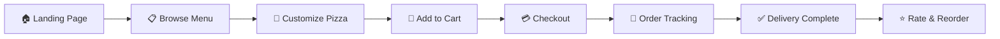
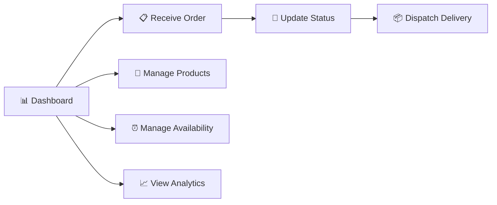
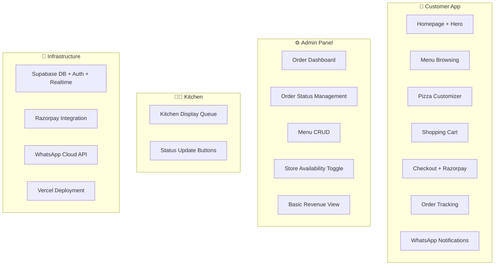

# 🍕 Pizza Planet — Product Requirements Document

> **Version:** 1.0  
> **Last Updated:** June 19, 2026  
> **Author:** CTO & Product Lead  
> **Status:** Draft — Pending Stakeholder Approval  
> **Stitch Project Reference:** `Pizza Planet Digital Storefront` (Project ID: `17410910858893906886`)

---

## Table of Contents

1. [Executive Summary](#executive-summary)
2. [Business Goals](#business-goals)
3. [Success Metrics](#success-metrics)
4. [User Personas](#user-personas)
5. [User Roles](#user-roles)
6. [Customer Journey](#customer-journey)
7. [Admin Journey](#admin-journey)
8. [Functional Requirements](#functional-requirements)
9. [Non-Functional Requirements](#non-functional-requirements)
10. [Future Features](#future-features)
11. [MVP Scope](#mvp-scope)
12. [Phase 2 Scope](#phase-2-scope)

---

## Executive Summary

Pizza Planet is a local pizza business currently operating with a **manual WhatsApp-based ordering workflow**. Every order—from initial inquiry to confirmation, payment coordination, kitchen relay, and delivery dispatch—flows through unstructured WhatsApp messages. This creates bottlenecks at every stage: orders get lost in chat threads, the owner manually tallies payments, kitchen staff rely on forwarded screenshots, and customers have zero visibility into order status.

This document defines the product requirements for **Pizza Planet's Digital Storefront**—a full-stack web application that transforms the business into a modern, self-service digital ordering platform. The platform will serve as the single system of record for menu management, order processing, payment collection, kitchen operations, and delivery coordination.

The design language, validated through our Stitch design project, follows a **"Modern Artisanal"** aesthetic—a premium glassmorphic interface built with Plus Jakarta Sans and Manrope typography, anchored by a Deep Pizza Orange (`#B1241A`) primary palette. The system is designed mobile-first for customers while providing a powerful desktop dashboard for operations.

### Key Outcomes

| Dimension | Current State (WhatsApp) | Target State (Digital Platform) |
|---|---|---|
| **Order Intake** | Manual chat parsing | Self-service digital ordering |
| **Payment** | Cash / manual UPI tracking | Integrated Razorpay checkout |
| **Kitchen Ops** | Screenshot forwarding | Real-time order queue dashboard |
| **Customer Updates** | Owner manually texts updates | Automated WhatsApp notifications |
| **Delivery** | Phone call coordination | Status-tracked delivery workflow |
| **Analytics** | Zero visibility | Full sales & operations dashboard |

### Tech Stack

| Layer | Technology |
|---|---|
| Frontend Framework | Next.js 15 (App Router) |
| Language | TypeScript |
| Styling | Tailwind CSS |
| Backend / Database | Supabase (PostgreSQL, Auth, Realtime, Storage) |
| Payments | Razorpay |
| Notifications | WhatsApp Cloud API |
| Hosting | Vercel |

---

## Business Goals

### BG-1: Eliminate Manual Order Processing

**Current Problem:** The owner spends 3–5 hours daily copying order details from WhatsApp into a notebook, relaying them to the kitchen, and manually tracking payment status.

**Target:** Achieve **zero manual data entry** for the standard ordering flow. Every order placed digitally should flow automatically from cart → payment → kitchen queue → delivery dispatch.

### BG-2: Increase Order Volume & Revenue

**Current Problem:** WhatsApp ordering has an inherent throughput ceiling. The owner can only manage ~30–40 orders per day before messages pile up and response times degrade.

**Target:** Support **100+ concurrent orders** without degradation. Enable menu discovery and impulse ordering through an always-available digital storefront.

### BG-3: Improve Customer Experience & Retention

**Current Problem:** Customers have no way to browse the full menu, customize orders visually, or track delivery status. Repeat customers must re-explain their preferences every time.

**Target:** Deliver a **premium, app-like ordering experience** with visual pizza customization, real-time order tracking, and persistent order history for returning customers.

### BG-4: Create Operational Visibility

**Current Problem:** The owner has no data on bestselling items, peak ordering hours, average order values, or delivery times.

**Target:** Provide a **real-time analytics dashboard** with actionable business intelligence.

### BG-5: Reduce Order Errors

**Current Problem:** Misunderstood toppings, wrong sizes, and missing special instructions account for an estimated 8–12% of orders requiring correction.

**Target:** Structured digital ordering with explicit customization options should reduce order errors to **< 1%**.

---

## Success Metrics

### Primary KPIs

| Metric | Baseline (WhatsApp) | 30-Day Target | 90-Day Target |
|---|---|---|---|
| Daily Order Volume | 30–40 | 60+ | 100+ |
| Average Order Value (AOV) | ₹350 | ₹450 | ₹500 |
| Order Error Rate | 8–12% | < 3% | < 1% |
| Customer Reorder Rate | Unknown | 25% | 40% |
| Owner Daily Manual Hours | 3–5 hrs | < 30 min | < 15 min |
| Order-to-Kitchen Time | 5–15 min | < 30 sec | < 15 sec |
| Digital Payment Adoption | ~20% (manual UPI) | 70% | 90%+ |

### Secondary KPIs

| Metric | Target |
|---|---|
| Page Load Time (LCP) | < 2.5 seconds |
| Mobile Conversion Rate | > 5% of menu visitors |
| Cart Abandonment Rate | < 30% |
| Customer Satisfaction (post-order) | > 4.5 / 5.0 |
| Kitchen Order Acknowledgment | < 60 seconds |
| Average Delivery Time | < 35 minutes |

---

## User Personas

### 🧑 Arjun — The Hungry Student

| Attribute | Detail |
|---|---|
| **Age** | 19 |
| **Device** | Android phone (budget segment) |
| **Behavior** | Orders late at night, price-sensitive, wants quick checkout |
| **Pain Points** | Hates calling or waiting for WhatsApp replies. Wants to see the full menu with prices upfront. Gets anxious not knowing when food will arrive. |
| **Goal** | Browse → Customize → Pay → Track. All from his phone in under 3 minutes. |
| **Quote** | *"Just let me order without talking to anyone."* |

### 👩‍💼 Priya — The Working Professional

| Attribute | Detail |
|---|---|
| **Age** | 32 |
| **Device** | iPhone 15, also orders from laptop |
| **Behavior** | Orders for family on weekends, values quality and presentation. Repeats the same 2–3 orders. |
| **Pain Points** | Has to re-explain her order every time on WhatsApp. Wants to save favorites. Cares about food quality and delivery ETA. |
| **Goal** | Reorder her family's favorites in 2 taps. Know exactly when it's arriving. |
| **Quote** | *"I always order the same thing. Why can't it just remember?"* |

### 🧔 Ravi — The Restaurant Owner

| Attribute | Detail |
|---|---|
| **Age** | 45 |
| **Device** | Android tablet in the shop, personal smartphone |
| **Behavior** | Manages everything—orders, kitchen, delivery boys, payments, inventory. Works 12+ hour days. |
| **Pain Points** | Drowning in WhatsApp notifications. Can't tell which orders are paid. No idea what's selling well. Loses orders during rush hour. |
| **Goal** | See all orders in one place. Know what's paid. Control the menu instantly. Get business insights. |
| **Quote** | *"I need to see everything at a glance. I don't have time to scroll through chats."* |

### 👨‍🍳 Suresh — The Kitchen Lead

| Attribute | Detail |
|---|---|
| **Age** | 38 |
| **Device** | Shared Android tablet mounted in kitchen |
| **Behavior** | Needs clear, sequential order details. Works with flour-covered hands. Cannot handle complex interfaces. |
| **Pain Points** | Gets orders via forwarded screenshots that are blurry. Doesn't know priority. No way to signal "done" back to the owner. |
| **Goal** | See the next order to prepare. Mark it done. Move on. |
| **Quote** | *"Just show me what to make next. Big text. No clutter."* |

### 🏍️ Imran — The Delivery Rider

| Attribute | Detail |
|---|---|
| **Age** | 24 |
| **Device** | Android phone (mid-range) |
| **Behavior** | Juggles 2–3 deliveries at once. Needs address, phone number, and payment status at a glance. |
| **Pain Points** | Gets delivery details via phone call. Sometimes wrong address. Doesn't know if the order is COD or paid online. |
| **Goal** | Get notified of a new delivery. See address with map link. Mark as delivered. |
| **Quote** | *"Tell me where to go, and whether they've already paid."* |

---

## User Roles

### Role Hierarchy & Permissions

| Role | Authentication | Permissions |
|---|---|---|
| **Guest Customer** | None (session-based) | Browse menu, customize pizza, add to cart, checkout with phone number |
| **Returning Customer** | Phone OTP (Supabase Auth) | All guest permissions + order history, saved addresses, reorder, favorites |
| **Owner / Admin** | Email + Password (Supabase Auth) | Full system access — orders, menu CRUD, analytics, user management, settings |
| **Kitchen Staff** | PIN-based login (simplified) | View order queue, update preparation status, mark orders ready |
| **Delivery Staff** | Phone OTP (Supabase Auth) | View assigned deliveries, access customer address/phone, update delivery status |

### Role-Based Access Matrix

| Feature | Guest | Customer | Kitchen | Delivery | Owner |
|---|---|---|---|---|---|
| Browse Menu | ✅ | ✅ | ❌ | ❌ | ✅ |
| Customize Pizza | ✅ | ✅ | ❌ | ❌ | ✅ |
| Place Order | ✅ | ✅ | ❌ | ❌ | ❌ |
| View Order History | ❌ | ✅ | ❌ | ❌ | ✅ |
| Track Active Order | ✅ | ✅ | ❌ | ❌ | ✅ |
| Kitchen Queue | ❌ | ❌ | ✅ | ❌ | ✅ |
| Delivery Management | ❌ | ❌ | ❌ | ✅ | ✅ |
| Menu Management | ❌ | ❌ | ❌ | ❌ | ✅ |
| Analytics Dashboard | ❌ | ❌ | ❌ | ❌ | ✅ |
| System Settings | ❌ | ❌ | ❌ | ❌ | ✅ |

---

## Customer Journey

### Overview Flow

---

### CJ-1: Browse Menu

**Screen References:** `Home - Liquid Glass Optimized`, `Menu - Liquid Glass Refined`, `Home - Pizza Planet Mobile`, `Menu - Pizza Planet Mobile`

**Entry Points:**
- Direct URL / shared link
- WhatsApp message with storefront link
- Google search / Maps listing
- Social media post link

**User Flow:**

1. **Land on Homepage** — Customer arrives at the Pizza Planet storefront. The hero section showcases a full-bleed, high-quality pizza image with a glassmorphic overlay containing the tagline, operating hours, and a prominent "Order Now" CTA.

2. **Explore Categories** — Horizontal scrolling pill-shaped category chips (Pizzas, Sides, Beverages, Combos, Desserts). Active state uses the Primary Orange; inactive uses subtle cream-grey. Sticky on scroll.

3. **Browse Products** — Image-centric product cards with glassmorphic price overlays. Each card shows:
   - High-quality product photo
   - Product name (Plus Jakarta Sans, Bold)
   - Short description (Manrope, Regular)
   - Price (Plus Jakarta Sans, Bold, Primary Orange)
   - Veg/Non-veg indicator (Green/Red badge)
   - "Customize" or "Add" CTA button

4. **Quick Actions** — 
   - Search bar with instant filtering
   - Diet filter toggles (Veg / Non-veg / Bestseller)
   - Size quick-select for standard items

**Acceptance Criteria:**
- [ ] Menu loads within 2 seconds on 3G connection
- [ ] Category navigation persists as sticky header on scroll
- [ ] Product images lazy-load with skeleton placeholders
- [ ] Veg/Non-veg indicators are clearly visible and color-coded
- [ ] Out-of-stock items are visually dimmed with "Unavailable" overlay
- [ ] Prices are displayed in INR (₹) format
- [ ] Mobile layout uses single-column cards; desktop uses 3–4 column grid

---

### CJ-2: Customize Pizza

**Screen References:** `Customize Your Pizza - Liquid Glass Premium`, `Customize Your Pizza - Liquid Glass Finalized`, `Customize Pizza - Liquid Glass`

**User Flow:**

1. **Enter Customization View** — Clicking "Customize" on a pizza opens a split-screen layout (desktop) or full-screen overlay (mobile):
   - **Left/Top:** Live pizza visualization that updates as toppings are selected
   - **Right/Bottom:** Glassmorphic selection panel with customization controls

2. **Select Base Options:**
   - **Size:** Small (7") / Medium (10") / Large (12") / Party (16") — visual size comparison
   - **Crust:** Thin Crust / Classic Hand-Tossed / Cheese-Burst / Whole Wheat
   - **Sauce:** Classic Tomato / Peri-Peri / BBQ / White Garlic / Pesto

3. **Choose Toppings:**
   - Organized by category: Cheese, Veggies, Meat, Premium
   - Each topping shows: icon/image, name, extra price (if applicable)
   - Toggle selection with visual feedback (bounce animation)
   - "Extra" option for double portion at added cost

4. **Review & Price:**
   - Running total updates in real-time as selections change
   - Itemized breakdown visible in a collapsible section
   - Quantity selector (1–10)
   - "Special Instructions" free-text field

5. **Add to Cart** — Prominent CTA button with the total price. Triggers a subtle success animation and returns to menu.

**Acceptance Criteria:**
- [ ] Pizza visualization updates within 200ms of topping selection
- [ ] Price recalculates in real-time with each modification
- [ ] Minimum of 1 size, 1 crust, and 1 sauce must be selected
- [ ] Maximum topping limit enforced (8 regular + 3 premium)
- [ ] Special instructions field supports up to 200 characters
- [ ] "Reset to Default" option available
- [ ] Mobile experience uses bottom sheet for selections

---

### CJ-3: Add to Cart

**User Flow:**

1. **Cart Indicator** — A floating cart button (bottom-right on desktop, bottom-center on mobile) shows item count badge. Uses backdrop-blur glassmorphic styling with Primary Orange accent.

2. **Cart Drawer/Sheet:**
   - Opens as a slide-in drawer (desktop right side) or bottom sheet (mobile)
   - Each item shows: thumbnail, name, customization summary, quantity controls, line total
   - "Edit" link reopens the customizer with saved selections
   - "Remove" with confirmation micro-interaction
   - Swipe-to-delete on mobile

3. **Cart Summary:**
   - Subtotal
   - Delivery fee (free above ₹499, else ₹49)
   - Tax (GST 5%)
   - Applicable discounts / promo code input
   - **Grand Total** (prominent, Plus Jakarta Sans Bold)

4. **Actions:**
   - "Continue Shopping" — dismisses cart
   - "Proceed to Checkout" — navigates to checkout flow

**Acceptance Criteria:**
- [ ] Cart persists across page navigation (local storage + Supabase for authenticated users)
- [ ] Cart badge count animates on item addition
- [ ] Quantity changes update totals instantly
- [ ] Empty cart shows illustration + "Browse Menu" CTA
- [ ] Cart auto-expires after 24 hours of inactivity
- [ ] Maximum 20 items per cart
- [ ] Promo code validation provides instant feedback (valid/invalid/expired)

---

### CJ-4: Checkout

**Screen References:** `Checkout - Pizza Planet Mobile`

**User Flow:**

1. **Contact Information:**
   - Phone number (required) — with OTP verification for first-time users
   - Name (required)
   - Email (optional — for receipt)

2. **Delivery Details:**
   - **Order Type Toggle:** Delivery / Pickup
   - **Delivery Address:**
     - Saved addresses for returning customers (selectable list)
     - "Add New Address" with form: Flat/House No., Landmark, Area, City, Pincode
     - Google Maps integration for pin-drop location
   - **Delivery Time:** ASAP (default) / Schedule for later (time picker, 30-min slots)

3. **Payment Selection:**
   - **Razorpay Integration** — UPI, Credit/Debit Card, Net Banking, Wallets
   - **Cash on Delivery** (COD) — with ₹500 order limit
   - Payment summary with itemized breakdown

4. **Order Confirmation:**
   - Order review screen with all details
   - "Place Order" CTA
   - On success: Order confirmation screen with order ID, estimated delivery time, and "Track Order" CTA
   - WhatsApp confirmation message sent automatically

**Acceptance Criteria:**
- [ ] Phone OTP delivery within 10 seconds
- [ ] Razorpay checkout opens in-app (not redirect)
- [ ] Payment failure shows clear error message with retry option
- [ ] COD orders require phone verification
- [ ] Order confirmation WhatsApp message sent within 30 seconds of successful payment
- [ ] Delivery fee and tax calculated correctly before payment
- [ ] Address validation ensures deliverability within service radius (5 km default)
- [ ] Scheduled orders show available time slots based on kitchen capacity

---

### CJ-5: Order Tracking

**Screen References:** `Track Your Order - Pizza Planet`, `Track Your Order - Pizza Planet Mobile`

**User Flow:**

1. **Order Status Timeline** — A vertical stepper showing real-time progress:
   - ✅ **Order Placed** — timestamp
   - 🔄 **Confirmed** — kitchen has acknowledged
   - 👨‍🍳 **Preparing** — actively being made
   - ✅ **Ready** — prepared and packaged
   - 🏍️ **Out for Delivery** — rider assigned, ETA shown
   - 📍 **Delivered** — confirmed by rider

2. **Live Updates:**
   - Real-time status changes via Supabase Realtime subscriptions
   - Estimated time remaining (dynamic, recalculated)
   - WhatsApp notifications at each major status change

3. **Order Details Panel:**
   - Order ID and timestamp
   - Items ordered with customizations
   - Payment status (Paid / COD Pending)
   - Delivery address
   - Rider name and phone (when assigned)

4. **Actions:**
   - "Call Restaurant" — direct dial
   - "Need Help?" — opens WhatsApp chat with pre-filled order context
   - "Reorder" — available after delivery completion

**Acceptance Criteria:**
- [ ] Status updates appear within 5 seconds of kitchen/rider action
- [ ] ETA recalculates based on actual status changes
- [ ] Customer receives WhatsApp notification at each status transition
- [ ] Order tracking page is accessible without login (via unique order link)
- [ ] Historical orders are viewable for authenticated customers
- [ ] "Reorder" pre-populates cart with identical items and customizations

---

## Admin Journey

### Overview Flow

---

### AJ-1: Receive Order

**User Flow:**

1. **Real-Time Order Feed** — New orders appear in a live feed on the admin dashboard. Each order card shows:
   - Order ID and timestamp
   - Customer name and phone
   - Order items with customizations (clear, large text)
   - Payment status (highlighted: Paid ✅ / COD ⚠️)
   - Order type (Delivery / Pickup)
   - Total amount

2. **Notifications:**
   - 🔔 Browser push notification with order summary
   - 🔊 Audible alert (configurable tone)
   - 📱 WhatsApp notification to owner's phone
   - New order counter badge on the dashboard tab

3. **Actions:**
   - **Accept** — Moves order to kitchen queue, triggers customer confirmation
   - **Reject** — With mandatory reason selection (out of stock, kitchen closed, delivery area). Triggers refund if prepaid.
   - **Call Customer** — One-tap dial for clarification

**Acceptance Criteria:**
- [ ] New orders appear within 3 seconds of placement
- [ ] Audio notification plays for new orders (configurable)
- [ ] Order rejection triggers automatic refund initiation for prepaid orders
- [ ] Bulk accept available for multiple pending orders
- [ ] Order details are print-ready (thermal printer format)

---

### AJ-2: Update Status

**User Flow:**

1. **Kitchen Queue View** — Orders displayed as Kanban columns:
   - **New** → **Preparing** → **Ready** → **Out for Delivery** → **Delivered**

2. **Status Transitions:**
   - Drag-and-drop between columns (desktop)
   - One-tap status buttons (mobile/tablet)
   - Each transition triggers:
     - Customer WhatsApp notification
     - Real-time update on customer tracking page
     - Timestamp logging for analytics

3. **Kitchen Display System (KDS):**
   - Simplified view for kitchen tablet
   - Large text, high contrast
   - Shows only: order number, items, customizations, special instructions
   - Color-coded priority (standard / rush / scheduled)
   - Touch-optimized "Mark Ready" button

**Acceptance Criteria:**
- [ ] Status changes propagate to customer within 5 seconds
- [ ] Undo available for 10 seconds after status change
- [ ] Kitchen view auto-refreshes (Supabase Realtime)
- [ ] Order timer shows elapsed time since order was placed
- [ ] Orders exceeding 30 minutes in "Preparing" are highlighted red

---

### AJ-3: Manage Products

**User Flow:**

1. **Product List** — Searchable, filterable table of all menu items with:
   - Product image thumbnail
   - Name, category, price
   - Availability toggle (instant on/off)
   - Veg/Non-veg designation
   - Edit / Delete actions

2. **Add / Edit Product:**
   - Product name and description
   - Category assignment (with ability to create new categories)
   - Image upload (Supabase Storage, auto-compressed)
   - Base price + size variants with individual pricing
   - Customization options (toppings, crust, sauce) — assignable from master list
   - Veg/Non-veg toggle
   - Display order (drag-and-drop sorting)

3. **Category Management:**
   - Create, rename, reorder, archive categories
   - Assign display icons
   - Bulk product move between categories

**Acceptance Criteria:**
- [ ] Product changes reflect on storefront within 10 seconds
- [ ] Image upload supports JPEG, PNG, WebP up to 5MB (auto-resize to 800px max)
- [ ] Price changes do not affect orders already in progress
- [ ] Soft delete (archive) rather than hard delete for data integrity
- [ ] Bulk availability toggle for entire categories

---

### AJ-4: Manage Availability

**User Flow:**

1. **Store Status Controls:**
   - **Open / Closed** master toggle — Closed state shows "We're Closed" on storefront
   - **Operating Hours** — Set daily open/close times with break periods
   - **Holiday Calendar** — Schedule closures in advance

2. **Item-Level Availability:**
   - Quick toggle for individual items (e.g., "Out of Paneer")
   - Temporary unavailability with auto-restore timer
   - Batch operations for entire categories

3. **Delivery Zone Management:**
   - Define service radius on map
   - Set delivery fees by distance tier
   - Enable/disable delivery (keep pickup available)

**Acceptance Criteria:**
- [ ] Store closure immediately prevents new orders
- [ ] Scheduled closures show customer-facing notice in advance
- [ ] Item unavailability immediately grays out item on storefront
- [ ] Auto-restore timer resets availability at specified time
- [ ] Delivery zone changes take effect within 1 minute

---

## Functional Requirements

### Customer Features

| ID | Feature | Priority | Description |
|---|---|---|---|
| CF-01 | **Digital Menu** | P0 | Browsable product catalog with images, descriptions, prices, dietary indicators, and category filtering |
| CF-02 | **Pizza Customizer** | P0 | Interactive builder with size, crust, sauce, and topping selection with live price calculation |
| CF-03 | **Shopping Cart** | P0 | Persistent cart with add, edit, remove, quantity adjustment, and promo code support |
| CF-04 | **Guest Checkout** | P0 | Complete order flow without account creation, requiring only phone number |
| CF-05 | **Online Payment** | P0 | Razorpay integration supporting UPI, cards, wallets, and net banking |
| CF-06 | **Cash on Delivery** | P0 | COD option with configurable order value limit |
| CF-07 | **Order Tracking** | P0 | Real-time order status with timeline view and ETA |
| CF-08 | **WhatsApp Notifications** | P0 | Automated order confirmation, status updates, and delivery completion messages |
| CF-09 | **Account Creation** | P1 | Phone OTP-based registration for order history and saved preferences |
| CF-10 | **Order History** | P1 | View past orders with reorder capability |
| CF-11 | **Saved Addresses** | P1 | Store and manage multiple delivery addresses |
| CF-12 | **Favorites** | P2 | Mark items as favorites for quick access |
| CF-13 | **Search** | P1 | Full-text search across menu items with instant results |
| CF-14 | **Scheduled Orders** | P2 | Pre-order for a specific date/time slot |
| CF-15 | **Pickup Option** | P1 | Self-pickup with estimated ready time |

### Owner Features

| ID | Feature | Priority | Description |
|---|---|---|---|
| OF-01 | **Order Dashboard** | P0 | Real-time feed of all incoming orders with accept/reject actions |
| OF-02 | **Order Management** | P0 | Kanban-style order pipeline with status tracking |
| OF-03 | **Menu CRUD** | P0 | Create, read, update, delete products and categories |
| OF-04 | **Availability Controls** | P0 | Store hours, item-level availability, delivery zone management |
| OF-05 | **Payment Tracking** | P0 | View payment status per order, daily revenue summary |
| OF-06 | **Analytics Dashboard** | P1 | Sales trends, bestsellers, peak hours, AOV, and customer metrics |
| OF-07 | **Promo Code Management** | P1 | Create and manage discount codes (%, flat, first-order, minimum-spend) |
| OF-08 | **Delivery Staff Management** | P1 | Add/remove riders, assign deliveries, view delivery performance |
| OF-09 | **WhatsApp Integration Settings** | P1 | Configure notification templates, business profile, opt-in management |
| OF-10 | **Tax Configuration** | P0 | Set GST rates, manage GSTIN, configure pricing (inclusive/exclusive) |
| OF-11 | **Business Settings** | P0 | Store name, address, contact, logo, operating hours, delivery radius |
| OF-12 | **Order Export** | P2 | Export orders as CSV for accounting |

### Kitchen Features

| ID | Feature | Priority | Description |
|---|---|---|---|
| KF-01 | **Kitchen Display** | P0 | Simplified queue view with large text, item details, and special instructions |
| KF-02 | **Order Timer** | P0 | Elapsed time tracker per order with overdue alerts |
| KF-03 | **Status Update** | P0 | One-tap buttons: "Start Preparing" → "Mark Ready" |
| KF-04 | **Priority View** | P1 | Color-coded priority levels based on order time and type |
| KF-05 | **PIN Login** | P0 | Simplified authentication suitable for shared kitchen tablets |
| KF-06 | **Audio Alerts** | P1 | Configurable sound notifications for new orders |

### Delivery Features

| ID | Feature | Priority | Description |
|---|---|---|---|
| DF-01 | **Delivery Queue** | P0 | View assigned deliveries with customer details and address |
| DF-02 | **Navigation Link** | P0 | One-tap Google Maps navigation to delivery address |
| DF-03 | **Status Updates** | P0 | "Picked Up" → "On the Way" → "Delivered" status buttons |
| DF-04 | **Payment Indicator** | P0 | Clear display of payment status (Paid / Collect COD ₹XXX) |
| DF-05 | **Delivery History** | P1 | View completed deliveries for the day |
| DF-06 | **Customer Contact** | P0 | One-tap call/WhatsApp to customer (with number masking in Phase 2) |

---

## Non-Functional Requirements

### Performance

| Requirement | Target | Measurement |
|---|---|---|
| **First Contentful Paint (FCP)** | < 1.5 seconds | Lighthouse CI |
| **Largest Contentful Paint (LCP)** | < 2.5 seconds | Lighthouse CI |
| **Time to Interactive (TTI)** | < 3.5 seconds | Lighthouse CI |
| **Cumulative Layout Shift (CLS)** | < 0.1 | Lighthouse CI |
| **API Response Time (P95)** | < 500ms | Supabase monitoring |
| **Real-time Update Latency** | < 5 seconds | Supabase Realtime |
| **Image Optimization** | WebP format, responsive srcset | Next.js Image component |
| **Bundle Size** | < 200KB initial JS | Next.js analytics |
| **Concurrent Users** | 500+ simultaneous | Load testing |

### Security

| Requirement | Implementation |
|---|---|
| **Authentication** | Supabase Auth with RLS (Row Level Security) |
| **Authorization** | Role-based access control at database and API layer |
| **Data Encryption** | TLS 1.3 in transit, AES-256 at rest (Supabase default) |
| **Payment Security** | PCI DSS compliance via Razorpay (no card data stored) |
| **Input Validation** | Server-side validation on all user inputs, parameterized queries |
| **CSRF Protection** | SameSite cookies, CSRF tokens on mutations |
| **Rate Limiting** | API rate limiting on auth endpoints (10 req/min), order placement (5 req/min) |
| **Phone Number Privacy** | Customer phone numbers visible only to owner and assigned delivery rider |
| **Session Management** | JWT with 24-hour expiry, refresh token rotation |
| **Admin Access** | IP whitelist option, forced 2FA for owner account |

### Scalability

| Requirement | Strategy |
|---|---|
| **Database** | Supabase PostgreSQL with proper indexing, connection pooling (PgBouncer) |
| **CDN** | Vercel Edge Network for static assets and ISR pages |
| **Image Storage** | Supabase Storage with CDN-backed delivery and on-the-fly transforms |
| **Caching** | ISR for menu pages (revalidate: 60s), SWR for client-side data |
| **Background Jobs** | Supabase Edge Functions for notifications, payment webhooks |
| **Multi-tenancy** | Architecture designed for single-tenant now, multi-tenant ready for franchise expansion |

### Mobile Responsiveness

| Requirement | Detail |
|---|---|
| **Breakpoints** | Mobile: < 768px, Tablet: 768–1279px, Desktop: ≥ 1280px |
| **Mobile-First Design** | All customer-facing pages designed mobile-first per Stitch mockups |
| **Touch Optimization** | Minimum tap target 44×44px, swipe gestures for cart actions |
| **Viewport** | Proper viewport meta, no horizontal scroll |
| **PWA Capabilities** | Service worker for offline menu browsing, "Add to Home Screen" prompt |
| **Input Handling** | Numeric keyboard for phone/pincode, appropriate autocomplete attributes |
| **Device Testing** | Android Chrome, iOS Safari, Samsung Internet — latest 2 versions |

### Accessibility

| Requirement | Standard |
|---|---|
| **WCAG Compliance** | Level AA minimum |
| **Color Contrast** | 4.5:1 minimum for body text, 3:1 for large text (per design system) |
| **Keyboard Navigation** | Full keyboard operability for all interactive elements |
| **Screen Reader Support** | Semantic HTML, ARIA labels, meaningful alt text |
| **Focus Management** | Visible focus indicators, logical focus order |
| **Motion Sensitivity** | `prefers-reduced-motion` support for all animations |
| **Language** | English primary, Hindi secondary (Phase 2) |
| **Error Handling** | Clear, descriptive error messages associated with form fields |

---

## Future Features

These features are intentionally excluded from MVP and Phase 2 but are on the long-term product roadmap.

| Feature | Description | Estimated Phase |
|---|---|---|
| **Loyalty Program** | Points-based rewards system with redeemable offers | Phase 3 |
| **Multi-Location Support** | Franchise model with location-based menu and pricing | Phase 3 |
| **AI-Powered Recommendations** | "You might also like" suggestions based on order history | Phase 3 |
| **Group Ordering** | Shared cart for office/group orders with split billing | Phase 3 |
| **Subscription Plans** | Weekly/monthly pizza subscription with discount | Phase 4 |
| **Inventory Management** | Ingredient-level tracking with low-stock alerts | Phase 3 |
| **Native Mobile App** | React Native app for iOS and Android | Phase 4 |
| **Chatbot Ordering** | WhatsApp chatbot for conversational ordering | Phase 3 |
| **Table Ordering / QR** | Dine-in QR code ordering for physical restaurant | Phase 3 |
| **Multi-Language Support** | Hindi, regional language support | Phase 2 |
| **Rider Tracking (Live Map)** | Real-time GPS tracking of delivery rider on map | Phase 3 |
| **Customer Reviews & Ratings** | Post-delivery rating system with public reviews | Phase 2 |
| **Referral Program** | "Share with friends" referral discounts | Phase 3 |
| **Dark Mode** | Customer-facing dark theme option | Phase 2 |
| **Advanced Analytics** | Cohort analysis, predictive demand, waste tracking | Phase 4 |

---

## MVP Scope

> **Timeline:** 6–8 weeks  
> **Goal:** Replace the WhatsApp ordering workflow with a functional digital storefront

### Included in MVP

### MVP Feature Checklist

| Area | Features | IDs |
|---|---|---|
| **Customer** | Menu browsing, pizza customizer, cart, guest checkout, Razorpay payment, COD, order tracking, WhatsApp notifications | CF-01 through CF-08 |
| **Owner** | Order dashboard, order management (Kanban), menu CRUD, store open/close toggle, basic payment tracking, tax configuration, business settings | OF-01 through OF-05, OF-10, OF-11 |
| **Kitchen** | Kitchen display queue, order timer, one-tap status updates, PIN login | KF-01 through KF-03, KF-05 |
| **Delivery** | Delivery queue, Google Maps link, status updates, payment indicator, customer contact | DF-01 through DF-04, DF-06 |

### Explicitly Excluded from MVP

- User accounts / login (guest checkout only)
- Order history and reorder
- Saved addresses and favorites
- Search functionality
- Scheduled orders
- Analytics dashboard
- Promo codes
- Delivery staff management portal
- PWA / offline support

---

## Phase 2 Scope

> **Timeline:** 4–6 weeks after MVP launch  
> **Goal:** Drive retention and operational intelligence

### Phase 2 Feature Set

| Area | Feature | IDs | Business Impact |
|---|---|---|---|
| **Customer** | Phone OTP accounts | CF-09 | Enables retention tracking |
| **Customer** | Order history + reorder | CF-10 | Reduces friction for repeat customers (target: 40% reorder rate) |
| **Customer** | Saved addresses | CF-11 | Faster checkout for returning customers |
| **Customer** | Menu search | CF-13 | Faster item discovery for large menus |
| **Customer** | Pickup option | CF-15 | Serves walk-in digital orders, reduces delivery costs |
| **Customer** | Favorites | CF-12 | Personalization and quick access |
| **Customer** | Scheduled orders | CF-14 | Captures advance orders, smooths kitchen load |
| **Owner** | Analytics dashboard | OF-06 | Data-driven menu and operations decisions |
| **Owner** | Promo code engine | OF-07 | Marketing campaigns, customer acquisition |
| **Owner** | Delivery staff management | OF-08 | Formalized delivery operations |
| **Owner** | WhatsApp settings | OF-09 | Customizable notification templates |
| **Owner** | Order export (CSV) | OF-12 | Accounting integration |
| **Kitchen** | Priority view | KF-04 | Smarter order sequencing |
| **Kitchen** | Audio alerts | KF-06 | Reduce missed orders |
| **Delivery** | Delivery history | DF-05 | Rider accountability and daily tracking |

### Phase 2 Success Criteria

| Metric | Target |
|---|---|
| Registered user accounts | 500+ within 30 days |
| Reorder rate | ≥ 40% of registered users |
| Search utilization | ≥ 15% of sessions |
| Promo code redemption | ≥ 20% of orders |
| Scheduled order adoption | ≥ 10% of orders |
| Owner time on analytics | ≥ 3 sessions / week |

---

## Appendix

### A: Design System Reference

The design system is defined in the Stitch project `Pizza Planet Digital Storefront` under the design theme "Premium Artisanal Pizza System."

| Token | Value |
|---|---|
| **Primary Color** | `#B1241A` (Deep Pizza Orange) |
| **Primary Container** | `#D43E30` |
| **Background** | `#F7F9FF` |
| **Surface** | `#F7F9FF` |
| **On-Surface** | `#091D2E` |
| **Tertiary (Success)** | `#006A35` (Basil Green) |
| **Error** | `#BA1A1A` |
| **Headline Font** | Plus Jakarta Sans (700–800) |
| **Body Font** | Manrope (400) |
| **Label Font** | Manrope (600) |
| **Border Radius** | 8px (default), 24px (cards), full (chips) |
| **Base Spacing Unit** | 8px |
| **Container Max Width** | 1280px |
| **Section Gap** | 80px |

### B: Screen Inventory (Stitch)

| Screen | Type | Resolution | Purpose |
|---|---|---|---|
| Home - Liquid Glass Optimized | Desktop | 2560×3032 | Landing page with hero, categories, featured items |
| Menu - Liquid Glass Refined | Desktop | 2560×2174 | Full menu browsing with category filters |
| Customize Your Pizza - Liquid Glass Premium | Desktop | 2560×2048 | Interactive pizza builder |
| Customize Your Pizza - Liquid Glass Finalized | Desktop | 2688×2252 | Finalized customizer layout |
| Track Your Order | Desktop | 2560×2048 | Order tracking timeline |
| Home - Pizza Planet Mobile | Mobile | 780×3372 | Mobile landing page |
| Menu - Pizza Planet Mobile | Mobile | 780×2518 | Mobile menu browsing |
| Checkout - Pizza Planet Mobile | Mobile | 780×3604 | Mobile checkout flow |
| Track Your Order - Pizza Planet Mobile | Mobile | 780×2810 | Mobile order tracking |
| Pizza Planet Logo | Asset | 512×512 | Brand logo (SVG) |

### C: Integration Specifications

#### Razorpay

- **Integration Type:** Standard Checkout (Web)
- **Supported Methods:** UPI, Credit/Debit Cards, Net Banking, Wallets (Paytm, PhonePe, etc.)
- **Webhook Events:** `payment.captured`, `payment.failed`, `refund.processed`
- **Refund Policy:** Auto-refund on order rejection within 5–7 business days

#### WhatsApp Cloud API

- **Provider:** Meta Business Platform (direct API)
- **Message Types:** Template messages (transactional)
- **Notification Triggers:**
  1. Order Confirmed — with order ID, items, total, and ETA
  2. Preparing — "Your order is being prepared!"
  3. Out for Delivery — with rider name and ETA
  4. Delivered — with feedback link
  5. Order Rejected — with reason and refund status

#### Supabase

- **Auth:** Phone OTP (customer), Email/Password (admin), PIN (kitchen)
- **Database:** PostgreSQL with Row Level Security policies per role
- **Realtime:** Subscriptions on `orders` and `order_status` tables
- **Storage:** Product images, brand assets
- **Edge Functions:** Payment webhooks, WhatsApp message dispatch, order notifications

---

> **Document Status:** This PRD is a living document. It will be updated as requirements evolve through development and user feedback cycles.  
> **Next Steps:** Stakeholder review → Technical architecture design → Sprint planning → MVP development kickoff
