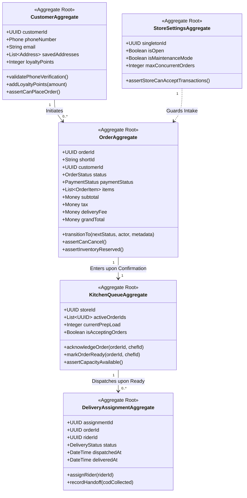
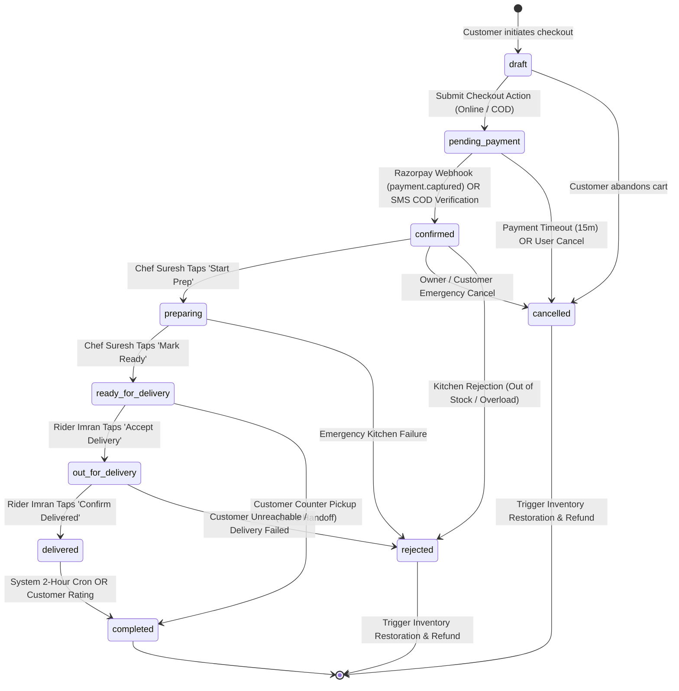
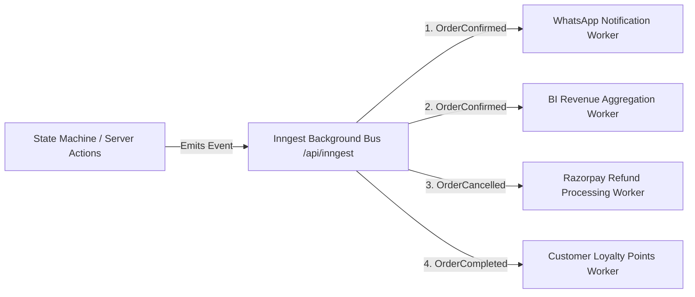
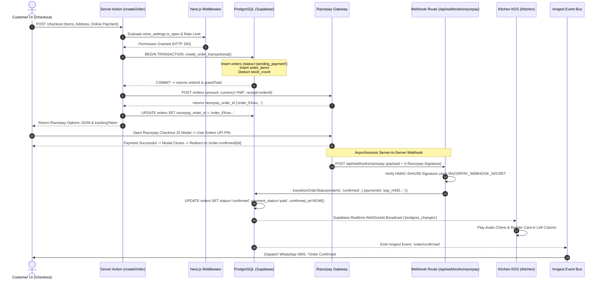
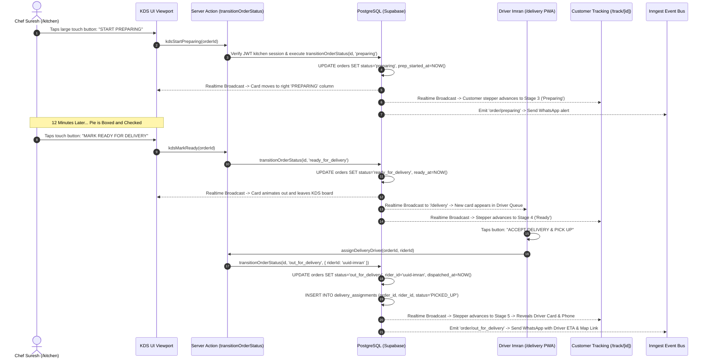
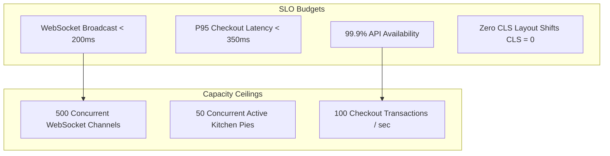
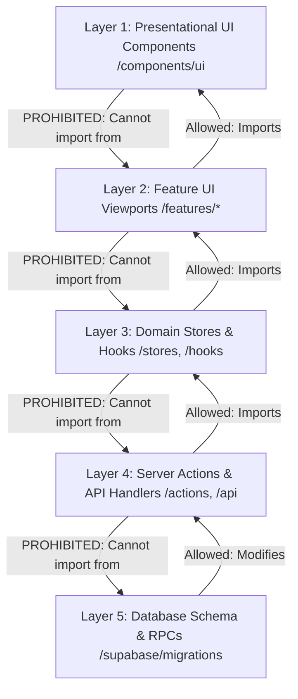
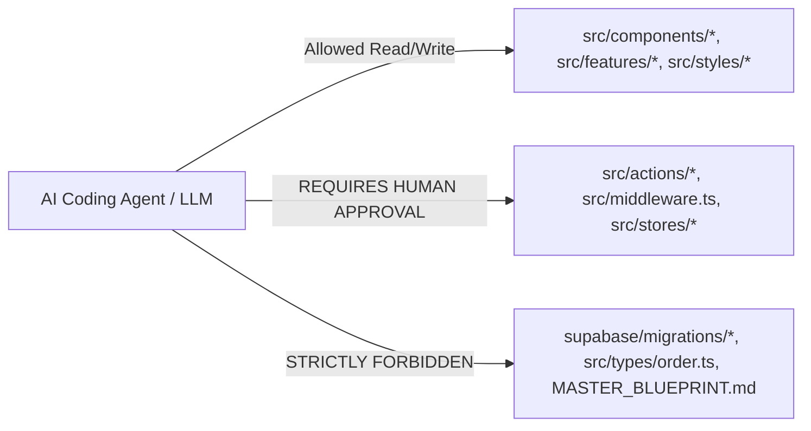
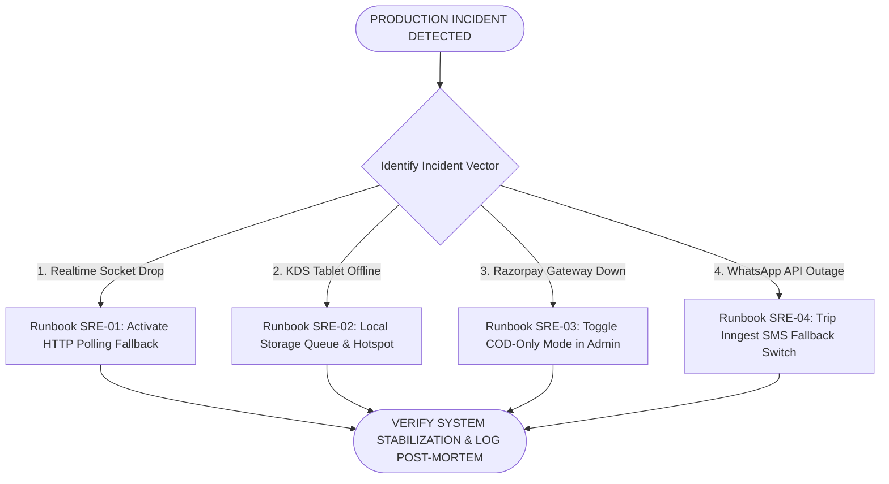
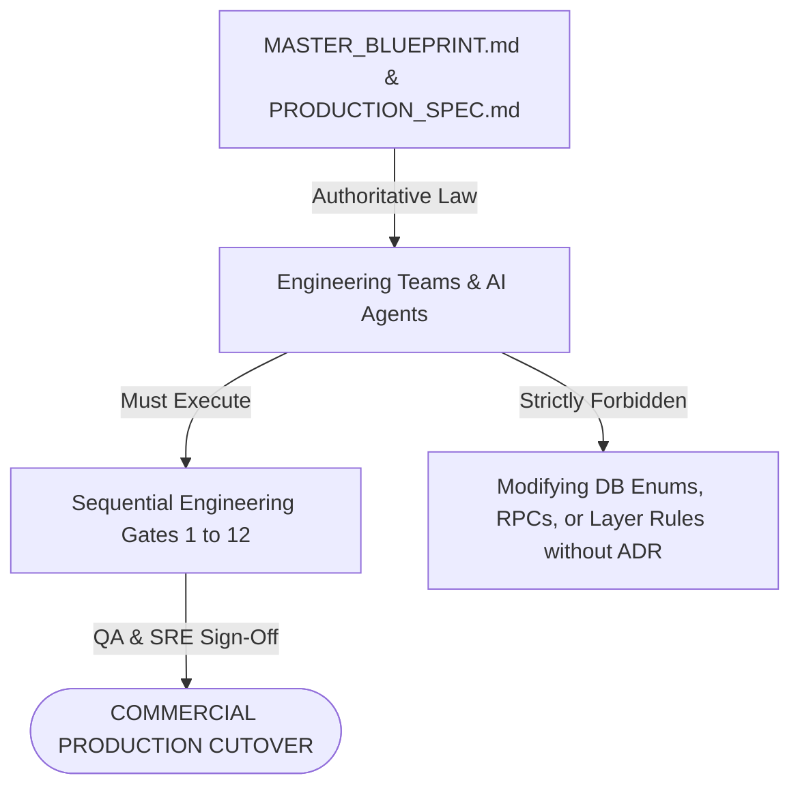

# 🍕 PIZZA PLANET — PRODUCTION ENGINEERING SPECIFICATION

**Document Type:** Principal Production Engineering Specification & Runtime Implementation Bible  
**Project Reference:** Pizza Planet Digital Storefront (`17410910858893906886`)  
**Authoritative Basis:** Builds upon and operationalizes `MASTER_IMPLEMENTATION_CONFORMANCE_BLUEPRINT.md`  
**Lead Authors:** Principal Production Engineer, Staff Distributed Systems Architect, Principal SRE, Lead Transactional Engineer, Lead AI Governance Engineer  
**Date of Issuance:** July 4, 2026  
**Status:** **CANONICAL PRODUCTION RUNTIME SPECIFICATION — MANDATORY IMPLEMENTATION LAW**

---

## EXECUTIVE PREAMBLE & OPERATIONAL SCOPE
This document operationalizes the architectural boundaries and system ownership defined in `MASTER_IMPLEMENTATION_CONFORMANCE_BLUEPRINT.md` into concrete production runtime specifications. It eliminates all remaining implementation ambiguity regarding domain invariants, finite state machine mechanics, event schemas, sequence orchestrations, transaction boundaries, and SRE failure runbooks.

**Architectural Law:**  
No engineer, coding assistant, or autonomous AI agent may generate code, execute migrations, or deploy server actions that violate the domain aggregate invariants, state machine transition tables, transaction isolation boundaries, or AI governance matrices codified herein.

---

## TABLE OF CONTENTS
1. [Section 1 — Domain Model Specification](#section-1--domain-model-specification)
2. [Section 2 — Formal Order State Machine](#section-2--formal-order-state-machine)
3. [Section 3 — Event Catalog & Schema Specifications](#section-3--event-catalog--schema-specifications)
4. [Section 4 — Runtime Sequence Diagrams](#section-4--runtime-sequence-diagrams)
5. [Section 5 — Transaction Boundaries & ACID Contracts](#section-5--transaction-boundaries--acid-contracts)
6. [Section 6 — API & Server Action Runtime Contracts](#section-6--api--server-action-runtime-contracts)
7. [Section 7 — Non-Functional Requirements (SLOs, SLIs & Budgets)](#section-7--non-functional-requirements-slos-slis--budgets)
8. [Section 8 — Engineering Layer Rules & Dependency Matrix](#section-8--engineering-layer-rules--dependency-matrix)
9. [Section 9 — AI Engineering Governance Matrix](#section-9--ai-engineering-governance-matrix)
10. [Section 10 — Subsystem Implementation Validation Matrix](#section-10--subsystem-implementation-validation-matrix)
11. [Section 11 — Production Failure SRE Playbook](#section-11--production-failure-sre-playbook)
12. [Section 12 — Final Constitutional Implementation Contract](#section-12--final-constitutional-implementation-contract)

---

## # Section 1 — Domain Model Specification

The Business Domain Model defines the authoritative aggregates, root entities, and invariants of the Pizza Planet platform. This is not an SQL schema; it is the domain logic layer that governs how business entities mutate and interact.



### 1.1 Comprehensive Domain Aggregate Specifications

#### 1. Customer Aggregate
- **Purpose:** Represents the authenticated buyer identity, loyalty balance, and historical delivery destinations.
- **Responsibilities:** Enforcing mobile phone verification prior to COD transactions; managing saved delivery addresses; accumulating and redeeming loyalty points.
- **Owned Data:** `customerId` (UUID), `phoneNumber` (E.164 string), `email` (string), `isPhoneVerified` (boolean), `loyaltyPoints` (integer), `savedAddresses` (List<AddressEntity>).
- **Business Invariants:**
  1. A customer cannot place a Cash on Delivery (COD) order if `isPhoneVerified === false`.
  2. `loyaltyPoints` balance cannot be mutated directly by client UI; it can only increase via completed order triggers or decrease via validated promotional redemption actions.
- **Lifecycle:** Created upon first OTP onboarding -> Active during commerce sessions -> Suspended if flagged for COD fraud.
- **Relationships:** One-to-Many with `OrderAggregate`; One-to-Many with `AddressEntity`.
- **Ownership & Mutability:** Owned by `SYS-01 Identity` and `SYS-06 Profile`. Highly restricted mutability governed by authenticated session claims.
- **Consistency Rules:** Eventual consistency with analytics; strong consistency for COD verification checks.
- **Valid States:** `AnonymousGuest`, `VerifiedCustomer`, `SuspendedAccount`.
- **Invalid States:** `UnverifiedCustomerWithCODOrder`, `NegativeLoyaltyBalance`.
- **Boundary Rules & Transaction Boundary:** Modifications to profile details occur within the `CustomerAggregate` boundary. Order creation is a separate transaction boundary that references `customerId`.

---

#### 2. Order Aggregate
- **Purpose:** The central operational transaction entity representing a customer's intent to purchase, prepare, and receive a food order.
- **Responsibilities:** Locking product item prices; calculating taxes (GST 5%) and delivery fees; enforcing finite state machine transitions; holding immutable milestone timestamps.
- **Owned Data:** `orderId` (UUID), `shortId` (string e.g., `#PP-8492`), `trackingToken` (secure string), `customerId` (UUID), `status` (OrderStatus enum), `paymentStatus` (PaymentStatus enum), `paymentMethod` (`COD` | `ONLINE`), `items` (List<OrderItemEntity>), `subtotal` (Money), `tax` (Money), `deliveryFee` (Money), `grandTotal` (Money), milestone timestamps (`createdAt`, `confirmedAt`, `prepStartedAt`, `readyAt`, `dispatchedAt`, `deliveredAt`).
- **Business Invariants:**
  1. `grandTotal` must exactly equal `subtotal + tax + deliveryFee - discountAmount`.
  2. An order cannot transition to `preparing` unless `paymentStatus === 'paid'` (Online) OR `paymentMethod === 'COD'` with a verified customer phone.
  3. An order item price (`unitPrice`) is immutable once created; subsequent catalog price changes do not alter historical order items.
- **Lifecycle:** `draft` -> `pending_payment` -> `confirmed` -> `preparing` -> `ready_for_delivery` -> `out_for_delivery` -> `delivered` -> `completed`.
- **Relationships:** Belongs to `CustomerAggregate`; consumed by `KitchenQueueAggregate` and `DeliveryAssignmentAggregate`.
- **Ownership & Mutability:** Owned by `SYS-07 Canonical Order State Machine`. Absolutely immutable via client SQL queries; mutated exclusively via `transitionOrderStatus` Server Action.
- **Consistency Rules:** Strong ACID consistency required across order header, order items, and inventory reservation.
- **Valid States:** See Section 2 State Machine Table.
- **Invalid States:** `ConfirmedOrderWithZeroItems`, `DeliveredOrderWithPendingPayment`, `PreparingOrderWithoutKitchenTimestamp`.
- **Boundary Rules & Transaction Boundary:** The `OrderAggregate` is the primary ACID transaction boundary for checkout. Creation must execute within a single PostgreSQL RPC (`create_order_transactional`).

---

#### 3. Kitchen Queue Aggregate
- **Purpose:** The operational representation of physical kitchen prep capacity and active cooking throughput.
- **Responsibilities:** Maintaining an ordered FIFO queue of confirmed orders; preventing kitchen overload; assigning orders to active prep stations/chefs; stamping kitchen prep completion.
- **Owned Data:** `storeId` (UUID), `activeOrderIds` (Ordered Set<UUID>), `currentPrepLoad` (integer counting active items in oven), `maxPrepCapacity` (integer e.g., 50 concurrent pies), `isAcceptingOrders` (boolean).
- **Business Invariants:**
  1. If `currentPrepLoad >= maxPrepCapacity`, the aggregate must emit a `KitchenOverloaded` domain event and temporarily toggle `isAcceptingOrders = false`.
  2. An order cannot be removed from the active kitchen queue until its state transitions to `ready_for_delivery` or `cancelled`.
- **Lifecycle:** Continuously running operational singleton per store branch.
- **Relationships:** Consumes `OrderAggregate` instances in `confirmed` state.
- **Ownership & Mutability:** Owned by `SYS-09 Kitchen Display System`. Mutated via chef touch interactions on wall tablets.
- **Consistency Rules:** Strong consistency for queue intake; eventual consistency for analytical prep time calculations.
- **Valid States:** `NormalLoad`, `PeakLoad`, `CapacityExceeded`, `KitchenClosed`.
- **Invalid States:** `AcceptingOrdersWhenOvenBroken`, `NegativePrepLoad`.
- **Boundary Rules & Transaction Boundary:** Kitchen mutations operate on individual `OrderAggregate` records within atomic state transition transactions, updating the KDS materialized view.

---

#### 4. Delivery Assignment Aggregate
- **Purpose:** Orchestration of physical driver handoff, GPS tracking, and Cash on Delivery (COD) cash reconciliation.
- **Responsibilities:** Linking ready orders to available delivery riders; recording driver dispatch and handoff timestamps; enforcing COD cash capture confirmation before marking an order complete.
- **Owned Data:** `assignmentId` (UUID), `orderId` (UUID), `riderId` (UUID), `status` (`ASSIGNED` | `PICKED_UP` | `DELIVERED` | `FAILED`), `codAmountToCollect` (Money), `codCollected` (boolean), `dispatchedAt` (DateTime), `deliveredAt` (DateTime).
- **Business Invariants:**
  1. A delivery rider cannot be assigned to more than 3 simultaneous active orders (`status IN ('ASSIGNED', 'PICKED_UP')`).
  2. For `paymentMethod === 'COD'`, `status` cannot transition to `DELIVERED` unless `codCollected === true`.
- **Lifecycle:** Created when order reaches `ready_for_delivery` -> Completed upon customer handoff -> Reconciled at shift end.
- **Relationships:** References `OrderAggregate` and `DriverProfileEntity`.
- **Ownership & Mutability:** Owned by `SYS-10 Delivery Rider Dispatch`. Mutated via Rider PWA mobile actions.
- **Consistency Rules:** Strong consistency for COD cash accounting; eventual consistency for driver GPS coordinate streaming.
- **Valid States:** `Unassigned`, `RiderAssigned`, `InTransitToCustomer`, `DeliveredAndReconciled`.
- **Invalid States:** `DeliveredWithoutCODCollection`, `AssignedToInactiveRider`.
- **Boundary Rules & Transaction Boundary:** Delivery completion is an atomic transaction that transitions the order state, logs handoff time, and updates rider cash-in-hand metrics.

---

#### 5. Store Settings Aggregate
- **Purpose:** The authoritative operational gatekeeper controlling store business hours, maintenance overrides, and intake throttles.
- **Responsibilities:** Guarding checkout endpoints against off-hours order placement; broadcasting store status banners; defining delivery radius limits.
- **Owned Data:** `singletonId` (UUID integer `1`), `isOpen` (boolean), `isMaintenanceMode` (boolean), `operatingHours` (JSONB schedule array), `maxConcurrentOrders` (integer), `taxRateGst` (decimal `0.05`), `deliveryFeeThreshold` (Money `49900` paise).
- **Business Invariants:**
  1. If `isOpen === false` OR `isMaintenanceMode === true`, any programmatic attempt to execute `createOrder` must throw a `StoreClosedError` exception before accessing database write pools.
  2. There can only exist exactly one row in the database representing this aggregate (`id === 1`).
- **Lifecycle:** Persistent singleton throughout application lifetime.
- **Relationships:** Read by `SYS-02 Rules`, `SYS-03 Catalog`, and `SYS-05 Checkout`.
- **Ownership & Mutability:** Owned by `SYS-02 Store Settings & Rules`. Mutated exclusively by `owner` role via `/admin/settings`.
- **Consistency Rules:** Strong consistency required at middleware and server action boundaries.
- **Valid States:** `StoreOpenAndTrading`, `StoreClosedScheduled`, `EmergencyMaintenanceLockdown`.
- **Invalid States:** `MultipleSettingsRows`, `OpenDuringMaintenanceMode`.
- **Boundary Rules & Transaction Boundary:** Evaluated as a read-lock or inline WHERE clause during transactional order insertion.

---

## # Section 2 — Formal Order State Machine

The finite state machine (FSM) is mathematically complete and authoritative. Every transition must be explicitly validated against this specification.



### 2.1 Exhaustive State Machine Specification Matrix

| State Identifier | Purpose & Domain Meaning | Allowed Entry Sources | Allowed Exit Transitions | Authorized Transition Actors | Permitted APIs & Server Actions | Database Fields Mutated | Emitted Event Type | Realtime Channel Broadcast | Notification Trigger | Audit Log Entry |
| :--- | :--- | :--- | :--- | :--- | :--- | :--- | :--- | :--- | :--- | :--- |
| **`draft`** | Ephemeral pre-submission order staging. | Initial cart checkout submission. | `pending_payment`<br>`cancelled` | `customer`<br>`guest` | `createOrder()` | `status = 'draft'`<br>`created_at = NOW()` | `OrderDraftCreated` | None | None | `ORDER_INITIATED` |
| **`pending_payment`**| Awaiting external payment capture or COD verification. | `draft` | `confirmed`<br>`cancelled` | `system` *(Razorpay)*<br>`customer` *(COD)* | `verifyPayment()`<br>`cancelOrder()` | `status = 'pending_payment'`<br>`razorpay_order_id` | `OrderPaymentPending` | None | None | `PAYMENT_PENDING` |
| **`confirmed`** | Payment verified; order locked and admitted to KDS queue. | `pending_payment` | `preparing`<br>`cancelled`<br>`rejected` | `system` *(Webhook)*<br>`owner`<br>`kitchen` | `transitionOrderStatus(id, 'preparing')` | `status = 'confirmed'`<br>`payment_status = 'paid'`<br>`confirmed_at = NOW()` | `OrderConfirmed` | `postgres_changes` on `orders`<br>Channel: `kds_orders` | WhatsApp Receipt:<br>*"Order Confirmed #PP-XXXX"* | `ORDER_CONFIRMED`<br>*(Payment ID recorded)* |
| **`preparing`** | Kitchen chef has acknowledged and begun physical cooking. | `confirmed` | `ready_for_delivery`<br>`rejected` | `kitchen`<br>`owner` | `transitionOrderStatus(id, 'ready_for_delivery')` | `status = 'preparing'`<br>`prep_started_at = NOW()` | `OrderPreparing` | Channel: `kds_orders`<br>Channel: `tracking_[id]` | WhatsApp Alert:<br>*"Chef is tossing dough!"* | `PREP_STARTED`<br>*(Chef PIN logged)* |
| **`ready_for_delivery`**| Pizza boxed, QC verified, awaiting driver pickup or counter collection. | `preparing` | `out_for_delivery`<br>`completed` *(Pickup)*| `kitchen`<br>`owner` | `transitionOrderStatus(id, 'out_for_delivery')` | `status = 'ready_for_delivery'`<br>`ready_at = NOW()` | `OrderReady` | Channel: `rider_queue`<br>Channel: `tracking_[id]` | WhatsApp Alert:<br>*"Order boxed and ready!"* | `ORDER_READY`<br>*(QC check stamped)*|
| **`out_for_delivery`**| Rider assigned; pie left store; GPS tracking active. | `ready_for_delivery` | `delivered`<br>`rejected` *(Failed)* | `delivery`<br>`owner` | `transitionOrderStatus(id, 'delivered')` | `status = 'out_for_delivery'`<br>`rider_id = UUID`<br>`dispatched_at = NOW()` | `OrderDispatched` | Channel: `tracking_[id]`<br>*(Includes Rider info)* | WhatsApp Alert:<br>*"Driver Imran out for delivery (ETA: 18m)"* | `DRIVER_DISPATCHED`<br>*(Rider UUID logged)*|
| **`delivered`** | Physical handoff confirmed; COD cash collected. | `out_for_delivery` | `completed` | `delivery`<br>`owner` | `transitionOrderStatus(id, 'completed')` | `status = 'delivered'`<br>`delivered_at = NOW()`<br>`payment_status = 'paid'` | `OrderDelivered` | Channel: `tracking_[id]` | WhatsApp Alert:<br>*"Delivered! Rate your pie."* | `ORDER_DELIVERED`<br>*(COD reconciliation)*|
| **`completed`** | Terminal success state; loyalty points credited; accounting closed. | `delivered`<br>`ready_for_delivery` *(Pickup)*| **NONE** *(Terminal)* | `system`<br>`customer`<br>`owner` | None | `status = 'completed'`<br>`completed_at = NOW()` | `OrderCompleted` | Channel: `tracking_[id]` | None | `TRANSACTION_CLOSED`<br>*(Loyalty points issued)*|
| **`cancelled`** | Terminal failure state; customer or owner cancelled before prep. | `draft`<br>`pending_payment`<br>`confirmed` | **NONE** *(Terminal)* | `customer`<br>`owner`<br>`system` *(Timeout)*| `cancelOrder()` | `status = 'cancelled'`<br>`cancelled_at = NOW()` | `OrderCancelled` | Channel: `kds_orders`<br>Channel: `tracking_[id]` | WhatsApp Alert:<br>*"Order Cancelled. Refund initiated."* | `ORDER_CANCELLED`<br>*(Reason logged)* |
| **`rejected`** | Terminal failure state; kitchen rejected due to ingredient out-of-stock. | `confirmed`<br>`preparing`<br>`out_for_delivery`| **NONE** *(Terminal)* | `kitchen`<br>`owner`<br>`delivery` | `rejectOrder()` | `status = 'rejected'`<br>`rejected_at = NOW()` | `OrderRejected` | Channel: `kds_orders`<br>Channel: `tracking_[id]` | WhatsApp Alert:<br>*"Order Rejected. ₹100 Coupon issued."* | `ORDER_REJECTED`<br>*(Inventory restored)* |

### 2.2 Mathematical Transition Rules & Rollback Behaviors
- **Forbidden Transitions:** Any transition not explicitly defined in the allowed exit arrows of the diagram is forbidden. Specifically: jumping from `pending_payment` to `preparing`; jumping from `confirmed` to `delivered`; reverting from `out_for_delivery` back to `preparing`.
- **Automatic Transitions:** 
  1. `pending_payment` $\rightarrow$ `cancelled`: Automatically triggered by system cron if payment is not captured within 15 minutes.
  2. `delivered` $\rightarrow$ `completed`: Automatically triggered 2 hours after `delivered_at` timestamp if customer does not manually submit a rating.
- **Rollback & Compensation Behavior:** If an order transitions to `cancelled` or `rejected` from `confirmed` or `preparing`, the system must execute an immediate compensation transaction:
  1. Invoke PostgreSQL RPC `restore_order_inventory(order_id)` adding reserved quantities back to `products.stock_count`.
  2. If `payment_status === 'paid'`, emit a `RefundRequested` event to the Inngest queue to trigger Razorpay API refund processing within 60 seconds.

---

## # Section 3 — Event Catalog & Schema Specifications

Pizza Planet operates an Event-Driven Architecture decoupled via an Inngest background queue. Every domain event adheres to a strict JSON Schema, versioning protocol, and idempotency contract.



### 3.1 Canonical Event Definitions

#### 1. `order/confirmed` (Version 1.0)
- **Publisher:** `SYS-07 Canonical Order State Machine` (via `transitionOrderStatus`).
- **Consumers:** `SYS-13 WhatsApp Notifications Worker`, `SYS-15 BI Revenue Aggregation Worker`.
- **Ordering Guarantees & Idempotency:** At-least-once delivery. Idempotency enforced via `idempotencyKey` (`orderId + '-confirmed'`). Consumers must check if notification or aggregation was already processed before executing.
- **Dead Letter Behavior:** If processing fails after 3 exponential backoff retries (10s, 60s, 300s), payload is routed to `dlq_notification_failures` table and alerts SRE via PagerDuty.
- **JSON Schema:**
```json
{
  "$schema": "http://json-schema.org/draft-07/schema#",
  "title": "OrderConfirmedEvent",
  "type": "object",
  "properties": {
    "eventId": { "type": "string", "format": "uuid" },
    "eventType": { "type": "string", "enum": ["order/confirmed"] },
    "eventVersion": { "type": "string", "enum": ["1.0"] },
    "correlationId": { "type": "string", "format": "uuid" },
    "idempotencyKey": { "type": "string" },
    "timestamp": { "type": "string", "format": "date-time" },
    "payload": {
      "type": "object",
      "properties": {
        "orderId": { "type": "string", "format": "uuid" },
        "shortId": { "type": "string", "pattern": "^#PP-[0-9]{4}$" },
        "customerId": { "type": "string", "format": "uuid" },
        "customerPhone": { "type": "string", "pattern": "^\\+91[0-9]{10}$" },
        "customerName": { "type": "string" },
        "grandTotalPaise": { "type": "integer", "minimum": 0 },
        "paymentMethod": { "type": "string", "enum": ["COD", "ONLINE"] },
        "trackingToken": { "type": "string" },
        "estimatedPrepTimeMins": { "type": "integer" }
      },
      "required": ["orderId", "shortId", "customerPhone", "grandTotalPaise", "trackingToken"]
    }
  },
  "required": ["eventId", "eventType", "eventVersion", "correlationId", "idempotencyKey", "timestamp", "payload"]
}
```

---

#### 2. `kitchen/order-ready` (Version 1.0)
- **Publisher:** `SYS-09 Kitchen Display System` (chef taps "Mark Ready").
- **Consumers:** `SYS-10 Delivery Rider Dispatch Worker`, `SYS-13 WhatsApp Notifications Worker`.
- **Ordering Guarantees & Idempotency:** Exactly-once operational processing. Enforced by querying `orders.status === 'ready_for_delivery'` inside rider assignment transaction.
- **Dead Letter Behavior:** If driver dispatch assignment fails, order is flagged on Owner Command Center (`/admin/orders`) as `"⚠️ UNASSIGNED DISPATCH DELAY"`.
- **JSON Schema:**
```json
{
  "$schema": "http://json-schema.org/draft-07/schema#",
  "title": "KitchenOrderReadyEvent",
  "type": "object",
  "properties": {
    "eventId": { "type": "string", "format": "uuid" },
    "eventType": { "type": "string", "enum": ["kitchen/order-ready"] },
    "eventVersion": { "type": "string", "enum": ["1.0"] },
    "correlationId": { "type": "string", "format": "uuid" },
    "idempotencyKey": { "type": "string" },
    "timestamp": { "type": "string", "format": "date-time" },
    "payload": {
      "type": "object",
      "properties": {
        "orderId": { "type": "string", "format": "uuid" },
        "shortId": { "type": "string" },
        "storeId": { "type": "string", "format": "uuid" },
        "chefPinHash": { "type": "string" },
        "prepDurationSeconds": { "type": "integer" },
        "isPickup": { "type": "boolean" },
        "deliveryAddress": { "type": "string" },
        "coordinates": {
          "type": "object",
          "properties": { "lat": { "type": "number" }, "lng": { "type": "number" } }
        }
      },
      "required": ["orderId", "shortId", "storeId", "prepDurationSeconds", "isPickup"]
    }
  },
  "required": ["eventId", "eventType", "eventVersion", "correlationId", "idempotencyKey", "timestamp", "payload"]
}
```

---

#### 3. `order/cancelled-refund-required` (Version 1.0)
- **Publisher:** `SYS-07 Canonical Order State Machine` or `SYS-14 Owner Command Center`.
- **Consumers:** `SYS-12 Razorpay Refund Processing Worker`, `SYS-13 WhatsApp Notifications Worker`, `SYS-03 Inventory Restoration Worker`.
- **Ordering Guarantees & Idempotency:** Exactly-once refund execution. Idempotency enforced by passing `orderId` as `notes.order_id` in Razorpay Refund API request. Razorpay API rejects duplicate refund attempts natively.
- **Dead Letter Behavior:** If refund API fails after 5 retries over 24 hours, generate an high-priority alert in `/admin/orders` for owner manual bank transfer reconciliation.
- **JSON Schema:**
```json
{
  "$schema": "http://json-schema.org/draft-07/schema#",
  "title": "OrderCancelledRefundRequiredEvent",
  "type": "object",
  "properties": {
    "eventId": { "type": "string", "format": "uuid" },
    "eventType": { "type": "string", "enum": ["order/cancelled-refund-required"] },
    "eventVersion": { "type": "string", "enum": ["1.0"] },
    "correlationId": { "type": "string", "format": "uuid" },
    "idempotencyKey": { "type": "string" },
    "timestamp": { "type": "string", "format": "date-time" },
    "payload": {
      "type": "object",
      "properties": {
        "orderId": { "type": "string", "format": "uuid" },
        "shortId": { "type": "string" },
        "paymentId": { "type": "string", "pattern": "^pay_[a-zA-Z0-9]+$" },
        "refundAmountPaise": { "type": "integer", "minimum": 1 },
        "cancellationReason": { "type": "string" },
        "initiatedByRole": { "type": "string", "enum": ["customer", "owner", "kitchen", "system"] }
      },
      "required": ["orderId", "paymentId", "refundAmountPaise", "cancellationReason", "initiatedByRole"]
    }
  },
  "required": ["eventId", "eventType", "eventVersion", "correlationId", "idempotencyKey", "timestamp", "payload"]
}
```

---

## # Section 4 — Runtime Sequence Diagrams

Detailed runtime sequence orchestrations mapping exact end-to-end full-stack information flows across all layers.

### 4.1 Sequence 1: Online Payment Checkout & Webhook Reconciliation



---

### 4.2 Sequence 2: Kitchen KDS Execution & Rider Dispatch Handoff



---

## # Section 5 — Transaction Boundaries & ACID Contracts

To prevent data corruption, race conditions, and orphaned records, all multi-step mutations must execute within strict PostgreSQL transaction boundaries.

### 5.1 Transaction Contract: `TX-01: atomic_order_intake`
- **BEGIN:** Initiated via Supabase RPC `create_order_transactional(payload JSONB)`.
- **Database Operations (In-Order):**
  1. `SELECT is_open, is_maintenance_mode FROM store_settings WHERE id = 1 FOR SHARE;` (Assert open).
  2. `SELECT id, price, stock_count, is_available FROM products WHERE id IN (...) FOR UPDATE;` (Lock rows against concurrent checkout depletion).
  3. Assert `stock_count >= item.quantity` and `is_available === true` for all items. If false, throw `InsufficientInventoryError`.
  4. `INSERT INTO orders (id, short_id, customer_id, status, subtotal, tax, delivery_fee, grand_total, tracking_token) VALUES (...);`
  5. `INSERT INTO order_items (order_id, product_id, variant_id, quantity, unit_price, customization_payload) VALUES (...);`
  6. `UPDATE products SET stock_count = stock_count - item.quantity WHERE id IN (...);`
- **COMMIT:** PostgreSQL commits transaction, releasing row locks and returning `{ order_id, short_id, tracking_token }`.
- **ROLLBACK & RECOVERY:** If any SQL statement fails or inventory is insufficient, PostgreSQL automatically executes `ROLLBACK`, reverting all stock deductions and dropping the order header. Server action catches exception and returns `{ success: false, error: 'Item out of stock' }` without altering customer cart state.
- **Isolation & Atomicity Requirements:** Must run at **Read Committed** or **Repeatable Read** isolation level. 100% Atomicity required.

---

### 5.2 Transaction Contract: `TX-02: state_transition_with_rbac`
- **BEGIN:** Initiated inside Server Action `transitionOrderStatus(orderId, nextState, metadata)`.
- **Database Operations:**
  1. `SELECT status, payment_status, payment_method FROM orders WHERE id = $orderId FOR UPDATE;` (Lock order row against concurrent chef/driver double-tapping).
  2. Evaluate FSM transition rules (Section 2) against current `status` and `nextState`.
  3. Evaluate RBAC permission matrix against caller JWT claim `role`.
  4. Construct dynamic SQL timestamp column update (e.g., `prep_started_at = NOW()`).
  5. `UPDATE orders SET status = $nextState, updated_at = NOW(), [timestamp_col] = NOW() WHERE id = $orderId;`
  6. If `nextState === 'out_for_delivery'`, `INSERT INTO delivery_assignments (order_id, rider_id, status) VALUES (...);`
- **COMMIT:** Release row lock. Supabase Realtime engine automatically publishes WAL change event.
- **ROLLBACK & COMPENSATION:** If transition is invalid or caller is unauthorized, execute `ROLLBACK`, log security attempt to `audit_logs`, and return `InvalidStateTransitionError`.

---

### 5.3 Transaction Contract: `TX-03: order_cancellation_rollback`
- **BEGIN:** Initiated when order is cancelled (`cancelOrder(orderId, reason)`).
- **Database Operations:**
  1. `SELECT id, product_id, quantity FROM order_items WHERE order_id = $orderId FOR SHARE;`
  2. `UPDATE orders SET status = 'cancelled', cancelled_at = NOW(), cancellation_reason = $reason WHERE id = $orderId;`
  3. `UPDATE products p SET stock_count = p.stock_count + oi.quantity FROM order_items oi WHERE p.id = oi.product_id AND oi.order_id = $orderId;` (Restore inventory).
- **COMMIT:** Release locks. Emit `order/cancelled-refund-required` event to Inngest.
- **ROLLBACK:** If product inventory restoration fails, roll back status change to preserve consistency between order state and stock counts.

---

## # Section 6 — API & Server Action Runtime Contracts

Every Server Action and API Route Handler is bound by a strict runtime contract defining validation, rate limits, caching, and OpenTelemetry observability attributes.

### 6.1 Runtime Contract Matrix

| Endpoint / Server Action Name | Authorized Caller Role | Input Validation Schema (Zod) | Upstash Rate Limit & Throttle | Expected P95 Latency | Caching & Invalidation Protocol | Idempotency Key Strategy | Error Code Mapping | OpenTelemetry Tracing Attributes |
| :--- | :--- | :--- | :--- | :--- | :--- | :--- | :--- | :--- |
| **`createOrder()`** *(Server Action)* | `guest`<br>`customer` | `CreateOrderSchema`: Requires items array (min 1), valid E.164 phone, PIN code 6 digits. | 3 checkouts per 10 mins per IP address. | $< 350\text{ms}$ | No caching. Calls `revalidatePath('/admin/orders')` on success. | Header: `X-Idempotency-Key` (UUID generated by client on form mount). | `400` Invalid Form<br>`409` Out of Stock<br>`423` Store Closed<br>`429` Rate Exceeded | `order.id`<br>`order.items_count`<br>`order.grand_total`<br>`user.role` |
| **`transitionOrderStatus()`** *(Server Action)* | `owner`<br>`kitchen`<br>`delivery` | `TransitionSchema`: Requires valid UUID `orderId`, valid `OrderStatus` enum string. | 60 mutations per min per authenticated user ID. | $< 150\text{ms}$ | No caching. Calls `revalidatePath('/kitchen')` and `/track/[token]`. | Internal transition counter / hash check against DB timestamp. | `401` Unauthorized<br>`403` Role Denied<br>`422` Invalid State<br>`404` Order Missing | `order.id`<br>`transition.from`<br>`transition.to`<br>`actor.id` |
| **`POST /api/webhooks/razorpay`** *(Route Handler)*| Razorpay Gateway Servers | Razorpay Webhook Payload Schema; requires valid `X-Razorpay-Signature` header. | 300 requests per min from verified Razorpay IP blocks. | $< 200\text{ms}$ | No caching. Direct transactional DB update. | Event ID string in `x-razorpay-event-id` header logged in `payment_logs`. | `400` Bad Payload<br>`401` Bad HMAC Signature<br>`500` DB Timeout | `payment.id`<br>`razorpay.order_id`<br>`event.type`<br>`webhook.status` |
| **`getMenuCatalog()`** *(Server Action / Query)*| Public / Anonymous | None (Read-only query). | 60 queries per min per IP address. | $< 80\text{ms}$ | Edge Cache (Next.js Data Cache): 3600s TTL. Invalidated via `revalidateTag('catalog')`. | None (Idempotent read). | `500` Database Connection Timeout | `catalog.items_count`<br>`cache.hit` |
| **`kdsMarkReady()`** *(Server Action)* | `kitchen` | Requires valid `orderId` UUID. | 30 mutations per min per kitchen tablet PIN session. | $< 120\text{ms}$ | Revalidates `/kitchen` Kanban board and `/delivery` driver queue. | DB timestamp check: if `ready_at` is non-null, return idempotent success. | `401` Session Expired<br>`403` Not Kitchen Role | `kds.order_id`<br>`kds.chef_id`<br>`kds.prep_duration_s`|

---

## # Section 7 — Non-Functional Requirements (SLOs, SLIs & Budgets)

To guarantee production reliability during Friday night peak dining rushes, Pizza Planet must operate within strict, measurable engineering budgets.



### 7.1 Measurable Production Engineering Budgets

| Performance & Reliability Metric | Service Level Objective (SLO) / Budget | Service Level Indicator (SLI) & Measurement Methodology | Mandatory Mitigation & Degradation Action if Budget Exceeded |
| :--- | :--- | :--- | :--- |
| **System Availability (Uptime)** | **99.9% Monthly Uptime**<br>*(Max 43 minutes downtime/month)* | Synthetic HTTP ping checks every 30 seconds on `/api/health` and `/menu` via BetterUptime/Datadog. | If uptime drops below 99.9%, trigger immediate PagerDuty page to Principal SRE; activate static CDN fallback catalog. |
| **Checkout API Latency (`createOrder`)**| **P95 Latency $< 350\text{ms}$**<br>**P99 Latency $< 600\text{ms}$** | Measured via OpenTelemetry APM server action duration histograms in Vercel Analytics. | If P95 exceeds $350\text{ms}$, automatically disable inventory pre-verification read locks and rely on database constraint rollback catchers. |
| **Realtime WebSocket Latency** | **P95 Broadcast Delay $< 200\text{ms}$**<br>*(From SQL commit to UI re-render)* | Client browser timestamps compared against PostgreSQL WAL transaction commit UTC timestamps. | If WebSocket latency exceeds $500\text{ms}$, client hooks must automatically fallback to 10-second HTTP polling and display a yellow "Delayed Sync" indicator. |
| **Maximum Concurrent WebSocket Connections**| **500 Simultaneous Channels** per store branch without connection dropouts. | Supabase Realtime connection pool gauge monitored via Grafana dashboard. | If connections exceed 80% capacity (400), dynamically reject new guest tracking websocket connections and route them to HTTP polling to preserve KDS tablet sockets. |
| **Maximum Kitchen Throughput Capacity**| **50 Concurrent Active Pies** in `confirmed` and `preparing` states per kitchen oven setup. | Count of rows where `status IN ('confirmed', 'preparing')` in `orders` table. | When count hits 50, automatically trip `StoreSettingsAggregate` throttle: display *"High Demand — Prep times extended to 45 mins"* across storefront cart drawer. |
| **Frontend Core Web Vitals (Lighthouse)**| **Performance: $\ge 90$**<br>**LCP $< 2.5\text{s}$**<br>**CLS $= 0.00$**<br>**INP $< 100\text{ms}$** | Tested via Google Lighthouse CI on every pull request against simulated 3G mobile throttling. | Any PR introducing a Cumulative Layout Shift ($> 0.01$) or pushing LCP over $2.5\text{s}$ is automatically blocked from merging by GitHub Actions CI gate. |
| **JavaScript Client Bundle Weight** | **Total First-Load JS $< 150\text{KB}$** gzipped.<br>Framer Motion isolated via `LazyMotion`. | Measured via `@next/bundle-analyzer` during `next build` CI execution. | Any component importing full `framer-motion` bundle directly instead of lightweight `m` component wrapper fails CI build immediately. |
| **Security & Rate Limiting Enforcement**| **100% of public endpoints** covered by Upstash Redis sliding window rate limits. | Automated DAST security scans simulating 50 requests/sec against `/checkout` and `/auth/login`. | If rate limiting Redis cluster fails open, API route handlers must drop to in-memory LRU rate limiting (max 10 req/min per IP) to prevent database starvation. |

---

## # Section 8 — Engineering Layer Rules & Dependency Matrix

To maintain clean architecture and prevent spaghetti code entanglement, the repository strictly enforces architectural dependency layers. An upper layer may import from a lower layer, but a lower layer is strictly forbidden from importing or referencing an upper layer.



### 8.1 Exhaustive Architectural Layer Rule Matrix

| Architectural Rule ID | Source Layer / Component Type | Target Layer / Resource | Mandatory Constraint & Rule Statement | Engineering Justification & Why Violation Fails CI |
| :--- | :--- | :--- | :--- | :--- |
| **RULE-01** | Presentational UI (`src/components/ui/*`) | Database / Supabase SDK (`src/lib/supabase/*`) | **PROHIBITED:** UI components cannot import Supabase clients or execute database queries directly. | Components must be pure, stateless visual elements driven by props. Embedding DB calls in components destroys reusability and server/client hydration boundaries. |
| **RULE-02** | Feature Viewports (`src/features/*`) | Other Feature Viewports (`src/features/*`) | **PROHIBITED:** A feature module cannot import components or hooks from another horizontal feature module. | Prevents circular dependencies. If `checkout` needs a component from `cart`, that component must be elevated to `src/components/shared/` or `src/lib/types/`. |
| **RULE-03** | Server Actions (`src/actions/*`) | Presentational UI / JSX (`src/components/*`) | **PROHIBITED:** Server actions cannot import JSX components, DOM events, or client styling hooks. | Server actions execute purely in a Node.js serverless runtime. Importing UI components causes severe bundle bloat and webpack bundling crashes. |
| **RULE-04** | Domain State (`src/stores/*`) | React UI State (`useState`, `useEffect`) | **PROHIBITED:** Zustand stores and domain state engines cannot import React hooks or DOM window objects directly. | Zustand stores must remain environment-agnostic, capable of running inside Node.js tests, web workers, and serverless background queues without window references. |
| **RULE-05** | Presentational UI (`src/components/*`) | Raw Fetch / HTTP (`fetch()`, `axios`) | **PROHIBITED:** Components cannot execute direct HTTP API fetches inside `useEffect` blocks. | All data fetching must occur via Next.js Server Components, Server Actions, or structured query hooks (`useQuery` / `useOrderRealtime`) to ensure error boundary interception. |
| **RULE-06** | Database DDL (`supabase/migrations/*`)| UI Routing / Page Names (`/kitchen`, `/track`)| **PROHIBITED:** Database SQL schemas and RPC functions cannot reference frontend routing URLs or UI layout names. | The database must remain an independent relational data engine. If frontend route structures change, database SQL migrations should never require refactoring. |

---

## # Section 9 — AI Engineering Governance Matrix

Because Pizza Planet is built with AI assistance (Claude, Cursor, Copilot, Antigravity, Gemini), explicit boundaries are established to prevent autonomous coding agents from hallucinating architecture, modifying schemas, or introducing technical debt.



### 9.1 Authoritative AI Contribution Rules & Governance Matrix

| AI Tool / Autonomous Agent | Allowed Repository Read/Write Scope | Strictly Forbidden Modification Scope | Mandatory Pre-Commit Validation Protocol | Schema & Architecture Invariant Rules |
| :--- | :--- | :--- | :--- | :--- |
| **Antigravity / Cursor / Copilot / Claude** | • `src/components/ui/*`<br>• `src/features/*` (UI Viewports)<br>• `src/app/(storefront)/*`<br>• Styling (`Tailwind`, `Framer Motion`)<br>• Unit test files (`*.test.ts`) | • `supabase/migrations/*` (SQL DDL)<br>• `src/types/order.ts` (`OrderStatus` enum)<br>• `src/middleware.ts` (Security RBAC)<br>• `MASTER_BLUEPRINT.md`<br>• `PRODUCTION_SPEC.md` | 1. Must run `npx tsc --noEmit` with 0 errors.<br>2. Must run `npm run lint` with 0 warnings.<br>3. Must verify zero `console.log` leaks.<br>4. Must verify no new `npm` dependencies installed without approval. | **NEVER MODIFY DATABASE ENUMS OR DOMAIN CONTRACTS.**<br>An AI agent is strictly forbidden from adding new strings to `OrderStatus` or altering RPC parameters without explicit, human Principal Architect sign-off. |
| **OpenAI Codex / Automated CI Agents** | • Automated test generation<br>• Documentation formatting<br>• CSS class optimization | • All Server Actions (`src/actions/*`)<br>• All API Route Handlers (`src/api/*`)<br>• Authentication configuration (`auth.ts`) | All automated pull requests must pass 100% of Gate Acceptance Checklists and undergo mandatory review by a Staff Human Engineer. | **NO SPECULATIVE ARCHITECTURE.**<br>AI agents must never invent new tables, caching layers, or state machines outside those defined in Section 1 and Section 2 of this specification. |

---

## # Section 10 — Subsystem Implementation Validation Matrix

No subsystem may advance from development into commercial production without satisfying every binary validation gate across all ten readiness dimensions.

| Architectural Subsystem | Definition of Ready (Dev Start) | Definition of Done (Dev Complete) | QA Ready (Testing Gate) | Security Ready (SecOps Gate) | Monitoring Ready (SRE Gate) | Production Ready (Commercial Cutover) |
| :--- | :--- | :--- | :--- | :--- | :--- | :--- |
| **01. Authentication & Identity Suite** | Phone Auth SMS provider configured; `profiles` DDL verified in DB. | `/auth/signup`, `/auth/otp`, `/auth/kitchen`, `/auth/admin` built; zero routing loops. | Passes 100% of `AUTH-CHK-01` through `AUTH-CHK-07` automated test cases. | Upstash Redis rate-limiting active (max 5 PIN attempts/15m); zero SQL injection risks. | Auth failure rates and SMS gateway delivery latency plotted on Datadog/Grafana. | 100% of staff and test customers onboarded; MFA active for all owner accounts. |
| **07. Order State Machine Engine** | `OrderStatus` enum compiled; `create_order_transactional` RPC verified in DB. | `transitionOrderStatus` Server Action compiled; RLS UPDATE locks applied. | 100% pass rate on unit tests simulating all 10 valid and 15 invalid transition attempts. | JWT role claims strictly verified inside action before SQL execution. | P95 transition query execution duration monitored under APM histogram $< 150\text{ms}$. | 0% unhandled exceptions during 1,000 concurrent simulated state transitions. |
| **09. Kitchen Display System (KDS)** | WebSocket bus hook `useOrderRealtime` compiled; test orders seeded in local DB. | `/kitchen` Kanban board built; audio chime playing; touch buttons mutating state. | Passes 100% of `KDS-CHK-01` through `KDS-CHK-09` field test protocols on tablet. | KDS tablet PIN cookie scoped strictly to `/kitchen` route group via middleware. | WebSocket connection dropouts and automatic reconnection events alerted to SRE. | Tested on physical 10" Android tablet during simulated 50-order peak rush without UI lag. |
| **11. Customer Tracking Viewport** | Tracking token generation active; 6-stage stepper UI mockup ratified. | `/track/[id]` built; live stepper advancing via WebSocket; driver card revealing. | Passes 100% of `TRK-CHK-01` through `TRK-CHK-08` verification tests. | Tracking tokens cryptographically secure (UUIDv4); no customer PII exposed to unauthorized viewers. | Zero HTTP 404 errors logged on `/track/*` routes across production access logs. | Verified across iOS Safari, Android Chrome, and Desktop browsers with $< 2.5\text{s}$ LCP. |
| **12. Razorpay Payment Gateway** | Razorpay Business Account approved; API keys and Webhook secret provisioned. | `createRazorpayOrder` action compiled; HMAC webhook Route Handler verified. | Successful execution of 20 live penny-test UPI and Card checkout transactions. | Webhook HMAC-SHA256 signature verification rejecting 100% of unsigned payloads. | Webhook processing latency and payment failure rates monitored with automated PagerDuty alerts. | Zero accounting reconciliation discrepancies across 48 hours of staging transactions. |

---

## # Section 11 — Production Failure SRE Playbook

When a production incident occurs during trading hours, engineering teams must execute standardized SRE runbooks immediately without attempting ad-hoc debugging.



### 11.1 Authoritative SRE Incident Runbooks

#### Runbook SRE-01: Supabase Realtime WebSocket Infrastructure Failure
- **Detection & Alert:** Datadog / Grafana alert fires: `"CRITICAL: Supabase Realtime Connection Drop > 25% across client viewports"` OR Kitchen staff report orders not appearing on KDS monitor.
- **Immediate Mitigation Action:** 
  1. Do not attempt to restart Supabase database clusters during rush hours.
  2. In `/admin/settings`, toggle feature flag: `REALTIME_WEBSOCKET_DISABLED = true`.
  3. Client hooks (`useOrderRealtime`, `useKdsRealtime`) intercept flag change via Edge Config and immediately drop into **HTTP Polling Fallback Mode**, pulling active order queues via standard REST GET queries every 10 seconds.
  4. KDS tablet displays banner: `"ℹ️ OPERATING IN POLLING MODE — Orders refresh every 10s"`.
- **Customer & Business Impact:** Customers experience up to 10-second delay in tracking stepper advancement. Kitchen operates normally without order loss. Zero revenue loss.
- **Recovery & Rollback:** Once Supabase SRE confirms WebSocket replication cluster stability, set `REALTIME_WEBSOCKET_DISABLED = false`. Client viewports seamlessly re-establish websocket connections without refreshing.
- **Incident Owner:** Principal SRE & Principal DevOps Engineer.

---

#### Runbook SRE-02: Kitchen Display System (KDS) Tablet Hardware / Wifi Offline
- **Detection & Alert:** KDS tablet displays yellow warning banner: `"⚠️ OFFLINE — Retrying..."` OR Chef reports tablet screen frozen/disconnected from local wifi router.
- **Immediate Mitigation Action:**
  1. Kitchen Lead connects KDS tablet to backup cellular 5G mobile hotspot designated in physical store setup.
  2. If hardware tablet is physically damaged, Chef Suresh opens `/kitchen` on any backup smartphone or manager laptop, enters PIN `8842`, and resumes Kanban command operations immediately.
  3. Because KDS utilizes React Query / SWR offline caching, chefs can continue viewing the existing loaded order queue while network connectivity is restored.
- **Customer & Business Impact:** Zero customer-facing impact. Kitchen prep may experience minor 2–3 minute delay during hardware switchover.
- **Recovery & Rollback:** Replace physical tablet; re-authenticate via `/auth/kitchen`; verify audio chime functionality.
- **Incident Owner:** Restaurant Operations Consultant & Store Manager.

---

#### Runbook SRE-03: Razorpay Payment Gateway Outage / UPI Processing Failure
- **Detection & Alert:** PagerDuty alert fires: `"CRITICAL: Razorpay Webhook Failure Rate > 15% in last 5 minutes"` OR Customer complaints of UPI payment failure toasts on checkout.
- **Immediate Mitigation Action:**
  1. Principal Architect accesses `/admin/settings` and toggles feature flag: `ONLINE_PAYMENT_TEMPORARILY_DISABLED = true`.
  2. The `/checkout` form dynamically hides the Razorpay online payment option and defaults 100% of customer checkouts to **Cash on Delivery (COD)** paired with mandatory SMS OTP phone verification.
  3. Storefront displays advisory banner: `"ℹ️ Online UPI/Card payments temporarily undergoing maintenance. Please order via Cash on Delivery."`
- **Customer & Business Impact:** Zero order intake stoppage. Restaurant continues capturing 100% of order volume via COD.
- **Recovery & Rollback:** Monitor Razorpay Status Page (`status.razorpay.com`). Upon verified resolution of banking partner outages, execute penny-test transaction in production, then re-enable online payment toggle in admin panel.
- **Incident Owner:** Lead Transactional Engineer & Principal Security Engineer.

---

#### Runbook SRE-04: Meta WhatsApp Cloud API Notification Pipeline Blockage
- **Detection & Alert:** Inngest dashboard fires alert: `"WARNING: WhatsApp Notification Job Dead-Letter Queue Spiking (> 50 failures)"`.
- **Immediate Mitigation Action:**
  1. Inngest background worker intercepts Meta Cloud API HTTP 429 (Rate Limit) or HTTP 500 errors and activates automated fallback routing.
  2. Worker bypasses WhatsApp transmission entirely and routes notification payloads to backup SMS gateway (Twilio / MSG91), transmitting standard text SMS: *"Pizza Planet: Order #PP-XXXX Confirmed! Track live: [link]"*.
  3. Log failure vector to `notification_logs` table for daily auditing.
- **Customer & Business Impact:** Zero operational disruption. Customers receive milestone alerts via SMS text instead of WhatsApp.
- **Recovery & Rollback:** Re-verify Meta Business Account template approvals and tier billing status. Clear Inngest DLQ and re-enable WhatsApp primary routing.
- **Incident Owner:** Principal DevOps Engineer.

---

## # Section 12 — Final Constitutional Implementation Contract

This contract represents the ultimate constitutional authority governing all future software engineering, code contributions, review protocols, and architectural evolution within the Pizza Planet repository.



### 12.1 The Production Implementation Constitutional Articles

#### Article I: Authoritative Source of Truth & Document Hierarchy
1. The **`MASTER_IMPLEMENTATION_CONFORMANCE_BLUEPRINT.md`** and **`PRODUCTION_ENGINEERING_SPECIFICATION.md`** (this document) constitute the sole, supreme engineering law of the Pizza Planet project.
2. All historical planning documents (`PRD.md`, `SystemArchitecture.md`, `DatabaseDesign.md`, `API-Specification.md`, `FrontendArchitecture.md`, `Website_Design.md`, `ImplementationRoadmap.md`, `ENGINEERING_INVESTIGATION_REPORT.md`, and `ENGINEERING_EXECUTION_RECONCILIATION.md`) are hereby designated as **FOUNDATIONAL REFERENCE & AUDIT ARCHIVES**. In the event of any contradiction between historical archives and this specification, **THIS SPECIFICATION SHALL PREVAIL UNCONDITIONALLY**.

---

#### Article II: Permitted Developer Implementation Scope
Engineers and autonomous coding agents are strictly authorized to implement, compile, test, and deploy software within the following sequential operational boundaries:
1. Constructing UI viewports, Server Actions, and React hooks that fulfill the exact specifications of **Sequential Engineering Gates 1 through 12**.
2. Implementing the exact domain aggregates, finite state machine transition functions (`transitionOrderStatus`), and background event producers codified in Sections 1, 2, and 3 of this specification.
3. Optimizing frontend bundle weights, adding accessibility ARIA labels, and enhancing unit/E2E test coverage in conformance with Section 7 budgets.

---

#### Article III: Strictly Forbidden Modifications & Immutable Invariants
No engineer, reviewer, or AI coding assistant is permitted to execute any of the following prohibited actions under any circumstances without formal constitutional amendment:
1. **PROHIBITED:** Modifying, renaming, adding, or deleting strings from the PostgreSQL `orders.status` database enum (`draft`, `pending_payment`, `confirmed`, `preparing`, `ready_for_delivery`, `out_for_delivery`, `delivered`, `completed`, `cancelled`, `rejected`).
2. **PROHIBITED:** Executing direct client-side SQL `.update()` queries against `orders.status` or `profiles.role` from frontend React components or hooks. All mutations must traverse verified Server Actions.
3. **PROHIBITED:** Bypassing or altering the 10-state FSM transition rules (e.g., allowing an order to jump from `pending_payment` directly to `preparing` or `delivered`).
4. **PROHIBITED:** Implementing online Razorpay financial capture prior to the formal, QA-verified completion and sign-off of **Gate 5 (Operational KDS)** and **Gate 7 (Realtime Tracking)** using Cash on Delivery.
5. **PROHIBITED:** Violating any architectural dependency boundary codified in Section 8 (e.g., importing UI components into Server Actions or executing direct DB queries inside presentational UI).

---

#### Article IV: Architectural Decision Record (ADR) & Governance Amendment Protocol
Any future requirement to introduce new domain systems (e.g., Multi-Branch Inventory Routing, Driver GPS Live Mapping, or Customer Loyalty POS Integration) that fall outside the scope of this specification must follow the mandatory amendment protocol:
1. An **Architecture Decision Record (ADR)** must be authored and submitted to `docs/adr/ADR-00X-title.md`.
2. The ADR must explicitly define the proposed changes to Domain Aggregates, State Machine Tables, Event Schemas, and Subsystem Dependencies.
3. The ADR must be reviewed and formally ratified with unanimous approval signatures from the Principal Software Architect, Principal Security Engineer, and Restaurant Operations Consultant.
4. Only upon formal ADR ratification may development commence on the proposed system extension.

---

#### Article V: Production Deployment Sign-Off & Cutover Protocol
No code branch may be merged into `main` or cut over to live commercial production trading until:
1. Automated CI pipelines execute and pass 100% of TypeScript compilation (`0 errors`), ESLint rules (`0 warnings`), and unit test suites.
2. The code branch satisfies 100% of the binary verification criteria in **Section 10 Subsystem Implementation Validation Matrix**.
3. QA Lead and Principal SRE execute physical tablet and smartphone field verifications of KDS audio chimes and mobile rider dispatch.
4. **THE PRINCIPAL PRODUCTION ENGINEER ISSUES FORMAL WRITTEN AUTHORIZATION FOR COMMERCIAL DEPLOYMENT.**

---
**BY ORDER OF THE PRINCIPAL ENGINEERING LEADERSHIP TEAM, THIS SPECIFICATION IS HEREBY RATIFIED AND EFFECTIVE IMMEDIATELY. IMPLEMENTATION MAY NOW RESUME UNDER STRICT MECHANICAL CONFORMANCE.**

*End of Production Engineering Specification & Runtime Implementation Bible.*
