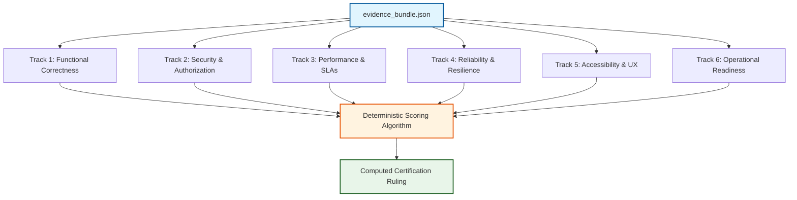
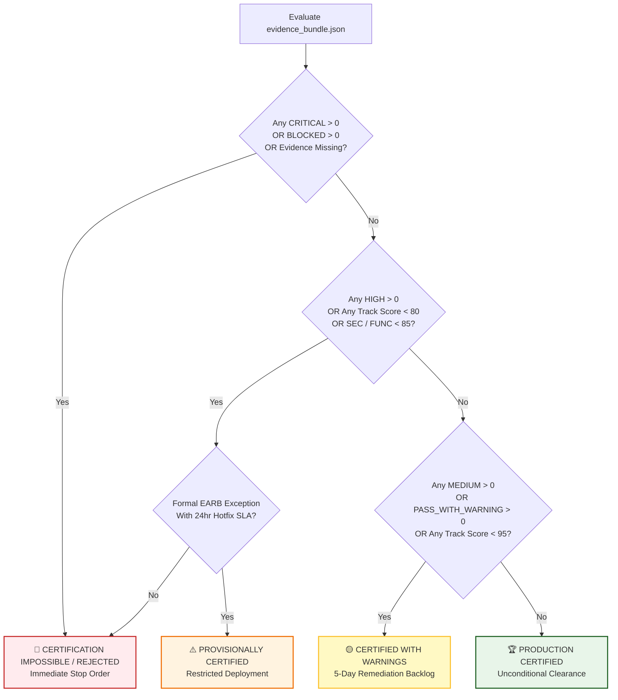

# 🧮 Pizza Planet QA Certification Engine & Readiness Scoring Specification
**Document Reference:** `QA-CERT-SPEC-2026-07`  
**Classification:** Canonical Engineering Engine Specification & Mathematical Scoring Model  
**Target Subsystem:** Pizza Planet Quality Assurance Certification Router & Readiness Calculator  
**Authoritative Body:** Architecture Governance Board, Production Readiness Board, Principal Release Engineering Group  

---

## 1. Executive Summary & Purpose

A fundamental flaw discovered in QA Framework V2 was the manual, procedural generation of deployment certifications. When certification rules are written as ad-hoc string comparisons (`if (failed > 0)`), reports inevitably emit contradictory statements—such as declaring a build `CERTIFIED PRODUCTION READY` while documenting active database session inconsistencies.

To establish the rigor practiced at Stripe, Uber, DoorDash, Shopify, and Cloudflare, **QA Framework V3** introduces an algorithmic **Certification Engine**. Certification is no longer written or judged; **it is computed.** This specification defines the mathematical rules, orthogonal certification tracks, and deterministic scoring algorithms that automatically evaluate raw evaluation bundles (`evidence_bundle.json`) to produce immutable release rulings.

---

## 2. Orthogonal Certification Tracks

In complex restaurant operating systems, functional correctness does not guarantee production readiness. A build may render pizzas correctly while suffering from severe memory leaks or security vulnerabilities. QA Framework V3 separates monolithic QA evaluation into **six independent certification tracks**. A failure in one track cannot be masked by high scores in another.



### Track 1: Functional Correctness (`TRACK_FUNC`)
* **Scope:** UI page viewport rendering, form submissions, Server Action execution, database entity persistence, and Order State Machine transitions.
* **Evaluation Metrics:** Test execution outcomes (`PASS`, `FAIL`), data integrity confirmation, and user journey completion rates.

### Track 2: Security & Authorization (`TRACK_SEC`)
* **Scope:** Edge Middleware RBAC route interception, cryptographic HMAC-SHA256 session cookie signing, SQL injection immunity (`pgcrypto` parameterization), clean incognito session isolation, and brute-force rate limit enforcement.
* **Evaluation Metrics:** Zero unauthorized access leaks, 100% cryptographic signature validity, zero plaintext token exposures, and zero unhandled SQL injection vectors.

### Track 3: Performance & SLAs (`TRACK_PERF`)
* **Scope:** Viewport Largest Contentful Paint (LCP), Server Action HTTP POST roundtrip latency, database query execution times, and network payload sizes.
* **Evaluation Metrics:** Conformance against constitutional SLA thresholds (LCP < 1500ms target; Server Action < 800ms target; DB query < 50ms target).

### Track 4: Reliability & Resilience (`TRACK_REL`)
* **Scope:** Browser page reload persistence, multi-tab session synchronization, hydration mismatch absence, zero unhandled console exceptions, and network retry resilience.
* **Evaluation Metrics:** Zero hydration warnings, zero JavaScript console errors, and 100% session recovery across browser restarts.

### Track 5: Accessibility & UX (`TRACK_A11Y`)
* **Scope:** Touch-friendly KDS button target sizing ($\ge 48 \times 48\text{px}$), WAI-ARIA alert banners (`role="alert"`), form label associations, contrast ratios, and keyboard navigation affordances.
* **Evaluation Metrics:** Zero ARIA violation warnings, 100% form label accessibility, and compliance with touch-screen viewport standards.

### Track 6: Operational Readiness (`TRACK_OPS`)
* **Scope:** Database Row-Level Security (RLS) session consistency, reproducible database seeding (`seed.sql`), clean structured telemetry emission, and clear error recovery UI affordances.
* **Evaluation Metrics:** Zero database session orphaned records, 100% seed script execution reproducibility, and 100% artifact physical integrity verification.

---

## 3. Deterministic Production Readiness Scoring Model

To replace arbitrary percentage estimates, QA Framework V3 implements a mathematical scoring algorithm. Every certification track begins with a perfect score of **100.00 points**. Deterministic penalty deductions are subtracted for every identified runtime anomaly, SLA latency breach, or evidence deficiency within that track.

### 3.1 Immutable Penalty Deduction Matrix

| Anomaly / Issue Classification | Severity Tier | Track Score Penalty Deduction | Formulaic Application Rule |
| :--- | :---: | :---: | :--- |
| **Critical Security / Data Vulnerability** | `CRITICAL` | **$-100.00\text{ pts}$** | Drops track score to $0.00$; triggers immediate automatic release block. |
| **High Severity Core Flow / SLA Breach** | `HIGH` | **$-25.00\text{ pts}$** | Subtracted per distinct `HIGH` issue in the track. |
| **Medium Severity Secondary Bug** | `MEDIUM` | **$-10.00\text{ pts}$** | Subtracted per distinct `MEDIUM` issue in the track. |
| **Low Severity UI / Styling Notice** | `LOW` | **$-2.00\text{ pts}$** | Subtracted per distinct `LOW` issue in the track (capped at $-10.00\text{ max}$). |
| **Test Case Execution Warning** | `PASS_WITH_WARNING`| **$-5.00\text{ pts}$** | Subtracted per test case terminating in warning state. |
| **Missing / Corrupted Evidence Artifact** | `INCONCLUSIVE` | **$-15.00\text{ pts}$** | Subtracted per unverified or missing physical artifact. |
| **LCP Latency Degradation** ($1500\text{ms} < \text{LCP} \le 2500\text{ms}$) | `SLA_WARNING` | **$-8.00\text{ pts}$** | Subtracted per viewport breaching primary LCP target. |
| **Server Action Latency Degradation** ($800\text{ms} < \text{Latency} \le 1500\text{ms}$)| `SLA_WARNING` | **$-6.00\text{ pts}$** | Subtracted per Server Action breaching primary roundtrip target. |
| **Unhandled Console Hydration Warning** | `HYDRATION_ERR` | **$-12.00\text{ pts}$** | Subtracted from `TRACK_REL` per unhandled React hydration warning. |

### 3.2 Mathematical Track Score Formula
For any certification track $T \in \{\text{FUNC}, \text{SEC}, \text{PERF}, \text{REL}, \text{A11Y}, \text{OPS}\}$, the track score $S_T$ is computed as:

$$S_T = \max \left( 0.00, \quad 100.00 - \sum_{i \in \text{Issues}(T)} \text{Penalty}(i) \right)$$

### 3.3 Weighted Aggregate Production Readiness Score
The canonical **Overall Production Readiness Score ($\mathcal{R}_{\text{total}}$)** is computed using an asymmetric weighted aggregation model that prioritizes Security and Functional Correctness above secondary operational metrics:

$$\mathcal{R}_{\text{total}} = 0.25 \cdot S_{\text{SEC}} + 0.25 \cdot S_{\text{FUNC}} + 0.15 \cdot S_{\text{REL}} + 0.15 \cdot S_{\text{PERF}} + 0.10 \cdot S_{\text{OPS}} + 0.10 \cdot S_{\text{A11Y}}$$

---

## 4. Deterministic Certification Routing Rules

The Certification Engine processes the evaluated track scores ($S_T$), aggregate readiness score ($\mathcal{R}_{\text{total}}$), issue severity counts, and evidence confidence levels through an immutable boolean decision tree to assign the official certification ruling.



### 4.1 Formal Certification Rulings & Algorithmic Mandates

#### 🏆 PRODUCTION CERTIFIED (Tier 1 — Unconditional Promotion)
* **Algorithmic Requirements:**
  1. $\text{Count}(\text{CRITICAL}) = 0$ and $\text{Count}(\text{HIGH}) = 0$ and $\text{Count}(\text{MEDIUM}) = 0$.
  2. $\text{Count}(\text{FAIL}) = 0$ and $\text{Count}(\text{BLOCKED}) = 0$ and $\text{Count}(\text{INCONCLUSIVE}) = 0$.
  3. All mandatory constitutional test cases achieve `HIGH` or `VERY_HIGH` Evidence Confidence.
  4. Every individual track score $S_T \ge 95.00$.
  5. Aggregate readiness score $\mathcal{R}_{\text{total}} \ge 95.00$.
* **Operational Ruling:** The build is commercially certified for immediate, zero-human-intervention deployment to production environments.

#### 🟡 CERTIFIED WITH WARNINGS (Tier 2 — Standard Operational Release)
* **Algorithmic Requirements:**
  1. $\text{Count}(\text{CRITICAL}) = 0$ and $\text{Count}(\text{HIGH}) = 0$.
  2. $\text{Count}(\text{FAIL}) = 0$ and $\text{Count}(\text{BLOCKED}) = 0$ and $\text{Count}(\text{INCONCLUSIVE}) = 0$.
  3. Presence of $\ge 1$ `MEDIUM` or `LOW` severity issues, or $\ge 1$ test cases in `PASS_WITH_WARNING` state.
  4. Every individual track score $S_T \ge 90.00$ (with $S_{\text{SEC}} \ge 95.00$ and $S_{\text{FUNC}} \ge 95.00$).
  5. Aggregate readiness score $\mathcal{R}_{\text{total}} \ge 90.00$.
* **Operational Ruling:** Clear for deployment promotion. Automatically generates automated P2 Jira/linear technical debt tickets assigned to responsible engineering leads with a **5-day remediation SLA**.

#### ⚠️ PROVISIONALLY CERTIFIED (Tier 3 — Exception-Granted Release)
* **Algorithmic Requirements:**
  1. $\text{Count}(\text{CRITICAL}) = 0$ and $\text{Count}(\text{BLOCKED}) = 0$ and $\text{Count}(\text{INCONCLUSIVE}) = 0$.
  2. Presence of exactly $1$ `HIGH` severity issue that does NOT impact data integrity or tenant security (e.g., LCP latency = 2600ms on a non-core page, or a secondary fallback API timeout).
  3. Every individual track score $S_T \ge 80.00$ (with $S_{\text{SEC}} \ge 90.00$).
  4. Aggregate readiness score $\mathcal{R}_{\text{total}} \ge 85.00$.
  5. **Mandatory Governance Requirement:** Must contain a cryptographically signed **Emergency Architecture Review Board (EARB) Waiver** embedded in the evidence bundle, attaching an active hotfix pull request with a **24-hour expiration timer**.
* **Operational Ruling:** Restricted deployment clearance. If the 24-hour SLA expires without hotfix certification, the deployment pipeline automatically locks all future promotions.

#### 🛑 REJECTED — NOT PRODUCTION READY (Tier 4 — Automatic Stop Order)
* **Algorithmic Requirements:**
  1. $\text{Count}(\text{CRITICAL}) \ge 1$, OR un-exempted $\text{Count}(\text{HIGH}) \ge 1$.
  2. Any test case terminating in `FAIL` on a primary user journey or security guardrail.
  3. Any individual track score $S_T < 80.00$, OR $S_{\text{SEC}} < 90.00$, OR $S_{\text{FUNC}} < 90.00$.
  4. Aggregate readiness score $\mathcal{R}_{\text{total}} < 85.00$.
* **Operational Ruling:** Absolute release block. Automated CI/CD pipelines immediately abort deployment. The engineering team is placed on mandatory remediation focus.

#### 🛑 CERTIFICATION IMPOSSIBLE (Tier 5 — Fatal Governance Failure)
* **Algorithmic Requirements:**
  1. $\text{Count}(\text{BLOCKED}) \ge 1$, indicating upstream prerequisite test failures prevented downstream evaluation.
  2. $\text{Count}(\text{INCONCLUSIVE}) \ge 1$ on any core constitutional gating item due to corrupted or missing physical evidence artifacts (`artifactSummary.invalidCount > 0`).
  3. Absence of a valid, schema-conformant `evidence_bundle.json`.
* **Operational Ruling:** The QA Engine refuses to emit a certification ruling. The test execution cycle is tagged as unverified and invalid. The harness must be repaired and re-executed from Stage 1.

---

## 5. Machine-Readable Evaluation Schema (`V3EvidenceBundle`)

To guarantee that certification rules are evaluated algorithmically without procedural string parsing, all evaluation data is structured according to the canonical TypeScript schema below:

```typescript
export type SeverityLevel = 'CRITICAL' | 'HIGH' | 'MEDIUM' | 'LOW' | 'INFORMATIONAL'
export type ExecutionOutcome = 'PASS' | 'PASS_WITH_WARNING' | 'FAIL' | 'BLOCKED' | 'NOT_EXECUTED' | 'INCONCLUSIVE'
export type ConfidenceLevel = 'VERY_HIGH' | 'HIGH' | 'MEDIUM' | 'LOW'
export type CertificationRuling = 
  | 'PRODUCTION CERTIFIED' 
  | 'CERTIFIED WITH WARNINGS' 
  | 'PROVISIONALLY CERTIFIED' 
  | 'REJECTED — NOT PRODUCTION READY' 
  | 'CERTIFICATION IMPOSSIBLE'

export interface AnomalyRecord {
  anomalyId: string
  track: 'FUNC' | 'SEC' | 'PERF' | 'REL' | 'A11Y' | 'OPS'
  severity: SeverityLevel
  description: string
  penaltyDeducted: number
  evidenceTraceRef: string // Pointer to traces.jsonl correlation ID
}

export interface TrackScoreBundle {
  trackName: string
  rawScore: number
  penaltyCount: number
  anomalies: AnomalyRecord[]
}

export interface V3EvidenceBundle {
  metadata: {
    bundleId: string
    timestamp: string
    targetEnvironment: string
    gitCommitHash: string
    qaFrameworkVersion: '3.0.0'
  }
  executionSummary: {
    totalTests: number
    passCount: number
    warningCount: number
    failCount: number
    blockedCount: number
    inconclusiveCount: number
  }
  trackScores: {
    functional: TrackScoreBundle
    security: TrackScoreBundle
    performance: TrackScoreBundle
    reliability: TrackScoreBundle
    accessibility: TrackScoreBundle
    operational: TrackScoreBundle
  }
  readinessScore: {
    overallScore: number // Calculated formulaic score (0.00 to 100.00)
    isSlaCompliant: boolean
  }
  certificationDecision: {
    ruling: CertificationRuling
    justification: string
    earbWaiverRef?: string
  }
}
```

---

## 6. Verification Summary & Next Steps

This specification permanently eliminates contradictory QA reporting from Pizza Planet. By enforcing algorithmic score calculations across 6 orthogonal tracks and routing decisions through immutable boolean gates, the QA Engine guarantees that **no build containing database inconsistencies, unverified artifacts, or security failures can ever be certified for production release.**

This Certification Engine specification serves as the mathematical core for **QA Framework V3**, detailed in **[QA_FRAMEWORK_V3_ARCHITECTURE.md](file:///c:/CODES/Businesses/Pizza_Planet/docs/QA_FRAMEWORK_V3_ARCHITECTURE.md)**.
