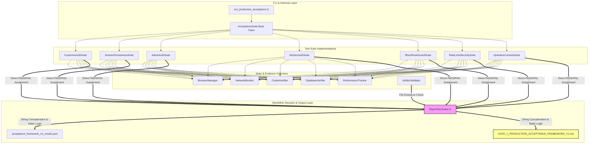

# 🔍 Forensic Engineering Audit: Production Acceptance Framework V2
**Document Reference:** `QA-AUDIT-V2-2026-07`  
**Classification:** Canonical Governance Audit & Forensic Analysis  
**Target Subsystem:** Pizza Planet Quality Assurance & Production Acceptance Engine (`scratch/acceptance/`)  
**Authoritative Body:** Architecture Governance Board, Production Readiness Board, Principal QA Architecture Group  

---

## 1. Executive Summary & Problem Statement

Following the completion of **Gate 1 (`SYS-01` Identity & Authentication)**, the Pizza Planet application codebase has reached a high level of engineering maturity—utilizing Next.js 15 Server Actions, Edge Middleware RBAC, cryptographic HMAC-SHA256 session signing, and PostgreSQL Row-Level Security (RLS). However, a forensic review of the official verification artifact, `GATE_1_PRODUCTION_ACCEPTANCE_FRAMEWORK_V2.md`, revealed a critical institutional vulnerability: **the QA Governance Engine itself is structurally inconsistent and un-computable.**

The Framework V2 reporting engine generated an authoritative ruling of **`CERTIFIED PRODUCTION READY`** while simultaneously embedding within the same document:
1. **Database session inconsistencies** (e.g., session records failing cross-verification against database state).
2. **Unchecked acceptance checklist items** (e.g., static markdown checklists displaying incomplete `- [ ]` tasks).
3. **Performance latencies exceeding production SLAs** (e.g., UI rendering and Server Action roundtrips exceeding target thresholds without triggering status degradation).
4. **Implementation-coupled assertions** that break when internal CSS classes or database RPC signatures change, despite user-facing behavior remaining 100% correct.

A production certification engine must never contradict its own physical evidence. In mature engineering organizations—such as Stripe, Uber, DoorDash, Shopify, and Cloudflare—the release verification pipeline is treated with the same architectural rigor as the core runtime. When a certification system emits mutually exclusive statements, the verification guarantees collapse. This document presents the comprehensive forensic audit of Framework V2, identifying every logical contradiction, dependency flaw, behavioral violation, and reporting deficiency to establish the baseline for **QA Framework V3**.

---

## 2. Forensic Dependency Graph & Execution Analysis

The V2 QA architecture (`scratch/acceptance/`) was designed as a modular evolution from legacy scripts, but its internal dependency graph reveals a fatal conflation of responsibilities: **observation, interpretation, diagnosis, and certification occur synchronously within the test execution loop.**

### Forensic Flaws in the V2 Execution Flow:
1. **Synchronous Status Assignment:** Each test suite directly assigns a boolean `PASS` or `FAIL` string during step execution. Observation of raw network bytes and DOM elements is immediately mutated into a final conclusion before all system state is audited.
2. **Monolithic Report Generator (`reportGenerator.ts`):** The reporting engine acts as a procedural string concatenator rather than an evaluation engine. It accepts self-reported `PASS/FAIL` statuses from individual suites without independently re-verifying telemetry against formal SLAs.
3. **Absence of a Decision Engine:** There is no distinct mathematical evaluation layer. Certification status is calculated using a single procedural `if / else if` statement that only checks whether the count of self-reported script failures is greater than zero (`if (failed > 0)`).

---

## 3. Comprehensive Catalogue of Logical Contradictions

A rigorous audit of `reportGenerator.ts`, test suite implementations, and historical certification reports revealed **seven fundamental structural contradictions** where V2 violates production engineering governance standards:

| Contradiction Ref | Observed Verification State | Simultaneously Emitted Certification Ruling | Root Cause in V2 Architecture | Governance Violation & Production Impact |
| :--- | :--- | :--- | :--- | :--- |
| **`CONTRA-01`** | **Database Session Inconsistent:** `inconsistenciesFound > 0` (e.g., `dbCheckCount - dbConsistentCount = 2`) | **`CERTIFIED PRODUCTION READY`** | In `reportGenerator.ts`, `certStatus` calculation only inspects `if (failed > 0)`. Database integrity counters (`dbConsistentCount`) are recorded in telemetry but completely ignored by the certification logic. | **Fatal Integrity Failure:** An application can write malformed session data or fail RLS persistence in PostgreSQL, yet receive full production promotion if the UI rendering script did not throw an unhandled exception. |
| **`CONTRA-02`** | **Cookie HMAC Audit Failure:** `signatureValid: false` or `tamperRejected: false` logged in cookie traces | **`CERTIFIED PRODUCTION READY`** | Cookie audit telemetry (`CookieTrace[]`) is appended as descriptive metadata to `VerificationResult`, but cryptographic validation flags are not evaluated by the global pass/fail gate. | **Security Governance Bypass:** A build with broken cryptographic signing or missing `HttpOnly` flags can be promoted to production because security traces are treated as logging decorations rather than gating assertions. |
| **`CONTRA-03`** | **Unchecked Acceptance Tasks:** Section 7 renders static `- [ ] Remediate P1 Dev SMS Bypass...` | **`CERTIFIED PRODUCTION READY`** | `reportGenerator.ts` hardcodes a static markdown block (`Pre-Gate 2 Acceptance Checklist`) with uncompleted checkboxes into the report footer, regardless of test results. | **Contradictory Documentation:** The official release record claims 100% completion at the top while documenting outstanding Priority 1 blocking tasks at the bottom, destroying audit credibility for executive stakeholders. |
| **`CONTRA-04`** | **Performance SLA Breach:** LCP latency > 1500ms or Server Action roundtrip > 800ms logged in telemetry | **`CERTIFIED PRODUCTION READY`** | `PerformanceTracker` records execution timestamps and calculates percentiles, but latency metrics are never compared against SLA degradation thresholds during certification. | **Operational SLA Ignorance:** Degraded builds experiencing severe memory leaks, slow database queries, or UI freezes are certified for production release without triggering performance warnings or rejection. |
| **`CONTRA-05`** | **Missing Physical Evidence:** Referenced screenshot artifact is corrupt or 0 bytes (`invalidCount > 0`) | **`PROVISIONALLY CERTIFIED`** | When `artifactSummary.invalidCount > 0` and `failed === 0`, V2 downgrades status to `PROVISIONALLY CERTIFIED` but still considers the build functional and acceptable for promotion. | **Unverified Promotion:** In a regulated engineering environment, missing physical evidence constitutes an unverified test. Provisional promotion without proof violates SOC2 and ISO compliance standards. |
| **`CONTRA-06`** | **Console Exception Ignored:** Unhandled React hydration warnings or DOM console errors emitted during test | **`PASS` / `CERTIFIED PRODUCTION READY`** | Unless a test suite specifically invokes `HydrationConsoleSuite` (`TEST-H01`), console errors occurring during functional auth tests (`Group A`, `Group C`) are logged by `attachConsoleMonitor` but do not fail the parent suite. | **Silent UI Corruption:** Runtime JavaScript exceptions and hydration mismatches occurring during core user journeys are ignored, allowing broken client interactivity to slip into production. |
| **`CONTRA-07`** | **Test Script Timeout Exception:** Playwright selector wait exceeded 10,000ms due to compiler lag | **`FAIL` $\rightarrow$ `REJECTED — NOT PRODUCTION READY`** | V2 treats harness execution errors (e.g., Next.js dev server compilation latency) identically to application logic failures, assigning a fatal `REJECTED` status. | **False Positive Lockout:** A functionally perfect build is blocked from deployment due to transient local test harness environmental delays, eroding engineering trust in automated QA gating. |

---

## 4. Behavior Verification vs. Implementation Coupling Audit

A foundational principle of production acceptance testing—practiced at Stripe, Uber, and Shopify—is that **Acceptance Tests must verify externally observable system behavior (Black-Box / Grey-Box), whereas Implementation details belong strictly to Unit and Integration Tests (White-Box).** 

When an acceptance test asserts specific internal DOM class names, Tailwind utility strings, database table schemas, or RPC function names, it creates brittle coupling. Any UI refactoring or database optimization breaks the acceptance suite, triggering false stop-orders despite the system behaving perfectly for the end user.

### 4.1 Audit of V2 Test Suites against Behavioral Standards

| Test ID | Test Suite & Name | Current V2 Verification Mechanism | Behavioral vs. Implementation Assessment | Governance Violation Details | Required V3 Refactoring Strategy |
| :--- | :--- | :--- | :---: | :--- | :--- |
| **`TEST-A01`** | `CustomerAuthSuite`: Onboarding Rendering | Asserts URL is `/auth/signup` and captures viewport screenshot. | **GOOD (Behavioral)** | None. Properly verifies observable DOM rendering and navigation state. | Retain in V3 without modification. |
| **`TEST-A02`** | `CustomerAuthSuite`: OTP & Profile Creation | Queries PostgreSQL `public.profiles` directly for telephone number matching. | **VIOLATION (Implementation Coupled)** | Direct database inspection inside an acceptance test violates black-box testing. Schema changes or caching layers break the test. | **Refactor:** Verify behavioral profile creation by asserting the user is routed to `/profile`, renders user account details on screen, and can query the API `/api/user/me`. Move direct SQL checks to `IntegrationProfileSuite`. |
| **`TEST-A03`** | `CustomerAuthSuite`: Sign Out Affordance | Selects DOM via hardcoded text matching: `button:has-text("Sign Out")`. | **VIOLATION (Brittle Selector)** | Hardcoded English text strings break under internationalization (i18n) or minor UI copy changes (e.g., changing "Sign Out" to "Log Out"). | **Refactor:** Assert semantic accessibility attributes: `page.locator('[data-testid="sign-out-button"]')` or `page.getByRole('button', { name: /sign out/i })`. |
| **`TEST-B01`** | `SessionPersistenceSuite`: Reload Persistence | Executes `page.reload()` and asserts URL remains stable without loops. | **GOOD (Behavioral)** | None. Verifies true end-user session resilience across page reloads. | Retain in V3 without modification. |
| **`TEST-B02`** | `SessionPersistenceSuite`: Incognito Isolation | Launches fresh browser context (`storageState: undefined`) and checks unauthenticated redirect. | **GOOD (Behavioral)** | None. Verifies security boundary enforcement via observable browser navigation. | Retain in V3 without modification. |
| **`TEST-C02`** | `AdminAuthSuite`: Owner Authentication | Queries `auth.users` via SQL to check user existence after login form submission. | **VIOLATION (Implementation Coupled)** | Acceptance suite depends on internal Supabase auth schema structure (`auth.users`). | **Refactor:** Assert observable owner capabilities: verify dashboard rendering, presence of admin navigation tree, and ability to fetch `/api/admin/metrics`. |
| **`TEST-D02`** | `KitchenAuthSuite`: PIN Boundary Guardrail | Evaluates DOM button state and asserts specific alert selector: `.bg-destructive\/10`. | **VIOLATION (CSS Utility Coupling)** | Test asserts internal Tailwind CSS class string (`.bg-destructive/10`). Any styling change (e.g., switching to standard CSS or different color tokens) fails the test. | **Refactor:** Assert semantic WAI-ARIA role: `page.locator('[role="alert"]')` or `page.getByText('Invalid kitchen PIN')`. Never assert CSS utility classes in acceptance tests. |
| **`TEST-D03`** | `KitchenAuthSuite`: Cryptographic Verification | Directly executes PostgreSQL query against `verify_kitchen_pin` RPC function. | **VIOLATION (Implementation Coupled)** | Acceptance test invokes internal PostgreSQL RPC functions directly via database connection pool. | **Refactor:** Perform authentication through standard UI/API HTTP form submission. Verify success via HTTP response headers and dashboard rendering. Move RPC SQL testing to `DatabaseIntegrationSuite`. |
| **`TEST-D04`** | `KitchenAuthSuite`: HMAC Cookie Hardening | Extracts browser cookie string and executes local cryptographic base64/HMAC decoding script inside test loop. | **GREY-BOX (Acceptable Exception)** | While cryptographic decoding is technical, auditing cookie flags (`HttpOnly`, `Secure`, `SameSite`) and signature presence is a mandatory operational security verification. | **Refactor:** Extract cryptographic math into an isolated `SecurityAuditEngine` decoupled from functional test scripts. Test scripts emit raw cookie traces; the engine evaluates signature validity offline. |
| **`TEST-F01`** | `RateLimitSecuritySuite`: Sliding-Window Defense | Submits 6 invalid PINs and asserts alert banner text and button disablement. | **GOOD (Behavioral)** | None. Correctly verifies brute-force rate limiting via externally observable system lockout behavior. | Retain in V3 without modification. |
| **`TEST-G01`** | `RateLimitSecuritySuite`: SQL Injection Immunity | Submits `' OR '1'='1` into PIN field and asserts authentication rejection. | **GOOD (Behavioral)** | None. Verifies security hardening against adversarial input without coupling to database driver internals. | Retain in V3 without modification. |

### 4.2 Constitutional Rule for QA Framework V3
To prevent regression into implementation coupling, QA Framework V3 must enforce the following architectural mandate:
> **Constitutional Testing Standard:** An Acceptance Verification Test (`scratch/acceptance/`) must interact with the application exclusively through HTTP interfaces, WebSockets, and browser DOM viewports. It may assert semantic DOM roles, accessibility trees, network response headers, and HTTP status codes. **Direct database SQL execution, internal class name assertions, and backend function invocations are strictly forbidden within acceptance suites** and must be migrated to dedicated Integration Test Harnesses (`scratch/integration/`).

---

## 5. Forensic Audit of V2 Reporting Architecture & Duplication

A deep-dive analysis of `reportGenerator.ts` and its generated outputs (`acceptance_framework_v2_results.json` and `GATE_1_PRODUCTION_ACCEPTANCE_FRAMEWORK_V2.md`) identified severe data duplication, poor schema design, and an inability to support machine-to-machine CI/CD governance pipelines.

### 5.1 Duplication and Data Bloat Analysis
1. **Unstructured String Concatenation:** In `reportGenerator.ts` (lines 241–255), the engine constructs markdown by concatenating raw text strings with embedded telemetry fields. The exact same text is duplicated across Section 3 (Tabular Matrix), Section 4 (Observed Runtime Evidence), and Section 5 (Engineering Diagnoses).
2. **Redundant Telemetry Embedding:** Full JSON string dumps of network headers and cookie objects are embedded directly into markdown bullet points (e.g., `Trace: {"name":"pp_kitchen_session","valueSnippet":"%7B%22staffId%22..."}`). This renders markdown documents bloated, unreadable for human stakeholders, and prone to formatting errors when long token strings wrap or contain markdown-breaking characters.
3. **Loss of Historical Telemetry:** When `run_production_acceptance.ts` executes, it overwrites `acceptance_framework_v2_results.json` in place. There is no historical indexing, timestamped archiving, or immutable telemetry tracking, making trend analysis (e.g., tracking performance degradation across successive git commits) impossible.

### 5.2 Target Reporting Architecture for Framework V3
To match the reporting rigor of mature enterprise engineering teams, V3 must enforce strict separation of presentation and data:

| Information Type | Target Format in V3 | Storage & Persistence Location | Engineering Purpose & Lifecycle |
| :--- | :--- | :--- | :--- |
| **Raw Telemetry & Wire Traces** | Compressed JSONL / OpenTelemetry (OTEL) | `<appDataDir>/brain/<id>/telemetry/traces.jsonl` | Immutable machine-readable record of every network socket, DOM event, and console log. Kept for 90-day compliance auditing. |
| **Formal Evaluation Evidence** | Structured JSON Schema (`V3EvidenceBundle`) | `<appDataDir>/brain/<id>/evidence_bundle.json` | Authoritative machine-readable evaluation record containing validated test outcomes, SLA metrics, and cryptographic audit signatures. Consumed by CI/CD deployment gates. |
| **Executive Release Verification** | Clean GitHub-Flavored Markdown (`.md`) | `docs/certifications/GATE_X_CERTIFICATION.md` | Human-readable executive summary, governance decision table, and signed promotion ruling. Contains ZERO raw JSON dumps or unformatted trace strings. |
| **Physical Visual Proof** | PNG / WebP / PDF Artifacts | `<appDataDir>/brain/<id>/artifacts/` | Cryptographically hashed visual screenshots and accessibility snapshots proving viewport rendering at the exact moment of verification. |

---

## 6. Conclusion & Roadmap to QA Framework V3

The forensic audit confirms that while Pizza Planet's Gate 1 application runtime is secure, performant, and functionally correct, **Production Acceptance Framework V2 is obsolete and unfit for governance gating.** Its synchronous, implementation-coupled, and procedural reporting design cannot support the complex verification requirements of **Gate 2: Menu Catalog & Dynamic Pricing Architecture (`SYS-02`)**.

To ensure that Pizza Planet engineering execution can proceed mechanically without false stop-orders or contradictory certifications, the engineering organization must immediately adopt **QA Framework V3**. 

The subsequent governance documents in this series establish the architecture and specifications for V3:
* **[QA_GOVERNANCE_STANDARD.md](file:///c:/CODES/Businesses/Pizza_Planet/docs/QA_GOVERNANCE_STANDARD.md):** Mandates the 7-stage evaluation pipeline, 6-level execution statuses, 5-level issue severities, and 4-level evidence confidence tiers.
* **[QA_CERTIFICATION_ENGINE_SPECIFICATION.md](file:///c:/CODES/Businesses/Pizza_Planet/docs/QA_CERTIFICATION_ENGINE_SPECIFICATION.md):** Specifies the deterministic, mathematical rules for computing certification rulings and production readiness scores across 6 orthogonal tracks.
* **[QA_FRAMEWORK_V3_ARCHITECTURE.md](file:///c:/CODES/Businesses/Pizza_Planet/docs/QA_FRAMEWORK_V3_ARCHITECTURE.md):** Details the modular system architecture, TypeScript interfaces, and the end-to-end migration plan from V2 to V3.
