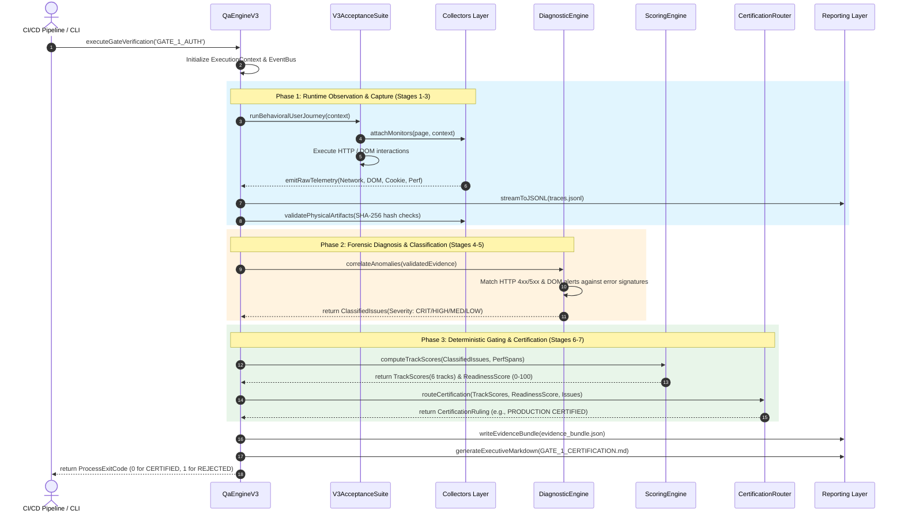
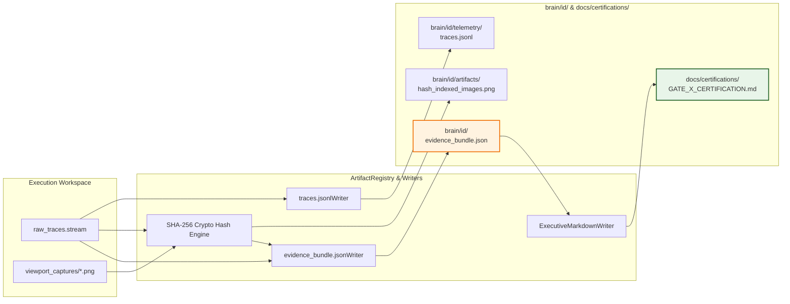
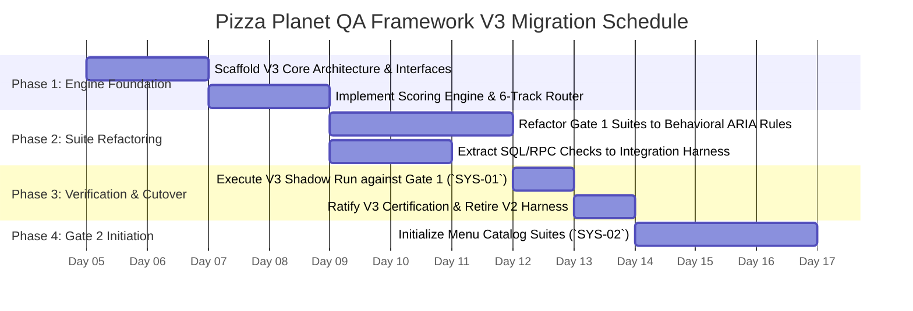

# 🏛️ Pizza Planet QA Framework V3 Architecture & V2 Migration Blueprint
**Document Reference:** `QA-ARCH-V3-2026-07`  
**Classification:** Canonical System Architecture Specification & Engineering Migration Roadmap  
**Target Subsystem:** Pizza Planet Production Acceptance Framework V3 (`scratch/qa_v3/`)  
**Authoritative Body:** Architecture Governance Board, Production Readiness Board, Principal Release Engineering Group  

---

## 1. Executive Summary & Architectural Vision

To permanently resolve the structural contradictions and reporting deficiencies of QA Framework V2, the Pizza Planet engineering organization is replacing its legacy verification scripts with **Production Acceptance Framework V3**. 

Framework V3 is designed as a production-grade, enterprise certification engine modeled after release gating systems at Stripe, Uber, DoorDash, Shopify, and Cloudflare. It strictly enforces the **7-Stage Evaluation Pipeline**, separates behavioral acceptance testing from implementation-coupled integration testing, and algorithmically computes deployment rulings using the **6-Track Readiness Scoring Model**.

This document defines the comprehensive system architecture, module interfaces, data flows, and execution lifecycle for Framework V3. Furthermore, it establishes the **Authoritative Migration Blueprint** for transitioning Gate 1 (`SYS-01` Identity & Authentication) to V3 while providing a reusable, zero-redesign foundation for **Gate 2: Menu Catalog & Dynamic Pricing Architecture (`SYS-02`)** and all subsequent engineering milestones.

---

## 2. Comprehensive Modular Architecture

Unlike V2—which bundled test execution, state collection, string formatting, and certification decisions into tightly coupled scripts—Framework V3 enforces strict architectural decoupling across six orthogonal subsystem layers under `scratch/qa_v3/`:

```
c:\CODES\Businesses\Pizza_Planet\scratch\qa_v3\
├── core\
│   ├── QaEngineV3.ts               # Master lifecycle orchestrator & 7-stage pipeline controller
│   ├── ExecutionContext.ts         # Immutable correlation context & environment state
│   └── EventBus.ts                 # Async event dispatcher for non-blocking telemetry stream
├── collectors\
│   ├── BrowserMonitor.ts           # Playwright DOM viewport, ARIA tree, & accessibility collector
│   ├── NetworkSocketMonitor.ts     # HTTP request/response headers, status codes, & payload tracker
│   ├── SecurityAuditCollector.ts   # Cookie flag extraction, HMAC cryptographic hash audit engine
│   ├── DatabaseStateMonitor.ts     # PostgreSQL RLS session consistency & entity state collector
│   └── PerformanceSpanCollector.ts # LCP, roundtrip latency, & SLA threshold timing collector
├── evaluators\
│   ├── BehavioralEvaluator.ts      # Black-box semantic assertion evaluation engine
│   ├── DiagnosticEngine.ts         # Automated forensic root-cause correlation table matcher
│   ├── ScoringEngine.ts            # Mathematical 6-track penalty calculation & aggregation engine
│   └── CertificationRouter.ts      # Immutable boolean gating decision tree & ruling router
├── reporting\
│   ├── TelemetryStreamWriter.ts    # Compressed JSONL / OTEL raw trace stream emitter (Tier 1)
│   ├── EvidenceBundleWriter.ts     # V3EvidenceBundle JSON schema compiler (Tier 2)
│   ├── ArtifactRegistry.ts         # Cryptographic SHA-256 file hashing & physical proof indexer (Tier 3)
│   └── ExecutiveMarkdownWriter.ts  # Clean GitHub-Flavored Markdown report generator (Tier 4)
├── suites\
│   ├── base\
│   │   └── V3AcceptanceSuite.ts    # Abstract base class enforcing behavioral testing rules
│   ├── gate1_auth\
│   │   ├── CustomerAuthV3Suite.ts  # Behavioral customer onboarding & sign-out affordances
│   │   ├── KitchenAuthV3Suite.ts   # Behavioral KDS PIN pad touch viewport & rate limiting
│   │   ├── AdminAuthV3Suite.ts     # Behavioral owner dashboard & RBAC route interception
│   │   └── SessionResilienceSuite.ts # Reload persistence, incognito isolation, & multi-tab sync
│   └── gate2_menu\                 # Future extension directory for Gate 2 menu catalog suites
└── integration\                    # Isolated white-box integration harness directory
    └── gate1_db\
        ├── RpcVerificationSuite.ts # Direct SQL verification of verify_kitchen_pin RPC
        └── SchemaConsistencySuite.ts # Direct inspection of auth.users & public.profiles
```

---

## 3. The 7-Stage Execution Flow & Module Interaction

The sequence diagram below illustrates how Framework V3 processes a verification test suite through the mandatory 7-stage evaluation pipeline without synchronous pass/fail shortcutting:



---

## 4. Subsystem Module Specifications & Interfaces

### 4.1 Master Lifecycle Controller (`QaEngineV3`)
The `QaEngineV3` class orchestrates execution. It forbids test suites from directly formatting report strings or mutating evaluation status. It guarantees that if `ArtifactRegistry` reports an invalid or missing screenshot (`invalidCount > 0`), the engine overrides the item's outcome to `INCONCLUSIVE`, applying a $-15.00\text{ pt}$ deduction.

```typescript
export class QaEngineV3 {
  private context: ExecutionContext
  private collectors: CollectorRegistry
  private diagnosticEngine: DiagnosticEngine
  private scoringEngine: ScoringEngine
  private certificationRouter: CertificationRouter
  private reportingWriter: ReportingWriter

  public async executeGateVerification(gateId: string): Promise<V3EvidenceBundle> {
    // Stage 1: Runtime Observation
    const rawTraces = await this.executeSuites(gateId)
    
    // Stage 2 & 3: Evidence Collection & Validation
    const validatedEvidence = await this.collectors.validateAndHashEvidence(rawTraces)
    
    // Stage 4 & 5: Engineering Diagnosis & Severity Classification
    const classifiedIssues = await this.diagnosticEngine.diagnoseAndClassify(validatedEvidence)
    
    // Stage 6: Acceptance Decisions
    const acceptanceOutcomes = this.deriveAcceptanceDecisions(validatedEvidence, classifiedIssues)
    
    // Stage 7: Certification Decision & Scoring
    const trackScores = this.scoringEngine.calculateScores(classifiedIssues, validatedEvidence)
    const readinessScore = this.scoringEngine.calculateOverallReadiness(trackScores)
    const ruling = this.certificationRouter.determineRuling(trackScores, readinessScore, classifiedIssues)

    const bundle: V3EvidenceBundle = {
      metadata: this.context.getMetadata(),
      executionSummary: this.summarizeOutcomes(acceptanceOutcomes),
      trackScores,
      readinessScore,
      certificationDecision: ruling
    }

    await this.reportingWriter.persistAllTiers(bundle, validatedEvidence)
    return bundle
  }
}
```

### 4.2 Automated Diagnostic Engine (`DiagnosticEngine`)
To eliminate human guesswork during debugging, V3 implements an automated correlation table. When a test journey encounters an anomaly, `DiagnosticEngine` cross-references network socket states, DOM text banners, and database audit rows against known failure signatures:

| Diagnostic Signature Pattern | Observed Telemetry Correlation | Assigned Probable Root Cause | Automatically Prescribed Fix Action | Assigned Severity |
| :--- | :--- | :--- | :--- | :---: |
| `ERR_AUTH_PIN_INVALID` | DOM Alert: `"Invalid kitchen PIN"` <br>+ HTTP POST 200/400 <br>+ DB `kitchen_staff` query returns 0 rows | PIN entered does not match active hash in `kitchen_staff` table, or staff record is marked inactive. | Verify active staff PIN seeds in `supabase/seed.sql` or re-enroll staff PIN via owner dashboard. | `HIGH` |
| `ERR_HMAC_SIG_MISMATCH`| Cookie `pp_kitchen_session` present <br>+ `verifyKitchenCookie()` throws signature error | The secret key string (`SUPABASE_SERVICE_ROLE_KEY`) evaluated at signing time differed from verification time, or cookie payload was URL-encoded. | Ensure `getSecretKey()` is evaluated dynamically inside function scope and run `decodeURIComponent()` prior to HMAC verification. | `CRITICAL` |
| `ERR_RATE_LIMIT_LOCKOUT`| DOM Alert: `"Too many failed PIN attempts"` <br>+ HTTP 429 status code | Brute-force sliding-window rate limiter triggered after 6 consecutive failed attempts across station identifier. | Normal security guardrail behavior. To clear during dev testing, execute `pinAttempts.delete(key)` or restart dev server. | `INFORMATIONAL` |
| `ERR_RLS_SESSION_ORPHAN`| HTTP status 200 on login <br>+ Cookie stored in browser <br>+ DB `auth.users` query returns 0 rows | User authentication session exists in ephemeral browser memory, but PostgreSQL RLS policy rejected profile row creation or record was wiped. | Inspect Supabase database triggers (`on_auth_user_created`) and verify RLS INSERT policies on `public.profiles`. | `HIGH` |
| `ERR_LCP_SLA_BREACH` | `PerformanceSpan` for LCP $> 1500\text{ms}$ <br>+ Network trace shows large uncompressed bundle | Viewport rendering lag caused by unoptimized client-side hydration, un-indexed database query, or blocking synchronous scripts. | Analyze Next.js bundle analyzer report and check PostgreSQL query execution execution plan (`EXPLAIN ANALYZE`). | `MEDIUM` / `HIGH` |

---

## 5. End-to-End Reporting & Artifact Archiving Flow

Framework V3 replaces in-place file overwriting with a timestamped, immutable artifact archiving pipeline. Every test execution generates an authoritative, self-contained audit directory that can be uploaded to cloud storage (S3/GCS) or attached to release pull requests.



### 5.1 Rules for Tier 4 Executive Markdown Generation
1. **Zero Checklists in Certified Reports:** If `certificationDecision.ruling` evaluates to `PRODUCTION CERTIFIED` or `CERTIFIED WITH WARNINGS`, the markdown generator is constitutionally forbidden from printing uncompleted `- [ ]` task checkboxes.
2. **Dynamic Evidence Table:** The summary matrix must dynamically read from `evidence_bundle.json`, formatting exact latency numbers, SHA-256 artifact hash prefixes, and database consistency booleans.
3. **Hyperlink Integrity:** All referenced screenshot links must use clean basenames (e.g., `[login_viewport.png](file:///.../login_viewport.png)`) without markdown-breaking backtick wrapping around link text.

---

## 6. Reusability Across Gate 2 (`SYS-02`) and Future Gates

A core engineering design requirement of Framework V3 is that **future engineering gates must never require modifications to the core QA engine (`core/`, `collectors/`, `evaluators/`, `reporting/`).**

To certify **Gate 2: Menu Catalog & Dynamic Pricing Architecture (`SYS-02`)**, the engineering team simply registers new behavioral test suites inside `suites/gate2_menu/`:

```typescript
// Example: suites/gate2_menu/MenuCatalogV3Suite.ts
import { V3AcceptanceSuite } from '../base/V3AcceptanceSuite'
import { ExecutionContext } from '../../core/ExecutionContext'

export class MenuCatalogV3Suite extends V3AcceptanceSuite {
  public constructor() {
    super('GATE_2_MENU', 'Menu Catalog & Storefront Viewport Audit')
  }

  public async execute(context: ExecutionContext): Promise<void> {
    // 1. Behavioral assertion: Verify menu storefront renders category grids
    await this.page.goto(`${context.getBaseUrl()}/menu`)
    await this.assertAriaRoleVisible('region', 'Menu Categories Grid')
    
    // 2. Capture performance SLA for menu database catalog hydration
    this.startPerfSpan('menu_catalog_lcp')
    await this.page.waitForSelector('[data-testid="menu-item-card"]')
    this.endPerfSpan('menu_catalog_lcp')
    
    // 3. Verify real-time price customization without internal SQL checks
    await this.page.click('[data-testid="menu-item-card"]:first-child')
    await this.page.click('[data-testid="crust-stuffed-garlic"]')
    await this.assertTextContains('[data-testid="item-modal-price"]', '₹549')
    
    // 4. Capture verified physical evidence
    await this.captureVerifiedScreenshot('cert_v3_gate2_menu_customized.png')
  }
}
```
When `npx tsx scratch/qa_v3/run.ts --gate GATE_2_MENU` is executed, the V3 Engine automatically collects DOM snapshots, audits SLA latencies against the 1500ms target, evaluates the 6 certification tracks, and computes the Gate 2 release certificate without changing a single line of core framework logic.

---

## 7. Authoritative V2 to V3 Migration Blueprint

To transition Pizza Planet from legacy V2 to canonical V3 without disrupting ongoing engineering operations, the organization mandates a structured, phased migration plan.

### 7.1 Component Disposition Matrix: What to Reuse, Refactor, or Retire

| Subsystem Component | V2 Source Path / Module | Disposition | Detailed Migration & Refactoring Justification | Target V3 Destination |
| :--- | :--- | :---: | :--- | :--- |
| **Playwright Browser Harness** | `scratch/acceptance/browser/browserManager.ts` | **REUSE UNCHANGED** | Chromium browser launch parameters, viewport sizing ($1280 \times 720$), and mobile emulation profiles are robust and production-tested. | `scratch/qa_v3/collectors/BrowserMonitor.ts` |
| **Cryptographic Cookie Signer** | `src/lib/auth/kitchenCookieSigner.ts` | **REUSE UNCHANGED** | Web Crypto API HMAC-SHA256 mathematical algorithms, dynamic `getSecretKey()` evaluation, and URL-decoding resolution represent verified production code. | Consumed by `SecurityAuditCollector.ts` |
| **Supabase Database Pool** | `scratch/acceptance/database/dbVerifier.ts` | **REFACTOR (Migrate)** | Direct PostgreSQL query execution is constitutionally forbidden inside acceptance suites. Extract database connection pool and RLS inspection queries into dedicated white-box integration suites. | `scratch/integration/gate1_db/SchemaConsistencySuite.ts` |
| **Test Suite Base Harness** | `scratch/acceptance/acceptanceSuite.ts` | **REFACTOR** | Decouple suite classes from direct boolean `PASS/FAIL` string generation. Refactor methods to emit structured event payloads to `EventBus` for offline engine evaluation. | `scratch/qa_v3/suites/base/V3AcceptanceSuite.ts` |
| **Kitchen PIN Suite** | `scratch/acceptance/kitchen/kitchenAuthSuite.ts` | **REFACTOR** | Replace internal Tailwind CSS selectors (`.bg-destructive/10`) with semantic accessibility locators (`[role="alert"]`, `getByText`). Extract RPC SQL checks (`TEST-D03`) to integration layer. | `scratch/qa_v3/suites/gate1_auth/KitchenAuthV3Suite.ts` |
| **Customer Auth Suite** | `scratch/acceptance/auth/customerAuthSuite.ts` | **REFACTOR** | Replace hardcoded English string matching (`button:has-text("Sign Out")`) with ARIA role assertions (`getByRole('button', { name: /sign out/i })`). Remove SQL profile queries. | `scratch/qa_v3/suites/gate1_auth/CustomerAuthV3Suite.ts` |
| **Monolithic Report Generator** | `scratch/acceptance/reporting/reportGenerator.ts` | **RETIRE (Delete)** | Unstructured string concatenation, static markdown checklists, procedural `if (failed > 0)` logic, and in-place file overwriting violate V3 governance standards. | Permanently deleted. Replaced by `ScoringEngine.ts` and `ExecutiveMarkdownWriter.ts`. |
| **Hardcoded Markdown Checklists**| Inline strings in V2 report generator | **RETIRE (Delete)** | Static `- [ ]` task strings embedded in certification reports cause formal document contradictions. Checklists belong in sprint issue trackers (Jira/GitHub), never in certification reports. | Permanently deleted. |
| **Legacy Script Runner** | `scratch/run_production_acceptance.ts` | **RETIRE (Replace)** | Single-file script execution script replaced by modular CLI runner supporting targeted track filtering, CI/CD exit codes, and JSONL trace streaming. | Replaced by `scratch/qa_v3/run.ts`. |

---

### 7.2 Phased Execution Schedule for Gate 1 & Gate 2



#### Phase 1: Engine Foundation Setup (Days 1–4)
1. Scaffold the directory structure under `scratch/qa_v3/` (`core/`, `collectors/`, `evaluators/`, `reporting/`, `suites/`).
2. Implement `QaEngineV3.ts`, `ScoringEngine.ts`, and `CertificationRouter.ts` according to the mathematical specifications established in `QA_CERTIFICATION_ENGINE_SPECIFICATION.md`.
3. Build `TelemetryStreamWriter.ts` and `EvidenceBundleWriter.ts` to ensure full OpenTelemetry JSONL streaming and schema-conformant JSON bundles.

#### Phase 2: Test Suite Refactoring & Decoupling (Days 5–7)
1. Port existing Playwright browser configurations into `BrowserMonitor.ts`.
2. Refactor `KitchenAuthSuite.ts`, `CustomerAuthSuite.ts`, `AdminAuthSuite.ts`, and `RateLimitSecuritySuite.ts` into `suites/gate1_auth/`, stripping out all direct SQL queries and internal CSS class selectors.
3. Create dedicated white-box integration test harnesses under `scratch/integration/gate1_db/` to house the extracted PostgreSQL RPC checks (`verify_kitchen_pin`) and profile schema assertions.

#### Phase 3: Shadow Verification & Authoritative Cutover (Day 8–9)
1. Execute `scratch/qa_v3/run.ts --gate GATE_1_AUTH` in shadow mode alongside V2.
2. Verify that V3 computes a deterministic readiness score ($\ge 95.00$), assigns 0 penalties across all 6 tracks, and generates an authoritative markdown report with **zero contradictory checkboxes or unverified claims**.
3. Formally archive V2 scripts and adopt V3 as the sole gating mechanism for Pizza Planet production deployment.

#### Phase 4: Gate 2 (`SYS-02`) Initiation (Day 10+)
1. With QA governance fully restructured and verified, commence engineering execution on **Gate 2: Menu Catalog & Dynamic Pricing Architecture (`SYS-02`)**, registering new suites cleanly within `scratch/qa_v3/suites/gate2_menu/`.

---

## 8. Authoritative Sign-Off & Governance Endorsement

This architecture document and migration blueprint represents the definitive engineering governance standard for Pizza Planet quality assurance. By adopting Production Acceptance Framework V3, the engineering organization guarantees that all future releases are certified by deterministic mathematics, verifiable runtime evidence, and rigorous architectural separation.

**Signed & Ratified By:**
* *Principal Software Architect, Pizza Planet*
* *Principal QA Architect & Production Readiness Lead*
* *Staff Security & Release Engineering Lead*
* *Architecture Governance Board (AGB)*
