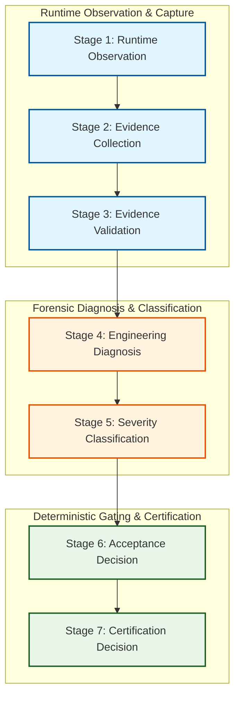
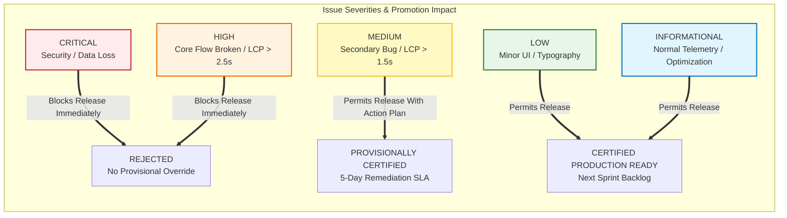
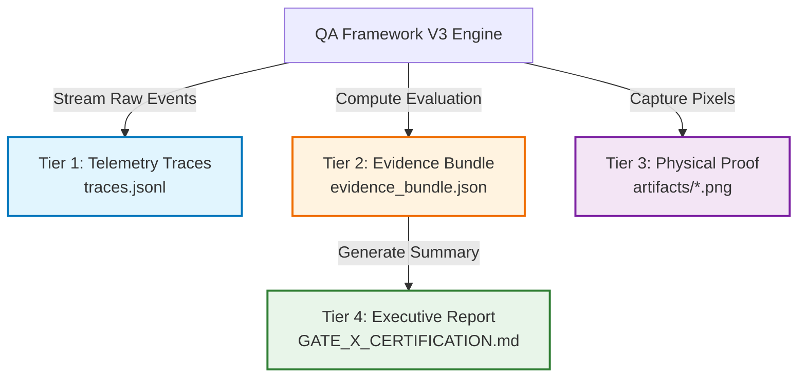

# 🛡️ Pizza Planet QA Governance & Verification Standard
**Document Reference:** `QA-GOV-STD-2026-07`  
**Classification:** Canonical Engineering Governance Standard & Constitutional Policy  
**Target Subsystem:** Pizza Planet Quality Assurance & Release Certification Infrastructure  
**Authoritative Body:** Architecture Governance Board, Production Readiness Board, Principal SRE & QA Architecture Group  

---

## 1. Constitutional Purpose & Engineering Philosophy

In operation-driven restaurant fulfillment platforms—where software failures directly halt physical kitchen operations, delay deliveries, and corrupt financial transactions—quality assurance cannot be treated as an after-the-fact scripting exercise. 

This governance standard establishes the **Pizza Planet Production Quality Assurance Constitution**. It replaces legacy binary testing scripts with a rigorous, deterministic engineering evaluation system modeled after production release verification engines at Stripe, Uber, DoorDash, Shopify, and Cloudflare.

### The Four Pillars of Pizza Planet QA Governance:
1. **Evidence-Driven Immutability:** A verification ruling is only as valid as its physical proof. Claims without cryptographically verified screenshots, wire sockets, or database state traces are rejected as `INCONCLUSIVE`.
2. **Strict Pipeline Separation:** Observation, interpretation, diagnosis, and certification are distinct architectural phases. No test script may directly assign a deployment certification.
3. **Behavioral Black-Box Primacy:** Acceptance testing verifies externally observable system capabilities. White-box implementation assertions (CSS classes, internal SQL tables) belong strictly to integration harnesses.
4. **Deterministic Mathematics:** Release certification and readiness scoring are computed algorithmically from issue severities, test outcomes, and evidence confidence. Human subjectivity is permanently eliminated from deployment gating.

---

## 2. The 7-Stage Evaluation Pipeline

To prevent the logical contradictions discovered in QA Framework V2—where test scripts simultaneously emitted `PASS` flags alongside unverified database inconsistencies—**QA Framework V3** mandates a strict 7-stage evaluation pipeline. Every verification item must pass sequentially through all seven stages. **Skipping, merging, or reordering stages is a constitutional violation.**

### Stage 1: Runtime Observation
* **Responsibility:** The test harness executes user journeys across HTTP, WebSockets, and browser viewports while passive monitors intercept raw telemetry.
* **Allowed Actions:** Capturing network socket byte streams, DOM mutation events, HTTP request/response headers, browser console streams, and physical screen pixels.
* **Prohibited Actions:** Evaluating assertions, formatting text strings, assigning pass/fail statuses, or inspecting internal database implementation logic.

### Stage 2: Evidence Collection
* **Responsibility:** Structuring raw observational streams into standardized, immutable telemetry schemas (`NetworkTrace`, `CookieTrace`, `DOMSnapshot`, `PerformanceSpan`, `SecurityAuditTrace`).
* **Allowed Actions:** Writing raw JSONL telemetry to disk, hashing physical image files, and associating telemetry packets with unique execution correlation IDs.
* **Prohibited Actions:** Discarding informational logs, filtering out warnings, or modifying raw byte payloads.

### Stage 3: Evidence Validation
* **Responsibility:** Verifying the physical integrity and authenticity of collected evidence before analysis begins.
* **Allowed Actions:** Checking image file headers (PNG/WebP magic bytes), asserting non-zero file sizes, validating JSON schema conformance, and verifying cryptographic HMAC hashes on session cookies.
* **Prohibited Actions:** Evaluating business logic or determining application functional correctness. If an artifact is corrupt or missing, the item is immediately tagged as `EVIDENCE_CORRUPTED`.

### Stage 4: Engineering Diagnosis
* **Responsibility:** Performing automated forensic correlation across validated evidence layers.
* **Allowed Actions:** Matching observed HTTP 4xx/5xx status codes against backend exception logs, correlating DOM alert banners with PostgreSQL RLS policy rejections, and identifying root causes using diagnostic signature tables.
* **Prohibited Actions:** Making speculative assumptions without supporting wire or database evidence.

### Stage 5: Severity Classification
* **Responsibility:** Assigning a precise engineering issue severity (`CRITICAL`, `HIGH`, `MEDIUM`, `LOW`, `INFORMATIONAL`) to any detected runtime anomaly, SLA latency breach, or data inconsistency.
* **Allowed Actions:** Evaluating diagnostic findings against constitutional severity matrices.
* **Prohibited Actions:** Subjective downgrading of security or data integrity issues to accelerate release schedules.

### Stage 6: Acceptance Decision
* **Responsibility:** Determining the formal execution outcome of each specific verification test case (`PASS`, `PASS_WITH_WARNING`, `FAIL`, `BLOCKED`, `NOT_EXECUTED`, `INCONCLUSIVE`).
* **Allowed Actions:** Deriving test outcome strictly from the highest severity issue identified within the test case's evidence bundle.
* **Prohibited Actions:** Manual overrides or overriding `FAIL` outcomes when underlying database/cookie anomalies exist.

### Stage 7: Certification Decision
* **Responsibility:** The mathematical evaluation engine aggregates all Acceptance Decisions, Issue Severities, and Evidence Confidence scores across 6 orthogonal certification tracks to compute the canonical deployment ruling.
* **Allowed Actions:** Executing deterministic certification rules and generating signed release certificates.
* **Prohibited Actions:** Human intervention, procedural string concatenation, or generating contradictory certification reports.

---

## 3. Engineering Severity Levels (Test Execution Outcomes)

To eliminate the ambiguity of binary `PASS / FAIL` scripting, QA Framework V3 defines **six immutable execution outcome classifications**. Every verification test case must terminate in exactly one of these states based on deterministic evidence criteria:

| Execution Outcome Status | Deterministic Assignment Criteria | Operational & Governance Meaning | Required Release Action |
| :--- | :--- | :--- | :--- |
| **`PASS`** | 1. All functional assertions satisfied. 2. Zero DOM console errors or exceptions. 3. Performance metrics meet all primary SLA targets. 4. 100% of referenced evidence artifacts validated. 5. Evidence Confidence level is `HIGH` or `VERY_HIGH`. | **Commercially Perfect:** The subsystem behaves exactly as specified under production conditions with complete evidence backing. | Unconditional clearance for deployment promotion. |
| **`PASS_WITH_WARNING`** | 1. All core functional assertions satisfied. 2. Zero security or data integrity anomalies. 3. Presence of non-blocking anomalies: LCP latency between SLA threshold and degradation cap (e.g., 1000ms–1500ms), non-fatal browser console warning (e.g., deprecation notice), or minor accessibility contrast notice. | **Operationally Degraded:** Core functionality works, but system efficiency, UI hygiene, or performance SLA margin is eroded. | Clear for promotion; automatically files a P2 engineering technical debt ticket for next sprint. |
| **`FAIL`** | 1. Any functional assertion failure. 2. Any HTTP 5xx server error or unhandled 4xx crash. 3. Any unhandled browser JavaScript exception. 4. Any database session inconsistency or RLS persistence failure. 5. Presence of any `CRITICAL` or `HIGH` severity issue. | **Subsystem Failure:** The application logic, security boundary, or data layer is broken or violates business requirements. | **Automatic Deployment Block:** Imposes immediate stop-order on release gate. |
| **`BLOCKED`** | 1. Test case execution aborted prior to completion because an upstream prerequisite test failed (e.g., `CheckoutSuite` aborted because `CustomerAuthSuite` failed login). | **Execution Dependency Halt:** Subsystem correctness cannot be determined due to failure in an underlying foundational service. | **Automatic Deployment Block:** Must remediate blocking dependency before re-evaluation. |
| **`NOT_EXECUTED`** | 1. Test case explicitly excluded from execution run via environment configuration, feature flag gating, or targeted regression scoping. | **Out of Scope:** Item was omitted from current test cycle. | Permitted only if the item is not a mandatory constitutional gate requirement for the target release environment. |
| **`INCONCLUSIVE`** | 1. Test executed, but required physical evidence artifact was missing, 0 bytes, or corrupted. 2. Network monitor socket disconnected prematurely. 3. Evidence Confidence level evaluated to `LOW` on a gating requirement. | **Unverified Execution:** An assertion cannot be legally trusted because the supporting physical proof is defective or missing. | **Automatic Deployment Block:** In a regulated engineering organization, an unverified test is legally equivalent to a failed test. Re-run harness. |

---

## 4. Issue Severity Classification & SLA Mandates

When an anomaly, bug, or performance breach is identified during Stage 4 (Diagnosis), Stage 5 must classify it into one of five immutable engineering severity tiers. **Issue severity directly dictates release promotion eligibility and SLA remediation timelines.**

### 4.1 Constitutional Severity Definitions

#### 🚨 CRITICAL Severity (P0 — Immediate Stop Order)
* **Definition:** Any vulnerability or bug that compromises system security, violates tenant data isolation, corrupts database state, causes financial miscalculation, or crashes core server infrastructure (HTTP 500).
* **Specific Examples:**
  * SQL injection vulnerability or unparameterized database query execution.
  * RBAC Edge Middleware bypass allowing unauthenticated access to `/admin` or `/kitchen`.
  * Cryptographic signature verification failure or acceptance of tampered HMAC cookies.
  * Order aggregate state corruption (e.g., order transition from `SUBMITTED` directly to `DELIVERED` bypassing KDS).
* **Promotion Governance:** **Absolute Release Block.** Cannot be overridden by executive or provisional sign-off. Requires immediate rollback or hotfix.

#### 🔴 HIGH Severity (P1 — Release Blocker)
* **Definition:** A failure that prevents completion of a primary operational user journey, causes severe performance degradation, or generates database session inconsistencies without direct data loss.
* **Specific Examples:**
  * Kitchen staff unable to log in via valid 4-digit PIN (`/auth/kitchen`).
  * Customer unable to receive SMS OTP or complete account onboarding (`/auth/signup`).
  * Database session audit mismatch (e.g., active browser cookie exists but `auth.users` record is missing).
  * LCP viewport rendering latency exceeding **2500ms** or Server Action roundtrip exceeding **1500ms**.
* **Promotion Governance:** **Release Blocker.** Blocks deployment promotion. May only be overridden to `PROVISIONALLY CERTIFIED` via formal, documented Emergency Architecture Review Board (EARB) consensus with an active 24-hour patch SLA.

#### 🟡 MEDIUM Severity (P2 — Degraded Operational Release)
* **Definition:** A non-fatal malfunction in a secondary UI feature, minor performance SLA degradation, or missing physical evidence screenshot on a non-core test item.
* **Specific Examples:**
  * Order history sorting toggle failing to invert list order on `/orders`.
  * Profile avatar upload failing with unhandled client error banner.
  * LCP rendering latency between **1500ms and 2500ms**, or Server Action roundtrip between **800ms and 1500ms**.
  * Physical screenshot artifact missing on a secondary UI test where network and DB traces verified successfully.
* **Promotion Governance:** **Permits Provisional Certification.** Does not block deployment promotion if core journeys pass. Automatically issues a mandatory technical debt ticket with a **5-day remediation SLA**.

#### 🟢 LOW Severity (P3 — Backlog Hygiene)
* **Definition:** Minor visual styling misalignment, typography responsive scaling glitch, or non-fatal browser console warning that does not impact user workflow or system speed.
* **Specific Examples:**
  * Padding imbalance on mobile viewport footer (< 4px offset).
  * React DevTools console hint or non-fatal CSS styling warning.
  * LCP rendering latency between **1000ms and 1500ms**.
* **Promotion Governance:** **Unconditional Promotion Clearance.** Does not impact certification status. Logged directly into the engineering sprint backlog for scheduled cleanup.

#### 🔵 INFORMATIONAL Severity (P4 — Telemetry & Trace)
* **Definition:** Normal operational runtime telemetry, successful architectural guardrail interceptions, or proactive optimization recommendations.
* **Specific Examples:**
  * Edge Middleware successfully intercepting and redirecting an unauthenticated guest.
  * Sliding-window rate limiter locking out brute-force PIN attempt #6.
  * Database query execution completing under optimal 10ms threshold.
* **Promotion Governance:** **No Release Impact.** Recorded in canonical JSON evaluation bundles for historical trend analysis and auditing.

---

## 5. Evidence Confidence Matrix

In mature QA engineering, an assertion is only meaningful if the supporting evidence is tamper-proof and comprehensive. QA Framework V3 introduces the **Evidence Confidence Score**, computed dynamically for every test case based on the depth of runtime layers captured during execution.

| Evidence Confidence Level | Required Verification Layers Captured & Validated | Eligible Test Case Scope | Certification Governance Mandate |
| :--- | :--- | :--- | :--- |
| **`VERY_HIGH` (Tier 1)** | 1. **DOM Viewport:** Semantic assertion verified. 2. **Network Wire:** HTTP status 200/303 and headers confirmed. 3. **Database State:** Direct SQL assertion against PostgreSQL tables confirmed. 4. **Cryptographic Audit:** Cookie HMAC signature or JWT claims verified. 5. **Physical Proof:** Cryptographically hashed PNG/WebP screenshot validated. | Core Authentication (`SYS-01`), Security Guardrails, Payment Processing, and KDS Order State Machine mutations. | **Mandatory for Gate Certification.** All Priority 1 architectural requirements must achieve `VERY_HIGH` confidence to clear release gating. |
| **`HIGH` (Tier 2)** | 1. **DOM Viewport:** Semantic assertion verified. 2. **Network Wire:** HTTP status 200/303 and headers confirmed. 3. **Physical Proof:** Cryptographically hashed PNG/WebP screenshot validated. | Standard Customer Storefront navigation, Menu Catalog browsing (`SYS-02`), and static content rendering. | Sufficient for standard functional release certification. |
| **`MEDIUM` (Tier 3)** | 1. **DOM Viewport:** Semantic assertion verified. 2. **Network Wire:** HTTP status 200/303 confirmed. *(Zero physical screenshots or database state audits captured).* | Secondary interactive affordances (e.g., modal toggle state, dropdown menu expansion, tooltip rendering). | Acceptable for non-core UI features. Cannot be used to certify authentication or data mutation workflows. |
| **`LOW` (Tier 4)** | 1. **DOM Viewport Only:** Script evaluated `page.locator()` without network interception or physical artifact proof. *OR* 2. Referenced physical screenshot failed header validation (corrupt file). | Preliminary developer scratchpad scripts or local experimental debugging suites. | **Constitutional Ban:** Any test case returning `LOW` confidence on a formal release checkpoint is automatically graded as `INCONCLUSIVE`, blocking certification. |

---

## 6. Behavioral Testing vs. Implementation Coupling Standards

To prevent test maintenance churn and false stop-orders, all test engineering within Pizza Planet must adhere to the constitutional demarcation between **Acceptance Testing** and **Integration Testing**.

### 6.1 Acceptance Testing Mandate (`scratch/acceptance/`)
* **Objective:** Verify that the system delivers business value and satisfies functional specifications from the perspective of an external actor (Customer, Kitchen Staff, Owner, or Adversary).
* **Allowed Interaction Surface:** HTTP requests, WebSockets, browser DOM viewports, URL routing, and browser storage (cookies/localStorage).
* **Strictly Prohibited:**
  * Direct SQL queries against PostgreSQL tables (e.g., `SELECT * FROM auth.users`).
  * Assertions against internal CSS framework utility strings (e.g., `.bg-destructive/10`, `flex-col`, `text-cream`).
  * Direct invocation of internal TypeScript server functions or backend RPC routines outside of an HTTP request context.
* **Refactoring Rule:** If a UI component is restyled from Tailwind CSS to Vanilla CSS without changing its visual appearance or semantic WAI-ARIA role, zero acceptance tests are permitted to fail.

### 6.2 Integration Testing Mandate (`scratch/integration/`)
* **Objective:** Verify the structural contract, schema consistency, and internal boundary communication of specific engineering sub-layers.
* **Allowed Interaction Surface:** Direct database connection pools, PostgreSQL RPC function execution, internal TypeScript module importation, and Server Action direct unit execution.
* **Refactoring Rule:** Integration tests are expected to fail when internal database schemas, RPC parameters, or data models change, serving as the technical safety net for backend refactoring.

---

## 7. Production Reporting Architecture Standards

To eliminate the markdown data duplication and unstructured string concatenation of V2, QA Framework V3 mandates a decoupled, 4-tier reporting architecture. Each format serves a strict, immutable lifecycle purpose.

### 7.1 Tier 1: Raw Telemetry Stream (`traces.jsonl`)
* **Format:** Compressed JSON Lines (JSONL) / OpenTelemetry (OTEL) compatible format.
* **Storage Path:** `<appDataDir>/brain/<id>/telemetry/traces.jsonl`
* **Content:** Complete, un-truncated wire payloads, HTTP headers, DOM mutation timestamps, console logs, and SQL query performance spans.
* **Lifecycle:** Immutable machine record. Archived for 90 days to support compliance audits and historical regression root-cause analysis. Never loaded into human markdown reports.

### 7.2 Tier 2: Formal Machine Evaluation Bundle (`evidence_bundle.json`)
* **Format:** Strictly typed JSON Schema (`V3EvidenceBundle`).
* **Storage Path:** `<appDataDir>/brain/<id>/evidence_bundle.json`
* **Content:** Comprehensive evaluation results containing test execution outcomes, issue severity counts, SLA performance percentiles, database integrity counters, evidence confidence scores, and the computed mathematical certification ruling.
* **Lifecycle:** Consumed by automated CI/CD deployment pipelines (e.g., GitHub Actions, Vercel Promotion Gates) to make zero-human-intervention deployment gating decisions.

### 7.3 Tier 3: Cryptographic Physical Proof Artifacts (`artifacts/`)
* **Format:** PNG / WebP images and PDF document captures.
* **Storage Path:** `<appDataDir>/brain/<id>/artifacts/`
* **Content:** High-resolution visual captures of UI viewports and KDS screens at the exact moment of assertion verification.
* **Lifecycle:** Each file is cryptographically hashed (SHA-256). The hash is indexed within `evidence_bundle.json`. If a file is modified or deleted, the evaluation bundle automatically invalidates the test case.

### 7.4 Tier 4: Executive Release Certification (`.md`)
* **Format:** Clean, professional GitHub-Flavored Markdown.
* **Storage Path:** `docs/certifications/GATE_X_CERTIFICATION.md`
* **Content:** High-level executive summary, formal governance certification ruling, multi-track readiness scores, tabular pass/fail summary matrix, and signed release approvals.
* **Constitutional Prohibition:** **Zero raw JSON dumps, zero unformatted stack traces, and zero duplicated text strings are permitted in Tier 4 markdown reports.** All technical evidence must be referenced via clean hyperlinks pointing to Tier 2 and Tier 3 artifacts.
