# 🏗️ Pizza Planet — System Architecture

> **Version:** 2.0  
> **Last Updated:** June 19, 2026  
> **Author:** CTO & Product Lead · Staff Architect  
> **Status:** Production-Ready — Post Architecture Review  
> **Source of Truth:** [PRD.md](file:///c:/CODES/Businesses/Pizza_Planet/docs/PRD.md) (Business) · Stitch Project `17410910858893906886` (Design)

---

## Table of Contents

1. [High-Level System Architecture](#1-high-level-system-architecture)
2. [Frontend Architecture](#2-frontend-architecture)
3. [Backend Architecture](#3-backend-architecture)
4. [Authentication Strategy](#4-authentication-strategy)
5. [State Management Strategy](#5-state-management-strategy)
6. [Realtime Architecture](#6-realtime-architecture)
7. [Payment Architecture](#7-payment-architecture)
8. [WhatsApp Notification Architecture](#8-whatsapp-notification-architecture)
9. [File Storage Architecture](#9-file-storage-architecture)
10. [Deployment Architecture](#10-deployment-architecture)
11. [Security Architecture](#11-security-architecture)
12. [Folder Structure](#12-folder-structure)
13. [Data Flow Diagrams](#13-data-flow-diagrams)
14. [Sequence Diagrams](#14-sequence-diagrams)
15. [Service Layer Architecture](#15-service-layer-architecture)
16. [Observability Architecture](#16-observability-architecture)
17. [Background Processing Architecture](#17-background-processing-architecture)
18. [Caching Architecture](#18-caching-architecture)
19. [Disaster Recovery](#19-disaster-recovery)
20. [Performance Requirements](#20-performance-requirements)
21. [Future Multi-Tenant Architecture](#21-future-multi-tenant-architecture)
22. [Architecture Decision Records](#22-architecture-decision-records)
23. [Architecture Readiness Assessment](#23-architecture-readiness-assessment)

---

## 1. High-Level System Architecture

### System Overview

Pizza Planet is a **server-rendered monolith** built on Next.js 15 with Supabase as the backend-as-a-service layer. The architecture prioritizes operational simplicity for a single-restaurant operation while maintaining clean boundaries for future multi-tenant expansion.

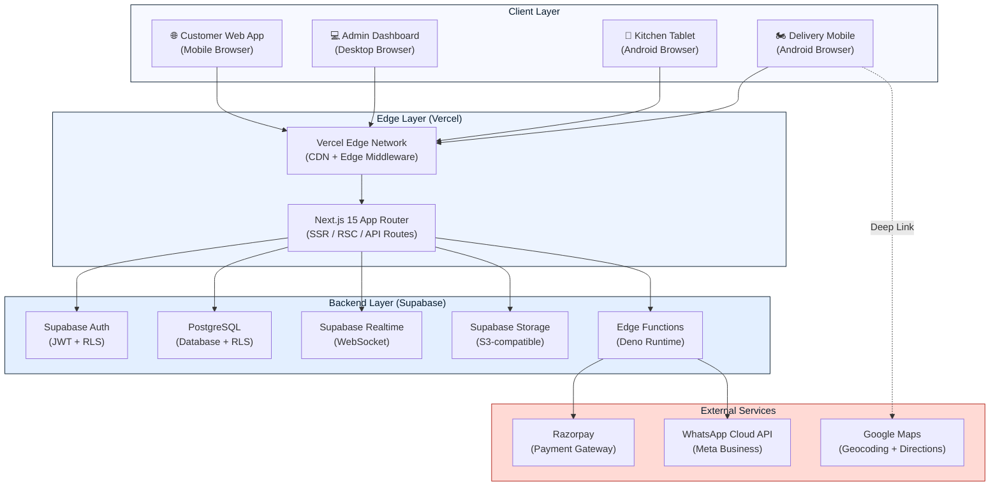

### Architectural Principles

| Principle | Rationale |
|---|---|
| **Server-First Rendering** | Next.js 15 RSC (React Server Components) for menu pages ensures fast LCP, SEO indexability, and minimal client JS bundle. Client components only where interactivity demands it. |
| **Backend-as-a-Service** | Supabase eliminates the need to build and maintain a custom API layer. Row Level Security (RLS) policies enforce authorization at the database level, removing an entire class of authorization bugs. |
| **Edge-First Delivery** | Vercel's Edge Network handles static assets, ISR pages, and Edge Middleware (auth token validation, geolocation) at the CDN layer before requests hit the origin. |
| **Realtime by Default** | Supabase Realtime (WebSocket) powers the order lifecycle. Kitchen, delivery, and customer tracking views are all live-subscribed—no polling. |
| **Webhook-Driven Integrations** | Razorpay and WhatsApp are integrated through Supabase Edge Functions triggered by webhooks, keeping external service logic decoupled from the main application. |
| **Progressive Enhancement** | The storefront works without JavaScript for menu browsing (SSR). Interactivity (cart, customizer, tracking) hydrates on the client. |

### System Boundary Definitions

| Boundary | Responsibility | Technology |
|---|---|---|
| **Presentation** | UI rendering, client-side state, interaction handling | Next.js 15, React 19, Tailwind CSS, Zustand |
| **Application** | Route handling, server actions, form processing, auth middleware | Next.js App Router, Server Actions, Middleware |
| **Data Access** | Database queries, RLS enforcement, realtime subscriptions | Supabase Client SDK (server + browser) |
| **Integration** | Payment processing, notification dispatch, file management | Supabase Edge Functions |
| **Infrastructure** | Hosting, CDN, DNS, SSL, monitoring | Vercel, Supabase Cloud |

---

## 2. Frontend Architecture

### Next.js 15 App Router

The frontend is built entirely on Next.js 15's App Router with React Server Components as the default rendering strategy.

#### Rendering Strategy by Page Type

| Page | Rendering | Rationale |
|---|---|---|
| **Homepage** | ISR (`revalidate: 60`) | Content changes infrequently. ISR gives static-site speed with periodic freshness. |
| **Menu / Category** | ISR (`revalidate: 60`) | Menu data is relatively static. 60-second revalidation ensures availability changes propagate within a minute. |
| **Product Detail** | ISR (`revalidate: 60`) | Same as menu. Individual product pages pre-rendered at build for popular items, on-demand for rest. |
| **Pizza Customizer** | Client Component | Highly interactive — real-time price calculation, topping visualization, drag interactions. Must be fully client-rendered. |
| **Cart** | Client Component | Ephemeral state, local-first persistence, frequent mutations. |
| **Checkout** | Hybrid (RSC shell + Client form) | Server component loads address/user data; client handles form validation and Razorpay SDK. |
| **Order Tracking** | Client Component | Supabase Realtime subscription for live status updates. |
| **Admin Dashboard** | Client Component (behind auth) | Highly interactive Kanban, real-time order feed, drag-and-drop. No SEO need. |
| **Kitchen Display** | Client Component (behind auth) | Live order queue with realtime subscriptions. |
| **Delivery View** | Client Component (behind auth) | Live delivery assignments with status buttons. |

#### Route Architecture

```
app/
├── (storefront)/              # Customer-facing routes (public layout)
│   ├── layout.tsx             # Storefront shell: header, cart FAB, footer
│   ├── page.tsx               # Homepage (ISR)
│   ├── menu/
│   │   ├── page.tsx           # Full menu (ISR)
│   │   └── [category]/
│   │       └── page.tsx       # Category-filtered menu (ISR)
│   ├── customize/
│   │   └── [productId]/
│   │       └── page.tsx       # Pizza customizer (Client)
│   ├── cart/
│   │   └── page.tsx           # Cart view (Client)
│   ├── checkout/
│   │   └── page.tsx           # Checkout flow (Hybrid)
│   └── track/
│       └── [orderId]/
│           └── page.tsx       # Order tracking (Client)
│
├── (admin)/                   # Owner dashboard routes (auth-protected layout)
│   ├── layout.tsx             # Admin shell: sidebar nav, header
│   ├── dashboard/
│   │   └── page.tsx           # Order dashboard (Client)
│   ├── orders/
│   │   └── page.tsx           # Kanban order management (Client)
│   ├── menu/
│   │   ├── page.tsx           # Menu CRUD list (Client)
│   │   └── [productId]/
│   │       └── page.tsx       # Product editor (Client)
│   ├── settings/
│   │   └── page.tsx           # Business settings (Client)
│   └── analytics/
│       └── page.tsx           # Analytics (Phase 2) (Client)
│
├── (kitchen)/                 # Kitchen Display System (auth-protected layout)
│   ├── layout.tsx             # Fullscreen KDS layout
│   └── page.tsx               # Order queue (Client)
│
├── (delivery)/                # Delivery rider view (auth-protected layout)
│   ├── layout.tsx             # Minimal mobile layout
│   └── page.tsx               # Delivery queue (Client)
│
├── auth/                      # Authentication pages
│   ├── login/
│   │   └── page.tsx           # Admin login (Email/Password)
│   ├── kitchen/
│   │   └── page.tsx           # Kitchen PIN entry
│   └── verify/
│       └── page.tsx           # OTP verification
│
└── api/                       # API Route Handlers (Next.js)
    ├── razorpay/
    │   ├── create-order/
    │   │   └── route.ts       # Create Razorpay order
    │   └── webhook/
    │       └── route.ts       # Razorpay webhook receiver
    └── revalidate/
        └── route.ts           # On-demand ISR revalidation trigger
```

#### Route Group Strategy

| Route Group | Purpose | Layout | Auth Required |
|---|---|---|---|
| `(storefront)` | Customer-facing pages | Header + Cart FAB + Footer | No (guest allowed) |
| `(admin)` | Owner dashboard | Sidebar + Top bar | Yes (owner role) |
| `(kitchen)` | Kitchen display system | Fullscreen, no nav | Yes (kitchen PIN) |
| `(delivery)` | Delivery rider view | Minimal mobile header | Yes (delivery role) |

#### Component Architecture

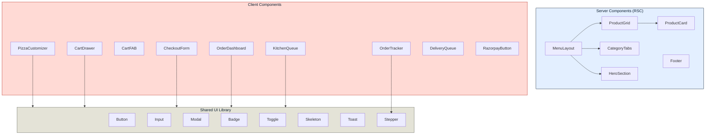

### Design System Integration

The Stitch design system ("Premium Artisanal Pizza System") maps to Tailwind CSS configuration:

```
tailwind.config.ts
├── colors          → Mapped from Stitch namedColors
├── fontFamily      → Plus Jakarta Sans (headlines), Manrope (body/labels)
├── borderRadius    → sm(4px), DEFAULT(8px), md(12px), lg(16px), xl(24px), full
├── spacing         → 8px base unit scale
├── screens         → mobile(<768px), tablet(768-1279px), desktop(≥1280px)
└── extend
    ├── backdropBlur  → glass-sm(10px), glass-md(15px), glass-lg(24px)
    ├── boxShadow     → glass(custom glassmorphic shadows)
    └── animation     → bounce-subtle, fade-in, slide-up, pulse-slow
```

#### Glassmorphism Utility Classes

Per the Stitch design system, glassmorphism is a core visual pattern. We define reusable Tailwind utilities:

| Utility Class | CSS Properties | Usage |
|---|---|---|
| `.glass` | `backdrop-blur-[15px] bg-white/60 border border-white/30` | Standard glass overlay |
| `.glass-dark` | `backdrop-blur-[15px] bg-black/40 border border-white/10` | Dark glass overlay |
| `.glass-card` | `glass + shadow-[0_4px_20px_rgba(0,0,0,0.04)] rounded-xl` | Product cards |
| `.glass-panel` | `glass + rounded-2xl p-6` | Customizer panel, cart drawer |

---

## 3. Backend Architecture

### Supabase as Backend-as-a-Service

Supabase provides five core services, each serving a distinct architectural role:

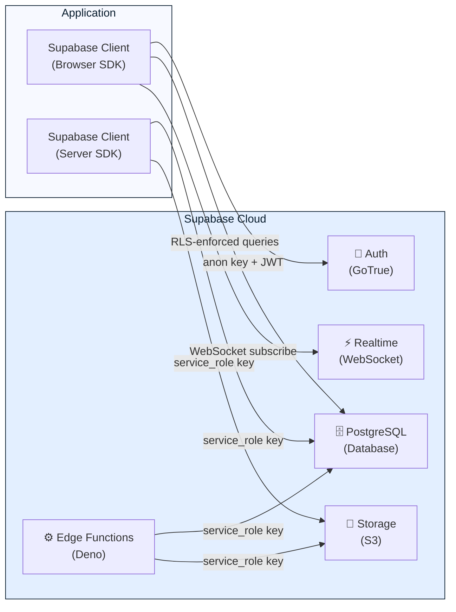

### Client Instantiation Strategy

We maintain **two Supabase client instances** with different permission levels:

| Client | Created In | Key Used | Purpose |
|---|---|---|---|
| **Browser Client** | `lib/supabase/client.ts` | `NEXT_PUBLIC_SUPABASE_ANON_KEY` | Client-side queries, auth, realtime subscriptions. All queries enforced by RLS. |
| **Server Client** | `lib/supabase/server.ts` | `SUPABASE_SERVICE_ROLE_KEY` | Server Actions, API Routes, ISR data fetching. Bypasses RLS for admin operations. |

> [!CAUTION]
> The `service_role` key **must never** be exposed to the client. It is used exclusively in:
> - Next.js Server Actions (`"use server"`)
> - API Route Handlers (`app/api/*/route.ts`)
> - Supabase Edge Functions
> - ISR data fetching in Server Components

### Server Actions Architecture

Next.js Server Actions serve as the **primary mutation layer** — replacing traditional REST API endpoints for most operations.

| Domain | Server Action | Description |
|---|---|---|
| **Orders** | `createOrder()` | Validates cart, creates order record, initiates payment |
| **Orders** | `updateOrderStatus()` | Kitchen/admin status transitions with validation |
| **Orders** | `cancelOrder()` | Customer/admin cancellation with refund logic |
| **Menu** | `createProduct()` | Admin product creation with image upload |
| **Menu** | `updateProduct()` | Admin product updates |
| **Menu** | `toggleAvailability()` | Instant item/category availability toggle |
| **Settings** | `updateStoreSettings()` | Business settings mutations |
| **Settings** | `updateStoreHours()` | Operating hours management |

#### Server Action Design Pattern

```
Server Action invoked
  ├── 1. Authentication check (session validation)
  ├── 2. Authorization check (role verification)
  ├── 3. Input validation (Zod schema)
  ├── 4. Business logic execution
  ├── 5. Database mutation (Supabase server client)
  ├── 6. Side effects (notifications, cache revalidation)
  └── 7. Return typed response
```

### API Route Handlers

API Routes are reserved for **webhook receivers** and **third-party integration endpoints** that cannot use Server Actions:

| Route | Method | Purpose |
|---|---|---|
| `/api/razorpay/create-order` | POST | Creates a Razorpay order with amount and metadata |
| `/api/razorpay/webhook` | POST | Receives Razorpay payment events (signature-verified) |
| `/api/revalidate` | POST | On-demand ISR revalidation (triggered by menu changes) |

### Edge Functions (Supabase)

Supabase Edge Functions handle **asynchronous, decoupled operations** that should not block the main request cycle:

| Function | Trigger | Responsibility |
|---|---|---|
| `handle-payment-webhook` | Razorpay webhook → API Route → Edge Function | Process payment confirmation, update order status, trigger notifications |
| `send-whatsapp-notification` | Database trigger on `order_status_log` insert | Dispatch WhatsApp template message via Meta Cloud API |
| `process-refund` | Admin order rejection | Initiate Razorpay refund, update payment status |
| `cleanup-abandoned-carts` | Cron (daily) | Remove cart data older than 24 hours |

### Data Access Patterns

| Pattern | Use Case | Implementation |
|---|---|---|
| **Direct Query** | Menu browsing, product details | Supabase `.select()` with `.eq()` filters in Server Components |
| **RPC (Stored Procedure)** | Complex order creation with multi-table writes | Supabase `.rpc('create_order', {...})` for transactional operations |
| **Realtime Subscription** | Order tracking, kitchen queue, admin dashboard | `supabase.channel('orders').on('postgres_changes', ...)` |
| **Server Action** | All write operations from UI | `"use server"` functions with `revalidatePath()` |
| **Edge Function** | Webhook processing, notification dispatch | HTTP-triggered Deno functions |

---

## 4. Authentication Strategy

### Multi-Strategy Authentication

Pizza Planet requires three distinct authentication strategies to serve its user personas:

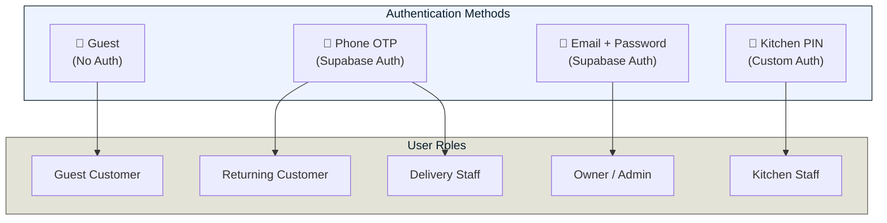

### Authentication Flow Details

#### Guest Customers (MVP)

- **No authentication required** for menu browsing, pizza customization, or adding to cart
- At checkout, guest provides **phone number** (mandatory) and **name** (mandatory)
- Phone number is collected for WhatsApp notifications and order association—it is NOT used for authentication in MVP
- Cart state persists via `localStorage` keyed to a generated `session_id`
- Orders are linked to phone number, enabling future account upgrade in Phase 2

#### Returning Customers (Phase 2)

- Phone OTP authentication via **Supabase Auth** (`supabase.auth.signInWithOtp({ phone })`)
- OTP delivered via SMS (Supabase built-in provider)
- On successful auth, Supabase creates a user record with `phone` as the identifier
- User role `customer` assigned via `user_metadata` or `profiles` table
- Session persists via Supabase session management (httpOnly cookie via Next.js middleware)

#### Owner / Admin

- Email + Password authentication via **Supabase Auth** (`supabase.auth.signInWithPassword()`)
- Account pre-created during system setup (no self-registration)
- Role `owner` stored in `profiles.role` column
- Session validated in Next.js middleware on every `(admin)` route group request
- Forced 2FA via TOTP in Phase 2

#### Kitchen Staff

- Simplified **PIN-based authentication** (4–6 digit numeric PIN)
- PIN is validated against a hashed value stored in the `kitchen_staff` table
- On successful PIN entry, a **custom JWT is issued** via a Supabase Edge Function with role `kitchen` in the claims
- The JWT is stored in an httpOnly cookie and validated by Next.js middleware
- No persistent user identity—PIN authenticates the shared kitchen device, not an individual
- Multiple PINs can be active simultaneously (one per shift/station)

#### Delivery Staff

- Phone OTP authentication (same as customers) via **Supabase Auth**
- Role `delivery` assigned by owner in admin panel
- Delivery-specific RLS policies scope data to assigned orders only

### Session Management

| Aspect | Implementation |
|---|---|
| **Token Type** | JWT (Supabase-issued) |
| **Storage** | httpOnly, Secure, SameSite=Lax cookie (set via Next.js middleware) |
| **Expiry** | Access token: 1 hour, Refresh token: 30 days |
| **Refresh** | Automatic via Supabase client SDK; Next.js middleware refreshes on each request |
| **Revocation** | Admin can revoke sessions via Supabase dashboard; Kitchen PINs can be deactivated |
| **Multi-device** | Supported — user can be logged in on multiple devices |

### Middleware Authentication Flow

```
Incoming Request
  │
  ├── Is route in (storefront)? → Allow (no auth required)
  │
  ├── Is route in (admin)?
  │   ├── Has valid session cookie? → Check role === 'owner'
  │   │   ├── Yes → Allow
  │   │   └── No → Redirect /auth/login
  │   └── No cookie → Redirect /auth/login
  │
  ├── Is route in (kitchen)?
  │   ├── Has valid kitchen JWT cookie? → Check role === 'kitchen'
  │   │   ├── Yes → Allow
  │   │   └── No → Redirect /auth/kitchen
  │   └── No cookie → Redirect /auth/kitchen
  │
  └── Is route in (delivery)?
      ├── Has valid session cookie? → Check role === 'delivery'
      │   ├── Yes → Allow
      │   └── No → Redirect /auth/login
      └── No cookie → Redirect /auth/login
```

---

## 5. State Management Strategy

### Architecture Decision: Zustand + Server State Separation

We separate state into two categories with distinct management strategies:

| State Category | Management | Examples |
|---|---|---|
| **Server State** | Supabase queries via React Server Components + Supabase Realtime | Menu data, orders, product details, user profile |
| **Client State** | Zustand stores | Cart, UI state, customizer selections, form drafts |

> [!NOTE]
> We intentionally avoid React Query / TanStack Query. Server state is primarily fetched via RSC (no client-side fetching for read-heavy pages). For realtime data (orders, tracking), Supabase Realtime subscriptions push updates directly into Zustand stores.

### Zustand Store Architecture

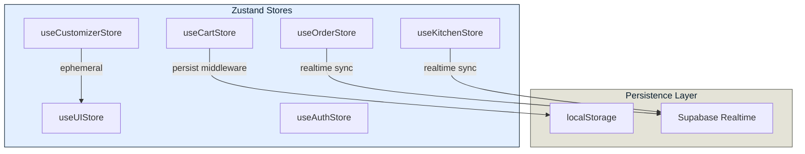

### Store Definitions

#### `useCartStore`

```
State:
  items: CartItem[]           // Products with customizations and quantities
  sessionId: string           // Anonymous session identifier
  appliedPromoCode: string | null
  deliveryFee: number
  taxRate: number

Actions:
  addItem(item)               // Add product to cart (merge if duplicate)
  removeItem(itemId)          // Remove item by ID
  updateQuantity(itemId, qty) // Update quantity
  clearCart()                 // Empty cart
  applyPromoCode(code)        // Validate and apply promo
  getSubtotal()               // Computed: sum of item totals
  getTotal()                  // Computed: subtotal + delivery + tax - discount

Persistence:
  localStorage (via Zustand persist middleware)
  Key: 'pizza-planet-cart'
  Expiry: 24 hours (checked on hydration)
```

#### `useCustomizerStore`

```
State:
  baseProduct: Product | null  // The pizza being customized
  selectedSize: Size
  selectedCrust: Crust
  selectedSauce: Sauce
  selectedToppings: Topping[]
  extraToppings: Topping[]     // Double-portion toppings
  quantity: number
  specialInstructions: string

Actions:
  initCustomizer(product)      // Load defaults for a product
  setSize(size)
  setCrust(crust)
  setSauce(sauce)
  toggleTopping(topping)
  toggleExtraTopping(topping)
  setQuantity(qty)
  setInstructions(text)
  getUnitPrice()               // Computed: base + size + crust + toppings
  getTotalPrice()              // Computed: unitPrice * quantity
  reset()                      // Clear all selections

Persistence:
  None (ephemeral — destroyed on navigation away)
```

#### `useUIStore`

```
State:
  isCartOpen: boolean
  isMobileMenuOpen: boolean
  activeCategory: string | null
  toasts: Toast[]

Actions:
  toggleCart()
  toggleMobileMenu()
  setActiveCategory(category)
  addToast(toast)
  removeToast(id)

Persistence:
  None (ephemeral)
```

#### `useOrderStore`

```
State:
  activeOrder: Order | null    // Currently tracked order
  orderStatus: OrderStatus     // Latest status from realtime
  statusHistory: StatusLog[]   // Full status timeline
  estimatedDelivery: Date | null

Actions:
  setActiveOrder(order)
  updateStatus(status)         // Called by realtime subscription handler
  clearActiveOrder()

Persistence:
  None (hydrated from Supabase Realtime on mount)
```

#### `useKitchenStore`

```
State:
  orderQueue: KitchenOrder[]   // Orders in kitchen pipeline
  filterStatus: OrderStatus    // Current filter (all / preparing / ready)

Actions:
  setQueue(orders)             // Bulk replace on initial load
  addOrder(order)              // Realtime: new order arrives
  updateOrder(orderId, data)   // Realtime: order updated
  removeOrder(orderId)         // Realtime: order leaves kitchen scope

Persistence:
  None (fully realtime-driven, no local persistence)
```

#### `useAuthStore`

```
State:
  user: User | null
  role: UserRole | null
  isLoading: boolean

Actions:
  setUser(user, role)
  clearUser()
  setLoading(bool)

Persistence:
  None (derived from Supabase Auth session on mount)
```

### State Flow Pattern

```
User Interaction
  │
  ├── Read-only (menu, product details)?
  │   └── React Server Component fetches from Supabase
  │       └── Rendered on server, streamed to client
  │
  ├── Interactive (cart, customizer, UI)?
  │   └── Zustand store mutation
  │       └── React re-renders affected components
  │
  ├── Write operation (place order, update status)?
  │   └── Server Action invoked
  │       ├── Mutates Supabase database
  │       ├── Triggers realtime broadcast
  │       └── Calls revalidatePath() for ISR
  │
  └── Realtime update (order status, new kitchen order)?
      └── Supabase Realtime subscription fires
          └── Zustand store updated
              └── React re-renders affected components
```

---

## 6. Realtime Architecture

### Supabase Realtime Channels

Pizza Planet uses Supabase Realtime's **Postgres Changes** feature to broadcast database mutations as WebSocket events.

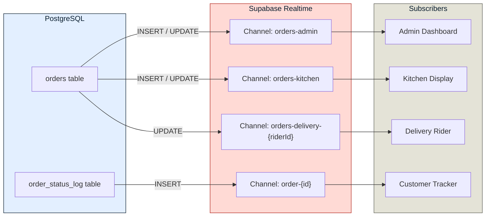

### Channel Specifications

| Channel | Filter | Events | Subscriber | RLS-Enforced |
|---|---|---|---|---|
| `orders-admin` | `schema=public, table=orders` | INSERT, UPDATE | Admin dashboard | Yes (owner role) |
| `orders-kitchen` | `schema=public, table=orders, filter=status=in.(confirmed,preparing,ready)` | INSERT, UPDATE | Kitchen display | Yes (kitchen role) |
| `order-{orderId}` | `schema=public, table=order_status_log, filter=order_id=eq.{orderId}` | INSERT | Customer tracking page | Yes (order owner or public via token) |
| `orders-delivery-{riderId}` | `schema=public, table=orders, filter=delivery_rider_id=eq.{riderId}` | INSERT, UPDATE | Delivery rider app | Yes (delivery role) |

### Realtime Connection Lifecycle

```
Component Mount
  │
  ├── 1. Create Supabase channel with filter
  ├── 2. Subscribe to 'postgres_changes' event
  ├── 3. On event received:
  │   ├── Validate event payload
  │   ├── Update Zustand store
  │   └── Trigger UI update (React re-render)
  │
  └── Component Unmount
      └── Unsubscribe and remove channel
```

### Realtime Fallback Strategy

| Scenario | Fallback |
|---|---|
| **WebSocket disconnect** | Supabase SDK auto-reconnects with exponential backoff |
| **Prolonged disconnect (>30s)** | Client triggers a full data refetch on reconnection |
| **Browser tab inactive** | `visibilitychange` event listener triggers refetch on tab focus |
| **Realtime quota exceeded** | Admin dashboard falls back to 10-second polling interval |

---

## 7. Payment Architecture

### Razorpay Integration Model

We use Razorpay's **Standard Checkout** (web) integration with server-side order creation and webhook-based confirmation.

> [!IMPORTANT]
> The payment flow is **server-authoritative**. The client never determines payment success. Only the webhook confirmation (with signature verification) marks an order as "paid."

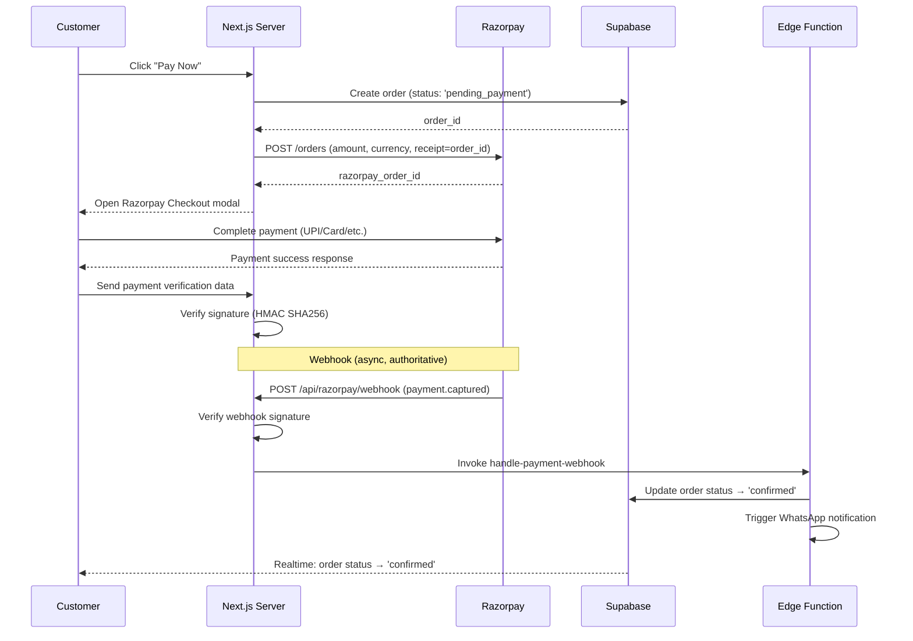

### Payment Flow Components

| Component | Responsibility | Location |
|---|---|---|
| **Order Creation** | Create Razorpay order with amount from server-calculated cart total | Server Action / API Route |
| **Checkout Modal** | Razorpay Standard Checkout SDK renders payment UI | Client Component (`RazorpayButton`) |
| **Client Verification** | HMAC SHA256 verification of `razorpay_payment_id + razorpay_order_id + razorpay_signature` | Server Action |
| **Webhook Handler** | Authoritative payment confirmation with idempotency | API Route → Edge Function |
| **Refund Processing** | Initiated via Razorpay API on order rejection | Edge Function |

### Payment State Machine

```
pending_payment → payment_captured → confirmed
pending_payment → payment_failed → (retry or cancel)
confirmed → rejected_by_owner → refund_initiated → refund_processed
```

### Cash on Delivery (COD) Flow

COD orders bypass Razorpay entirely:

```
Customer selects COD
  → Server Action creates order with payment_method='cod', payment_status='pending'
  → Order enters kitchen queue immediately
  → Delivery rider sees "Collect ₹XXX" indicator
  → Rider confirms cash collection → payment_status='collected'
```

| COD Constraint | Value |
|---|---|
| Maximum order value | ₹500 (configurable) |
| Requires phone verification | Yes |
| COD surcharge | None (MVP), configurable (Phase 2) |

---

## 8. WhatsApp Notification Architecture

### Integration Model

WhatsApp notifications are sent via the **Meta WhatsApp Cloud API** through Supabase Edge Functions, triggered by database events.

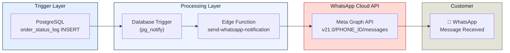

### Notification Trigger Map

| Event | Template Name | Variables | Trigger |
|---|---|---|---|
| Order Confirmed | `order_confirmed` | `{{order_id}}`, `{{items_summary}}`, `{{total}}`, `{{eta}}` | Status → `confirmed` |
| Preparing | `order_preparing` | `{{order_id}}`, `{{eta}}` | Status → `preparing` |
| Out for Delivery | `order_out_for_delivery` | `{{order_id}}`, `{{rider_name}}`, `{{eta}}` | Status → `out_for_delivery` |
| Delivered | `order_delivered` | `{{order_id}}`, `{{feedback_link}}` | Status → `delivered` |
| Order Rejected | `order_rejected` | `{{order_id}}`, `{{reason}}`, `{{refund_status}}` | Status → `rejected` |
| New Order (to Owner) | `new_order_alert` | `{{order_id}}`, `{{customer_name}}`, `{{total}}` | New order created |

### Message Dispatch Architecture

```
Database Trigger (on order_status_log INSERT)
  │
  ├── 1. pg_notify('order_status_changed', payload)
  │
  ├── 2. Supabase Edge Function receives notification
  │   ├── Fetch full order details (customer phone, items, status)
  │   ├── Determine template based on new status
  │   ├── Construct Meta API request body
  │   │   ├── messaging_product: "whatsapp"
  │   │   ├── to: customer_phone (E.164 format)
  │   │   ├── type: "template"
  │   │   └── template: { name, language, components[] }
  │   ├── POST to graph.facebook.com/v21.0/{phone_number_id}/messages
  │   ├── Log response (message_id, status) to notification_log table
  │   └── Handle errors (retry with exponential backoff, max 3 attempts)
  │
  └── 3. On failure after retries:
      └── Log to error_log table for manual review
```

### WhatsApp API Configuration

| Configuration | Value |
|---|---|
| **API Version** | v21.0 |
| **Auth** | Bearer token (permanent system user access token) |
| **Phone Number ID** | Stored in environment variable `WHATSAPP_PHONE_NUMBER_ID` |
| **Business Account ID** | Stored in environment variable `WHATSAPP_BUSINESS_ACCOUNT_ID` |
| **Template Language** | `en` (English) |
| **Rate Limit** | 80 messages/second (Business tier) |
| **Retry Strategy** | 3 retries with exponential backoff (1s, 4s, 16s) |

---

## 9. File Storage Architecture

### Supabase Storage Buckets

| Bucket | Access | Purpose | File Types | Max Size |
|---|---|---|---|---|
| `product-images` | Public (read) | Menu item photos | JPEG, PNG, WebP | 5 MB |
| `brand-assets` | Public (read) | Logo, favicon, OG images | SVG, PNG, WebP | 2 MB |
| `order-receipts` | Private | Generated order receipts (Phase 2) | PDF | 1 MB |

### Image Processing Pipeline

```
Admin uploads image (via product editor)
  │
  ├── 1. Client-side: Validate type (JPEG/PNG/WebP) and size (≤ 5MB)
  ├── 2. Upload to Supabase Storage (`product-images/{productId}/{uuid}.{ext}`)
  ├── 3. Supabase returns public URL
  ├── 4. Store URL in products table
  │
  └── 5. Frontend consumption:
      └── Next.js <Image> component with:
          ├── src={supabase_public_url}
          ├── Automatic WebP conversion (via Supabase image transforms)
          ├── Responsive srcset (400w, 800w, 1200w)
          ├── Lazy loading (below fold)
          └── Blur placeholder (base64 generated at build)
```

### Image Transformation

Supabase Storage supports on-the-fly image transforms via URL parameters:

| Usage | Transform URL Pattern | Dimensions |
|---|---|---|
| **Product Card Thumbnail** | `?width=400&height=400&resize=cover` | 400×400 |
| **Product Detail** | `?width=800&height=600&resize=contain` | 800×600 |
| **Hero Banner** | `?width=1920&height=800&resize=cover` | 1920×800 |
| **Admin Thumbnail** | `?width=100&height=100&resize=cover` | 100×100 |
| **OG Image** | `?width=1200&height=630&resize=cover` | 1200×630 |

### Storage Access Policies

| Bucket | SELECT (Read) | INSERT (Write) | UPDATE | DELETE |
|---|---|---|---|---|
| `product-images` | Public (`anon`) | Owner only | Owner only | Owner only |
| `brand-assets` | Public (`anon`) | Owner only | Owner only | Owner only |
| `order-receipts` | Order owner or admin | System only (Edge Function) | None | Admin only |

---

## 10. Deployment Architecture

### Infrastructure Overview

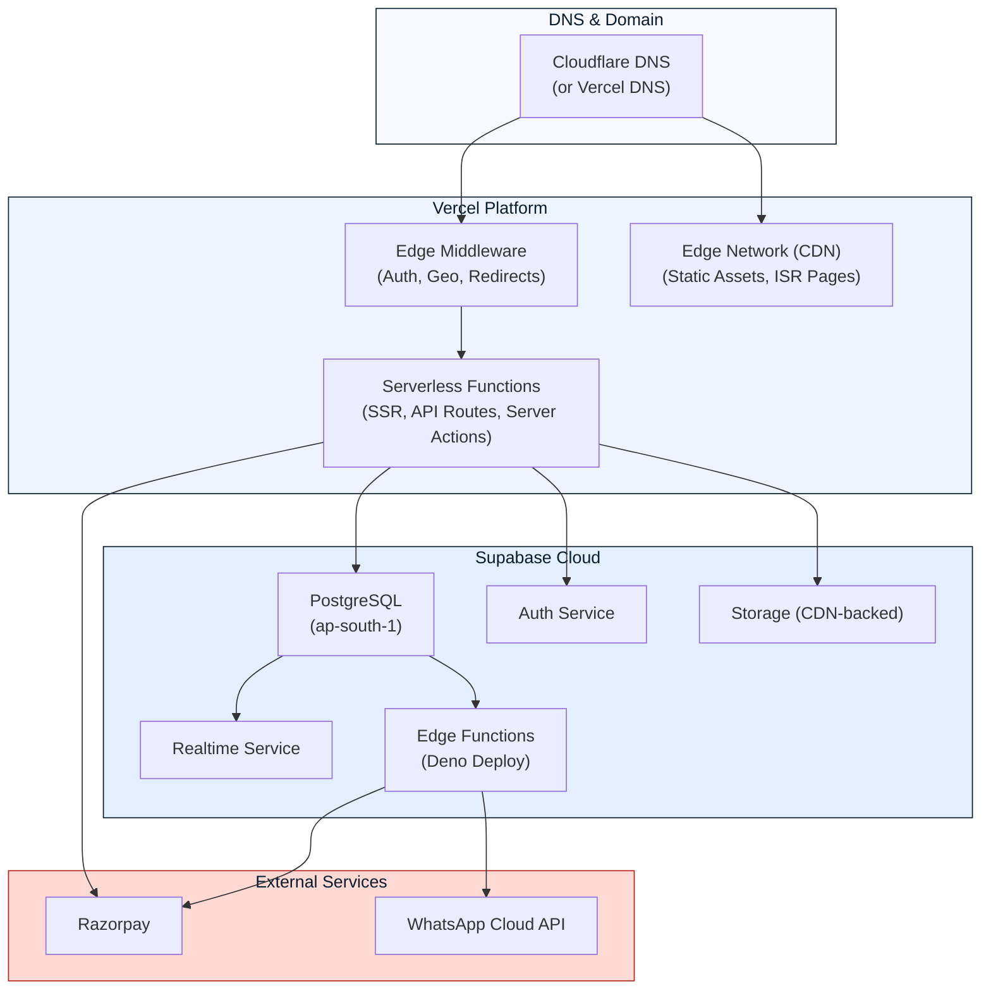

### Environment Strategy

| Environment | URL | Vercel Branch | Supabase Project | Purpose |
|---|---|---|---|---|
| **Production** | `pizzaplanet.in` | `main` | `pizza-planet-prod` | Live customer traffic |
| **Staging** | `staging.pizzaplanet.in` | `staging` | `pizza-planet-staging` | Pre-release testing, owner preview |
| **Development** | `localhost:3000` | Local | `pizza-planet-dev` | Developer workstations |
| **Preview** | `*.vercel.app` | PR branches | `pizza-planet-staging` | Automatic PR preview deployments |

### Environment Variables

| Variable | Scope | Description |
|---|---|---|
| `NEXT_PUBLIC_SUPABASE_URL` | Client + Server | Supabase project URL |
| `NEXT_PUBLIC_SUPABASE_ANON_KEY` | Client + Server | Supabase anonymous (public) key |
| `SUPABASE_SERVICE_ROLE_KEY` | Server only | Supabase admin key (bypasses RLS) |
| `RAZORPAY_KEY_ID` | Client + Server | Razorpay public key |
| `RAZORPAY_KEY_SECRET` | Server only | Razorpay secret key |
| `RAZORPAY_WEBHOOK_SECRET` | Server only | Razorpay webhook signature verification |
| `WHATSAPP_ACCESS_TOKEN` | Server only | Meta permanent system user token |
| `WHATSAPP_PHONE_NUMBER_ID` | Server only | WhatsApp Business phone number ID |
| `WHATSAPP_BUSINESS_ACCOUNT_ID` | Server only | WhatsApp Business account ID |
| `NEXT_PUBLIC_GOOGLE_MAPS_KEY` | Client | Google Maps JavaScript API key |
| `REVALIDATION_SECRET` | Server only | Secret for on-demand ISR revalidation |

### CI/CD Pipeline

```
Developer pushes to branch
  │
  ├── GitHub Actions / Vercel CI
  │   ├── 1. Lint (ESLint + Prettier)
  │   ├── 2. Type Check (tsc --noEmit)
  │   ├── 3. Unit Tests (Vitest)
  │   ├── 4. Build (next build)
  │   └── 5. Deploy
  │       ├── PR branch → Preview deployment
  │       ├── staging branch → Staging deployment
  │       └── main branch → Production deployment
  │
  └── Supabase CI (separate)
      ├── 1. Migrate database (supabase db push)
      ├── 2. Deploy Edge Functions (supabase functions deploy)
      └── 3. Sync Storage policies
```

### Deployment Checklist

| Step | Tool | Command |
|---|---|---|
| Database migrations | Supabase CLI | `supabase db push` |
| Edge Functions | Supabase CLI | `supabase functions deploy` |
| Storage policies | Supabase CLI | `supabase db push` (policies are SQL) |
| Application | Vercel (auto) | `git push origin main` |
| ISR Purge | Vercel API | On-demand via `/api/revalidate` |

---

## 11. Security Architecture

### Defense-in-Depth Model

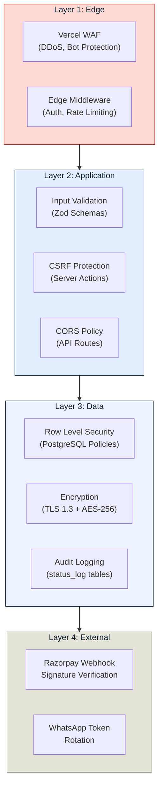

### Row Level Security (RLS) Policies

RLS is the **primary authorization mechanism**. Every table has RLS enabled, and no data is accessible without a matching policy.

| Table | Policy | Roles | Condition |
|---|---|---|---|
| `products` | SELECT | `anon`, `authenticated` | `is_archived = false` |
| `products` | INSERT, UPDATE, DELETE | `owner` | `true` (full access) |
| `categories` | SELECT | `anon`, `authenticated` | `is_archived = false` |
| `orders` | INSERT | `anon`, `authenticated` | `true` (anyone can create) |
| `orders` | SELECT | `authenticated` | `auth.uid() = customer_id OR role = 'owner' OR (role = 'kitchen' AND status IN (...)) OR (role = 'delivery' AND delivery_rider_id = auth.uid())` |
| `orders` | UPDATE | `owner`, `kitchen`, `delivery` | Role-specific status transitions only |
| `order_status_log` | SELECT | `anon`, `authenticated` | `order_id` belongs to user OR public tracking token matches |
| `store_settings` | SELECT | `anon` | `true` (store hours, status are public) |
| `store_settings` | UPDATE | `owner` | `true` |

### Input Validation Architecture

All user inputs are validated at **three layers**:

| Layer | Tool | Purpose |
|---|---|---|
| **Client** | Zod + React Hook Form | Instant UX feedback, prevent unnecessary server round-trips |
| **Server Action** | Zod (same schemas, shared via `lib/validations/`) | Authoritative validation — never trust client |
| **Database** | PostgreSQL constraints + CHECK | Last line of defense (e.g., `price > 0`, `phone ~ '^\+91[0-9]{10}$'`) |

### Rate Limiting

| Endpoint | Rate Limit | Window | Implementation |
|---|---|---|---|
| `/auth/verify` (OTP) | 5 requests | 1 minute | Edge Middleware + Vercel KV |
| `/api/razorpay/create-order` | 3 requests | 1 minute | Edge Middleware |
| Server Action: `createOrder` | 5 requests | 1 minute | In-function check |
| Server Action: `updateOrderStatus` | 30 requests | 1 minute | In-function check |
| `/api/razorpay/webhook` | No limit | — | Signature verification is the control |

### Secret Management

| Secret | Storage | Rotation |
|---|---|---|
| Supabase Service Role Key | Vercel env vars (encrypted) | On compromise only |
| Razorpay Key Secret | Vercel env vars (encrypted) | Annually or on compromise |
| Razorpay Webhook Secret | Vercel env vars (encrypted) | On Razorpay regeneration |
| WhatsApp Access Token | Vercel env vars (encrypted) | System user token — non-expiring, rotate annually |
| Kitchen PINs | Supabase DB (bcrypt hashed) | Monthly by owner |
| ISR Revalidation Secret | Vercel env vars | On compromise only |

### Content Security Policy (CSP)

The application enforces a strict CSP header via `next.config.ts` to mitigate XSS, clickjacking, and data injection attacks:

```
Content-Security-Policy:
  default-src 'self';
  script-src 'self' 'unsafe-inline' 'unsafe-eval' https://checkout.razorpay.com;
  style-src 'self' 'unsafe-inline' https://fonts.googleapis.com;
  font-src 'self' https://fonts.gstatic.com;
  img-src 'self' data: blob: https://*.supabase.co https://*.googleusercontent.com;
  connect-src 'self' https://*.supabase.co wss://*.supabase.co https://api.razorpay.com
              https://graph.facebook.com https://lumberjack.razorpay.com;
  frame-src https://api.razorpay.com https://checkout.razorpay.com;
  frame-ancestors 'none';
  base-uri 'self';
  form-action 'self';
```

> [!NOTE]
> `unsafe-inline` for scripts is required by the Razorpay Checkout SDK. `unsafe-eval` is required in development only and is stripped in production builds via environment-conditional config.

Additional security headers set via `next.config.ts`:

| Header | Value | Purpose |
|---|---|---|
| `X-Frame-Options` | `DENY` | Prevent clickjacking |
| `X-Content-Type-Options` | `nosniff` | Prevent MIME-type sniffing |
| `Referrer-Policy` | `strict-origin-when-cross-origin` | Control referrer leakage |
| `Permissions-Policy` | `camera=(), microphone=(), geolocation=(self)` | Disable unnecessary browser APIs |
| `Strict-Transport-Security` | `max-age=31536000; includeSubDomains` | Force HTTPS |

### Audit Logging Architecture

All security-relevant and business-critical actions are logged to immutable audit tables for compliance and debugging:

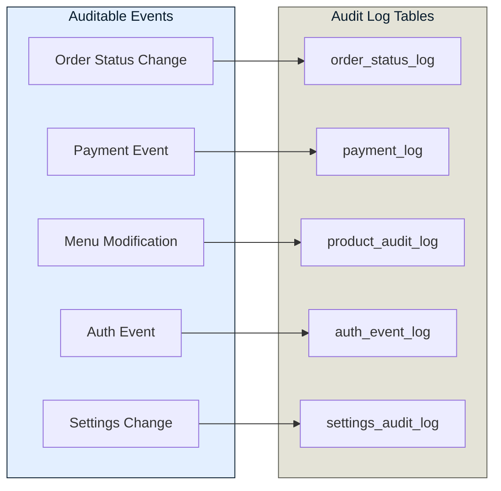

| Audit Table | Captured Fields | Retention |
|---|---|---|
| `order_status_log` | `order_id`, `old_status`, `new_status`, `changed_by`, `role`, `timestamp`, `ip_address` | 1 year |
| `payment_log` | `order_id`, `razorpay_payment_id`, `event`, `amount`, `status`, `timestamp` | 3 years (tax compliance) |
| `product_audit_log` | `product_id`, `action` (create/update/delete), `changed_fields` (JSONB diff), `changed_by`, `timestamp` | 6 months |
| `auth_event_log` | `event` (login/logout/failed_attempt), `user_id`, `role`, `ip_address`, `user_agent`, `timestamp` | 90 days |
| `settings_audit_log` | `setting_key`, `old_value`, `new_value`, `changed_by`, `timestamp` | 1 year |

> [!IMPORTANT]
> All audit tables have RLS policies that allow INSERT from any authenticated role but allow SELECT only for the `owner` role. No UPDATE or DELETE is permitted on audit tables — they are append-only.

### Security Incident Response Workflow

```
Incident Detected (Sentry alert / manual discovery)
  │
  ├── 1. TRIAGE (< 15 min)
  │   ├── Severity classification (P0-Critical / P1-High / P2-Medium / P3-Low)
  │   ├── P0: Payment breach, data leak, full system compromise
  │   ├── P1: Auth bypass, RLS policy failure, API key exposure
  │   ├── P2: Rate limit bypass, minor data exposure
  │   └── P3: Failed attack attempt, suspicious activity
  │
  ├── 2. CONTAIN (P0: < 30 min, P1: < 2 hrs)
  │   ├── Rotate compromised secrets immediately
  │   ├── Revoke affected sessions (Supabase Auth admin)
  │   ├── If payment-related: Contact Razorpay security team
  │   ├── If data breach: Document affected records
  │   └── Enable maintenance mode if required
  │
  ├── 3. REMEDIATE
  │   ├── Patch the vulnerability
  │   ├── Deploy fix (hotfix branch → direct to production)
  │   ├── Verify fix with targeted testing
  │   └── Restore service
  │
  ├── 4. COMMUNICATE
  │   ├── P0/P1: Notify affected users within 72 hours
  │   ├── Internal incident report
  │   └── Update security documentation
  │
  └── 5. POST-MORTEM
      ├── Root cause analysis
      ├── Timeline of events
      ├── Preventive measures
      └── Update monitoring / alerting rules
```

---

## 12. Folder Structure

### Complete Project Structure

```
pizza-planet/
├── .env.local                          # Local environment variables (git-ignored)
├── .env.example                        # Template for environment variables
├── .eslintrc.json                      # ESLint configuration
├── .prettierrc                         # Prettier configuration
├── next.config.ts                      # Next.js configuration
├── tailwind.config.ts                  # Tailwind CSS configuration (design system tokens)
├── tsconfig.json                       # TypeScript configuration
├── package.json
├── middleware.ts                        # Next.js Edge Middleware (auth, rate limiting)
│
├── docs/                               # Project documentation
│   ├── PRD.md                          # Product Requirements Document
│   ├── SystemArchitecture.md           # This document
│   └── ...                             # Future: API specs, DB schema, etc.
│
├── public/                             # Static assets served from CDN
│   ├── fonts/                          # Self-hosted fonts (Plus Jakarta Sans, Manrope)
│   │   ├── plus-jakarta-sans/
│   │   └── manrope/
│   ├── icons/                          # Favicon, PWA icons
│   ├── images/                         # Static images (hero backgrounds, placeholders)
│   └── manifest.json                   # PWA manifest (Phase 2)
│
├── src/
│   ├── app/                            # Next.js App Router
│   │   ├── layout.tsx                  # Root layout (fonts, global providers)
│   │   ├── not-found.tsx               # Custom 404 page
│   │   ├── error.tsx                   # Global error boundary
│   │   ├── loading.tsx                 # Global loading state
│   │   │
│   │   ├── (storefront)/              # Customer-facing route group
│   │   │   ├── layout.tsx             # Storefront layout (header, cart FAB, footer)
│   │   │   ├── page.tsx               # Homepage
│   │   │   ├── menu/
│   │   │   │   ├── page.tsx           # Full menu
│   │   │   │   └── [category]/
│   │   │   │       └── page.tsx       # Filtered menu by category
│   │   │   ├── customize/
│   │   │   │   └── [productId]/
│   │   │   │       └── page.tsx       # Pizza customizer
│   │   │   ├── cart/
│   │   │   │   └── page.tsx           # Cart page (mobile full-page view)
│   │   │   ├── checkout/
│   │   │   │   └── page.tsx           # Checkout flow
│   │   │   └── track/
│   │   │       └── [orderId]/
│   │   │           └── page.tsx       # Order tracking
│   │   │
│   │   ├── (admin)/                   # Owner dashboard route group
│   │   │   ├── layout.tsx             # Admin layout (sidebar, topbar)
│   │   │   ├── dashboard/
│   │   │   │   └── page.tsx           # Order dashboard
│   │   │   ├── orders/
│   │   │   │   └── page.tsx           # Order management (Kanban)
│   │   │   ├── menu/
│   │   │   │   ├── page.tsx           # Product list + CRUD
│   │   │   │   └── [productId]/
│   │   │   │       └── page.tsx       # Product editor
│   │   │   ├── settings/
│   │   │   │   └── page.tsx           # Business settings
│   │   │   └── analytics/
│   │   │       └── page.tsx           # Analytics (Phase 2)
│   │   │
│   │   ├── (kitchen)/                 # Kitchen Display System
│   │   │   ├── layout.tsx             # Fullscreen KDS layout
│   │   │   └── page.tsx               # Kitchen order queue
│   │   │
│   │   ├── (delivery)/               # Delivery rider view
│   │   │   ├── layout.tsx             # Minimal mobile layout
│   │   │   └── page.tsx               # Delivery queue
│   │   │
│   │   ├── auth/                      # Auth pages (no route group — standalone layout)
│   │   │   ├── login/
│   │   │   │   └── page.tsx           # Admin login
│   │   │   ├── kitchen/
│   │   │   │   └── page.tsx           # Kitchen PIN entry
│   │   │   └── verify/
│   │   │       └── page.tsx           # OTP verification
│   │   │
│   │   └── api/                       # API Route Handlers
│   │       ├── razorpay/
│   │       │   ├── create-order/
│   │       │   │   └── route.ts
│   │       │   └── webhook/
│   │       │       └── route.ts
│   │       ├── inngest/
│   │       │   └── route.ts           # Inngest serve endpoint
│   │       └── revalidate/
│   │           └── route.ts
│   │
│   ├── components/                    # React components
│   │   ├── ui/                        # Shared UI primitives (design system)
│   │   │   ├── button.tsx
│   │   │   ├── input.tsx
│   │   │   ├── modal.tsx
│   │   │   ├── badge.tsx
│   │   │   ├── toggle.tsx
│   │   │   ├── skeleton.tsx
│   │   │   ├── toast.tsx
│   │   │   ├── stepper.tsx
│   │   │   ├── card.tsx
│   │   │   ├── chip.tsx
│   │   │   ├── drawer.tsx
│   │   │   └── bottom-sheet.tsx
│   │   │
│   │   ├── storefront/               # Customer-facing components
│   │   │   ├── hero-section.tsx
│   │   │   ├── category-tabs.tsx
│   │   │   ├── product-card.tsx
│   │   │   ├── product-grid.tsx
│   │   │   ├── pizza-customizer.tsx
│   │   │   ├── topping-selector.tsx
│   │   │   ├── size-selector.tsx
│   │   │   ├── cart-drawer.tsx
│   │   │   ├── cart-fab.tsx
│   │   │   ├── cart-item.tsx
│   │   │   ├── checkout-form.tsx
│   │   │   ├── address-form.tsx
│   │   │   ├── razorpay-button.tsx
│   │   │   ├── order-tracker.tsx
│   │   │   ├── order-timeline.tsx
│   │   │   └── diet-filter.tsx
│   │   │
│   │   ├── admin/                     # Admin dashboard components
│   │   │   ├── sidebar.tsx
│   │   │   ├── order-feed.tsx
│   │   │   ├── order-card.tsx
│   │   │   ├── order-kanban.tsx
│   │   │   ├── product-form.tsx
│   │   │   ├── product-table.tsx
│   │   │   ├── availability-toggle.tsx
│   │   │   ├── store-status-toggle.tsx
│   │   │   ├── settings-form.tsx
│   │   │   └── revenue-summary.tsx
│   │   │
│   │   ├── kitchen/                   # Kitchen Display components
│   │   │   ├── kitchen-queue.tsx
│   │   │   ├── kitchen-order-card.tsx
│   │   │   └── order-timer.tsx
│   │   │
│   │   ├── delivery/                  # Delivery rider components
│   │   │   ├── delivery-queue.tsx
│   │   │   ├── delivery-card.tsx
│   │   │   └── delivery-status-buttons.tsx
│   │   │
│   │   └── layout/                    # Layout components
│   │       ├── storefront-header.tsx
│   │       ├── storefront-footer.tsx
│   │       ├── admin-sidebar.tsx
│   │       ├── admin-topbar.tsx
│   │       └── mobile-nav.tsx
│   │
│   ├── lib/                           # Core utilities and configurations
│   │   ├── supabase/
│   │   │   ├── client.ts              # Browser Supabase client (anon key)
│   │   │   ├── server.ts              # Server Supabase client (service role)
│   │   │   └── middleware.ts          # Supabase auth helpers for Next.js middleware
│   │   │
│   │   ├── razorpay/
│   │   │   ├── client.ts              # Razorpay SDK initialization
│   │   │   └── verify.ts             # Signature verification utilities
│   │   │
│   │   ├── whatsapp/
│   │   │   ├── client.ts              # WhatsApp Cloud API client
│   │   │   └── templates.ts          # Template message constructors
│   │   │
│   │   └── utils/
│   │       ├── formatting.ts          # Currency, date, phone formatting
│   │       ├── pricing.ts             # Price calculation logic (tax, delivery, discounts)
│   │       └── constants.ts           # App-wide constants (order statuses, roles, etc.)
│   │
│   ├── actions/                       # Next.js Server Actions (thin orchestration layer)
│   │   ├── orders.ts                  # createOrder, updateOrderStatus, cancelOrder
│   │   ├── products.ts                # createProduct, updateProduct, toggleAvailability
│   │   ├── categories.ts              # CRUD for categories
│   │   ├── settings.ts                # updateStoreSettings, updateStoreHours
│   │   └── auth.ts                    # verifyKitchenPin, phone OTP helpers
│   │
│   ├── services/                      # Business logic layer (see Section 15)
│   │   ├── order-service.ts           # Order lifecycle, pricing, status transitions
│   │   ├── product-service.ts         # Product CRUD orchestration, image handling
│   │   ├── payment-service.ts         # Razorpay order creation, verification, refunds
│   │   ├── notification-service.ts    # WhatsApp dispatch coordination
│   │   ├── cart-service.ts            # Cart validation, totals calculation
│   │   └── store-service.ts           # Store settings, availability, hours
│   │
│   ├── repositories/                  # Data access layer (see Section 15)
│   │   ├── order-repository.ts        # orders + order_status_log queries
│   │   ├── product-repository.ts      # products + categories queries
│   │   ├── payment-repository.ts      # payment_log queries
│   │   ├── store-repository.ts        # store_settings queries
│   │   └── user-repository.ts         # profiles + kitchen_staff queries
│   │
│   ├── inngest/                       # Background job definitions (see Section 17)
│   │   ├── client.ts                  # Inngest client initialization
│   │   ├── functions/
│   │   │   ├── send-order-notification.ts
│   │   │   ├── process-payment-webhook.ts
│   │   │   ├── process-refund.ts
│   │   │   ├── generate-daily-report.ts
│   │   │   └── cleanup-abandoned-carts.ts
│   │   └── events.ts                  # Type-safe event definitions
│   │
│   ├── stores/                        # Zustand state stores
│   │   ├── cart-store.ts              # useCartStore
│   │   ├── customizer-store.ts        # useCustomizerStore
│   │   ├── ui-store.ts                # useUIStore
│   │   ├── order-store.ts             # useOrderStore
│   │   ├── kitchen-store.ts           # useKitchenStore
│   │   └── auth-store.ts             # useAuthStore
│   │
│   ├── hooks/                         # Custom React hooks
│   │   ├── use-realtime-orders.ts     # Supabase Realtime subscription for orders
│   │   ├── use-realtime-status.ts     # Supabase Realtime for order status tracking
│   │   ├── use-media-query.ts         # Responsive breakpoint detection
│   │   ├── use-debounce.ts            # Debounced input values
│   │   └── use-local-storage.ts       # Type-safe localStorage wrapper
│   │
│   ├── validations/                   # Zod schemas (shared between client + server)
│   │   ├── order.ts                   # Order creation/update schemas
│   │   ├── product.ts                 # Product CRUD schemas
│   │   ├── checkout.ts                # Checkout form validation
│   │   ├── address.ts                 # Address validation
│   │   └── settings.ts               # Settings form schemas
│   │
│   └── types/                         # TypeScript type definitions
│       ├── database.ts                # Supabase generated types (supabase gen types)
│       ├── order.ts                   # Order domain types
│       ├── product.ts                 # Product domain types
│       ├── cart.ts                    # Cart item types
│       ├── auth.ts                    # Auth/role types
│       └── api.ts                     # API response types
│
└── supabase/                          # Supabase project configuration
    ├── config.toml                    # Supabase local config
    ├── seed.sql                       # Seed data (categories, sample products)
    ├── migrations/                    # Database migrations (SQL)
    │   ├── 00001_initial_schema.sql
    │   ├── 00002_rls_policies.sql
    │   ├── 00003_realtime_setup.sql
    │   └── ...
    └── functions/                     # Supabase Edge Functions
        ├── handle-payment-webhook/
        │   └── index.ts
        ├── send-whatsapp-notification/
        │   └── index.ts
        ├── process-refund/
        │   └── index.ts
        └── cleanup-abandoned-carts/
            └── index.ts
```

### File Naming Conventions

| Type | Convention | Example |
|---|---|---|
| **Pages** | `page.tsx` (Next.js convention) | `app/(storefront)/menu/page.tsx` |
| **Layouts** | `layout.tsx` (Next.js convention) | `app/(admin)/layout.tsx` |
| **Components** | `kebab-case.tsx` | `pizza-customizer.tsx` |
| **Stores** | `kebab-case.ts` with `-store` suffix | `cart-store.ts` |
| **Server Actions** | `kebab-case.ts` by domain | `orders.ts` |
| **Hooks** | `use-kebab-case.ts` | `use-realtime-orders.ts` |
| **Validations** | `kebab-case.ts` by domain | `checkout.ts` |
| **Types** | `kebab-case.ts` by domain | `order.ts` |
| **Utilities** | `kebab-case.ts` by concern | `pricing.ts` |
| **Migrations** | `NNNNN_description.sql` | `00001_initial_schema.sql` |

---

## 13. Data Flow Diagrams

### DFD Level 0: System Context

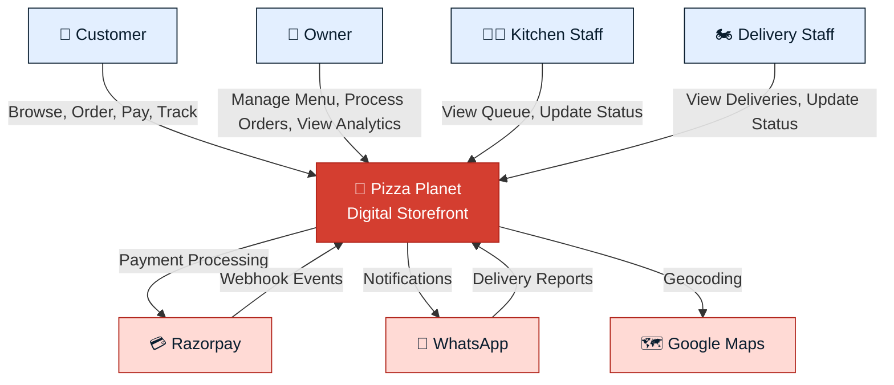

### DFD Level 1: Internal Processes

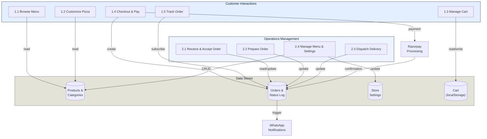

### Data Flow: Order Lifecycle

```mermaid
graph LR
    subgraph Creation["Order Creation"]
        A1["Cart Data<br/>(Zustand)"] --> A2["Validate Cart<br/>(Server Action)"]
        A2 --> A3["Calculate Totals<br/>(Server)"]
        A3 --> A4["Create DB Record<br/>(status: pending_payment)"]
    end

    subgraph Payment["Payment Processing"]
        A4 --> B1["Create Razorpay Order"]
        B1 --> B2["Customer Pays<br/>(Razorpay Checkout)"]
        B2 --> B3["Webhook Confirms<br/>(payment.captured)"]
        B3 --> B4["Update Status<br/>(status: confirmed)"]
    end

    subgraph Fulfillment["Fulfillment"]
        B4 --> C1["Kitchen Queue<br/>(Realtime)"]
        C1 --> C2["Preparing<br/>(Kitchen taps Start)"]
        C2 --> C3["Ready<br/>(Kitchen taps Ready)"]
        C3 --> C4["Assign Rider"]
        C4 --> C5["Out for Delivery"]
        C5 --> C6["Delivered"]
    end

    subgraph Notifications["Notifications (async)"]
        B4 -.->|"WhatsApp"| N1["Order Confirmed"]
        C2 -.->|"WhatsApp"| N2["Preparing"]
        C5 -.->|"WhatsApp"| N3["Out for Delivery"]
        C6 -.->|"WhatsApp"| N4["Delivered"]
    end

    style Creation fill:#e3efff,stroke:#091d2e,color:#091d2e
    style Payment fill:#ffdad5,stroke:#b1241a,color:#091d2e
    style Fulfillment fill:#edf4ff,stroke:#091d2e,color:#091d2e
    style Notifications fill:#e4e3d7,stroke:#5e5f56,color:#091d2e
```

### Data Flow: Menu Management

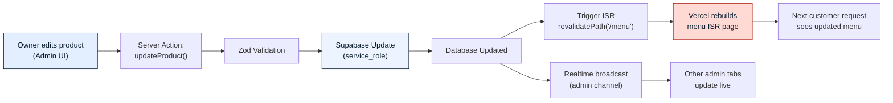

---

## 14. Sequence Diagrams

### SD-1: Complete Order Placement Flow

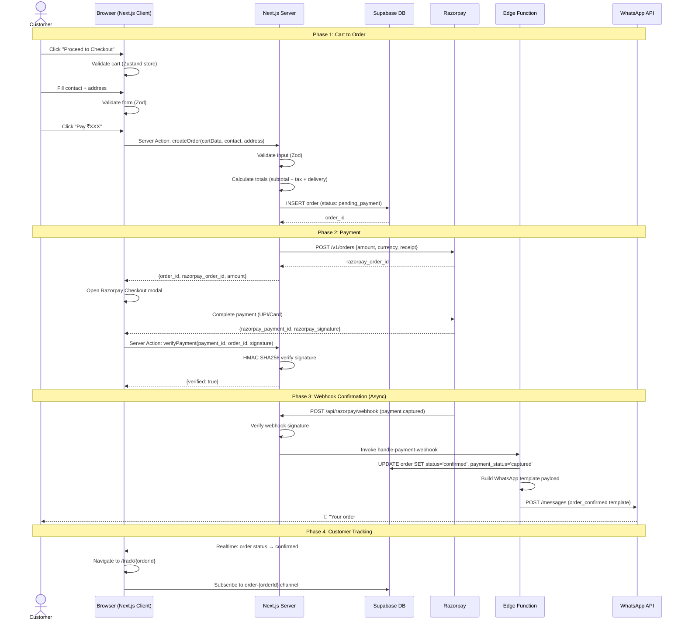

### SD-2: Kitchen Order Processing Flow

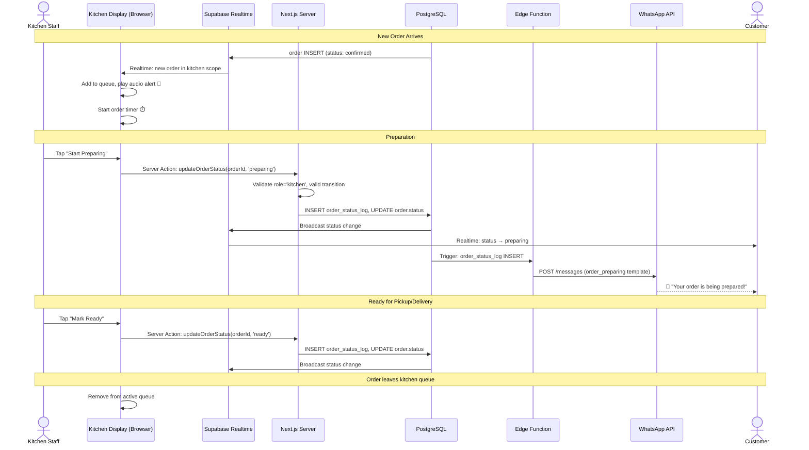

### SD-3: Delivery Flow

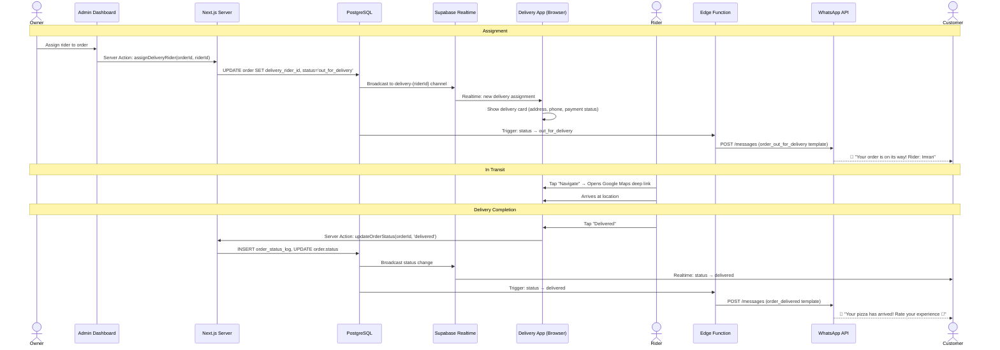

### SD-4: Menu Update with ISR Revalidation

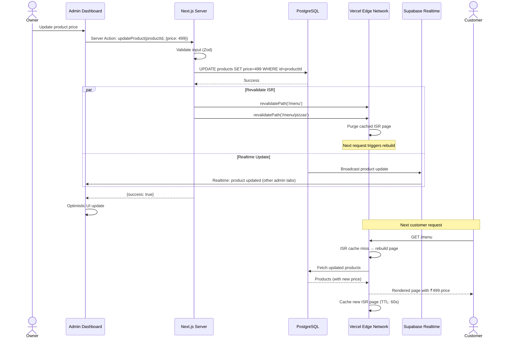

### SD-5: Guest Checkout to Order Tracking (MVP)

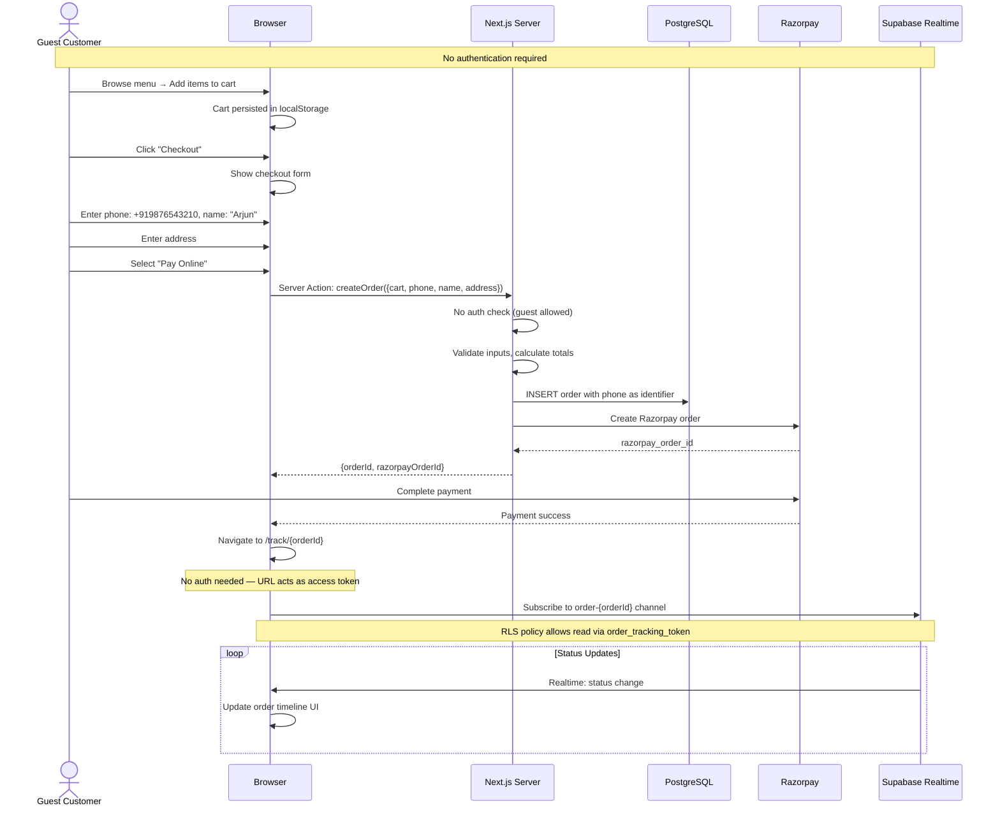

---

## 15. Service Layer Architecture

### Motivation: Why Add Services & Repositories?

The original architecture connects Server Actions directly to Supabase queries. This works for MVP velocity but creates three problems as the codebase grows:

| Problem | Impact | Example |
|---|---|---|
| **Business logic in Server Actions** | Untestable — Server Actions can only run in a Next.js server context | Price calculation, order validation, status transition rules |
| **Supabase SDK coupled to logic** | Cannot mock database for unit tests; changing data layer requires touching every action | Switching from `supabase.from('orders').insert()` to a different ORM |
| **Duplicated queries** | Same query patterns appear in actions, Edge Functions, and API routes | Fetching order with items, customer, and payment status |

### Layered Architecture

```mermaid
graph TB
    subgraph Presentation["Presentation Layer"]
        SA["Server Actions"]
        AR["API Routes"]
        EF["Edge Functions"]
    end

    subgraph Business["Service Layer"]
        OS["OrderService"]
        PS["ProductService"]
        PAS["PaymentService"]
        NS["NotificationService"]
        CS["CartService"]
        SS["StoreService"]
    end

    subgraph Data["Repository Layer"]
        OR["OrderRepository"]
        PR["ProductRepository"]
        PAR["PaymentRepository"]
        SR["StoreRepository"]
        UR["UserRepository"]
    end

    subgraph Infra["Infrastructure"]
        SB["Supabase Client"]
    end

    SA & AR & EF --> Business
    Business --> Data
    Data --> SB

    style Presentation fill:#ffdad5,stroke:#b1241a,color:#091d2e
    style Business fill:#e3efff,stroke:#091d2e,color:#091d2e
    style Data fill:#edf4ff,stroke:#091d2e,color:#091d2e
    style Infra fill:#e4e3d7,stroke:#5e5f56,color:#091d2e
```

### Layer Responsibilities

| Layer | Responsibility | Rules |
|---|---|---|
| **Server Actions** (`src/actions/`) | Thin orchestration — auth check, input validation (Zod), invoke service, call `revalidatePath()`, return response | No business logic. No direct Supabase calls. Max ~20 lines per action. |
| **Services** (`src/services/`) | Business logic — pricing, validation rules, status transitions, orchestrating multi-step operations | No Supabase imports. Receives repository instances. Framework-agnostic (testable with plain Jest). |
| **Repositories** (`src/repositories/`) | Data access — typed Supabase queries, encapsulating table structures and joins | One repository per aggregate root. Returns typed domain objects (not raw Supabase rows). No business logic. |

### Example: Order Service

```
// src/services/order-service.ts

class OrderService {
  constructor(
    private orderRepo: OrderRepository,
    private paymentService: PaymentService,
    private cartService: CartService
  ) {}

  async createOrder(input: CreateOrderInput): Promise<OrderResult> {
    // 1. Validate cart items are still available
    const validatedCart = await this.cartService.validateCart(input.cart);

    // 2. Calculate totals (business logic — no DB calls)
    const totals = this.calculateTotals(validatedCart, input.deliveryAddress);

    // 3. Create order record
    const order = await this.orderRepo.create({
      items: validatedCart.items,
      customer_phone: input.phone,
      customer_name: input.name,
      delivery_address: input.address,
      subtotal: totals.subtotal,
      delivery_fee: totals.deliveryFee,
      tax: totals.tax,
      total: totals.total,
      payment_method: input.paymentMethod,
      status: 'pending_payment',
    });

    // 4. If online payment, create Razorpay order
    if (input.paymentMethod === 'online') {
      const razorpayOrder = await this.paymentService.createRazorpayOrder(
        order.id,
        totals.total
      );
      return { order, razorpayOrder };
    }

    // 5. If COD, move directly to confirmed
    await this.orderRepo.updateStatus(order.id, 'confirmed');
    return { order, razorpayOrder: null };
  }

  validateStatusTransition(current: OrderStatus, next: OrderStatus, role: UserRole): boolean {
    const allowedTransitions: Record<OrderStatus, Record<UserRole, OrderStatus[]>> = {
      confirmed:        { owner: ['preparing', 'rejected'], kitchen: ['preparing'] },
      preparing:        { kitchen: ['ready'] },
      ready:            { owner: ['out_for_delivery'] },
      out_for_delivery: { delivery: ['delivered'] },
      // ...
    };
    return allowedTransitions[current]?.[role]?.includes(next) ?? false;
  }

  private calculateTotals(cart: ValidatedCart, address: Address): OrderTotals {
    const subtotal = cart.items.reduce((sum, item) => sum + item.total, 0);
    const deliveryFee = subtotal >= 499 ? 0 : 49;
    const tax = Math.round(subtotal * 0.05); // 5% GST
    return { subtotal, deliveryFee, tax, total: subtotal + deliveryFee + tax };
  }
}
```

### Example: Product Repository

```
// src/repositories/product-repository.ts

class ProductRepository {
  constructor(private supabase: SupabaseClient) {}

  async findAllByCategory(categorySlug: string): Promise<Product[]> {
    const { data, error } = await this.supabase
      .from('products')
      .select('*, categories!inner(slug, name), product_variants(*)')
      .eq('categories.slug', categorySlug)
      .eq('is_archived', false)
      .order('display_order', { ascending: true });

    if (error) throw new DatabaseError('Failed to fetch products', error);
    return data.map(mapToProduct);  // Transform DB row to domain type
  }

  async findById(id: string): Promise<Product | null> { /* ... */ }
  async create(data: CreateProductData): Promise<Product> { /* ... */ }
  async update(id: string, data: UpdateProductData): Promise<Product> { /* ... */ }
  async toggleAvailability(id: string, available: boolean): Promise<void> { /* ... */ }
}
```

### Dependency Injection Pattern

We avoid a full DI container. Instead, we use **factory functions** at the service boundary:

```
// src/services/index.ts — Service factory

export function createOrderService(supabase: SupabaseClient) {
  const orderRepo = new OrderRepository(supabase);
  const paymentRepo = new PaymentRepository(supabase);
  const productRepo = new ProductRepository(supabase);

  const paymentService = new PaymentService(paymentRepo);
  const cartService = new CartService(productRepo);

  return new OrderService(orderRepo, paymentService, cartService);
}

// Usage in Server Actions:
// const orderService = createOrderService(getServerSupabase());
// const result = await orderService.createOrder(input);
```

### Testing Benefits

| Test Type | Layer | Mock Strategy |
|---|---|---|
| **Unit Tests** | Services | Mock repositories with plain objects. Test business logic in isolation. |
| **Integration Tests** | Repositories | Use Supabase local dev (`supabase start`). Test actual queries. |
| **E2E Tests** | Server Actions → Services → Repos | Full stack against staging Supabase project. |

---

## 16. Observability Architecture

### Overview

Observability is structured around **four pillars**: error tracking, product analytics, performance monitoring, and infrastructure monitoring.

```mermaid
graph TB
    subgraph Application["Pizza Planet Application"]
        FE["Frontend<br/>(Next.js Client)"]
        BE["Backend<br/>(Server Actions / API Routes)"]
        EF["Edge Functions<br/>(Supabase)"]
    end

    subgraph Observability["Observability Stack"]
        SENTRY["🐛 Sentry<br/>(Error Tracking)"]
        POSTHOG["📊 PostHog<br/>(Product Analytics)"]
        VANL["📈 Vercel Analytics<br/>(Performance)"]
        SBLOGS["🗄️ Supabase Logs<br/>(Database / Auth)"]
    end

    FE -->|"Client errors, spans"| SENTRY
    BE -->|"Server errors, traces"| SENTRY
    EF -->|"Function errors"| SENTRY
    FE -->|"User events, feature flags"| POSTHOG
    FE -->|"Web Vitals, pageviews"| VANL
    BE -->|"SQL logs, auth events"| SBLOGS

    SENTRY -->|"Alert"| SLACK["Slack / WhatsApp"]
    POSTHOG -->|"Dashboards"| OWNER["Owner Dashboard"]
    VANL -->|"Reports"| DEV["Engineering"]

    style Application fill:#e3efff,stroke:#091d2e,color:#091d2e
    style Observability fill:#ffdad5,stroke:#b1241a,color:#091d2e
```

### Sentry — Error Tracking & Performance

| Configuration | Value |
|---|---|
| **SDK** | `@sentry/nextjs` (unified client + server) |
| **DSN** | Stored in `NEXT_PUBLIC_SENTRY_DSN` (client) and `SENTRY_DSN` (server) |
| **Sample Rate** | Errors: 100%. Transactions: 20% (production), 100% (staging) |
| **Release Tracking** | Tied to Vercel deployment via `VERCEL_GIT_COMMIT_SHA` |
| **Source Maps** | Uploaded during build via `withSentryConfig()` in `next.config.ts` |
| **PII Scrubbing** | Enabled — phone numbers and addresses are redacted from error payloads |

#### Error Tracking Flow

```
Error occurs (client or server)
  │
  ├── 1. Sentry SDK captures error with:
  │   ├── Stack trace (with source maps)
  │   ├── Breadcrumbs (last 50 user actions)
  │   ├── Tags: { role, orderId, page, environment }
  │   ├── User context: { id (hashed), role } (no PII)
  │   └── Request context (server-side): { url, method, headers }
  │
  ├── 2. Sentry processes and deduplicates
  │
  ├── 3. Alerting rules:
  │   ├── P0 (payment errors, order creation failures): Immediate Slack + WhatsApp to CTO
  │   ├── P1 (auth failures, realtime disconnects): Slack within 5 minutes
  │   ├── P2 (UI errors, non-critical): Daily digest
  │   └── Spike detection: > 10 same-issue errors in 5 minutes → P0 alert
  │
  └── 4. Sentry issue assigned → fix → deploy → Sentry auto-resolves
```

#### Sentry Alert Rules

| Alert | Condition | Channel | Urgency |
|---|---|---|---|
| Payment Failure Spike | > 3 `PaymentError` in 5 min | Slack #critical + WhatsApp CTO | P0 |
| Order Creation Failure | Any `OrderCreationError` | Slack #orders | P1 |
| Unhandled Server Error | New unhandled exception (server) | Slack #engineering | P1 |
| Client Error Spike | > 20 client errors in 10 min | Slack #engineering | P2 |
| Realtime Disconnect | > 5 `RealtimeConnectionError` in 5 min | Slack #engineering | P1 |

### PostHog — Product Analytics

| Configuration | Value |
|---|---|
| **SDK** | `posthog-js` (client-side only) |
| **API Key** | Stored in `NEXT_PUBLIC_POSTHOG_KEY` |
| **Host** | PostHog Cloud (`us.i.posthog.com`) |
| **Autocapture** | Enabled for click, pageview, input change |
| **Session Recording** | Enabled (1% sample in production) |
| **Feature Flags** | Used for Phase 2 feature rollout |

#### Tracked Events

| Event | Properties | Business Purpose |
|---|---|---|
| `menu_viewed` | `category`, `item_count` | Menu engagement |
| `product_customized` | `product_id`, `toppings_count`, `total_price` | Customizer usage |
| `cart_item_added` | `product_id`, `quantity`, `price` | Conversion funnel step |
| `checkout_started` | `cart_value`, `item_count`, `payment_method` | Conversion funnel step |
| `order_placed` | `order_id`, `total`, `payment_method`, `order_type` | Core conversion |
| `payment_completed` | `order_id`, `method`, `amount` | Revenue tracking |
| `order_tracked` | `order_id`, `status` | Tracking engagement |
| `promo_code_applied` | `code`, `discount_amount`, `success` | Promotion effectiveness |

#### Recommended Dashboards

| Dashboard | Metrics | Owner |
|---|---|---|
| **Business Overview** | Orders/day, revenue, AOV, payment split (UPI vs card vs COD) | Owner |
| **Conversion Funnel** | Menu → Customize → Cart → Checkout → Payment → Confirmed | Product |
| **Menu Performance** | Items by views, add-to-cart rate, revenue per item | Owner |
| **Operational Health** | Order-to-kitchen time, prep time, delivery time | Operations |

### Vercel Analytics — Performance Monitoring

| Feature | Configuration |
|---|---|
| **Web Vitals** | Automatic via `@vercel/analytics` — LCP, FID, CLS, TTFB, INP |
| **Speed Insights** | Enabled — real user monitoring (RUM) by route |
| **Audience** | Page views, unique visitors, referrers, geography |
| **Alerts** | LCP regression > 500ms triggers Slack notification |

### Supabase Logs — Database & Auth Monitoring

| Log Type | Retention | Monitored Metrics |
|---|---|---|
| **PostgreSQL Logs** | 7 days (free), 90 days (Pro) | Slow queries (> 500ms), connection pool usage, RLS policy denials |
| **Auth Logs** | 7 days | Failed login attempts, OTP delivery failures, session refresh errors |
| **Realtime Logs** | 7 days | Channel subscription counts, broadcast latency, disconnection events |
| **Edge Function Logs** | 7 days | Execution time, error rate, cold start frequency |
| **Storage Logs** | 7 days | Upload failures, transform errors, bandwidth usage |

### Monitoring Ownership

| System | Primary Owner | Escalation |
|---|---|---|
| Sentry (errors) | Engineering Lead | CTO (P0/P1) |
| PostHog (product) | Product / Owner | CTO (conversion drop > 20%) |
| Vercel Analytics | Engineering Lead | CTO (LCP regression) |
| Supabase Logs | Engineering Lead | CTO (database outage) |
| Razorpay Dashboard | Owner / Finance | CTO (payment failure rate > 2%) |

---

## 17. Background Processing Architecture

### Motivation: Why Add a Job Queue?

The current architecture invokes WhatsApp notifications synchronously from database triggers via Supabase Edge Functions. This creates three risks:

1. **No retry guarantees** — if the Edge Function fails, the notification is lost
2. **No observability** — failed jobs disappear silently
3. **Tight coupling** — adding new side effects (email, analytics events) requires modifying the same trigger

### Architecture Decision: Inngest

We adopt **Inngest** as the background job orchestration layer. Inngest runs within the Next.js application (no separate infrastructure) and provides durable execution, automatic retries, and observability out of the box.

| Criteria | Inngest | Trigger.dev | BullMQ |
|---|---|---|---|
| **Infrastructure** | Zero — runs as Next.js API route | Separate service | Requires Redis |
| **Vercel Compatible** | ✅ First-class | ✅ | ❌ Needs persistent process |
| **Retry & Backoff** | Built-in, configurable | Built-in | Manual implementation |
| **Type Safety** | Full TypeScript events | Full TypeScript | Manual |
| **Observability** | Dashboard with trace view | Dashboard | Self-hosted monitoring |
| **Cost (MVP scale)** | Free tier (25K runs/mo) | Free tier (10K runs/mo) | Self-hosted (free) |
| **Cron Jobs** | Built-in | Built-in | Separate scheduler |

### Job Queue Architecture

```mermaid
graph LR
    subgraph Triggers["Event Sources"]
        SA["Server Action<br/>(order created)"]
        WH["Webhook Handler<br/>(payment captured)"]
        RT["Realtime Trigger<br/>(status changed)"]
        CR["Cron Schedule<br/>(daily/hourly)"]
    end

    subgraph Inngest["Inngest (Next.js API Route)"]
        Q["Event Queue"]
        W1["send-order-notification"]
        W2["process-payment-webhook"]
        W3["process-refund"]
        W4["generate-daily-report"]
        W5["cleanup-abandoned-carts"]
    end

    subgraph Destinations["Side Effects"]
        WA["WhatsApp API"]
        DB["Supabase DB"]
        RP["Razorpay API"]
        SN["Sentry"]
    end

    SA & WH & RT & CR --> Q
    Q --> W1 & W2 & W3 & W4 & W5
    W1 --> WA
    W2 --> DB
    W3 --> RP
    W4 --> DB
    W1 & W2 & W3 -.->|"on failure"| SN

    style Triggers fill:#e3efff,stroke:#091d2e,color:#091d2e
    style Inngest fill:#ffdad5,stroke:#b1241a,color:#091d2e
    style Destinations fill:#e4e3d7,stroke:#5e5f56,color:#091d2e
```

### Job Definitions

| Job | Event Trigger | Steps | Retry Policy | Timeout |
|---|---|---|---|---|
| `send-order-notification` | `order/status.changed` | 1. Fetch order details → 2. Determine template → 3. Send WhatsApp → 4. Log result | 3 retries, exponential backoff (10s, 60s, 300s) | 30s |
| `process-payment-webhook` | `payment/webhook.received` | 1. Verify signature → 2. Update order status → 3. Trigger notification job | 5 retries, linear backoff (5s) | 15s |
| `process-refund` | `order/refund.requested` | 1. Initiate Razorpay refund → 2. Poll status → 3. Update payment record | 3 retries, exponential (30s, 120s, 600s) | 120s |
| `generate-daily-report` | Cron: `0 23 * * *` (11 PM IST) | 1. Aggregate day's orders → 2. Calculate metrics → 3. Send WhatsApp summary to owner | 2 retries | 60s |
| `cleanup-abandoned-carts` | Cron: `0 4 * * *` (4 AM IST) | 1. Find pending_payment orders > 24h → 2. Mark as expired → 3. Release inventory holds | 1 retry | 120s |

### Event Schema (Type-Safe)

```
// src/inngest/events.ts

type Events = {
  'order/status.changed': {
    data: {
      orderId: string;
      oldStatus: OrderStatus;
      newStatus: OrderStatus;
      changedBy: string;
      role: UserRole;
    };
  };
  'payment/webhook.received': {
    data: {
      razorpayPaymentId: string;
      razorpayOrderId: string;
      event: 'payment.captured' | 'payment.failed' | 'refund.processed';
      amount: number;
    };
  };
  'order/refund.requested': {
    data: {
      orderId: string;
      razorpayPaymentId: string;
      amount: number;
      reason: string;
    };
  };
};
```

### Dead Letter Queue (DLQ) Strategy

```
Job execution attempt
  │
  ├── Success → Log to notification_log, mark complete
  │
  ├── Failure (retryable: network timeout, 5xx) → Retry with backoff
  │   └── Max retries exhausted?
  │       ├── No → Re-enqueue with incremented attempt count
  │       └── Yes → Move to DLQ
  │
  └── Failure (non-retryable: 4xx, validation) → Move to DLQ immediately

DLQ Processing:
  ├── Log to Sentry with full context (event, attempts, error)
  ├── Insert to failed_jobs table for manual review
  ├── Alert via Slack (daily DLQ digest)
  └── Owner can manually retry or dismiss from admin panel (Phase 2)
```

### Migration Path from Edge Functions

| Current (Edge Function) | New (Inngest) | Migration Step |
|---|---|---|
| `send-whatsapp-notification` | `send-order-notification` function | Server Action emits Inngest event instead of relying on DB trigger |
| `handle-payment-webhook` | `process-payment-webhook` function | API route handler sends event to Inngest instead of invoking Edge Function |
| `process-refund` | `process-refund` function | Admin action emits Inngest event |
| `cleanup-abandoned-carts` (cron) | `cleanup-abandoned-carts` function | Replace Supabase cron with Inngest cron |

> [!NOTE]
> Edge Functions remain available as a fallback. During migration, both paths can coexist — Inngest is the primary path, Edge Functions are the circuit-breaker fallback triggered by Inngest DLQ processing.

---

## 18. Caching Architecture

### Cache Layers

```mermaid
graph LR
    subgraph Client["Browser Cache"]
        BFC["Browser Fetch Cache<br/>(Cache-Control headers)"]
        LSC["localStorage<br/>(Cart, Preferences)"]
        SWC["Service Worker<br/>(Phase 2 - Offline Menu)"]
    end

    subgraph Edge["Vercel Edge Cache"]
        ISR["ISR Page Cache<br/>(Stale-While-Revalidate)"]
        SC["Static Asset Cache<br/>(Immutable, 1 year)"]
    end

    subgraph Server["Server-Side"]
        RSC["React Server Component<br/>Cache (per-request)"]
    end

    subgraph Database["Supabase"]
        PGC["PostgreSQL<br/>Query Plan Cache"]
        PGB["PgBouncer<br/>Connection Pool"]
    end

    Client --> Edge --> Server --> Database

    style Client fill:#ffdad5,stroke:#b1241a,color:#091d2e
    style Edge fill:#e3efff,stroke:#091d2e,color:#091d2e
    style Server fill:#edf4ff,stroke:#091d2e,color:#091d2e
    style Database fill:#e4e3d7,stroke:#5e5f56,color:#091d2e
```

### Cache Policies by Resource

| Resource | Cache Strategy | TTL | Invalidation Trigger | Staleness Tolerance |
|---|---|---|---|---|
| **Homepage** | ISR | 60 seconds | `revalidatePath('/')` on hero/feature changes | High (content rarely changes) |
| **Menu Page** | ISR | 60 seconds | `revalidatePath('/menu')` on product/category changes | Medium (availability may change) |
| **Category Pages** | ISR | 60 seconds | `revalidatePath('/menu/[category]')` | Medium |
| **Product Images** | Vercel Edge + `Cache-Control` | `max-age=86400, stale-while-revalidate=604800` | New image uploaded → new URL (content-addressable) |
| **Store Settings** | ISR (embedded in layout) | 60 seconds | `revalidatePath('/')` on hours/status change | Low (store open/close is critical) |
| **Static Assets** | Vercel Edge + `immutable` | 1 year (`max-age=31536000, immutable`) | Next.js content-hashed filenames | N/A (immutable) |
| **Fonts** | Vercel Edge + `immutable` | 1 year | Versioned via `next/font` hash | N/A |
| **Cart Data** | localStorage | 24 hours | Manual clear, expiry check on hydration | High (client-only) |
| **Active Order Tracking** | No cache (Realtime) | N/A | Supabase Realtime push | None (must be live) |
| **Admin Dashboard** | No cache (Realtime) | N/A | Supabase Realtime push | None (must be live) |
| **Kitchen Queue** | No cache (Realtime) | N/A | Supabase Realtime push | None (must be live) |

### Revalidation Strategy

| Trigger | Pages Revalidated | Method |
|---|---|---|
| Product created/updated/deleted | `/menu`, `/menu/[category]`, `/customize/[productId]` | `revalidatePath()` in Server Action |
| Category created/updated/deleted | `/menu`, `/menu/[category]` | `revalidatePath()` in Server Action |
| Store hours/status changed | `/` (homepage layout) | `revalidatePath('/')` |
| Hero content updated | `/` | `revalidatePath('/')` |
| Bulk menu import | `/menu`, all `/menu/[category]` | `revalidatePath('/menu', 'layout')` (full subtree) |

### Cache Headers (next.config.ts)

```
// Static assets (JS, CSS, fonts, images)
/_next/static/**  → Cache-Control: public, max-age=31536000, immutable

// ISR pages (menu, homepage)
/                 → Cache-Control: public, s-maxage=60, stale-while-revalidate=300
/menu             → Cache-Control: public, s-maxage=60, stale-while-revalidate=300
/menu/*           → Cache-Control: public, s-maxage=60, stale-while-revalidate=300

// Dynamic pages (no cache)
/checkout         → Cache-Control: private, no-cache, no-store
/track/*          → Cache-Control: private, no-cache, no-store
/admin/*          → Cache-Control: private, no-cache, no-store
/kitchen          → Cache-Control: private, no-cache, no-store
/delivery         → Cache-Control: private, no-cache, no-store

// API routes
/api/*            → Cache-Control: private, no-cache, no-store
```

---

## 19. Disaster Recovery

### Recovery Objectives

| Metric | Target | Justification |
|---|---|---|
| **RTO** (Recovery Time Objective) | < 1 hour | Restaurant operates ~12 hours/day. 1-hour downtime during peak = ~₹5,000–₹10,000 lost revenue. |
| **RPO** (Recovery Point Objective) | < 5 minutes | Orders and payments are the most critical data. Losing 5 minutes of orders is recoverable (customers reorder). |

### Backup Strategy

| Component | Backup Method | Frequency | Retention | Storage Location |
|---|---|---|---|---|
| **PostgreSQL Database** | Supabase automatic backups | Daily (free), every 5 min PITR (Pro) | 7 days (free), 30 days (Pro) | Supabase-managed (same region) |
| **Database Migrations** | Git version control | Every commit | Indefinite | GitHub repository |
| **Supabase Storage** | Supabase-managed S3 replication | Continuous | Linked to project lifecycle | Supabase infrastructure |
| **Edge Functions** | Git version control + Supabase CLI | Every deployment | Indefinite | GitHub repository |
| **Environment Variables** | Vercel encrypted storage | Continuous | Linked to project | Vercel infrastructure |
| **Application Code** | Git (GitHub) | Every commit | Indefinite | GitHub |

> [!IMPORTANT]
> For production, upgrade to **Supabase Pro** ($25/month) to enable Point-in-Time Recovery (PITR) with 5-minute granularity. The free tier only provides daily backups, making the RPO ~24 hours — unacceptable for a business processing live payments.

### Database Restore Procedures

#### Scenario 1: Accidental Data Deletion (table-level)

```
1. Identify the timestamp of data loss (check audit logs)
2. Supabase Dashboard → Database → Backups → Point-in-Time Recovery
3. Restore to a NEW project (never overwrite production directly)
4. Verify restored data integrity
5. Use pg_dump to export affected tables from restored project
6. Import into production using pg_restore or INSERT statements
7. Verify production data integrity
8. Delete temporary restore project
```

#### Scenario 2: Full Database Corruption

```
1. Immediately enable maintenance mode (store status → closed)
2. Supabase Dashboard → Database → Backups → Restore to latest backup
3. If PITR available: restore to 5 minutes before corruption
4. If only daily backup: restore to latest daily backup
5. Reconcile missing orders from:
   a. Razorpay dashboard (payment records)
   b. WhatsApp notification history
   c. Sentry logs (order creation traces)
6. Disable maintenance mode
7. Notify affected customers via WhatsApp
```

#### Scenario 3: Supabase Project Failure (complete outage)

```
1. Check Supabase status page (status.supabase.com)
2. If regional outage:
   a. Wait for Supabase resolution (typical: < 30 minutes)
   b. Application shows maintenance page via Vercel Edge Middleware
3. If prolonged (> 2 hours):
   a. Provision new Supabase project in alternate region
   b. Restore from latest backup
   c. Update environment variables in Vercel
   d. Redeploy application
   e. Update DNS if Supabase URL changed
```

### Storage Backup Procedures

| Asset | Backup Strategy | Recovery |
|---|---|---|
| **Product Images** | Supabase Storage provides built-in redundancy. Additionally, original images retained by owner. | Re-upload originals to new Storage bucket. |
| **Brand Assets (Logo, Favicon)** | Committed to Git repository in `public/` | Available from any Git clone. |
| **Generated Receipts** | Non-critical. Can be regenerated from order data. | Regenerate from order history. |

### Environment Recovery Plan

| Step | Action | ETA |
|---|---|---|
| 1 | Provision new Supabase project | 5 minutes |
| 2 | Run all migrations (`supabase db push`) | 5 minutes |
| 3 | Restore database from backup | 10–30 minutes |
| 4 | Deploy Edge Functions | 5 minutes |
| 5 | Update Vercel environment variables | 5 minutes |
| 6 | Trigger Vercel redeployment | 3 minutes |
| 7 | Verify application health | 5 minutes |
| **Total** | | **~40–60 minutes** |

---

## 20. Performance Requirements

### Core Web Vitals Targets

| Metric | Homepage | Menu | Customizer | Checkout | Tracking |
|---|---|---|---|---|---|
| **LCP** | < 2.0s | < 2.5s | < 3.0s | < 2.5s | < 2.0s |
| **FID / INP** | < 100ms | < 100ms | < 200ms | < 100ms | < 100ms |
| **CLS** | < 0.05 | < 0.1 | < 0.1 | < 0.05 | < 0.05 |
| **TTFB** | < 400ms | < 500ms | < 500ms | < 600ms | < 400ms |

### Page-Specific Performance Budgets

#### Homepage (ISR — Critical Landing Page)

| Metric | Budget | Enforcement |
|---|---|---|
| LCP | < 2.0s on 4G | Lighthouse CI (P75) |
| Total JS | < 120 KB (gzipped) | `@next/bundle-analyzer` |
| Total Images (above fold) | < 300 KB | Supabase transforms + `next/image` |
| Total Requests | < 15 | Network waterfall analysis |
| Font Load | < 80 KB | `next/font` with subset + `swap` |

#### Menu Page (ISR — High Traffic)

| Metric | Budget | Enforcement |
|---|---|---|
| TTFB | < 500ms | Vercel Analytics |
| LCP (product grid) | < 2.5s | Lighthouse CI |
| Product image per card | < 40 KB | Supabase transform (400×400 WebP) |
| Infinite scroll chunk | < 200ms render time | React Profiler |

#### Checkout (Hybrid — Revenue Critical)

| Metric | Budget | Enforcement |
|---|---|---|
| Payment modal open | < 1.5s from button click | Custom timing metric (PostHog) |
| Payment confirmation | < 3.0s (end-to-end) | Sentry transaction tracing |
| Form validation feedback | < 50ms | Client-side only (Zod) |

#### Order Tracking (Realtime — Customer Experience)

| Metric | Budget | Enforcement |
|---|---|---|
| Status update latency | < 1.0s from DB write to UI render | Custom Sentry span |
| WebSocket reconnection | < 3.0s | Supabase SDK default |
| Initial page load | < 2.0s | Lighthouse CI |

### Bundle Size Budgets

| Bundle | Max Size (gzipped) | Contents |
|---|---|---|
| **Main bundle** | 80 KB | React, Next.js runtime, Zustand |
| **Supabase client** | 25 KB | `@supabase/supabase-js` |
| **Razorpay SDK** | 45 KB (external) | Loaded only on checkout page |
| **PostHog SDK** | 20 KB | Loaded async, non-blocking |
| **Sentry SDK** | 30 KB | Tree-shaken, lazy-loaded |
| **Page-specific** | < 50 KB per page | Route-level code splitting |
| **Total initial** | < 150 KB | First meaningful paint budget |

### Mobile Performance Budgets

| Constraint | Target | Rationale |
|---|---|---|
| **Device baseline** | Moto G Power (budget Android) | Matches Arjun persona (budget segment) |
| **Network baseline** | 4G (10 Mbps down, 100ms RTT) | Indian mobile network average |
| **Total page weight** | < 1.5 MB (initial load) | Critical for data-conscious users |
| **JavaScript execution** | < 2.0s TBT (Total Blocking Time) | Budget Android CPU constraint |
| **Touch response** | < 100ms (INP) | iOS/Android touch feedback expectation |

### Performance Monitoring Pipeline

```
Code Change
  │
  ├── PR Preview Build
  │   ├── Lighthouse CI runs against preview URL
  │   ├── Budget check: fail PR if any metric exceeds budget
  │   └── Bundle size diff reported in PR comment
  │
  ├── Staging Deploy
  │   ├── Synthetic monitoring (Lighthouse CI, 5 runs, median)
  │   └── Compare against main branch baseline
  │
  └── Production
      ├── Vercel Analytics (RUM — real user metrics)
      ├── Sentry Performance (transaction traces)
      └── Weekly performance review (engineering standup)
```

---

## 21. Future Multi-Tenant Architecture

> [!NOTE]
> This section documents the **evolution path** for Pizza Planet to become a multi-restaurant SaaS platform. No changes are required for MVP or Phase 2. The purpose is to ensure current architectural decisions do not preclude future expansion.

### Vision: Restaurant SaaS Platform

```
Current: Single Tenant (Pizza Planet)
  │
  └── Future: Multi-Tenant Platform
      ├── Restaurant A (Pizza Planet — original)
      ├── Restaurant B (Burger Barn)
      ├── Restaurant C (Sushi Station)
      └── Restaurant N...

      Shared infrastructure:
      ├── Single Next.js deployment
      ├── Single Supabase project (shared schema, RLS-isolated)
      ├── Per-tenant custom domain
      ├── Per-tenant design theme
      └── Per-tenant Razorpay + WhatsApp accounts
```

### Tenant Isolation Strategy: `tenant_id` Column

The recommended approach is **shared database, shared schema** with a `tenant_id` discriminator column:

| Aspect | Strategy |
|---|---|
| **Database** | Add `tenant_id UUID NOT NULL` to all tables. Enforce via RLS policies. |
| **RLS Enforcement** | All SELECT/INSERT/UPDATE/DELETE policies include `WHERE tenant_id = current_setting('app.tenant_id')` |
| **Tenant Resolution** | Domain-based: `pizzaplanet.platform.com` → resolve `tenant_id` via `tenants` table in Edge Middleware |
| **Session Context** | Set `app.tenant_id` as a PostgreSQL session variable on each request via `SET LOCAL` |
| **Storage** | Bucket-per-tenant: `product-images-{tenant_id}/` |
| **Auth** | Shared Supabase Auth with `tenant_id` in `user_metadata` |

### Migration Path (Current → Multi-Tenant)

| Step | Change | Risk |
|---|---|---|
| 1. Add `tenant_id` column | Migration: `ALTER TABLE ... ADD COLUMN tenant_id UUID DEFAULT '{pizza-planet-id}'` | Low — default value backfills existing data |
| 2. Add `tenants` table | New table with `id`, `name`, `domain`, `theme`, `razorpay_config`, `whatsapp_config` | None — additive |
| 3. Update RLS policies | Add `tenant_id` check to all policies | Medium — must test thoroughly |
| 4. Add Middleware resolver | Resolve tenant from subdomain/custom domain → set in headers | Low |
| 5. Parameterize integrations | Razorpay keys, WhatsApp tokens per tenant | Medium — secrets management |
| 6. Theme engine | Load Tailwind theme from `tenants.theme` JSONB column | Low |

### What the Current Architecture Already Supports

| Requirement | Current Status | Notes |
|---|---|---|
| RLS-based access control | ✅ Ready | Adding `tenant_id` to RLS policies is straightforward |
| Route-group architecture | ✅ Ready | Each route group already has clean separation |
| Service layer isolation | ✅ Ready (Section 15) | Services accept config — easily parameterized per tenant |
| Zustand stores | ✅ Ready | Client state is inherently single-tenant |
| ISR with revalidation | ⚠️ Needs work | Revalidation must be tenant-scoped (`revalidateTag()`) |
| Inngest jobs | ⚠️ Needs work | Events must include `tenant_id` for routing |
| Supabase Storage | ⚠️ Needs work | Bucket naming must be tenant-aware |

---

## 22. Architecture Decision Records

### ADR Strategy

All significant architectural decisions are documented as Architecture Decision Records (ADRs) in the `docs/adr/` directory. ADRs are immutable once accepted — if a decision is superseded, a new ADR is created referencing the old one.

### ADR Template

```markdown
# ADR-NNN: [Title]

**Status:** Proposed | Accepted | Deprecated | Superseded by ADR-XXX
**Date:** YYYY-MM-DD
**Deciders:** [Names/Roles]

## Context

What is the issue that we're seeing that is motivating this decision or change?

## Decision

What is the change that we're proposing and/or doing?

## Consequences

What becomes easier or more difficult to do because of this change?

### Positive
- ...

### Negative
- ...

### Risks
- ...
```

### ADR Directory Structure

```
docs/adr/
├── README.md                    # Index of all ADRs
├── adr-001-supabase.md          # Why Supabase over custom API
├── adr-002-zustand.md           # Why Zustand over Redux/Context
├── adr-003-razorpay.md          # Why Razorpay over Stripe
├── adr-004-server-actions.md    # Why Server Actions over REST API
├── adr-005-inngest.md           # Why Inngest over Edge Functions for jobs
├── adr-006-service-layer.md     # Why introduce Service/Repository pattern
└── adr-007-isr-strategy.md      # Why ISR over SSR/SSG for menu pages
```

### ADR-001: Why Supabase

**Status:** Accepted  
**Date:** 2026-06-19

**Context:** Pizza Planet needs a backend that provides authentication, database, realtime subscriptions, file storage, and serverless functions. The team is small (1-2 developers) and needs to ship MVP in 6-8 weeks. Building a custom Express/NestJS API with separate services for each concern would take significantly longer and require ongoing infrastructure management.

**Decision:** Use Supabase as the primary backend-as-a-service platform.

**Consequences:**
- ✅ Single platform for auth, DB, realtime, storage, and edge functions
- ✅ PostgreSQL gives us a relational model for orders (vs Firebase's document model)
- ✅ Row Level Security eliminates most authorization bugs
- ✅ Realtime is built-in — no separate WebSocket server
- ⚠️ Vendor lock-in to Supabase (mitigated: standard PostgreSQL underneath)
- ⚠️ Free tier limits may require upgrade at ~100 orders/day

### ADR-002: Why Zustand

**Status:** Accepted  
**Date:** 2026-06-19

**Context:** The application needs client-side state management for cart, pizza customizer, UI state, and realtime order data. The server state is managed by RSC and Supabase Realtime, so the client state layer is relatively small.

**Decision:** Use Zustand for all client-side state management.

**Consequences:**
- ✅ ~1KB bundle size (vs Redux Toolkit ~11KB)
- ✅ No provider wrapping — works seamlessly with Next.js App Router
- ✅ Built-in `persist` middleware for cart localStorage
- ✅ TypeScript-native with excellent inference
- ⚠️ No built-in devtools (mitigated: zustand/devtools middleware available)
- ⚠️ No built-in middleware ecosystem like Redux (unnecessary for our scale)

### ADR-003: Why Razorpay

**Status:** Accepted  
**Date:** 2026-06-19

**Context:** Pizza Planet operates in India. Payment gateway must support UPI (primary payment method for the target demographic), credit/debit cards, net banking, and popular wallets.

**Decision:** Use Razorpay as the payment gateway.

**Consequences:**
- ✅ UPI-first checkout experience (matches Indian market)
- ✅ Excellent developer documentation in English
- ✅ Standard Checkout SDK handles all payment method complexity
- ✅ Built-in refund API
- ⚠️ 2% + GST transaction fee (industry standard)
- ⚠️ No international payment support needed currently

### ADR-004: Why Server Actions over REST API

**Status:** Accepted  
**Date:** 2026-06-19

**Context:** Next.js 15 provides Server Actions as a mutation primitive. The alternative is building a traditional REST or tRPC API layer.

**Decision:** Use Next.js Server Actions as the primary mutation layer, with API Routes only for webhook endpoints.

**Consequences:**
- ✅ Zero API boilerplate — no route definitions, no fetch calls
- ✅ Automatic form data handling and progressive enhancement
- ✅ Type-safe end-to-end (TypeScript function signatures)
- ✅ Automatic CSRF protection (built into Server Actions)
- ⚠️ Coupled to Next.js — cannot call from external clients (mitigated: no external clients needed)
- ⚠️ Debugging can be harder than REST (mitigated: Sentry tracing)

### ADR-005: Why Inngest over Edge Functions for Background Jobs

**Status:** Accepted  
**Date:** 2026-06-19

**Context:** The initial architecture uses Supabase Edge Functions triggered by database events for notifications and payment processing. This lacks retry guarantees, observability, and makes it difficult to add new side effects.

**Decision:** Adopt Inngest as the background job orchestration layer, replacing direct Edge Function invocations for async workflows.

**Consequences:**
- ✅ Durable execution with automatic retries and dead letter queue
- ✅ Built-in observability dashboard with job traces
- ✅ Type-safe event system (TypeScript)
- ✅ Runs as a Next.js API route — no separate infrastructure
- ✅ Cron support for scheduled jobs (daily reports, cleanup)
- ⚠️ Additional dependency (mitigated: graceful degradation to Edge Functions)
- ⚠️ Free tier limited to 25K runs/month (sufficient for MVP, ~500 orders/day × 5 events)

---

## 23. Architecture Readiness Assessment

### Evaluation Matrix

| Dimension | Score | Assessment | Key Strengths | Gaps |
|---|---|---|---|---|
| **Maintainability** | 8/10 | Strong | Service layer separation, typed schemas, clear folder structure | Need comprehensive test coverage targets |
| **Scalability** | 7/10 | Good | ISR caching, Supabase connection pooling, Edge delivery | Multi-tenant requires DB schema changes |
| **Reliability** | 8/10 | Strong | Inngest retries, Realtime fallbacks, webhook idempotency | Depends on Supabase uptime SLA (99.9%) |
| **Security** | 9/10 | Excellent | RLS, CSP, audit logging, 3-layer validation, incident response | Kitchen PIN auth is simpler than ideal |
| **Cost Efficiency** | 9/10 | Excellent | Supabase free/Pro tier, Vercel Hobby/Pro, Inngest free tier | May need Supabase Pro at ~100 orders/day |
| **Operational Readiness** | 7/10 | Good | Sentry, PostHog, Vercel Analytics, backup strategy | No automated runbooks yet |

### Overall Readiness: **8.0 / 10** — Production Ready with Monitored Risks

### Remaining Technical Risks

| Risk | Severity | Probability | Mitigation | Owner |
|---|---|---|---|---|
| Supabase free tier limits hit before revenue justifies upgrade | Medium | High | Monitor daily. Budget for Pro ($25/mo) from launch. | CTO |
| Razorpay webhook delivery failure during peak | High | Low | Client-side verification + Inngest reconciliation cron | Engineering |
| Kitchen tablet browser memory leak on long sessions | Medium | Medium | Auto-refresh every 4 hours via `setInterval` | Engineering |
| WhatsApp template rejection by Meta review | Medium | Medium | Prepare templates early. Have SMS fallback via Supabase Auth SMS provider. | Product |
| Cold start latency on Vercel serverless functions | Low | Medium | Warm critical paths with synthetic requests. Use Edge Runtime where possible. | Engineering |
| Inngest free tier exhaustion at scale | Low | Low | 25K runs/month ≈ 166 orders/day × 5 events. Upgrade to $50/month if exceeded. | CTO |

### Recommended Implementation Order

```mermaid
graph LR
    subgraph Sprint1["Sprint 1-2: Foundation"]
        S1A["Project setup<br/>Next.js + Supabase + Tailwind"]
        S1B["DB schema + migrations<br/>+ RLS policies"]
        S1C["Auth: Guest + Owner<br/>+ Kitchen PIN"]
        S1D["Service + Repository<br/>layer scaffolding"]
    end

    subgraph Sprint2["Sprint 3-4: Customer Flow"]
        S2A["Menu pages<br/>(ISR + design system)"]
        S2B["Pizza Customizer<br/>(Zustand + UI)"]
        S2C["Cart + Checkout<br/>(Razorpay integration)"]
        S2D["Order Tracking<br/>(Supabase Realtime)"]
    end

    subgraph Sprint3["Sprint 5-6: Operations"]
        S3A["Admin Dashboard<br/>(Order management)"]
        S3B["Kitchen Display<br/>(Realtime queue)"]
        S3C["Delivery View<br/>(Status updates)"]
        S3D["WhatsApp Notifications<br/>(Inngest + Meta API)"]
    end

    subgraph Sprint4["Sprint 7-8: Harden"]
        S4A["Observability<br/>(Sentry + PostHog)"]
        S4B["Performance audit<br/>(Lighthouse CI)"]
        S4C["Security review<br/>(CSP + rate limiting)"]
        S4D["Load testing<br/>+ staging validation"]
    end

    Sprint1 --> Sprint2 --> Sprint3 --> Sprint4

    style Sprint1 fill:#e3efff,stroke:#091d2e,color:#091d2e
    style Sprint2 fill:#ffdad5,stroke:#b1241a,color:#091d2e
    style Sprint3 fill:#edf4ff,stroke:#091d2e,color:#091d2e
    style Sprint4 fill:#e4e3d7,stroke:#5e5f56,color:#091d2e
```

### Production Launch Checklist

| Category | Item | Status |
|---|---|---|
| **Infrastructure** | Supabase Pro project provisioned (ap-south-1) | ⬜ |
| **Infrastructure** | Vercel Pro account with custom domain | ⬜ |
| **Infrastructure** | Razorpay live mode activated with KYC complete | ⬜ |
| **Infrastructure** | WhatsApp Business API approved, templates reviewed | ⬜ |
| **Infrastructure** | Inngest production account configured | ⬜ |
| **Security** | All environment variables set in Vercel (production) | ⬜ |
| **Security** | CSP headers verified in production | ⬜ |
| **Security** | RLS policies tested with all 5 roles | ⬜ |
| **Security** | Razorpay webhook signature verification tested | ⬜ |
| **Observability** | Sentry project created, DSN configured | ⬜ |
| **Observability** | PostHog project created, events verified | ⬜ |
| **Observability** | Vercel Analytics enabled | ⬜ |
| **Observability** | Alert rules configured (Sentry, Slack) | ⬜ |
| **Performance** | Lighthouse CI passing all budgets | ⬜ |
| **Performance** | Load test: 100 concurrent orders | ⬜ |
| **Data** | Seed data loaded (categories, sample products) | ⬜ |
| **Data** | Owner account created with 2FA | ⬜ |
| **Data** | Kitchen PINs configured | ⬜ |
| **Recovery** | Database backup verified (restore test) | ⬜ |
| **Recovery** | Maintenance mode page tested | ⬜ |
| **Testing** | E2E test suite passing (order flow, payment, tracking) | ⬜ |
| **Testing** | Mobile testing on Android Chrome + iOS Safari | ⬜ |

---

## Appendix

### A: Technology Decision Log

| Decision | Chosen | Alternatives Considered | Rationale |
|---|---|---|---|
| **State Management** | Zustand | Redux Toolkit, Jotai, React Context | Minimal boilerplate, TypeScript-native, perfect for small-to-medium stores. No provider wrapping needed. |
| **Backend** | Supabase | Custom Express API, Firebase, PocketBase | PostgreSQL (relational) fits the order domain. Built-in Auth, Realtime, Storage, Edge Functions reduce custom code. RLS > custom middleware auth. |
| **Rendering** | Next.js 15 RSC | Remix, SvelteKit, Astro | RSC gives server-rendering without API layer. App Router's route groups perfectly model our multi-role architecture. Vercel deployment is seamless. |
| **Styling** | Tailwind CSS | CSS Modules, styled-components, Panda CSS | Stitch design system tokens map directly to Tailwind config. Utility-first approach matches component-based architecture. |
| **Payments** | Razorpay | Stripe, PayU, Cashfree | Razorpay dominates Indian payment UX. UPI-first experience. Best documentation for Indian developers. |
| **Notifications** | WhatsApp Cloud API | Twilio, MSG91, Firebase FCM | WhatsApp is the existing customer communication channel. Direct Meta API avoids middleman costs. |
| **Hosting** | Vercel | AWS Amplify, Netlify, Railway | Native Next.js support. Edge network for Indian geography. Preview deployments for PR review. |
| **Image Optimization** | Next.js Image + Supabase Transforms | Cloudinary, imgix | Next.js Image handles client-side optimization. Supabase transforms handle server-side resizing. No additional service needed. |
| **Background Jobs** | Inngest | Trigger.dev, BullMQ, Supabase Edge Functions | Zero infrastructure — runs as API route. Durable execution with retries. Built-in observability. Vercel-native. |
| **Error Tracking** | Sentry | LogRocket, Bugsnag, Datadog | Industry standard. First-class Next.js SDK. Source map support. Free tier sufficient for MVP. |
| **Product Analytics** | PostHog | Mixpanel, Amplitude, Google Analytics | Open-source option available. Feature flags built-in. Session recording. Generous free tier (1M events/month). |
| **Service Architecture** | Service + Repository pattern | Direct Supabase calls, tRPC | Clean separation enables unit testing. Repository abstraction future-proofs against ORM changes. Services are framework-agnostic. |

### B: Risk Register

| Risk | Impact | Probability | Mitigation |
|---|---|---|---|
| Supabase Realtime connection drops during peak hours | Orders missed by kitchen | Medium | Reconnection logic + visibility fallback refetch + audio alerts |
| Razorpay webhook delivery failure | Order stuck in `pending_payment` | Low | Client-side verification as fallback + Inngest reconciliation cron |
| WhatsApp API rate limiting | Customer notifications delayed | Low | Inngest queue with backoff + batch window |
| Kitchen tablet browser crash | Orders not visible | Medium | Auto-refresh on focus + 4-hour periodic reload |
| Supabase free tier limits | Database/auth quota exceeded | High (at scale) | Monitor usage dashboard, upgrade to Pro before 100 daily orders |
| Inngest free tier exhaustion | Background jobs stop processing | Low | Monitor usage. 25K runs/month ≈ 166 orders/day. Upgrade at $50/month. |
| Meta rejects WhatsApp templates | No automated customer notifications | Medium | Submit templates early in development. Have SMS fallback. |
| Vercel serverless cold starts | Slow checkout/payment initiation | Medium | Use Edge Runtime for latency-critical routes. Synthetic warm-up. |
| PostgreSQL connection pool exhaustion | Database queries fail under load | Low | PgBouncer (Supabase default). Monitor active connections. |

### C: Performance Budget

| Metric | Budget | Enforcement |
|---|---|---|
| Initial JS Bundle | < 150 KB (gzipped) | `next build` + `@next/bundle-analyzer` |
| First Contentful Paint | < 1.5s (4G) | Lighthouse CI in GitHub Actions |
| Largest Contentful Paint | < 2.5s (4G) | Lighthouse CI |
| Total Blocking Time | < 200ms | Lighthouse CI |
| Cumulative Layout Shift | < 0.1 | Lighthouse CI |
| Interaction to Next Paint | < 200ms | Vercel Analytics (RUM) |
| Product Image | < 200 KB per image | Supabase transforms (max 800px width) |
| Font Files | < 100 KB total (subset) | `next/font` with unicode-range subsetting |
| Third-party Scripts | Razorpay SDK only on checkout | CSP header restricts script sources |
| Total Page Weight (initial) | < 1.5 MB | Lighthouse CI |

### D: Environment Variables (Complete)

| Variable | Scope | Added In |
|---|---|---|
| `NEXT_PUBLIC_SUPABASE_URL` | Client + Server | MVP |
| `NEXT_PUBLIC_SUPABASE_ANON_KEY` | Client + Server | MVP |
| `SUPABASE_SERVICE_ROLE_KEY` | Server only | MVP |
| `RAZORPAY_KEY_ID` | Client + Server | MVP |
| `RAZORPAY_KEY_SECRET` | Server only | MVP |
| `RAZORPAY_WEBHOOK_SECRET` | Server only | MVP |
| `WHATSAPP_ACCESS_TOKEN` | Server only | MVP |
| `WHATSAPP_PHONE_NUMBER_ID` | Server only | MVP |
| `WHATSAPP_BUSINESS_ACCOUNT_ID` | Server only | MVP |
| `NEXT_PUBLIC_GOOGLE_MAPS_KEY` | Client | MVP |
| `REVALIDATION_SECRET` | Server only | MVP |
| `INNGEST_EVENT_KEY` | Server only | MVP |
| `INNGEST_SIGNING_KEY` | Server only | MVP |
| `NEXT_PUBLIC_SENTRY_DSN` | Client | MVP |
| `SENTRY_DSN` | Server only | MVP |
| `SENTRY_AUTH_TOKEN` | CI only | MVP |
| `NEXT_PUBLIC_POSTHOG_KEY` | Client | MVP |
| `NEXT_PUBLIC_POSTHOG_HOST` | Client | MVP |

---

> **Document Status:** Production-ready architecture document. Reviewed and enhanced by Staff Architect. All sections validated for implementation readiness.  
> **Next Steps:** Database Schema Design → API Specification → ADR formalization → Sprint 1 kickoff

